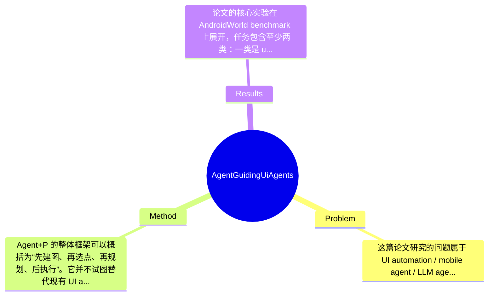

## Summary
该论文针对LLM-based UI agents在长程 UI automation 任务中因缺乏全局界面转移认知而产生 hallucination 的问题，提出了一个将 UI Transition Graph（UTG）与 symbolic planning 结合的插件式框架 Agent+P，把任务求解转化为图上的路径规划，并用 classical planner 生成可证明正确且最优的高层计划来指导底层 agent 执行。在 AndroidWorld benchmark 上，Agent+P 相比现有 state-of-the-art UI agents 最高提升成功率 14.31%，并将动作步数减少 37.70%。

## Problem & Motivation
这篇论文研究的问题属于 UI automation / mobile agent / LLM agent 交叉领域，核心是让智能体在移动应用中完成多步用户任务或自动化测试任务。问题本质上不是“当前页面该点哪里”这么局部，而是“为了达到最终目标，跨多个 UI screen 应该如何规划一条正确、经济的交互路径”。这类问题重要，是因为现代 app 的界面层级深、跳转关系复杂、状态变化多，单纯依赖当前 screen 的局部观察来决策，往往会在长程任务中走偏，尤其当目标页面需要经过设置页、二级菜单、权限弹窗、返回路径等多个中间状态时，错误会被逐步放大。

现实意义非常直接。其一，自动化测试可以借助这类技术自动遍历功能流，提高 bug 与 vulnerability 检测效率；其二，用户任务自动化可支持更智能的手机助手、RPA、无障碍辅助操作；其三，在企业应用、金融、办公等高复杂度场景中，跨页面稳定执行任务具有明显工程价值。

现有方法的局限，论文指出得比较具体。第一，许多 LLM-based UI agents 主要依据当前 UI state 做 reactive 决策，缺少对 app 全局转移结构的理解，因此在 long-horizon task 上容易 hallucinate。第二，常见 agent 倾向 depth-first 式探索，会在局部看似合理但全局无效的路径上浪费大量动作，导致低成功率和高 step cost。第三，即使 agent 能识别 screen 上可点击元素，也不等于能推理“哪些界面组合起来能通向目标”，也就是缺失高层 planning 能力。

论文提出新方法的动机是合理的：既然 UI navigation 本质上可以看成状态转移问题，那么与其让 LLM 在每一步临场猜测，不如先显式恢复 app 的 UI Transition Graph，再把任务转为 graph pathfinding / classical planning。其关键洞察在于：UI automation 的瓶颈不完全是 perception 或 action grounding，而是高层规划；一旦把全局转移知识外置并交给 symbolic planner，LLM agent 就可从“盲目探索者”变成“按计划执行者”，从而显著降低高层 hallucination。

## Method
Agent+P 的整体框架可以概括为“先建图、再选点、再规划、后执行”。它并不试图替代现有 UI agent，而是以 plug-and-play 方式在 agent 上方加一个 symbolic planning 层：先通过程序分析或静态/动态信息构建 app 的 UI Transition Graph（UTG），再根据当前任务把自然语言目标映射为图中的目标节点，随后调用现成的 symbolic planner 生成从起始 UI 到目标 UI 的高层 plan，最后由底层 LLM-based UI agent 负责把 plan 中的抽象转移落实为实际点击、输入、返回等操作。这个思路的价值在于明确分离“全局规划”和“局部执行”两类能力。

1. UTG Builder
- 作用：构建 app 的全局 UI Transition Graph。节点表示 UI screens，边表示由用户交互触发的 screen transition。
- 设计动机：作者认为长程失败的根因是 agent 不知道“从哪里能去哪里”，因此先恢复状态空间结构是必要前提。
- 与现有方法区别：传统 LLM UI agent 通常只显式建模当前页面可执行动作，而 Agent+P 引入跨页面、全局的 transition knowledge。它不是单步 action ranking，而是先构造全局导航骨架。
- 技术上，论文第 3 节提到将 UI automation 映射到 classical planning，说明 UTG 不只是可视化辅助，而是后续 planner 的状态空间输入。附录还提到 static UTG construction，说明图构建至少部分依赖程序分析而非纯在线探索。具体构图细节、节点合并策略、动态页面处理规则，摘要中未给出完整信息，属于论文正文/附录层面的实现细节。

2. Node Selector
- 作用：把任务目标与 UTG 中的候选目标节点对应起来，决定 planner 应该把哪一个 UI 当作 target node。
- 设计动机：symbolic planner 需要明确起点和终点，但自然语言任务往往并不直接给出目标页面 ID，因此必须有一个从 task description 到 graph node 的映射模块。
- 与现有方法区别：很多 baseline 直接让 LLM 端到端输出动作；Node Selector 相当于先做 goal grounding，把模糊任务压缩成图上的目标状态选择问题。
- 这一组件很关键，因为如果目标节点选错，后续 plan 即使最优也会导向错误目标。论文未在摘要中披露 node selection 的具体模型形式、是否使用 LLM scoring、embedding retrieval 或规则匹配，这部分需要以“论文未提及具体细节”处理。

3. Plan Generator
- 作用：基于起点、终点和 UTG，调用 off-the-shelf symbolic planner 生成高层计划。
- 设计动机：作者要解决的是 high-level planning hallucination，因此让 classical planner 负责全局搜索比让 LLM 自由生成多步策略更稳健。
- 与现有方法区别：它强调 provably correct and optimal high-level plan，这一点非常重要。也就是说，在给定图和规划形式正确的前提下，planner 找到的路径在符号层面上是可验证的，而非仅凭语言模型“觉得合理”。
- 技术层面，论文明确提到 symbolic planning 和 classical planning，但未在摘要中写明采用何种 planner、PDDL 表达方式、代价函数、最优性定义是最少步数还是其他加权成本。可以合理推断是标准 shortest-path 或 classical planning 设置，但严格说具体算法名称论文摘要未提及。

4. UI Explorer
- 作用：让底层 agent 在执行过程中根据 plan 落实具体 UI interaction，并在必要时探索局部页面元素。
- 设计动机：symbolic planner 给的是高层路径，不直接等于像素级或控件级动作；要完成端到端 automation，仍需一个执行器将抽象转移映射到实际操作。
- 与现有方法区别：Agent+P 不是纯 planner，也不是纯 executor，而是 planner-guided agent。底层 agent 的作用从“自己想路线”变成“围绕给定目标 screen/transition 执行”。这降低了搜索空间，也减少无关尝试。
- 这也解释了其 plug-and-play 特性：理论上可以兼容多个现有 UI agents，把它们作为执行层而不是规划层。

从设计选择上看，UTG 和 planner 是方法的必要部分；Node Selector 与 UI Explorer 的具体实现则存在替代方案，例如可用 learned retrieval、VLM matching 或 heuristic ranking 替代。方法整体相对简洁，核心思想非常清楚：把 UI automation 中最不稳定的高层规划显式符号化。不过它也带有一定工程组合色彩，因为效果依赖图构建质量、节点选择准确性和执行层可控性三者协同，并非单一端到端模型即可完成。

## Key Results
论文的核心实验在 AndroidWorld benchmark 上展开，任务包含至少两类：一类是 user task execution，另一类是 automated UI testing。摘要明确给出的最关键结果有两个：其一，Agent+P 将 state-of-the-art UI agents 的成功率最高提升 14.31%；其二，将动作步数最多降低 37.70%。这两个指标分别对应 effectiveness 和 efficiency，说明方法不仅更容易成功，也减少了冗余探索。

从 benchmark 角度看，AndroidWorld 是移动端 UI agent 较常见的评测环境，适合考察多步任务执行能力。论文第 5.3 节列出 Metrics，但在当前提供内容中，除 success rate 和 action steps 外，是否还包含 completion ratio、path optimality、timeout rate 等指标，论文摘要未提及。第 6.1 与 6.2 分别对应 user task execution 和 automated UI testing，说明作者试图证明该方法不仅适合“完成指定用户目标”，也对更广义的自动化测试流程有帮助，这一点比只做单一场景评测更扎实。

对比分析方面，论文声称增强的是现有 state-of-the-art UI agents，且方法是 plug-and-play，这意味着实验应包含“原始 agent”与“agent + Agent+P”的配对对比。14.31% 的成功率提升幅度在 UI automation 任务中是有意义的，尤其如果基线已经较强，则说明全局规划确实弥补了局部决策不足。37.70% 的步数下降也支持作者关于“避免 redundant exploration”的论点，表明改进不只是碰巧更成功，而是路径更短、更接近规划解。

论文目录显示附录包含 A.2 Ablation Study，说明作者做了消融实验，这对验证各组件必要性很重要。但当前提供材料没有具体 ablation 数字，因此不能捏造。合理期待的消融应包括：去掉 planner、去掉 UTG、替换 node selector、只用 agent 自主执行等。实验充分性方面，优点是覆盖了不同任务类型；不足是目前未看到跨 app 泛化、UTG 构建成本、动态图/异常弹窗下鲁棒性等结果。如果论文只突出提升明显的 agent 或任务，而未系统展示所有基线和失败案例，就可能存在一定 cherry-picking 风险；但基于当前信息，不能确定作者是否有选择性报告，只能说证据不足。

## Strengths & Weaknesses
这篇论文的亮点首先在于问题拆解非常准确。它没有把 UI automation 的失败简单归咎于 LLM 能力不足，而是识别出“缺少全局转移结构”才是长程任务 hallucination 的关键原因，并据此引入 UTG + symbolic planning。这种从表象错误回到结构性瓶颈的思路，是方法成立的根本。第二个亮点是模块化设计。Agent+P 并非重新训练一个庞大模型，而是作为 plug-and-play 规划层增强现有 UI agents，工程上更容易复用已有执行器，也更利于与不同 agent 组合。第三个亮点是 symbolic planner 带来的可验证性：在给定正确图与目标节点的前提下，高层 plan 具备明确的正确性与最优性语义，这比纯 LLM chain-of-thought 更可控。

但局限也很明显。第一，方法高度依赖 UTG 的完备性与准确性。如果图遗漏关键转移、无法覆盖运行时动态页面、权限弹窗或登录状态变化，那么 planner 的“最优解”只是在错误模型上的最优，现实执行仍会失败。第二，目标节点选择可能成为新的瓶颈。Node Selector 一旦把自然语言任务映射错页面，后续再强的 planner 也只是高效地走向错误目标。第三，适用范围存在边界：该方法更适合界面状态相对离散、转移关系较稳定的 app；对于 heavily dynamic UI、个性化内容流、连续滚动依赖强的场景，图建模和符号规划都可能困难。计算成本上，虽然在线步数下降，但离线构图和程序分析本身可能有额外成本，论文摘要未量化。

潜在影响方面，这项工作可能推动 UI agent 从“端到端大模型控制”走向“神经执行 + 符号规划”混合范式，对自动化测试、移动 RPA、辅助交互系统都有参考价值。

已知：论文明确提出 UTG 建模、classical planning 规划、plug-and-play 框架，并在 AndroidWorld 上取得 14.31% 成功率提升和 37.70% 步数下降。推测：其 planner 可能基于标准 shortest-path 或 PDDL 风格 classical planning，且提升主要来自减少无效探索。论文未证实这些实现细节。 不知道：UTG 构建的具体精度、不同 app 类型上的泛化、动态页面下的失败率、planner 的运行开销、Node Selector 的具体实现与误差模式，当前材料均未充分说明。

综合评分为 3。原因是：这篇工作方法思路清楚、结果有说服力，对 UI agent 研究有明显参考价值；但从当前信息看，它更像是一个有启发性的系统增强方案，而不是已经奠定范式的里程碑级工作。若你的研究方向是 UI automation、mobile agent、LLM + planning，这篇值得细读；若只是泛 agent 背景，可作为“符号规划增强 LLM agent”的代表性案例来读。

## Mind Map

## Notes
<!-- 其他想法、疑问、启发 -->
