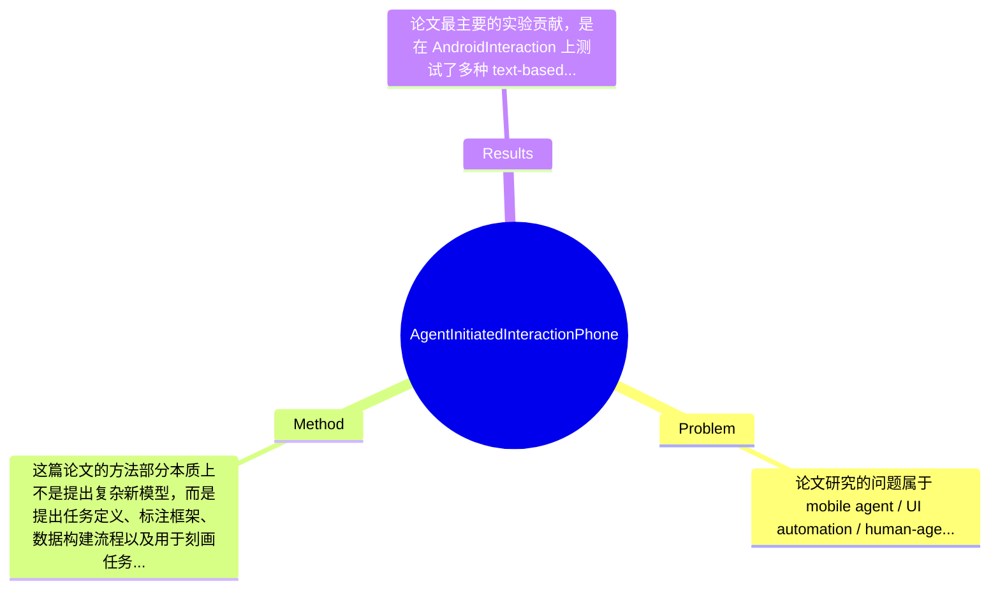

## Summary
这篇论文聚焦 phone UI automation 中长期被忽视的“agent 主动向用户发起交互”问题，提出了一个任务定义：判断何时必须询问用户、并生成合适的询问信息，同时构建了 AndroidInteraction 数据集与一组 text-based / multimodal baseline。论文的核心贡献不在于提出一个强新模型，而在于系统化定义 interaction timing、autonomy scope 与 user preference 相关标注框架，并通过基线实验表明该任务对当前 LLM 仍然非常困难。整体上，它为个性化手机代理中的 trust、alignment 与安全交互提供了一个基础研究起点。

## Problem & Motivation
论文研究的问题属于 mobile agent / UI automation / human-agent interaction 交叉领域，具体是：当手机自动化代理执行自然语言任务时，如何判断某一步是否应暂停自主执行并主动向用户询问，以及该如何生成合适、简洁且上下文相关的询问信息。这个问题重要，是因为真实世界中的手机任务并非总能由单次 instruction 完整决定，常常涉及缺失信息、隐含偏好、风险选择或多种可接受路径。例如订票、预定、发消息、付款、预约等任务，如果代理在用户偏好不明时擅自行动，可能造成错误操作、隐私泄露或用户不信任；但如果它事事询问，又会显著降低自动化价值。

现实意义非常直接。对普通用户，这关系到自动化代理是否真正“省事”而不是“添麻烦”；对无障碍场景，这关系到代理能否安全代替用户完成复杂 GUI 操作；对商业应用，这关系到高价值任务中的责任边界与 personalization。相比仅优化点击正确率或 screen understanding，这一问题更接近部署时的真实瓶颈。

现有方法的局限主要有三点。第一，很多 UI automation 工作默认 instruction 已经充分、目标明确，因此主要优化 perception、grounding 和 action planning，忽略信息不足时的交互决策。第二，传统 user interaction 研究更多关注 user-initiated clarification，而不是 agent-initiated interaction，即代理主动判断“现在该不该问”。第三，已有 benchmark 多衡量任务完成率，却没有显式评估过度自主与过度打扰之间的平衡，因此难以训练出真正符合用户预期的 agent。

论文动机是合理的：如果未来 phone agent 要真正走向可用，就不能只会“做动作”，还必须知道“何时不该擅作主张”。论文的关键洞察在于，将这一能力明确拆分为可研究的任务：检测 interaction necessity，并生成适当 message；同时把 interaction timing、instruction scope、用户偏好与默认行为边界纳入统一定义。这一抽象比单纯做 QA 或 dialogue generation 更贴近 UI automation 的实际决策过程。

## Method
这篇论文的方法部分本质上不是提出复杂新模型，而是提出任务定义、标注框架、数据构建流程以及用于刻画任务难度的一组 baseline。因此其“方法”核心是 problem formulation + dataset construction + evaluation setup，而非单一神经网络结构。整体框架可以概括为：基于现有 AndroidControl UI automation 数据，抽取其中可能存在用户交互需求的时刻，按照论文定义的标准标注是否需要 agent 主动询问、应在何时询问、询问内容应覆盖什么信息，进而构建 AndroidInteraction，并用 text-based 和 multimodal baseline 测试该任务。

关键组件可以分为以下几部分：

1. 任务定义（interaction necessity + message generation）
   - 作用：把“用户交互”从模糊概念变成可评测任务。模型需要在给定任务指令、当前 UI 上下文及执行状态时，判断当前是否应向用户发起交互；如果需要，还要生成恰当问题或消息。
   - 设计动机：很多 agent 失败不是因为不会点按钮，而是不知道何时该停下来确认。若不把“是否该问”单独建模，系统可能被动地默认为全自动执行。
   - 与现有方法区别：传统 UI agent 通常输出 action；这里增加了一个 meta-decision：continue autonomously 还是 ask user。也就是说，论文研究的是 action policy 之外的 interaction policy。

2. 任务范围细化：instruction scope、interaction timing、user preference
   - 作用：为标注和建模提供边界条件。论文特别强调用户原始 instruction 的范围、代理自主性的允许边界、以及不同步骤中何时询问才算合适。
   - 设计动机：同一 UI 状态下，“是否该问”并非纯视觉问题，而取决于用户一开始说了多少、有没有暗含默认偏好、当前决策是否可逆或高风险。
   - 与现有方法区别：许多 benchmark 把所有中间决策都视作确定性的；这篇论文把 ambiguity 和 preference sensitivity 正式纳入任务定义。它实际上承认：在真实 UI 环境里，不少步骤不存在唯一正确动作。

3. AndroidInteraction 数据集构建
   - 作用：提供训练和评测数据。论文基于已有 AndroidControl 数据集衍生出 interaction-centric 数据，而不是从零采集全新 UI 轨迹。
   - 设计动机：利用已有高质量 UI automation 轨迹，可以把精力集中在“哪一步需要问、问什么”而不是基础轨迹采集，成本更可控，也更容易与已有任务形成衔接。
   - 技术细节：根据文中描述，数据构建包含数据选择、必要性等级评估、annotation guideline 制定和质量分析。也就是说，并非所有轨迹都被纳入，而是筛选更可能涉及 preference ambiguity、 missing information 或 risky decision 的片段。必要性等级评估说明标注不是简单二分类，至少在流程上会先判断交互需求强弱，再归一化为可学习标签。具体标注人数、IAA、筛选阈值在提供内容中未完整给出，故只能说论文进行了系统的数据质量分析，但精确实现细节“论文摘录未充分提供”。

4. Baseline 模型设计：text-based 与 multimodal
   - 作用：验证任务难度，并建立后续工作对比基线。
   - 设计动机：该任务同时依赖语言指令、历史轨迹、UI 当前状态，因此单文本和多模态都应测试。若仅文本模型表现已足够好，则说明视觉上下文可能不是瓶颈；若 multimodal 仍差，则说明真正难点是 preference reasoning 和 autonomy calibration。
   - 与现有方法区别：作者并未宣称提出最优模型，而是通过多类 baseline 展示：即使使用当前 LLM / VLM，这个任务仍具挑战性。

5. 评估维度与误差分析
   - 作用：不仅评估“问得对不对”，还关心“是否问得过多”“消息是否恰当”。
   - 设计动机：该任务的关键不是传统分类精度 alone，而是平衡 false positive（不该问却问）和 false negative（该问却没问）。
   - 技术细节：论文应包含 necessity detection 与 message generation 两类指标，并附带 model error analysis。具体采用 accuracy、F1、BLEU、ROUGE 还是 LLM-as-judge，在当前提供内容中未见完整数值定义，因此不能捏造，只能确认其进行了 baseline comparison 和错误案例分析。

从设计选择上看，任务形式化和数据集构建是必须的，因为没有清晰定义就无法研究 agent-initiated interaction。至于是否必须依托 AndroidControl、是否必须做二阶段任务（先判定再生成），则存在替代方案，例如直接 end-to-end 生成 action-or-question policy，或引入 preference memory/user profile。简洁性方面，这项工作总体较为克制和清晰，并不过度工程化；但其方法论贡献强于模型创新，属于“把问题立起来”的 foundational work，而不是算法层面的 elegant breakthrough。

## Key Results
论文最主要的实验贡献，是在 AndroidInteraction 上测试了多种 text-based 与 multimodal baseline，并得出统一结论：当前 LLM 在 phone UI automation 的 agent-initiated interaction 上表现仍然较弱，说明“何时该问、问什么”远比表面上困难。遗憾的是，用户提供的论文摘录没有包含完整结果表格，因此无法可靠填写每个 benchmark 的精确数字；按要求这里必须明确标注：具体 accuracy / F1 / generation 分数，论文摘录未提供。

可以明确的是，benchmark 即论文自建的 AndroidInteraction，任务围绕 interaction necessity detection 与 message generation 展开；模型类型包括 text-only baseline 和 multimodal baseline。论文结论强调该任务对 current LLMs “very challenging”，这通常意味着无论是纯文本还是结合 UI 的模型，都没有接近人类水平，且在一些需要理解默认偏好、风险决策和信息缺失的场景下容易犯错。

从对比分析角度，论文的价值不在“某模型提升多少个百分点”，而在于建立了一个新的 evaluation target：以前 UI automation 可能看 final success rate，但这里额外评估 agent 在 autonomy 和 consultation 之间的平衡。若 baseline 中 multimodal 仅略优于 text-only，那么可推断视觉理解并不是唯一瓶颈，真正困难是规范性判断和用户意图不完备推理；但这一点属于推测，需以完整表格验证。

消融实验方面，全文目录显示存在 Results and Analysis 与 Model Error Analysis，说明作者不仅做了性能比较，也分析了错误类型。不过具体是否包含严格意义上的 ablation，例如去掉历史轨迹、去掉 accessibility tree、去掉 instruction scope 等，摘录中未给出，不能确定。实验充分性方面，我认为论文在“定义问题并建立基线”层面是充分的，但在“验证方法边界”层面仍不足：缺少跨 app 泛化、不同用户偏好 profile、真实在线交互、以及代价敏感评测（错问 vs 漏问的不同成本）。从目前信息看，作者并没有明显 cherry-picking 的迹象，反而主动强调任务很难、模型效果有限，这通常比只展示漂亮结果更可信。

## Strengths & Weaknesses
这篇论文的首要亮点，是它抓住了 UI automation 走向真实可用时最关键但常被忽视的一环：agent 不只是执行器，还是一个需要知道何时征求用户意见的决策体。技术上它的创新并非新 architecture，而是把 interaction necessity、interaction timing 和 user preference 显式任务化，这对研究方向非常重要。第二个亮点是数据集贡献。AndroidInteraction 不是泛泛的对话数据，而是嵌入具体手机 GUI 任务过程中的交互决策数据，具有较强场景真实性。第三个亮点是论文态度克制：作者没有夸大模型能力，而是用 baseline 证明这是个困难问题，这对领域发展反而更有价值。

局限性也很明显。第一，方法贡献主要是 formulation 和 dataset，而不是强模型，因此如果读者期待可直接部署的 interaction policy，这篇论文提供得不多。第二，任务标注天然带有规范性与主观性：什么叫“默认可接受动作”、什么情况下“必须询问”，不同用户、文化和应用域可能标准不同。即便有 annotation guideline，也可能难以覆盖真实世界偏好的多样性。第三，数据来源于已有 AndroidControl 衍生，可能继承其 app 分布、任务类型和轨迹风格偏差，导致 benchmark 不能完全代表开放世界手机使用。第四，计算成本方面，若部署时需要 multimodal LLM 在每一步判断是否询问，推理延迟和资源消耗可能不低；但论文摘录未给出具体 latency/cost 数据。

潜在影响方面，这项工作可能成为 personalized mobile agent、可解释 automation、以及安全 human-in-the-loop UI agent 的基础。未来可延伸到 preference memory、risk-aware planning、online feedback learning，甚至跨设备 agent 协作。

严格区分三类信息如下：已知：论文提出了任务定义，构建了 AndroidInteraction，测试了多种 text-based / multimodal baseline，并发现当前 LLM 表现仍具挑战。推测：错误主要来自缺失偏好建模、默认行为推理和风险敏感判断；multimodal 信息可能并未根本解决问题。论文摘录未完整证明这些因果关系。 不知道：数据集精确规模、各 baseline 名称与参数量、所有 benchmark 指标数值、标注员一致性统计、线上真实用户实验结果，这些在当前提供内容中都没有足够信息。总体上，这是一篇值得关注的“方向建立型”论文，而不是“性能碾压型”论文。

## Mind Map

## Notes
<!-- 其他想法、疑问、启发 -->
