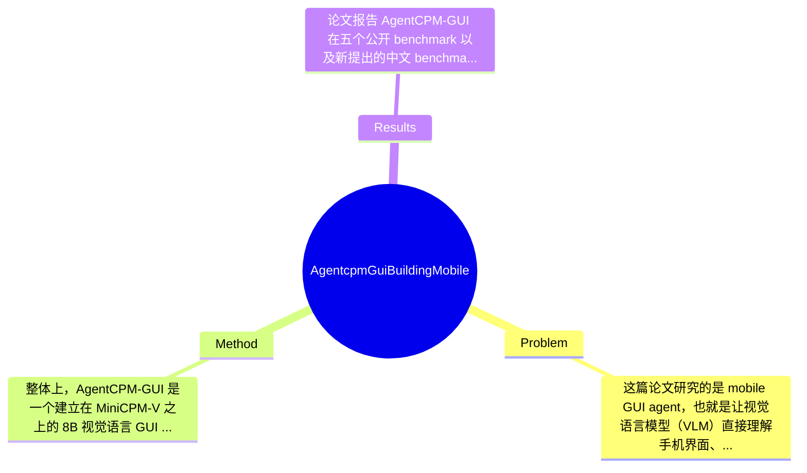

## Summary
该论文针对移动端 GUI agent 在数据噪声大、仅靠 imitation learning 泛化差、且中文场景覆盖不足的问题，提出了基于 MiniCPM-V 的 8B 模型 AgentCPM-GUI，通过 grounding-aware pre-training、supervised fine-tuning 与基于 GRPO 的 reinforcement fine-tuning 三阶段训练，并设计紧凑 action space 以支持低延迟执行。论文报告其在五个公开 benchmark 和新建中文 benchmark CAGUI 上达到 SOTA，其中 CAGUI 上取得 96.9% Type-Match 和 91.3% Exact-Match，强调了跨中英文 GUI 场景与端侧部署能力。

## Problem & Motivation
这篇论文研究的是 mobile GUI agent，也就是让视觉语言模型（VLM）直接理解手机界面、根据自然语言指令执行点击、输入、滑动等操作的问题。该问题位于 multimodal agent、GUI automation 与 mobile interaction 的交叉领域，核心挑战包括视觉感知、控件 grounding、多步规划、跨 app 泛化以及语言理解。它之所以重要，是因为手机是最普遍的人机交互终端，如果 agent 能稳定操作 Android GUI，就能把“会聊天的模型”进一步变成“会做事的助手”，在个人效率、无障碍交互、数字助理、客服自动化、测试自动化等方向都有直接价值。

论文指出现有方法有几个比较具体的不足。第一，公开训练数据往往来自 synthetic generation 或 emulator 录制，虽然规模可观，但噪声较多、语义覆盖有限，导致模型学到的是界面表层模式，而不是精确的 widget grounding 与任务语义。第二，很多 GUI agent 主要依赖 imitation learning，容易记住训练集中常见的界面布局与操作模板，一旦 instruction 稍有变化、页面结构改版或任务链条变长，就会出现 brittle planning。第三，已有工作几乎都围绕英文 GUI 展开，对中文 Android 生态关注不足，而中文 app 在布局习惯、按钮文案、交互密度上与英文环境差异明显，因此已有模型很难直接迁移。

作者提出新方法的动机是合理的：如果希望 GUI agent 真正落地，就不能只追求 benchmark 上的“看起来会做”，而要同时提升感知精度、行为泛化、跨语言能力和端侧效率。论文的关键洞察有两点：一是训练应分阶段进行，先解决 perception/grounding，再学 imitation，最后通过 reinforcement fine-tuning 补 reasoning；二是 action 表示本身会影响部署与学习难度，因此设计更紧凑的 action space 不只是工程优化，也可能提升推理稳定性。

## Method
整体上，AgentCPM-GUI 是一个建立在 MiniCPM-V 之上的 8B 视觉语言 GUI agent。作者采用 progressive training pipeline：先做 grounding-aware pre-training 强化界面理解与控件定位，再用高质量中英文轨迹做 supervised fine-tuning 学习人类操作模式，最后通过基于 GRPO 的 reinforcement fine-tuning 提升多步任务中的 reasoning 与 planning。与此同时，论文还重新设计了 action space，用更短的输出序列表示 GUI 操作，以降低解码成本并提升端侧可部署性。

1. grounding-aware pre-training
- 作用：让模型先学会“看懂界面”，包括页面元素识别、控件与文本对齐、位置感知以及操作对象 grounding。
- 设计动机：GUI agent 的失败往往不是不会“想”，而是先没“看准”；如果一开始就用 noisy trajectory 直接训练动作，模型很容易把控件定位误差和任务规划误差混在一起学坏。
- 与现有方法区别：很多工作直接端到端 imitation，而本文强调在动作学习前先补 perception 基础，相当于把 GUI understanding 当成独立能力建设。

2. 高质量中英文轨迹 supervised fine-tuning
- 作用：把感知能力转化为可执行行为，让模型根据 instruction 和当前 screen 生成具体操作。
- 设计动机：作者认为公开数据不够干净，且中文生态覆盖不足，因此构建了 55K trajectories、470K steps 的中文 Android 数据，并与多个英文公开数据集做严格去重后联合训练，以增强 cross-lingual 和 cross-app 泛化。
- 与现有方法区别：并非只堆更多英文数据，而是强调 targeted collection、meticulous annotation 和 de-duplication，这说明作者把数据质量视为核心变量，而非附属资源。

3. 基于 GRPO 的 reinforcement fine-tuning
- 作用：提升长程任务中的 reasoning、探索和鲁棒性，缓解 imitation learning 对 seen patterns 的过拟合。
- 设计动机：仅用 behavior cloning，模型通常只会复现训练分布中的局部动作，面对未见布局或 instruction 改写时容易崩。RFT 通过 reward signal 鼓励最终完成任务，而不是仅拟合单步动作标签。
- 与现有方法区别：论文明确把 RFT 放在第三阶段，意味着先有足够可用的 policy 再用 RL 做 refinement，而不是从零开始强化学习，这种做法更符合 GUI 环境高维、反馈稀疏的现实。

4. compact action space
- 作用：减少输出 token 长度，降低解码时延，并简化操作表示。
- 设计动机：移动端部署不仅看成功率，还看 latency。若 action 需要长文本描述坐标、控件和参数，推理会慢且更易出错。论文称其平均输出长度为 9.7 tokens，明显是在面向 edge deployment 优化。
- 与现有方法区别：很多 GUI agent 更关注能力上限，而较少把 action serialization 当作主要研究对象；本文把它提升到方法层面，体现出工程落地意识。

5. 模型与训练策略的整体评价
- 必要设计：三阶段训练中的 pre-training 与 SFT 很可能是必要的，因为没有 grounding 基础或模仿基础，后续 RFT 难以稳定；compact action space 对部署也基本是刚需。
- 可替代设计：RFT 不一定非要 GRPO，也可考虑 DPO、offline RL 或 process reward；动作空间也可以采用 pointer-based 或 structured API-like schema。论文未详细比较这些替代方案。
- 简洁性评价：整体框架是清晰的“感知→模仿→推理增强”路线，逻辑上相对优雅，不属于纯粹堆模块；但数据构建、去重、三阶段训练和新 benchmark 一起上，也说明这是一个系统工程型工作，而非单点算法突破。

## Key Results
论文报告 AgentCPM-GUI 在五个公开 benchmark 以及新提出的中文 benchmark CAGUI 上取得 state-of-the-art 表现，这是全文最核心的结果主张。根据摘要中给出的明确数字，模型在 CAGUI 上达到 96.9% Type-Match 和 91.3% Exact-Match，说明其不仅能预测正确的操作类型，还能较高精度地匹配完整动作。这一结果尤其重要，因为 CAGUI 面向中文移动 GUI，正对应论文所强调的语言覆盖缺口。

从 benchmark 设置看，论文覆盖了 public benchmarks + CAGUI，评价指标至少包括 Type-Match 与 Exact-Match。遗憾的是，当前给定材料没有列出五个公开 benchmark 的具体名称，也没有提供每个 benchmark 上的逐项分数、baseline 数值、方差范围或置信区间，因此无法精确复述所有表格结果；这些信息应标注为“论文未提及（在当前提供文本中未出现）”。同样，作者声称达到 SOTA，但缺少这里可见的具体对比对象，例如与前代 GUI agent 或同规模 VLM 的相对提升百分比。

就论文叙述来看，实验应当至少支撑三个主张：第一，中英文联合训练带来跨语言泛化；第二，RFT 相比纯 imitation learning 能提升 reasoning；第三，compact action space 有助于效率与端侧部署。不过在提供片段中，除 CAGUI 的 96.9/91.3 外，没有看到更详细的 ablation 数字，例如去掉 grounding-aware pre-training、去掉 GRPO 或改回较长 action representation 后性能下降多少，因此组件贡献目前无法量化。实验充分性方面，优点是覆盖了多 benchmark 且引入中文测试集；不足是从现有文本看，尚缺少失败案例分析、长任务分段成功率、真实手机时延、资源占用、跨设备分辨率鲁棒性等关键落地指标。是否 cherry-picking 目前不能下定论，但由于公开 benchmark 的完整数字未在摘要片段中展示，读者需要查看正文表格以确认其 SOTA 是否稳定且全面。

## Strengths & Weaknesses
这篇论文的亮点首先在于它抓住了 GUI agent 落地中的几个真问题，而不是只在单一 benchmark 上刷分。第一，作者把数据质量、语言覆盖和 reasoning 泛化放在同一框架下解决，尤其补上了中文 Android 生态这一长期被忽视的空白。第二，三阶段训练设计较为合理：grounding-aware pre-training 解决“看懂界面”，SFT 解决“学会操作”，RFT 解决“超越模仿”，思路完整且符合 agent 能力形成逻辑。第三，compact action space 是一个很实用的设计，它将平均输出长度压到 9.7 tokens，说明作者不仅关注 accuracy，也考虑 latency 和 edge deployment，这在 GUI agent 文献中确实较少被认真处理。

局限性也很明显。第一，技术上该方法仍然高度依赖高质量轨迹数据，虽然作者构建了 55K trajectories、470K steps，但这种数据采集和精标成本很高，其他团队未必容易复制同等质量的数据优势。第二，RFT 的收益虽然在叙述上很吸引人，但如果缺少细致 ablation 与 reward 设计分析，就难判断提升究竟来自 RL 本身，还是来自更好的数据和 curriculum。第三，论文强调 on-device/edge suitability，但从提供内容看并未给出完整的真实设备延迟、内存占用、功耗等部署指标；8B 模型即便 action 短，也未必天然适合广泛手机端原生运行。

潜在影响方面，这项工作对 multilingual GUI agent、移动端自动化和中文数字助理都具有推动作用，也可能为 mobile accessibility、自动测试、企业流程自动化提供基础模型。

已知：模型基于 MiniCPM-V，参数量 8B；采用 pre-training、SFT、GRPO-based RFT 三阶段训练；使用 55K trajectories 和 470K steps 的中文数据；提出 CAGUI；CAGUI 上达到 96.9% Type-Match 和 91.3% Exact-Match，并公开代码与 checkpoint。推测：其性能优势部分可能来自高质量中文数据构建，而不只是训练算法；compact action space 可能同时改善了解码稳定性，而不仅是速度。 不知道：五个公开 benchmark 的具体名称与逐项分数、各 baseline 的数值差距、RFT reward 细节、失败案例分布、真实端侧部署成本，这些在当前材料中都未充分给出。

## Mind Map

## Notes
<!-- 其他想法、疑问、启发 -->
