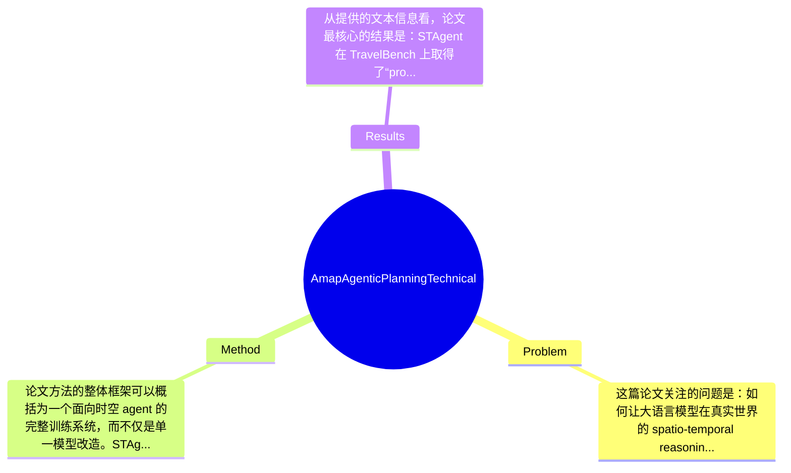

## Summary
该论文提出了面向时空推理与旅行规划场景的 agentic LLM——STAgent，通过稳定的多工具交互环境、分层高质量数据筛选以及 SFT-guided RL 级联训练方案，解决受约束 POI discovery 与 itinerary planning 等 System 2 任务；模型以 Qwen3-30B-A3B 为基础，在 TravelBench 上取得了有竞争力的结果，并声称在提升领域能力的同时较好保留了通用能力。

## Problem & Motivation
这篇论文关注的问题是：如何让大语言模型在真实世界的 spatio-temporal reasoning（时空推理）任务中，像 agent 一样调用外部工具，完成多约束、多步骤、可验证的复杂决策，例如 POI 检索、路线设计、旅行行程规划等。这属于 tool-integrated reasoning / agentic planning 交叉领域，也是典型的 System 2 问题：单靠语言先验往往不够，模型必须结合地图、天气、旅游、检索等外部信息持续修正中间决策。这个问题很重要，因为它直接对应真实用户需求，应用包括旅行助手、城市服务、车载导航、生活方式推荐以及本地生活平台的智能规划系统。现有方法的局限至少有三点。第一，许多 TIR 工作主要在数学、代码、网页操作等封闭或半封闭环境中验证，任务目标清晰、反馈标准化，但时空场景的信息异构性更强、约束更复杂、工具返回也更噪声化，因此已有方法不一定能直接迁移。第二，真实时空任务高度依赖多工具协同，而不同工具参数格式、协议、返回结构常不统一，导致训练环境不稳定，RL 很难做大规模 rollout。第三，原始用户查询数据海量但质量参差不齐，真正适合训练复杂 planning agent 的高难、高信息密度样本比例极低，如果直接训练，模型容易学到浅层模板而非稳定规划能力。论文动机总体合理：作者并不是只改模型结构，而是把“环境稳定性—数据质量—训练策略”视为决定 agent 上限的关键瓶颈。其核心洞察是，时空 agent 的能力提升不只依赖更强 base model，还依赖高质量、多样且按难度分层的数据，以及把高确定性样本用于 SFT、把低确定性样本交给 RL 的 difficulty-aware 训练范式。

## Method
论文方法的整体框架可以概括为一个面向时空 agent 的完整训练系统，而不仅是单一模型改造。STAgent 以 Qwen3-30B-A3B 为初始化底座，在上层构建稳定的多工具交互环境，然后通过分层数据筛选构造高质量查询池，最后采用 cascaded training recipe：先训练 Seed SFT 模型评估样本难度，再用高确定性样本继续 SFT，最后对低确定性、较难样本进行 RL，从而提升复杂场景中的探索、验证与规划能力。

1. 稳定的工具环境（Interactive Environment）
   该组件的作用是为模型提供可重复、可并发、可训练的外部交互接口。论文明确支持十个以上 domain-specific tools，覆盖 map、travel、weather、information retrieval 四类，这使模型能够在时空任务中查询地点、验证天气、获取路线或补充背景信息。设计动机很明确：如果工具接口不稳定、调用协议不统一，训练出来的 agent 往往学到的是“调用噪声适配”而非真实 planning 能力。与很多仅在单工具或模拟环境中验证的方法不同，作者用 FastMCP 统一封装参数格式和调用协议，降低后续工具替换成本，并强调可扩展性。这个设计本身不是算法创新，但对 agent 训练成败非常关键。

2. 异步 rollout 与训练基础设施
   该组件主要服务 RL 训练效率。作者与 ROLL 框架合作，支持 asynchronous rollout and training，并报告相较 Verl 有 80% 的训练效率提升。其设计动机在于，tool-using agent 的训练瓶颈常常不在 GPU 前向，而在外部工具调用、等待 I/O、环境同步等系统层。异步机制能够缓解环境返回慢、批次内样本长度差异大等问题。与传统同步 RL pipeline 相比，这种基础设施更适合真实世界工具链路。不过论文从摘录内容看，对具体的 RL 算法、奖励设计、credit assignment 细节披露不足，因此我们知道系统优化有效，但不知道是否有算法层协同改进。

3. 分层高质量数据筛选（Hierarchical Data Curation）
   这是方法中的关键部分之一。作者从超过 3000 万历史数据中筛出约 20 万查询，保留比例不到 1%，目标是同时兼顾 diversity 和 difficulty。它的作用是把原始海量但稀疏、重复、低价值的真实请求，转化为适合 agent 训练的高质量 query pool。设计动机在于复杂 planning 能力依赖“少量但高信号”的样本，而不是简单扩充数据量。与常见的 heuristic filtering 或人工规则采样不同，论文强调 hierarchical/self-evolving selection framework，说明筛选过程可能是分阶段、动态迭代的，而非一次性打标。可惜从提供内容看，筛选指标、难度定义、人工验证比例、数据偏差控制等技术细节论文未完整提及。

4. 难度感知的级联训练（SFT-Guided RL）
   这是论文最核心的训练思想。作者先训练一个 Seed SFT 模型，作为“guardian/evaluator”去估计样本难度或模型对样本的 certainty；之后用高确定性样本进行第二阶段 SFT，巩固模型在可学区域内的稳定行为；最后把低确定性、更具挑战的样本交给 RL，让模型通过交互探索进一步突破能力上限。这样设计的动机是避免在能力未成形时直接用 RL 啃最难样本，导致训练不稳定；同时也避免把所有样本都混在 SFT 中稀释监督信号。与很多 agent work 直接 SFT+RLHF 或单阶段 RL 不同，这种 difficulty-aware curriculum 更贴近课程学习。哪些设计是必须的？我认为“先有一个足够强的 SFT 基座”和“样本难度分流”是必要设计；而 certainty 的度量方式、分层阈值、SFT 与 RL 的切分比例，则可能有多种替代方案。

整体来看，这个方法更像“面向垂直场景 agent 的系统工程与训练配方整合”，而不是提出全新的 model architecture。它的优点是务实、闭环完整；不足是系统组件较多，工程味较强，是否足够简洁优雅取决于你怎么看待 agent 研究：若目标是真实可用性，这种设计是必要复杂；若追求纯算法新意，则显得偏工程化。

## Key Results
从提供的文本信息看，论文最核心的结果是：STAgent 在 TravelBench 上取得了“promising performance”，并且在一系列通用 benchmark 上保持了 general capabilities。但需要强调，当前给出的摘录没有包含完整结果表，因此大量具体分数论文摘录未提供，不能捏造。现阶段能明确写出的数字主要来自方法与数据层：工具环境支持 10+ domain-specific tools，数据从 3000 万以上历史样本中筛出约 20 万 query，保留率低于 1%；训练基础设施方面，相比 Verl，ROLL 带来约 80% 的训练效率提升。

主要实验方面，至少可以推断有两类。第一类是领域 benchmark 实验，即在 TravelBench 上评估 constrained point-of-interest discovery、itinerary planning 等时空任务能力；但具体 benchmark 子任务、评价指标、绝对分数、相对基线提升，摘录中均未给出。第二类是通用能力保持实验，即在 general benchmarks 上验证 STAgent 没有因领域强化而显著退化；但 benchmark 名称与数值同样论文摘录未提供。若原文完整表格存在，这部分本应是判断论文价值的核心证据。

对比分析方面，论文隐含的 baseline 应包括底座模型 Qwen3-30B-A3B、可能的 vanilla SFT 版本、以及未采用级联训练或未使用完整工具环境的 agent 版本；但具体提升百分比在当前材料中缺失，因此无法严谨量化。消融实验方面，按作者的叙述逻辑，理论上应当至少验证三部分贡献：稳定环境、数据筛选、SFT-guided RL 各自的增益；然而摘录未呈现实验表，因此只能说论文“很可能”做了相关分析，不能当作已知事实。

实验充分性上，我认为目前可见证据是不充分的。最大的缺口有三点：一是缺少失败案例与长链规划错误分析，无法判断模型在哪些约束组合下失效；二是缺少不同工具缺失/错误返回时的鲁棒性评估；三是缺少不同城市、语言、季节、用户偏好的泛化测试。至于是否 cherry-picking，从当前摘要性表述看，作者主要展示正向结论，尚未看到系统性的负面结果，因此存在一定选择性报告风险，但这只能算审慎怀疑，不是定论。

## Strengths & Weaknesses
这篇论文的亮点主要有三点。第一，它抓住了真实时空 agent 的真正瓶颈不只是模型参数，而是“环境、数据、训练”三位一体的系统问题。很多论文只展示 prompting 或少量工具调用示例，而 STAgent 明确把多工具环境标准化、异步训练和数据难度管理纳入方法主体，这一点很务实。第二，SFT-Guided RL 的训练思路有启发性：高确定性样本用于稳定监督、低确定性样本留给 RL 探索，本质上是一种基于样本难度的 curriculum learning，适合高噪声、长链决策场景。第三，作者重视 general capability preservation，而不是单纯把模型做成垂直窄域 planner，这对于真实产品部署很关键。

局限性也很明显。第一，技术层面上该工作更像 engineering-heavy recipe，而不是提出新的 reasoning architecture；如果环境、数据和训练资源不足，方法的可复现性和可迁移性可能会大打折扣。第二，适用范围可能偏向时空信息密集、工具生态成熟的场景；对于缺乏结构化工具、反馈延迟高、目标定义更模糊的任务，该范式未必同样有效。第三，计算与数据成本较高：从 3000 万数据中筛 20 万、维护 10+ 工具、进行异步 RL 训练，都意味着较强的工业基础设施要求，这对学术界小团队不友好。第四，论文摘录没有充分讨论 failure case，例如工具返回冲突、地图信息过时、天气变化突发、用户约束互相矛盾时模型如何退化。

潜在影响方面，这项工作对本地生活、出行服务、地图搜索、旅行助手等方向有直接价值，也可能推动 agent benchmark 从封闭数学/代码环境走向真实世界 planning 场景。

已知：STAgent 基于 Qwen3-30B-A3B，支持 10+ tools，使用分层数据筛选和 SFT-guided RL，在 TravelBench 上表现良好，并声称保留通用能力。推测：其真正优势可能更多来自数据工程和训练课程设计，而不是模型结构本身；若换一个强 base model，配方可能仍有效。不知道：TravelBench 的具体得分、相对 baseline 提升多少、RL 使用何种具体算法和奖励函数、不同工具类别的独立贡献、失败样例分布、跨城市跨语言泛化能力。

## Mind Map

## Notes
<!-- 其他想法、疑问、启发 -->
