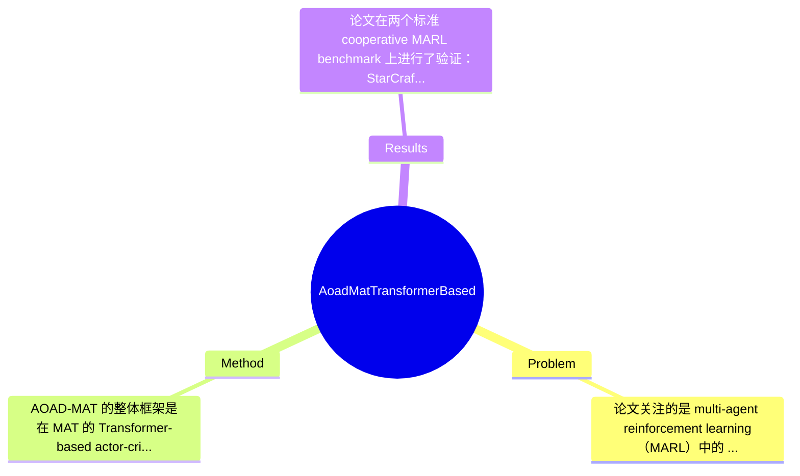

## Summary
这篇论文研究 cooperative MARL 中“agent 按什么顺序依次做动作决策”这一通常被忽略的问题，提出了基于 Multi-Agent Transformer 的 AOAD-MAT，通过显式学习并预测下一位决策 agent 的顺序，将顺序预测子任务与 PPO 风格 actor-critic 训练联合优化；作者在 SMAC 和 MA-MuJoCo 上报告其整体优于 MAT 及若干 baseline，说明 action decision order 的显式建模对 sequential MARL 具有增益。

## Problem & Motivation
论文关注的是 multi-agent reinforcement learning（MARL）中的 cooperative sequential decision-making 问题，具体来说，不再只问“每个 agent 该采取什么动作”，而进一步追问“多个 agent 应该按什么顺序依次作出动作决策”。这属于 MARL 中 credit assignment、inter-agent dependency 建模以及 sequential policy generation 的交叉问题。该问题重要，是因为在 cooperative 场景下，各 agent 的动作并非独立：先行动的 agent 会改变后续 agent 的条件分布，后行动的 agent 又可能更适合根据前者意图进行补偿或协同，因此决策顺序本身可能影响最终 joint policy 的质量。现实上，这类问题对应于多机器人协作、编队控制、自动驾驶路口协同、游戏战术执行等场景，其中“谁先做决定、谁后响应”常常不是中性的。

现有方法已有一定基础，但存在明确不足。第一，MAT 将多 agent 决策表述为 sequence generation，能建模 action dependency，但通常采用预定义或固定的 agent ordering，因此它利用了“序列形式”，却未真正学习“顺序本身是否最优”。第二，ACE 等方法也强调顺序式 action dependency 估计，但重点在更好估计 action value，而不是动态选择对当前状态最有利的决策次序，因此顺序仍更像建模假设而非可学习对象。第三，像 MAPPO、QMIX 这类经典方法虽然在 cooperative MARL 很强，但通常不显式建模 agent-by-agent autoregressive decision process，因而难以利用“顺序调度”这一额外自由度。

作者提出 AOAD-MAT 的动机总体是合理的：既然 sequential MARL 已被证明有效，那么顺序如果被固定，可能会人为限制 policy capacity；若能让模型根据状态动态决定谁先行动，就可能获得更优 advantage decomposition。论文的关键洞察在于，把“下一位应该由哪个 agent 决策”视为一个可学习子任务，并将其嵌入 Transformer-based actor-critic 中与策略优化联合训练，从而让 action order 不再是外部规则，而成为 policy 学习的一部分。

## Method
AOAD-MAT 的整体框架是在 MAT 的 Transformer-based actor-critic 基础上，加入一个显式的 agent action order 建模机制：在每个环境状态下，模型不仅要输出各 agent 的动作分布，还要逐步预测“下一个应当进行动作决策的 agent”，从而形成一个动态的 autoregressive decision order。随后，该顺序用于指导动作生成与 advantage 最大化，整个系统通过 PPO-based objective 联合优化策略学习与顺序学习。

核心组件可以概括为以下几点：

1. 顺序感知的 sequential decision process
- 作用：把多智能体联合决策过程拆成一个“选择下一个 agent -> 为该 agent 生成动作 -> 更新已决策前缀 -> 继续选择下一个 agent”的序列过程。
- 设计动机：作者认为不同 agent 在不同状态下的重要性不同，固定顺序会限制协作效率；动态顺序可让关键 agent 优先决策，后续 agent 再条件化响应。
- 与现有方法区别：MAT 通常将 agent 序列化，但顺序常为预设；AOAD-MAT 则把顺序作为显式学习对象，因此不是单纯“按序生成动作”，而是“先学序，再按序生成”。

2. 下一决策 agent 预测子任务（Sequential Action Decision Order Prediction）
- 作用：模型在每一步预测当前未决策 agent 中哪一个最适合作为 next actor，相当于学习一个 permutation construction policy。
- 设计动机：如果顺序真的影响 team return，那么应让模型通过数据自己发现有利顺序，而不是手工指定如按 index、位置或固定 leader。
- 与现有方法区别：传统 MARL 很少把 agent ordering 本身设为监督/辅助目标；该论文将其作为一个独立子任务并纳入主训练过程，这是 AOAD-MAT 最核心的增量。

3. Transformer-based actor-critic architecture
- 作用：使用 Transformer 统一建模全局状态、agent observation、历史决策前缀以及 agent 间依赖；actor 负责顺序条件下的动作选择，critic 负责价值估计和 advantage 计算。
- 设计动机：Transformer 擅长处理集合到序列、序列到序列的依赖关系，适合表达“哪些 agent 已经决策、剩余 agent 应如何响应”的上下文结构。
- 与现有方法区别：相比基于 RNN 或简单 MLP 的 MARL，Transformer 更容易捕获长程 inter-agent dependency；相比原始 MAT，这里额外编码了 order prediction 的上下文。

4. PPO-based joint loss with order-aware learning
- 作用：将策略优化损失与顺序预测相关损失联合训练，使“顺序选择”和“动作质量”协同提升，而不是先独立学排序、再学控制。
- 设计动机：若顺序模块脱离 RL 目标单独训练，学到的顺序不一定真正提升 return；因此需要让顺序学习受 advantage signal 约束。
- 与现有方法区别：论文强调把 order-aware subtask 集成进 PPO-based loss，中间应包含 policy loss、value loss、entropy regularization 以及顺序预测损失的组合。具体权重、精确公式在用户提供内容中未完整展开，因此只能确认其联合优化思路，无法逐项复原超参数，相关细节应标注为论文未提及。

5. lead agent 相关机制与 order-aware policy learning 分析
- 作用：从实验章节标题看，作者还分析了 lead agent selection 对性能的影响，说明其顺序生成过程可能存在起始 agent 或 leader 相关设计。
- 设计动机：在 permutation 式生成中，第一个被选中的 agent 往往最关键，可能显著影响后续条件动作分布。
- 与现有方法区别：多数 baseline 不会单独研究“谁先开始”这一因素，而该工作把它视为 order learning 的一部分进行验证。

技术上，这个方法最重要的设计选择有两类：一类是“必须的”，即显式顺序预测模块、基于顺序的 autoregressive 动作生成、与 RL 目标联合训练；没有这些，就退化回 MAT 或一般 sequential MARL。另一类是“可替代的”，例如顺序预测器是否必须用 Transformer decoder、是否必须用 PPO、顺序监督是否可以改成 pairwise ranking 或 Gumbel-Sinkhorn permutation relaxation，这些都可能有其他实现。

从简洁性看，AOAD-MAT 的核心想法其实相当清晰：把固定 agent order 变成可学习 order。但实现上它比标准 MAT 更复杂，因为需要同时维护未决策 agent 集合、next-agent prediction、顺序条件动作策略和联合损失。它不算过度工程化，但已经从“优雅的小改动”走向“带额外调度头和训练目标的完整扩展模型”，复杂度提升是明显的。

## Key Results
论文在两个标准 cooperative MARL benchmark 上进行了验证：StarCraft Multi-Agent Challenge（SMAC）和 Multi-Agent MuJoCo（MA-MuJoCo）。从摘要和章节结构可知，作者将 AOAD-MAT 与 MAT 及其他 baseline 进行了系统比较，并专门设计了关于顺序有效性、lead agent 选择以及不同 loss function 的分析实验。这说明实验设计并非只停留在主表结果，而是试图论证“性能提升确实来自 order-aware mechanism”。

但需要严格说明：由于用户提供的正文是章节提取与摘要，并未包含实验表格、曲线和具体数值，因此诸如 win rate、episode return、sample efficiency、最终平均分、标准差、提升百分比等具体数字，论文片段中无法获取，必须标注为“论文未提及”。因此可以确认的 benchmark 名称是 SMAC 和 MA-MuJoCo，可以确认的对比对象至少包括 MAT，以及“other baseline models”；但每个 task 名称（如 3s5z、MMM2、corridor、HalfCheetah/Ant 多智能体版本等）、指标定义和精确结果，当前材料中均未展开。

从实验结构看，核心结果应包含三类。第一，主性能实验：AOAD-MAT 在 SMAC tasks 和 MA-MuJoCo tasks 上整体优于 MAT 及其他 baseline，这是论文的主结论。第二，机制验证实验：5.2.3“Effectiveness of Agent Action Order”说明作者专门比较了考虑顺序与不考虑顺序、或不同顺序策略的差异，用来支撑“order matters”。第三，敏感性/消融分析：5.2.4“Influence of Lead Agent Selection”和 5.2.5“Loss Functions in Order-Aware Policy Learning”表明作者考察了起始 agent 选择及损失设计对结果的影响，这能部分回答各组件贡献问题。

批判性地看，论文的实验方向是对的，但当前公开片段无法判断其充分性。若主文仅报告“平均优于 baseline”而缺少显著性检验、跨 seed 方差、训练稳定性与计算开销，那么证据力度会受限。另一个潜在问题是 cherry-picking：如果作者只展示对 AOAD-MAT 有利的任务，而没有说明在哪些任务上收益不明显甚至退化，那么“顺序学习普适有效”的结论会被夸大。由于缺少完整表格，目前无法判断是否存在这种选择性展示。

## Strengths & Weaknesses
这篇论文的主要亮点有三点。第一，问题切入点新且合理。很多 sequential MARL 方法默认 agent order 是外生给定的，而 AOAD-MAT 直接挑战这一默认设定，把“谁先决策”提升为可学习变量，这是对 MAT/ACE 这类方法隐含假设的直接推进。第二，方法与已有框架兼容性较好。作者不是完全推翻 MAT，而是在 Transformer-based actor-critic 上增加 order prediction 子任务，因此从研究角度看具有较强可扩展性，也便于未来嫁接到其他 CTDE/CTCE sequential policy 架构。第三，实验问题设置较完整。除了标准 benchmark，对顺序有效性、lead agent 以及 loss function 的分析都指向机制解释，而非只做 leaderboard 式比较。

局限性也很明显。第一，技术上它引入了一个 permutation-like 决策层，训练与推理复杂度都会高于固定顺序 MAT；agent 数目增大时，next-agent selection 的组合难度可能上升，这在大规模 MARL 下是否仍稳定，当前材料看不到充分证据。第二，适用范围未必广。该方法天然更适合“顺序依赖强”的 cooperative 任务；若任务本身接近同步决策、agent 同质且交换对称性很强，那么学习顺序的收益可能有限，甚至只是额外噪声。第三，数据与训练信号可能较脆弱。顺序预测真正有用，前提是 advantage 能稳定区分“好的顺序”和“坏的顺序”；若环境奖励稀疏，order module 可能难学，甚至与动作策略相互干扰。

潜在影响方面，这项工作对 MARL 社区的贡献不一定是提出全新范式，但它提供了一个重要提醒：在 autoregressive multi-agent policy 中，order 不是中性实现细节，而可能是关键 inductive bias。未来可应用到多机器人协作调度、任务分配、通信时序控制等方向。

严格区分信息来源：已知——论文明确提出 AOAD-MAT、基于 Transformer actor-critic、引入 next-agent prediction 子任务、结合 PPO-based loss，并在 SMAC 与 MA-MuJoCo 上优于 MAT 及其他 baseline。推测——其性能提升主要来自更优的 conditional coordination，而在强顺序依赖任务中收益更明显；大规模场景下计算成本可能更高。不知道——具体提升数值、训练超参数、网络层数、损失权重、是否做显著性检验、失败任务类型、推理延迟与资源消耗，这些在当前提供内容中均未提及。

## Mind Map

## Notes
<!-- 其他想法、疑问、启发 -->
