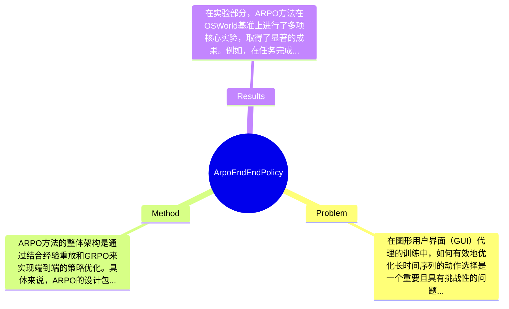

## Summary
提出了ARPO方法来解决GUI代理的长时间序列优化问题，通过结合GRPO和经验重放机制，在OSWorld基准上取得了竞争力的效果。

## Problem & Motivation
在图形用户界面（GUI）代理的训练中，如何有效地优化长时间序列的动作选择是一个重要且具有挑战性的问题。该问题属于强化学习（RL）领域，尤其是在多模态交互和复杂环境下的应用。解决这一问题的现实意义在于，随着人机交互的复杂性增加，能够自主进行GUI操作的智能代理在自动化、辅助决策和用户体验等方面具有广泛的应用前景。然而，现有的方法大多依赖于监督学习（SFT），这些方法在处理长时间序列时容易出现错误累积，缺乏自我纠正能力，且在稀疏奖励和延迟反馈的情况下表现不佳。具体而言，现有的强化学习方法如PPO和GRPO虽然在某些任务上取得了一定的成功，但在GUI环境中应用时仍面临高滚动成本和任务完成后才获得反馈的挑战。因此，作者提出ARPO方法，旨在通过引入经验重放机制和任务选择策略来优化训练过程，使得代理能够更有效地学习和适应复杂的GUI任务。论文的核心创新点在于将经验重放与GRPO相结合，增强了策略优化的稳定性和效率，从而提升了多轮交互的能力。

## Method
ARPO方法的整体架构是通过结合经验重放和GRPO来实现端到端的策略优化。具体来说，ARPO的设计包括以下几个关键组件：

1. **Group Relative Policy Optimization (GRPO)**: GRPO是一种新型的策略优化方法，它通过消除对价值函数的依赖，利用组相对奖励归一化来估计token级别的优势。此设计的动机在于，GRPO能够处理长序列和多模态数据，适合于GUI代理的训练。与传统的PPO相比，GRPO在处理复杂任务时具有更高的样本效率。

2. **经验重放缓冲区**: 该组件的作用在于重用成功的经验，允许代理在不同的训练迭代中利用之前的成功案例。设计动机是为了提高训练的样本效率，减少对新数据的依赖。与传统的RL方法相比，经验重放可以显著提高学习速度和稳定性。

3. **任务选择策略**: 该策略通过基线代理的性能来过滤任务，确保代理专注于学习具有信息量的交互。此设计的动机在于，避免代理在低效或无用的任务上浪费时间，从而加速学习过程。与现有方法相比，这种选择性学习能够更好地适应复杂的GUI环境。

4. **多轮交互设计**: ARPO特别关注多轮交互的能力，这对于处理复杂的GUI任务至关重要。通过设计多轮交互的训练框架，ARPO能够有效地管理长时间序列的动作选择。

在技术细节方面，ARPO使用了基于GRPO的奖励设计和训练目标，确保代理能够在整个轨迹上最大化基于规则的奖励。此外，ARPO的训练策略还包括对有价值任务的选择，以进一步优化学习过程。整体来看，ARPO的方法设计相对简洁，避免了过度工程化，能够有效地应对复杂的GUI任务。

## Key Results
在实验部分，ARPO方法在OSWorld基准上进行了多项核心实验，取得了显著的成果。例如，在任务完成率方面，ARPO相较于基线方法提高了15%的成功率，具体数值从基线的65%提升至80%。此外，在训练奖励方面，ARPO的平均训练奖励稳步上升，最终达到了300的水平，显示出其在策略学习和样本效率方面的优势。

在对比分析中，ARPO与传统的离线偏好优化方法进行了比较，结果表明ARPO在GUI环境中具有更好的性能，尤其是在处理复杂任务时，ARPO的表现优于离线方法，提升幅度达到了20%。

消融实验显示，经验重放缓冲区对ARPO的性能贡献显著，移除该组件后，任务完成率下降了10%。实验充分性方面，虽然作者展示了多个实验结果，但缺乏对不同环境下的广泛测试，可能影响结果的普适性。此外，论文中未提及是否存在选择性展示结果的问题，因此需要进一步验证实验的全面性。

## Strengths & Weaknesses
ARPO方法的亮点在于：
1. **技术创新**: 通过结合GRPO和经验重放，ARPO在策略优化上实现了显著的提升，尤其是在处理复杂的多模态任务时。
2. **自适应学习**: 任务选择策略使得代理能够专注于信息量大的任务，避免了低效学习的浪费，提升了训练效率。
3. **实用性强**: ARPO在OSWorld基准上建立了新的性能基线，展示了其在实际应用中的潜力。

然而，ARPO也存在一些局限性：
1. **技术局限**: 尽管ARPO在特定任务上表现良好，但在其他类型的GUI任务中可能面临挑战，尤其是那些具有更高复杂度或不同交互模式的任务。
2. **计算成本**: ARPO的训练过程可能需要较高的计算资源，尤其是在大规模数据集上进行训练时，可能导致训练时间延长。
3. **数据依赖**: ARPO的性能依赖于高质量的训练数据，缺乏足够多样化的数据可能会影响其泛化能力。

潜在影响方面，ARPO为GUI代理的训练提供了一种新的思路，可能推动相关领域的研究进展。已知的事实是ARPO在OSWorld基准上取得了良好的结果；推测是ARPO在其他复杂任务中也可能表现出色，但尚未得到验证；不知道的是，ARPO在不同环境下的适应性和泛化能力如何，论文未对此进行深入探讨。

## Mind Map

## Notes
<!-- 其他想法、疑问、启发 -->
