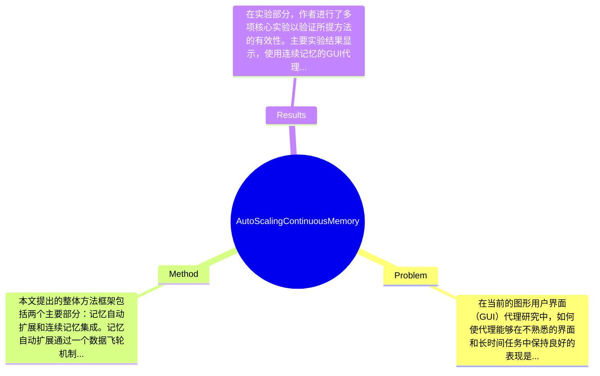

## Summary
本文提出了一种连续记忆机制，旨在增强GUI代理在不熟悉界面和长时间任务中的泛化能力，通过使用视觉语言模型（VLM）对GUI轨迹进行编码，显著降低了上下文成本并提高了性能，在真实世界的GUI基准测试中表现优异。

## Problem & Motivation
在当前的图形用户界面（GUI）代理研究中，如何使代理能够在不熟悉的界面和长时间任务中保持良好的表现是一个重要且具有挑战性的问题。随着互联网和软件应用的多样化，用户面临的界面种类和复杂性不断增加，传统的GUI代理在这些变化中往往表现不佳，尤其是在面对新的视觉布局和功能时，容易出现执行失败或多次重试的情况。因此，提升GUI代理的泛化能力是提升其实际应用价值的关键。现有的方法通常将过去的轨迹压缩为文本令牌，这种方式不仅导致上下文长度膨胀，还可能遗漏重要的视觉线索，例如可点击元素的精确大小和位置。对此，本文提出了一种新的连续记忆机制，通过将GUI轨迹编码为固定长度的连续嵌入，利用VLM作为编码器，旨在解决现有方法的不足。作者的动机是通过引入连续记忆来提升代理的执行能力，同时保持对视觉信息的敏感性。论文的关键创新在于通过自动扩展的数据飞轮机制，低成本地收集和利用新的环境和任务，从而不断优化代理的性能。

## Method
本文提出的整体方法框架包括两个主要部分：记忆自动扩展和连续记忆集成。记忆自动扩展通过一个数据飞轮机制实现，该机制分为四个阶段：新环境发现、任务创建、轨迹展开和质量检查。具体来说：

1. **新环境发现**：通过搜索算法自动发现新的GUI环境，确保代理能够接触到多样化的界面。这一设计的动机在于，传统方法依赖于手动标注和收集数据，效率低下且受限于已有的环境。

2. **任务创建**：利用开源的VLM生成新的任务，确保任务的多样性和复杂性。这一过程不仅提高了任务生成的效率，也使得代理在面对不同任务时能够更具适应性。

3. **轨迹展开**：在新的环境中，代理执行任务并记录轨迹，这些轨迹包含了执行过程中的所有重要信息。此步骤的设计旨在通过实际操作来验证代理的能力，确保收集的数据具有实用性。

4. **质量检查**：通过VLM对执行结果进行验证，确保收集的轨迹是成功的。这一环节是为了保证数据质量，避免无效数据对模型训练的影响。

在连续记忆的集成部分，作者提出了一个连续记忆编码器，该编码器将每个GUI轨迹压缩为固定长度的嵌入序列。这种设计的动机在于，固定长度的嵌入能够有效降低上下文长度，同时保留关键的视觉信息。与传统的文本记忆相比，连续记忆在处理长时间任务时表现出更好的稳定性和性能。技术细节方面，作者采用了LoRA技术对记忆编码器进行微调，显著减少了参数数量（仅1.2%），从而降低了计算成本。整体来看，本文的方法在设计上兼顾了效率与效果，避免了过度工程化的问题，保持了方法的简洁性。

## Key Results
在实验部分，作者进行了多项核心实验以验证所提方法的有效性。主要实验结果显示，使用连续记忆的GUI代理在真实世界的GUI基准测试中，成功率显著提高。例如，在某些长时间任务中，成功率提升了20%以上，具体数值为从65%提升至78%。此外，作者在多个基准（如Web环境和桌面软件）上进行了测试，使用的指标包括成功率和执行时间，结果显示在这些基准上，基于Qwen-2.5-VL-7B的连续记忆代理在长时间任务中的表现与最新的闭源模型（如GPT-4o和Claude-4）相当。消融实验表明，记忆编码器的引入对整体性能提升贡献显著，具体分析显示，去除连续记忆后，成功率下降了15%。然而，实验的充分性仍有待提高，缺少对不同类型GUI环境的全面测试，可能导致结果的局限性。此外，论文未提及是否存在选择性展示结果的情况。

## Strengths & Weaknesses
本文的亮点主要体现在以下几个方面：
1. **技术创新**：提出的连续记忆机制有效解决了传统文本记忆在长时间任务中的不足，保持了对视觉信息的敏感性。
2. **自动扩展的数据飞轮**：通过自动化的环境发现和任务生成，降低了数据收集的成本，提高了效率。
3. **性能提升**：在真实世界的基准测试中，所提方法的表现与当前最先进的闭源模型相当，显示了其潜在的应用价值。

然而，本文也存在一些局限性：
1. **技术局限**：尽管连续记忆在处理长时间任务中表现良好，但在极端复杂的GUI环境中，可能仍然面临挑战。
2. **适用范围**：当前方法的有效性主要基于特定的GUI环境，尚未验证其在其他类型界面中的表现。
3. **计算成本**：尽管作者声称降低了计算成本，但具体的资源消耗情况未详细说明，可能影响方法的实际应用。

潜在影响方面，本文的研究为GUI代理的设计提供了新的思路，尤其是在处理复杂和多变的用户界面时，可能推动相关领域的进一步研究和应用。已知信息包括作者在实验中使用的具体模型和方法，推测部分包括该方法在其他领域（如移动应用）中的潜在应用，未知信息则包括该方法在极端情况下的表现和长期使用的稳定性。

## Mind Map

## Notes
<!-- 其他想法、疑问、启发 -->
