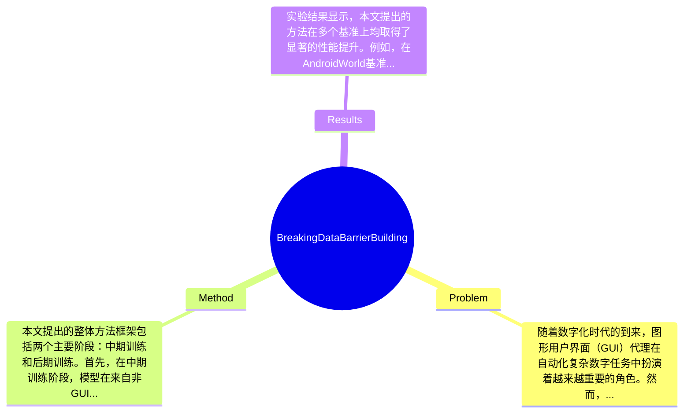

## Summary
本文提出了一种通过中期训练阶段使用数据丰富的推理任务来解决GUI代理在高质量轨迹数据稀缺问题的方法，并在AndroidWorld和WebArena基准上分别实现了12.2%和8.0%的性能提升。

## Problem & Motivation
随着数字化时代的到来，图形用户界面（GUI）代理在自动化复杂数字任务中扮演着越来越重要的角色。然而，现有的GUI代理在执行任务时往往受限于高质量轨迹数据的稀缺，这使得它们的性能受到严重影响。解决这一问题不仅有助于提高生产力，还能推动智能助手等技术的广泛应用。现有方法主要依赖于GUI感知数据进行训练，但研究表明，这些数据对最终性能的提升效果有限，甚至可能导致过拟合。因此，本文的动机在于探索如何通过引入中期训练阶段，利用来自非GUI领域的丰富数据来增强模型的通用性和稳定性。关键洞察在于，任务的泛化能力在很大程度上依赖于中期训练阶段的设计，通过对多种任务的实验，发现文本推理和多模态推理任务能够显著提升GUI代理的性能，尤其是在跨模态和跨领域的知识转移上。

## Method
本文提出的整体方法框架包括两个主要阶段：中期训练和后期训练。首先，在中期训练阶段，模型在来自非GUI领域的多种任务上进行训练，以增强其推理能力和通用性；然后，在后期训练阶段，模型使用GUI轨迹数据进行微调，以适应具体的GUI任务。关键组件包括：
1. **中期训练数据**：该组件的作用是为模型提供丰富的推理任务数据，增强其泛化能力。设计动机在于，传统的GUI感知数据不足以提升性能，而非GUI领域的数据则能提供更广泛的知识背景。与现有方法相比，这种设计能够有效避免过拟合，提高模型的稳定性。
2. **任务选择**：选择多种任务（如多模态数学推理、文本推理等）进行中期训练，目的是通过多样化的任务来提升模型的综合能力。这一设计使得模型能够在不同的任务之间进行知识迁移，增强其适应性。
3. **后期训练策略**：在完成中期训练后，模型使用GUI轨迹数据进行微调，以确保其能够有效地执行具体的GUI任务。此策略确保了模型在广泛知识背景下的学习与具体任务的结合。
4. **评估机制**：通过在多个基准（如AndroidWorld和WebArena）上进行评估，确保模型的泛化能力和实际应用效果。评估指标包括任务完成率和准确性等。
在技术细节方面，模型采用了先进的Vision-Language模型（VLM）架构，结合了视觉理解和语言推理能力。设计选择中，模型的中期训练阶段是必不可少的，而后期训练则是为了确保模型在特定任务上的优化。整体方法在设计上较为简洁，避免了过度工程化，确保了模型的高效性和实用性。

## Key Results
实验结果显示，本文提出的方法在多个基准上均取得了显著的性能提升。例如，在AndroidWorld基准上，使用多模态数学推理任务的模型性能提升了6.3%；而在WebArena上，文本推理任务的引入使得性能提升达到了5.6%。此外，通过优化中期训练任务组合，最终在AndroidWorld和WebArena上分别实现了12.2%和8.0%的绝对性能提升。这些结果表明，任务泛化能力的提升是模型性能提升的关键因素。消融实验显示，加入GUI轨迹数据的中期训练阶段对最终性能的影响显著，验证了中期训练设计的有效性。实验充分性方面，作者在11个中期训练任务上进行了广泛的实验，虽然结果令人鼓舞，但缺乏对不同任务组合的深入分析，可能会影响对最佳任务选择的理解。此外，论文未提及是否存在选择性展示结果的情况。

## Strengths & Weaknesses
本文的亮点包括：1. 提出了通过中期训练阶段提升GUI代理性能的新方法，具有创新性和实用性；2. 在多个基准上取得了显著的性能提升，验证了任务泛化能力的重要性；3. 设计简洁，避免了过度复杂化，易于实现和应用。局限性方面：1. 方法依赖于高质量的中期训练数据，若数据质量不足，可能会影响最终性能；2. 适用范围主要集中在特定类型的GUI任务，对于其他类型的任务可能效果不佳；3. 计算成本较高，尤其是在中期训练阶段需要处理大量数据。潜在影响方面，本文为GUI代理的研究提供了新的思路，可能推动智能助手等应用的发展。已知信息包括：模型在多个基准上取得了性能提升；推测信息包括：中期训练阶段的任务选择可能对最终性能有更深远的影响；未知信息包括：论文未涉及不同任务组合对模型性能的具体影响。

## Mind Map

## Notes
<!-- 其他想法、疑问、启发 -->
