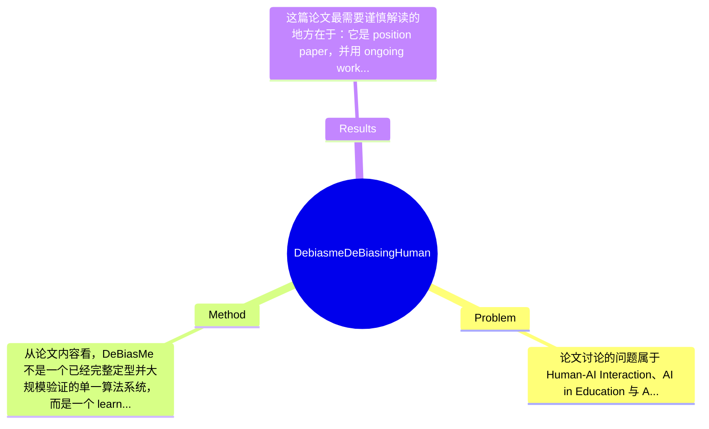

## Summary
这篇论文聚焦教育场景中学生与 Gen AI/LLM 交互时产生的人类认知偏差问题，提出以 metacognition 为核心的 AIED 干预框架 DeBiasMe，通过 deliberate friction、双向人机协作和 adaptive scaffolding 来减少 anchoring、confirmation、automation bias 等偏差。论文性质是 position paper/概念性框架展示，并以 DeBiasMe 的 Prompt Refinement Tool、Bias Visualization Map 等设计作为示例，但未给出完整实证结果，因此其主要贡献在于提出研究议程与设计框架，而非证明定量性能优势。

## Problem & Motivation
论文讨论的问题属于 Human-AI Interaction、AI in Education 与 AI literacy 交叉领域，核心是：当大学生在学习、写作、总结、论证与研究综合等任务中使用 Gen AI 时，用户自身会在输入构造、输出解读、采纳决策等环节受到 anchoring bias、confirmation bias、automation bias 等认知偏差影响，从而削弱批判性思维与学习质量。这个问题之所以重要，是因为教育场景并不只是追求“更快完成任务”，更关心学生是否形成独立判断、反思能力与高阶思维；如果学生把 AI 当作权威答案生成器，而非认知协作对象，AI 反而可能放大思维惰性与错误信念。现实意义上，这关系到大学教学中 AI 工具的课程设计、学术诚信、学生 epistemic agency 以及长期学习能力培养。

论文指出现有方法存在几类具体不足。第一，很多 AI literacy 工具强调 prompt engineering、功能操作和输出评估，但较少系统处理“人的偏差”如何在使用流程中介入，因此偏重 tool proficiency，忽视 cognitive vulnerability。第二，已有关于 AI 偏见的研究更多聚焦 algorithmic bias 或 dataset bias，却没有充分覆盖 human bias 与 system bias 相互作用这一层。第三，一些教育技术系统追求 frictionless interaction，即让 AI 使用尽可能顺畅，但在学习场景中过度顺滑可能促进自动接受与浅层采纳，而不是深度反思。

基于此，作者提出新方法的动机是合理的：如果教育中的目标是培养批判性使用 AI 的能力，那么系统必须显式支持 metacognitive monitoring，而不是只优化便利性。论文的关键洞察在于，将“deliberate friction”从交互缺陷重新定义为教育性设计资源：适度增加停顿、可视化、重述和比较机制，能帮助学生在输入阶段与输出阶段都意识到偏差风险，并恢复对 AI 协作过程的主体性。

## Method
从论文内容看，DeBiasMe 不是一个已经完整定型并大规模验证的单一算法系统，而是一个 learner-centered AIED intervention framework。其整体架构围绕“识别学生在 Human-AI workflow 中的元认知支持需求”，然后在 AI 使用的前端与后端嵌入有意设计的 friction、可视化与脚手架机制，使学生在提问、接收回答、解释回答、修正判断几个关键节点被提醒去审视自己的偏差，而不是无缝地接受 AI 输出。

第一，核心框架一：deliberate friction in human-AI feedback loops。该组件的作用是在交互流程中插入反思节点，打断自动化采纳。作者的设计动机很明确：教育场景不应把“低摩擦”视为唯一目标，因为过于流畅的系统更容易让学生默认 AI 正确。与传统追求 usability 最大化的设计不同，这里强调 pedagogical friction，即为了认知校准而有意制造停顿、重检与比较。论文未给出严格算法实现，但概念上包括在用户提交 prompt 前引导其检查措辞、假设与立场，在读取回答后引导其区分事实、推断与 AI 生成内容。

第二，核心框架二：bi-directional human-AI collaboration。该组件强调干预不能只放在“输出评估”一端，而应同时覆盖 input formulation 与 output interpretation。很多现有 AI literacy 设计把重点放在“如何辨别 AI 是否出错”，但作者认为偏差在提问阶段就已发生，例如带有预设结论的 prompt 会诱发 confirmation bias。DeBiasMe 因此提出双向干预：一方面帮助学生改写 prompt，减少诱导式、封闭式、单视角提问；另一方面帮助学生在看到 AI 回答后进行再解释、对照和反证搜索。这个设计与常见“输出审核器”不同，因为它将 bias 看作 interactional phenomenon，而不是单点错误。

第三，Prompt Refinement Tool。它是文中最具体的子工具之一，作用是支持学生在正式向 AI 发问前进行 prompt 重构。设计动机是让学习者意识到：问题的表述方式本身会决定 AI 输出的范围、语气与证据结构，从而影响后续判断。它可能通过提示用户识别 leading question、过度确定性措辞、缺少反方视角、未说明证据需求等问题来实现元认知支架。与现有 prompt helper 的区别在于，后者通常优化“更高效得到想要答案”，而 DeBiasMe 更关注“暴露并修正提问中的偏差”。这是从 performance-oriented prompting 转向 bias-aware prompting。

第四，Bias Visualization Map。该组件负责把原本隐性的偏差风险外显化，使用户能看到某次交互可能涉及哪些 cognitive bias，以及这些偏差在何处进入流程。设计动机来自 metacognition 理论：很多偏差并不是用户主动选择，而是未经觉察的加工捷径，因此需要外部表征帮助其监控。与传统 explainability 可视化不同，Bias Visualization Map 不是解释模型内部 attention 或 token 机制，而是解释用户—系统交互中潜在的认知风险路径。论文进一步提到 progressive visualization 与 adaptive visualization，说明可视化应随用户水平逐步展开，而不是一次性展示全部复杂信息。

第五，bias detection approach 与 scaffolding mechanisms。论文提出 bias measurement 应考虑 prevalence、intensity 与 mitigation，但未给出明确公式、分类器或标注协议，因此目前更像方法学原则而非定型技术。scaffolding 方面，作者强调三类设计：让 AI 使用与 bias implications 绑定、面向具体 use case 设计、以及处理用户对 AI 的 trust。这里的关键选择是把信任看作可调节变量，而不是越高越好；教育中需要 calibrated trust。整体看，这套方法在概念上较统一，理论动机也清晰，优点是把 metacognition、AI literacy 与 HAI 连接起来；但从工程角度仍较抽象，离可复现系统还有距离，因此更像优雅的研究框架，而非已成熟的产品级方法。

## Key Results
这篇论文最需要谨慎解读的地方在于：它是 position paper，并用 ongoing work 的形式介绍 DeBiasMe，因此严格意义上并没有提供完整 benchmark 实验、统计检验或与 baseline 的定量对比结果。论文摘要、章节目录和给定内容中均未出现标准化实验表格，也未报告诸如 accuracy、F1、learning gain、bias reduction rate、NASA-TLX、SUS、trust calibration score 等具体数值。因此，如果按机器学习论文的“Key Results”标准衡量，这篇论文的定量结果基本是“论文未提及”。

从文中可确认的“结果”更多是概念性主张而非实验结论。其主要输出包括三点：第一，提出 metacognitive support with deliberate friction 应成为 AI literacy 干预的一部分；第二，提出 bi-directional intervention，需要同时干预 prompt formulation 与 output interpretation；第三，提出 adaptive scaffolding、bias visualization 与 methodological integrity for bias analysis 的设计议程。也就是说，论文的“成果”是一个研究框架和设计原则集合，而不是在某个 benchmark 上取得 SOTA。

Benchmark 方面，论文未提及使用任何公开 benchmark，也没有说明实验对象规模、课程场景、任务类型、对照组设置或评估周期。唯一可以推断的应用对象是 university students，场景是学术环境中的 Gen AI 使用，但这不是正式 benchmark。对比分析方面，也没有与现有 AI literacy tool、reflection support system、prompt assistant 或 bias mitigation interface 做定量比较；提升百分比、显著性水平均未报告。消融实验同样未出现，因此无法判断 Prompt Refinement Tool、Bias Visualization Map、adaptive visualization 等组件的独立贡献。

批判性地说，论文的实验充分性明显不足，但这与其 position paper 定位一致，不宜按成熟实证论文标准苛责。真正缺少的关键实验包括：随机对照实验验证学生偏差是否显著下降；长期跟踪观察是否提升 critical thinking 而非仅提升自我报告意识；不同学科、不同 AI 熟练度用户的异质性分析；以及 friction 设计是否带来使用负担或反感。就 cherry-picking 而言，由于论文几乎没有展示正向数字结果，也谈不上只挑最好结果；更准确地说，是尚未进入系统实证阶段。

## Strengths & Weaknesses
这篇论文的亮点首先在于问题切入非常准确。已知事实是，作者没有把 AI 偏差仅理解为模型偏差，而是把 human bias、statistical bias、systemic bias 放在同一交互框架下讨论，这比很多只谈 fairness 或只谈 prompting 的工作更完整。第二个亮点是 deliberate friction 的教育化重释：在 HCI 中摩擦通常被视为要消除的阻力，但作者指出在学习场景里，适度摩擦可能是促进反思与去偏差的必要条件，这一设计哲学具有启发性。第三个亮点是双向干预视角，即偏差不仅发生在“看答案”时，也发生在“怎么问”时，这使 DeBiasMe 超越了单纯的输出审核工具。

但局限也很明显。第一，技术层面上它更像概念框架，缺少可执行的 bias detection algorithm、标注体系、模型结构与评估协议，因此目前难以复现，也难比较。第二，适用范围可能有限。推测在高时间压力、低学习动机或事务性任务场景中，用户未必愿意接受 friction；过多提示还可能造成 reactance 或 interaction fatigue。第三，计算与部署成本目前未知。论文虽提出 adaptive visualization 和 adaptive scaffolding，但没有说明适配机制基于规则、用户建模还是在线学习，因此其实现复杂度、数据需求与隐私风险都不清楚。第四，效果边界不明：不知道它究竟能减少哪些偏差、在多大程度上减少，以及是否会把偏差从一种形式转移到另一种形式。

潜在影响方面，已知这篇工作有助于推动 AIED 从“教学生会用 AI”转向“教学生如何不被自己与系统共同误导”，对 AI literacy、critical pedagogy、trust calibration 和 epistemic ethics 都有意义。推测其后续可扩展到写作辅助、研究检索、同行评议训练和课堂讨论支持。未知的是：真实学习增益、跨文化普适性、长期行为改变以及教师采纳成本。

严格区分三类信息：已知——这是一篇 2025 arXiv/Workshop position paper，提出 deliberate friction、bi-directional collaboration、adaptive scaffolding，并举例 Prompt Refinement Tool 与 Bias Visualization Map。推测——这些设计若实现得当，可能减少 confirmation/anchoring/automation bias 并提升 calibrated trust。 不知道——具体实验数据、样本量、算法细节、部署方式、长期效果与失败案例，论文当前都未充分提供。

## Mind Map

## Notes
<!-- 其他想法、疑问、启发 -->
