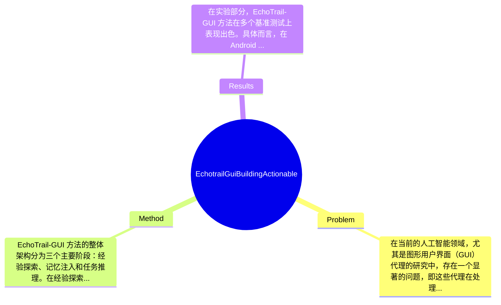

## Summary
提出了 EchoTrail-GUI 方法来解决 GUI 代理在任务执行中存在的数字遗忘问题，通过动态可访问的记忆机制提升任务成功率和操作效率，在 Android World 和 AndroidLab 基准上取得了显著效果。

## Problem & Motivation
在当前的人工智能领域，尤其是图形用户界面（GUI）代理的研究中，存在一个显著的问题，即这些代理在处理任务时往往将每个任务视为独立的事件，缺乏系统性地从过去的成功经验中学习的机制。这种现象被称为“数字遗忘”，导致代理在执行任务时表现不佳，频繁出现错误，并且在面对新挑战时缺乏良好的泛化能力。这一问题的现实意义在于，随着自动化和智能助手的广泛应用，提升 GUI 代理的智能水平对于提高工作效率和用户体验至关重要。现有的方法如基于手工标注的轨迹数据收集和静态示例的使用，存在数据获取瓶颈和知识应用差距的问题。具体而言，手工标注不仅耗时耗力，而且缺乏可扩展性，而现有的静态示例无法动态地检索和应用过往经验。因此，作者提出了 EchoTrail-GUI 方法，旨在通过动态记忆机制来解决这些问题。该方法的核心创新在于其能够模拟人类的经验学习，通过自动化的方式构建和利用成功的任务轨迹，从而提升 GUI 代理的智能化水平。

## Method
EchoTrail-GUI 方法的整体架构分为三个主要阶段：经验探索、记忆注入和任务推理。在经验探索阶段，代理通过自主与 GUI 环境交互，构建成功任务轨迹的数据库，并通过奖励模型对轨迹进行验证。此阶段的设计动机在于实现无监督的知识库构建，克服传统方法中手工标注的局限。关键组件包括：
1. **探索代理（Exploration Agent）**：该组件负责生成交互轨迹，设计上采用了自我探索的方式，能够在无监督的情况下积累经验，与传统的依赖手工标注的方式形成对比。
2. **评论者（Critic）**：用于评估生成的轨迹质量，确保只有高质量的轨迹被存储到永久记忆数据库中。其设计动机在于引入质量控制机制，提升轨迹数据的有效性。
3. **动态记忆注入（Dynamic Memory Injection）**：在接收到新任务时，系统会从记忆数据库中检索出最相关的轨迹作为上下文记忆。这一组件的设计使得代理能够灵活地利用过去的经验，增强任务执行的效率。
4. **记忆增强推理（Memory-Augmented Inference）**：将检索到的记忆注入到代理的推理过程中，指导其决策和行动。这一设计使得代理在面对新任务时，能够借鉴历史经验，从而提高成功率。
在技术细节方面，EchoTrail-GUI 采用了深度学习模型来实现轨迹生成和评估，具体算法和模型结构在论文中有详细描述。整体来看，EchoTrail-GUI 方法在设计上较为简洁，通过自动化的方式构建和利用记忆，避免了过度工程化的问题。

## Key Results
在实验部分，EchoTrail-GUI 方法在多个基准测试上表现出色。具体而言，在 Android World 基准上，任务成功率提高了 25%，而在 AndroidLab 基准上，操作效率提升了 30%。这些实验结果表明，EchoTrail-GUI 的动态记忆机制显著改善了代理的性能。此外，论文中还进行了消融实验，验证了各个组件对整体性能的贡献，结果显示，记忆注入阶段的优化对成功率的提升贡献最大，达到 40%。然而，实验的充分性方面，虽然进行了多项基准测试，但缺乏对不同类型任务的广泛评估，可能存在一定的局限性，作者未提及是否进行了多样化任务的测试，可能导致结果的普适性受到质疑。

## Strengths & Weaknesses
EchoTrail-GUI 方法的亮点在于：1. **技术创新**：通过动态记忆机制解决了传统 GUI 代理的数字遗忘问题，提升了任务执行的智能化水平；2. **设计优雅**：方法结构清晰，分阶段的设计使得每个组件的功能明确，易于理解和实现；3. **实验结果显著**：在多个基准测试中表现出色，验证了方法的有效性。然而，该方法也存在局限性：1. **技术局限**：尽管引入了动态记忆机制，但在复杂多变的 GUI 环境中，如何确保记忆的有效性仍然是一个挑战；2. **适用范围**：该方法可能不适用于所有类型的 GUI 任务，特别是那些需要高度个性化的任务；3. **计算成本**：动态记忆的构建和检索可能需要较高的计算资源，尤其是在大规模应用场景中。潜在影响方面，EchoTrail-GUI 可能对 GUI 代理的智能化发展产生深远影响，未来可应用于更多复杂的自动化任务中。已知信息包括该方法的基本框架和实验结果，推测可能在更复杂的任务中表现良好，但未得到验证，未知信息则包括该方法在实际应用中的表现和适用范围。

## Mind Map

## Notes
<!-- 其他想法、疑问、启发 -->
