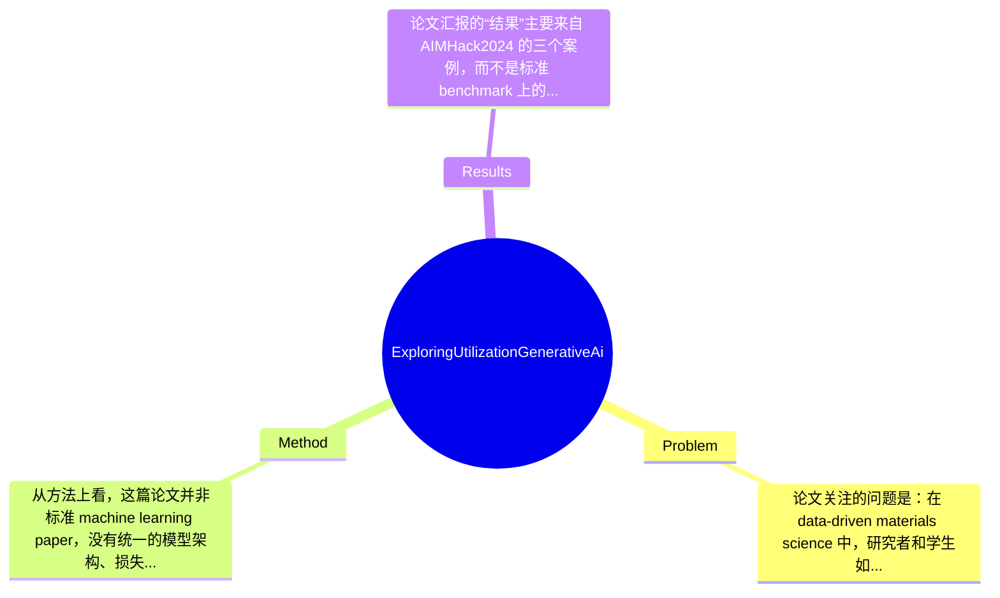

## Summary
这篇论文讨论的不是一个新的 materials science 算法，而是面向 data-driven materials science 的 generative AI 使用范式：作者通过组织 AIMHack2024，探索用大语言模型辅助软件试用、构建 PHYSBO 的 AI tutor，以及把 Python 脚本改造成 GUI 应用。论文的主要贡献是给出一组实践案例，说明 generative AI 在研究与教育流程中的可用性与局限，但整体更像经验总结与应用记录，而非经过严格 benchmark 验证的方法论文。

## Problem & Motivation
论文关注的问题是：在 data-driven materials science 中，研究者和学生如何高效、安全、可验证地使用 generative AI 来辅助科研软件学习、实验流程搭建与教育支持。这属于交叉领域问题，位于 materials informatics、scientific software engineering 与 AI-assisted education 的交汇点。该问题重要的原因在于，现代材料科学越来越依赖复杂软件栈，例如图像分析工具、Bayesian optimization 软件、数据处理脚本与可视化界面；但软件学习门槛高、文档分散、编程能力差异大，导致研究效率受限，尤其对初学者更明显。现实意义上，如果 generative AI 真能降低工具使用门槛，它就可能加速实验设计、数据采集、参数优化和教学培训，对材料研发、实验室 onboarding、跨学科合作都有价值。

现有方法的局限，论文实际上隐含指出了几类。第一，传统软件文档和 tutorial 往往是静态的，难以根据用户背景动态解释，初学者遇到报错时也缺乏即时交互支持。第二，许多科研软件虽然功能强，但命令行使用方式不友好，用户需要自己理解参数、环境配置和脚本逻辑，学习成本较高。第三，单纯依赖通用型 ChatGPT 一类模型会面临 hallucination、代码不一定可运行、领域术语解释不够贴合具体软件等问题，因此“直接问模型”并不等于“可靠使用 AI”。

作者提出该工作的动机是合理的：与其抽象讨论 AI 对科研的影响，不如通过一个 hackathon 在真实使用场景中观察 AI 如何帮助科研与教育。论文的关键洞察不在于提出全新模型，而在于将 generative AI 嵌入材料科学典型 workflow 的三个环节——软件试用、软件教学、软件可用性增强——并强调“critical evaluation”是使用 AI 的前提。这一点很重要：作者并没有把 AI 当成自动正确的助手，而是把它视为需要被验证的协作工具，这一定位相对务实。

## Method
从方法上看，这篇论文并非标准 machine learning paper，没有统一的模型架构、损失函数或训练流程；更准确地说，它提出的是一个基于 hackathon 的应用探索框架：选择 data-driven materials science 中具有代表性的科研软件任务，组织跨学科参与者在 generative AI 的帮助下完成软件上手、知识辅导和界面开发，并总结 AI 在研究与教育中的有效使用模式。整体框架可以概括为：以真实软件为载体，以 LLM 为交互中枢，以人工验证为安全机制，观察 AI 在科研 workflow 中的赋能效果。

关键组件可以分为以下几个部分：

1. AI-assisted software trials（AI 辅助软件试用）
   - 作用：帮助参与者，尤其是 beginner，快速上手特定软件，例如论文中提到的 ImageJ，用于 automated image analysis。
   - 设计动机：材料科学研究中，第一步往往是从实验图像或测量结果中抽取结构化数据；如果软件试用成本太高，数据积累就会受阻。因此作者将“在 AI 指导下完成基础计算或分析”作为最先验证的场景。
   - 与现有方式区别：传统上依赖官网文档、人工指导或零散教程；这里改为让 generative AI 提供步骤解释、命令建议、代码草案和错误定位，形成更交互式的 onboarding。
   - 技术细节：从论文摘要与引言可知，参与者通过像 MatDaCs 这样的 portal site 获取软件，再在 AI 协助下完成试用。论文未提及具体 prompt engineering 模板、模型版本、对话轮次统计或成功率定义，因此技术细节较粗。

2. AI tutor for PHYSBO with MyGPT（面向 PHYSBO 的定制化 AI tutor）
   - 作用：为 Bayesian optimization 工具 PHYSBO 构建一个针对性教学与问答系统，帮助用户理解参数设置、使用流程和优化逻辑。
   - 设计动机：PHYSBO 属于材料探索中比较有代表性的工具，但 Bayesian optimization 对很多实验研究者并不直观。通用 LLM 虽然能回答概念问题，却不一定能准确结合某一软件包的 API、输入输出格式和案例文档，因此作者选择借助 MyGPTs 做软件专用 tutor。
   - 与现有方法区别：区别不在底层模型，而在知识组织方式——把特定软件文档与教学需求绑定，使回答更贴近 PHYSBO 的使用语境，而不是泛泛解释 Bayesian optimization。
   - 技术细节：论文明确说使用 MyGPT 构建 tutor，但未提及知识库来源、是否采用 retrieval-augmented generation、是否接入官方文档、如何处理版本更新，也未给出 tutor 回答准确率或用户满意度量化评测。

3. GUI development from Python scripts with generative AI（借助 AI 将 Python 脚本改造成 GUI 应用）
   - 作用：提高软件可用性，让原本依赖脚本和命令行的工具更适合非编程背景用户使用。
   - 设计动机：在材料科学中，很多算法原型停留在“能跑的脚本”阶段，真正阻碍传播的往往不是算法本身，而是 usability。作者把 GUI 开发作为第三个场景，实际上是在测试 generative AI 能否承担“轻量软件工程助手”的角色。
   - 与现有方法区别：传统 GUI 封装通常需要懂框架、事件逻辑和部署流程；这里由 AI 辅助代码改写、界面生成和功能封装，降低开发门槛。
   - 技术细节：论文指出对象之一是 PHYSBO，但没有完整说明 GUI 使用何种框架（如 Tkinter、PyQt、Streamlit 等，论文未提及），也没有说明代码规模、人工修改比例或最终部署形态。

4. Human-in-the-loop verification（人工验证闭环）
   - 作用：这是全文最关键但最容易被忽视的“方法组件”。作者明确强调，参与者需要用文献、领域知识和实际运行结果去验证 AI 输出。
   - 设计动机：因为 generative AI 的核心风险不是“不会回答”，而是“看似合理但实际错误”。在科研与教育中，如果缺少验证闭环，就可能传播错误知识、生成错误代码，甚至误导实验设计。
   - 与很多乐观叙事的区别：作者没有把 AI 当 autonomous agent，而是强调 critical evaluation，这是这篇应用论文最有价值的 methodological stance。

整体来看，这个“方法”具有较强实践导向，简洁性尚可，因为其核心逻辑很直接：选任务、用 AI、做人类验证、记录经验。但从学术方法论角度，它也比较松散，缺少明确 protocol、定量指标和可复现的操作细节，因此更像 exploratory case study，而不是简洁优雅的标准化研究方法。换言之，它避免了复杂算法层面的过度工程化，却在 evaluation 和 formalization 上明显不足。

## Key Results
论文汇报的“结果”主要来自 AIMHack2024 的三个案例，而不是标准 benchmark 上的模型性能比较。根据摘要和引言可明确提取的核心成果有三项：第一，利用 generative AI 辅助完成 ImageJ 的 automated image analysis 软件试用；第二，基于 MyGPTs 为 PHYSBO 构建 AI tutor；第三，在 generative AI 帮助下将 Python 脚本发展为 GUI 应用，以提升 PHYSBO 等软件的可用性。论文还提到 hackathon 于 2024 年 7 月举办，约有 30 名参与者，覆盖 students 到 industry researchers，背景包括 materials science、information science、bioinformatics 和 condensed matter physics。

但若按严格实验论文标准衡量，论文几乎没有提供充分的 benchmark 详情。没有标准数据集名称，没有诸如 accuracy、success rate、task completion time、user satisfaction score、error reduction、learning gain 等量化指标；对 ImageJ 案例没有给出分析精度数字，对 PHYSBO AI tutor 没有给出回答正确率或用户问答覆盖率，对 GUI 开发也没有给出开发时间缩短比例或可用性测试结果。能够确认的“具体数字”主要只有参与人数约 30 人，以及案例数量为 3 类应用场景。除此之外，更细的数值结果论文未提及。

从对比分析看，作者隐含比较的是“有 generative AI 辅助”与“传统自学/纯文档驱动流程”的差异，但没有正式 baseline。没有前后对照实验，也没有与非 AI 教学方式、普通 ChatGPT、检索式 QA、人工 tutor、现有 GUI builder 的系统比较，因此无法计算具体提升百分比。消融实验也基本缺失，例如没有测试“只有通用 LLM vs. 定制 MyGPT tutor”“有无人工验证”“有无 GUI 封装”的差异。

因此，实验充分性明显不足。论文的价值更多在于提出和记录实践模式，而非用实证结果证明 generative AI 在材料科学教育中的优越性。是否存在 cherry-picking？从当前文本看，作者主要报告了成功的三类案例，而对失败案例、AI 误导实例、代码无法运行比例、参与者负反馈等没有充分展开，因此存在一定选择性汇报的可能。不过这更像 exploratory report 的常见问题，不一定是恶意 cherry-picking，但确实限制了结论强度。

## Strengths & Weaknesses
这篇论文的亮点首先在于选题切中真实需求。它没有追逐“用 AI 发现新材料”这类高风险叙事，而是落在更扎实的科研基础设施层面：软件试用、软件教学、GUI 开发，这些都是 data-driven materials science 日常高频但常被忽视的痛点。第二个亮点是强调 human verification。论文明确要求参与者交叉验证 AI 生成内容，这一点比很多仅展示 AI 成功案例的文章更成熟，也更符合科研环境。第三个亮点是跨学科 hackathon 组织形式。让 materials science、information science、bioinformatics、condensed matter physics 等背景的人共同参与，有助于暴露 generative AI 在不同能力层次、不同任务类型中的实际表现，这使论文具有一定方法学参考价值。

但局限性也很明显。第一，技术局限是缺乏严格评测：没有标准 benchmark、没有定量指标、没有统计显著性分析，导致结论只能停留在案例级经验总结，不能证明方法普适有效。第二，适用范围有限：论文展示的任务偏向软件使用与教育辅助，而不是材料发现核心流程本身，例如结构预测、property prediction、inverse design 等，因此其结论不能直接外推到更高风险、更高精度要求的 scientific discovery 任务。第三，数据与系统依赖关系不清楚：AI tutor 的知识来源、版本维护、错误处理机制都不透明，一旦软件更新，tutor 是否仍准确并不确定。第四，计算成本与安全性也未充分讨论，包括是否依赖商业 API、隐私数据是否会上传、实验数据和代码的保密性如何保障，论文未提及。

潜在影响方面，这篇工作可能推动材料科学社区重新认识 generative AI 的合理定位：不是直接替代科学家，而是作为 research software assistant、teaching assistant 和 lightweight prototyping assistant。对实验室 onboarding、课程教学、科研软件传播可能有实际帮助。

严格区分信息类型：已知——作者组织了 AIMHack2024，约 30 名参与者，产出了 ImageJ 辅助试用、PHYSBO 的 MyGPT tutor 和 GUI 开发三个案例，并强调 critical evaluation。推测——这些案例可能提高了初学者的软件上手效率，也可能降低了编程门槛，但论文未量化证实。 不知道——AI tutor 的准确率、GUI 的具体技术栈、失败案例比例、用户满意度、长期教育效果、成本与隐私风险，论文均未系统涉及。

综合评分为 3：有参考价值。它不是领域里程碑，也不是必须细读的技术论文，但对于关心 generative AI 如何实际进入 materials science research and education workflow 的读者，具有启发意义。

## Mind Map

## Notes
<!-- 其他想法、疑问、启发 -->
