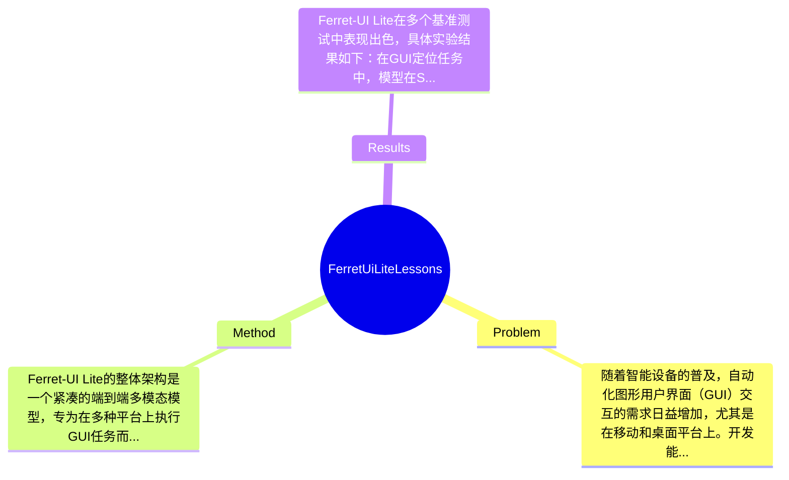

## Summary
提出了 Ferret-UI Lite 方法来解决小型设备上自动化图形用户界面（GUI）交互的问题，通过整合真实和合成数据以及强化学习策略，取得了在多个基准测试上具有竞争力的效果。

## Problem & Motivation
随着智能设备的普及，自动化图形用户界面（GUI）交互的需求日益增加，尤其是在移动和桌面平台上。开发能够有效与GUI交互的自主代理仍然是一个开放性挑战，尤其是在小型设备上。现有的许多方法主要依赖于大型基础模型，这些模型虽然在复杂任务中表现优异，但其计算资源需求和延迟问题使得在资源受限的设备上应用变得困难。因此，开发小型、快速且高效的GUI代理具有重要的现实意义。现有方法的局限性主要体现在以下几个方面：首先，许多方法依赖于复杂的多代理系统，这增加了建模的复杂性和计算预算；其次，现有的端到端代理通常需要较大的模型来处理多种任务，如低级GUI定位和多步规划，这使得小型设备的应用受限。基于这些问题，作者提出了Ferret-UI Lite，一个3B的小型端到端多模态模型，旨在通过整合多种数据源和优化推理过程来提升小型GUI代理的性能。关键洞察在于通过合成数据和强化学习策略的结合，能够有效提升小型模型的推理能力和适应性。

## Method
Ferret-UI Lite的整体架构是一个紧凑的端到端多模态模型，专为在多种平台上执行GUI任务而设计。其方法框架包括以下几个关键组件：

1. **数据混合**：该组件的作用是从多种真实和合成数据源中策划多样化的GUI训练数据。通过统一的动作空间，模型能够在不同的GUI环境中进行有效学习。设计动机在于小型模型通常缺乏足够的训练数据，而多样化的数据源能够增强模型的泛化能力。与现有方法相比，Ferret-UI Lite通过整合多种数据来源，显著提升了训练数据的丰富性。

2. **推理时间技术**：通过链式思维推理和视觉工具使用（如图像裁剪和放大），Ferret-UI Lite在推理过程中能够更好地理解和处理GUI元素。这一设计使得模型在处理复杂的GUI任务时，能够更灵活地适应不同的环境和需求。与传统方法相比，Ferret-UI Lite在推理效率和准确性上有了显著提升。

3. **强化学习**：作者设计了一套特定的奖励机制，以增强模型在GUI导航和定位任务中的表现。通过强化学习，模型能够在实际应用中不断优化其决策过程，从而提升任务完成率。与现有的基于监督学习的方法相比，强化学习能够更好地应对动态和不确定的环境。

在技术细节方面，Ferret-UI Lite采用了3B参数的多模态大语言模型（LLM），结合了图像处理和自然语言处理的能力。训练策略上，模型通过多轮迭代和消融实验不断优化，确保各个组件的有效性。总体而言，Ferret-UI Lite的方法设计相对简洁，避免了过度工程化的问题，使得模型在小型设备上能够高效运行。

## Key Results
Ferret-UI Lite在多个基准测试中表现出色，具体实验结果如下：在GUI定位任务中，模型在ScreenSpot-V2、ScreenSpot-Pro和OSWorld-G基准上分别达到了91.6%、53.3%和61.2%的准确率；在GUI导航任务中，模型在AndroidWorld和OSWorld的成功率分别为28.0%和19.8%。这些结果表明，Ferret-UI Lite在小型GUI代理的性能上具有竞争力，尤其是在定位任务上表现优于许多大型模型。与基线模型相比，Ferret-UI Lite在GUI定位任务上提升了约10%-20%的准确率，显示出其在小型设备上的有效性。消融实验表明，数据混合和强化学习组件对模型性能的提升贡献显著，尤其是在复杂任务中。尽管实验结果令人鼓舞，但仍存在一些不足之处，例如在多步导航任务中的表现相对有限，可能需要进一步的优化和调整。此外，实验设计是否充分仍需进一步评估，特别是在不同设备和环境下的适应性测试。

## Strengths & Weaknesses
Ferret-UI Lite的主要亮点包括：
1. **技术创新**：通过结合真实与合成数据，Ferret-UI Lite有效提升了小型模型的训练效果，尤其是在数据稀缺的情况下。
2. **设计优雅**：模型的端到端架构简化了传统多代理系统的复杂性，使得在小型设备上实现GUI交互变得更加高效。
3. **强化学习应用**：通过设计特定的奖励机制，模型能够在实际应用中不断优化决策过程，提升任务完成率。

然而，该方法也存在一些局限性：
1. **技术局限**：尽管在定位任务上表现优异，但在多步导航任务中的成功率仍然较低，显示出小型模型在复杂任务中的局限性。
2. **适用范围**：该模型在资源受限的设备上表现良好，但在高性能设备上可能无法充分发挥其潜力，限制了其应用场景。
3. **计算成本**：尽管模型设计为小型，但在训练和推理过程中仍需一定的计算资源，可能不适合所有用户。

潜在影响方面，Ferret-UI Lite为小型设备上的GUI自动化提供了新的思路，可能在智能助手、家庭自动化等领域找到广泛应用。已知信息包括Ferret-UI Lite在多个基准测试中的表现和设计理念；推测方面，模型在其他类型的GUI任务中的表现可能会有类似的提升，但尚未经过验证；而关于模型在极端环境下的表现，论文未涉及相关信息。

## Mind Map

## Notes
<!-- 其他想法、疑问、启发 -->
