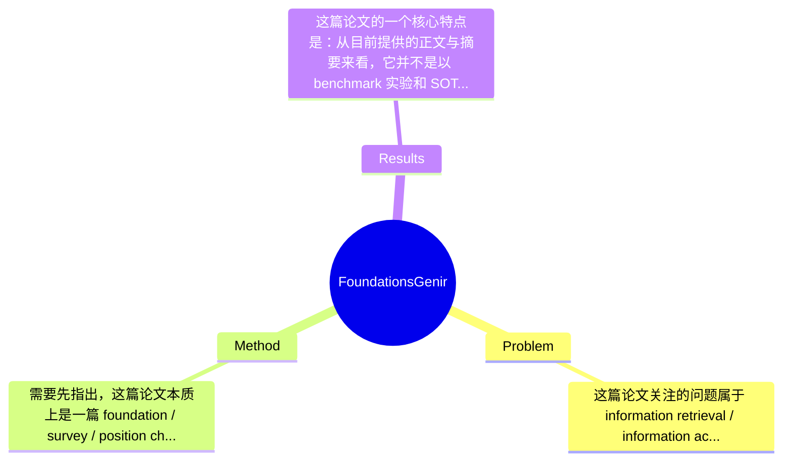

## Summary
该文并非提出一个单一新模型，而是系统性梳理 generative AI 如何重塑 information access（IA），将相关范式概括为 information generation 与 information synthesis 两大方向，并围绕 Transformer-based 生成模型、scaling、training、multi-modal、RAG 与 generative retrieval 等基础问题建立 GenIR 的总体框架。其主要贡献是提供一套面向 GenIR 的统一问题分解与研究地图，而非通过某个 benchmark 上的具体数值刷新 SOTA；因此它的价值更多体现在概念整合、范式总结与未来方向提炼上。

## Problem & Motivation
这篇论文关注的问题属于 information retrieval / information access 与 generative AI 的交叉领域，核心是：当大规模生成模型已经能够理解指令、建模复杂语义并生成高质量自然语言内容时，信息获取系统应如何从“返回已有文档”演化为“生成、综合并组织信息”。传统 IA 系统主要解决 document retrieval、ranking、recommendation 等问题，本质上是从现有语料中筛选信息；而现代 LLM、VLM 与多模态生成模型则使系统有能力直接生成回答、总结多源证据、重组知识结构，甚至在用户需求未被显式覆盖时构造新的表达形式。这个问题重要，是因为用户真实信息需求往往是长尾的、复杂的、任务导向的，不总能被一组现成网页或文档片段直接满足。

现实意义非常直接：在搜索、问答、推荐、教育、办公、科研辅助、医疗信息支持等场景中，用户希望得到的是“可执行、可理解、上下文相关”的结果，而不只是一个链接列表。生成式 IA 可以提升交互效率，降低信息整合成本；而 synthesis 型系统尤其适合需要 grounded response 的高风险场景，因为它可结合外部知识降低 hallucination。现有方法的局限主要有三类：第一，传统 lexical / dense retrieval 只能找到“已有内容”，难以对跨文档、跨模态、隐式需求进行综合表达；第二，纯生成模型虽擅长 fluency 和 instruction following，但缺乏可靠 grounding，容易产生事实错误与不可验证结论；第三，现有检索增强方法常将 retrieval 与 generation 松耦合处理，对复杂信息需求、检索规划、多跳组合推理支持不足。论文提出新框架的动机是合理的：与其只讨论某一种模型，不如从基础层系统审视生成式技术如何改变 IA。其关键洞察在于，把 GenIR 的新机会清晰归纳为“information generation”和“information synthesis”两条主线：前者强调直接满足需求，后者强调基于外部信息的重组与落地，从而给后续研究提供统一坐标系。

## Method
需要先指出，这篇论文本质上是一篇 foundation / survey / position chapter，而不是严格意义上提出单一算法并给出完整训练公式的原创模型论文。因此“Method”更适合理解为作者为 GenIR 总结出的概念框架与技术组成，而非某个可直接复现的 pipeline。整体上，论文将 generative AI 支撑的 IA 系统分解为两大支柱：information generation 与 information synthesis；前者依赖现代生成模型的架构、scaling 与训练机制，后者则主要落在 retrieval-augmented generation、corpus modeling、generative retrieval 与 domain-specific modeling 上，形成从模型能力到系统范式的层级化结构。

1. 整体框架：从基础生成能力到 IA 应用
该文的总体架构可以概括为三层。第一层是生成模型基础，包括 word embedding、position embedding、attention、layer normalization 等 Transformer 组件，以及 scaling law、training objectives、training stages、prompt optimization 等训练与能力形成机制。第二层是能力外延，包括 multi-modal understanding 与 multi-modal generation，说明 GenIR 不应局限于纯文本。第三层是 IA 侧的范式迁移，包括 information generation 与 information synthesis，其中 synthesis 进一步细化为 Naive RAG、Modular RAG、retrieval-generation optimization、retrieval planning、generative retrieval 和 domain-specific modeling。这个结构的价值在于：不是把 GenIR 简化为“LLM + search”，而是把它视为底层模型能力、外部知识利用和任务需求建模共同作用的系统工程。

2. 关键组件一：现代生成模型基础能力
作用：这是 information generation 成立的前提。没有强大的 sequence modeling、instruction following 与 in-context learning，系统无法根据用户需求直接生成高质量输出。论文从 embedding、attention、layer normalization 等典型 Transformer 元件出发，强调其在建模长程依赖、统一表示空间和稳定训练中的作用。
设计动机：作者希望说明，GenIR 并不是凭空出现的新任务，而是建立在现代 foundation model 能力跃迁之上。与传统 IR 模型只关注 matching function 不同，这里模型既负责理解 query，也负责生成 response。
区别：和以往 IR 论文直接把 LLM 当黑盒不同，该文回到生成模型基础，试图解释为何这些模型能支持 IA 范式转换。缺点是这一部分更像背景梳理，缺少针对 IR 特有问题的定制化结构分析。

3. 关键组件二：Scaling 与训练策略
作用：解释为什么生成模型会表现出远超传统 NLP/IR 模型的泛化能力。论文涵盖 scaling、training objectives、training stages、prompt optimization，隐含指出预训练、指令微调、偏好优化等阶段共同塑造了可用于 IA 的能力。
设计动机：GenIR 的很多表现——例如复杂需求理解、长尾问题应答、跨任务泛化——并非来自某个单独模块，而是来自规模化训练。作者把这部分单独拎出，实际上是在论证“能力来源”。
区别：相较于传统 retrieval pipeline 更强调 index、ranking loss 和 relevance label，该框架强调数据规模、目标函数和阶段式训练在信息访问中的基础性作用。这里的批判点是：论文较少讨论 scaling 带来的代价，如算力、数据版权、偏见传播与可解释性下降。

4. 关键组件三：Information Generation
作用：直接根据用户需求生成内容，而不是只返回证据。它适用于创意写作、摘要、问答、推荐文案、个性化解释等场景，尤其面向长尾与开放式需求。
设计动机：传统 IA 在“已有信息定位”上有效，但在“需求直接满足”上不足。作者据此提出 generation 是 IA 的天然延伸，而不是独立任务。
区别：与 classic search 的结果呈现方式不同，这里系统输出的是 synthesized answer/product。与纯聊天机器人不同，论文把它置于 information need satisfaction 的框架中，强调其和 IA 的连续性。

5. 关键组件四：Information Synthesis 与 RAG 家族
作用：这是本文最重要也最具实操性的部分。作者将 synthesis 定义为利用生成模型整合和重组外部信息，以提供 grounded response 并缓解 hallucination。其下包括 Naive RAG、Modular RAG、retrieval-generation optimization、retrieval planning and composite information needs。
设计动机：纯生成虽然流畅，但在 precision-critical 场景中不可靠；引入 retrieval 可以补足时效性、可验证性和长尾知识覆盖。
区别：论文不仅停留在“先检索后生成”的 Naive RAG，而是进一步强调模块化设计、检索与生成协同优化、面向复杂信息需求的 planning。这意味着作者把 RAG 看作一个可扩展系统，而非静态两阶段流水线。这里的价值在于提出更细粒度的系统视角；但由于是综述性章节，其技术细节多为分类与概括，缺少统一算法框架和定量比较。

6. 关键组件五：Corpus Modeling、Generative Retrieval 与 Domain-specific Modeling
作用：这部分把研究从“使用外部文档”推进到“如何建模整个语料库”。generative retrieval 代表用生成方式直接标识或访问文档，domain-specific modeling 则强调在特定领域上构建更精准的 IA 能力。
设计动机：如果 GenIR 只停留在 response generation，它仍然依赖传统索引体系；而 corpus modeling 试图从根本上重构知识组织与访问方式。
区别：与标准 dense retrieval 相比，generative retrieval 让检索过程更像 sequence generation，理论上可更自然地整合语义压缩、文档标识生成与端到端训练。但论文未提及何种 setting 下 generative retrieval 优于 ANN-based dense retrieval，也没有展开其 latency、可扩展性和更新成本。

总体评价上，这一“方法”是相当清晰的研究框架，概念分层也比较自然，称得上简洁；但如果按算法论文标准来看，它并不提供一个足够具体、可复现、可严格验证的统一方法，因此更像“研究蓝图”而不是“落地方案”。优点是视角完整、脉络清楚；不足是略显宽泛，部分模块停留在 taxonomy 而非 mechanism。

## Key Results
这篇论文的一个核心特点是：从目前提供的正文与摘要来看，它并不是以 benchmark 实验和 SOTA 数字为中心的论文，而是以章节式综述和范式总结为主。因此严格来说，论文未提及统一的主要实验设置、benchmark 名称、评价指标以及可直接摘录的核心数值结果。换言之，它没有像典型 empirical paper 那样报告“在某数据集上提升 x%”的结论，这一点需要明确说明，不能凭空补全。

从文本结构可以看出，作者讨论了多类已有方向：multi-modal understanding、multi-modal generation、Naive RAG、Modular RAG、retrieval-generation optimization、retrieval planning、generative retrieval、domain-specific modeling 等。但这些更像是对已有研究脉络的整理，而不是在单一实验协议下进行横向比较。因此如果按“结果”理解，其主要产出是概念层面的：第一，提出 GenIR 可以统一归纳为 information generation 和 information synthesis 两种新范式；第二，指出 RAG 并非单一技术，而可进一步细分为朴素式、模块化式、联合优化式与规划增强式；第三，强调多模态和语料级建模将扩展 IA 的边界。这些属于理论/框架性结果，而非数值性结果。

若从批判角度评价实验充分性，这篇论文最大短板正是缺乏系统实验。论文未提及：1）是否在 TREC、MS MARCO、BEIR、NQ、HotpotQA、MMQA 等 benchmark 上验证框架；2）是否比较 pure generation、retrieval-only、RAG、generative retrieval 的优劣；3）是否通过 human evaluation 检验回答质量、groundedness、faithfulness、latency 与 user satisfaction；4）是否有针对长尾需求、复合查询、多跳检索和多模态场景的拆分实验。消融实验方面，论文未提及对不同组件贡献的定量分析。关于 cherry-picking，也无法直接指控作者只展示好结果，因为公开片段中几乎没有结果表；更准确地说，是本文的目标就不是做结果驱动的模型比较，而是做基础性框架总结。这使其作为“研究地图”是有价值的，但作为“技术方案有效性证明”则明显不足。

## Strengths & Weaknesses
这篇论文的最大亮点首先在于框架化能力强。它没有把 GenIR 简单等同于 LLM 应用，而是明确区分 information generation 与 information synthesis，两者分别对应“直接满足需求”和“基于外部信息进行 grounded 重组”两类核心能力，这种划分对于研究问题定义非常有帮助。第二个亮点是它把底层模型基础、系统级 RAG 设计、多模态扩展和 corpus-level modeling 串成一条连续链路，避免了只从单点技术出发看问题。第三个亮点是对 RAG 进行了更细的谱系化梳理，尤其强调 modularity、optimization 与 planning，这比把 RAG 当作固定模板更有启发性。

但它的局限也很明显。第一，技术上偏综述与观点性，缺乏单一核心方法、统一问题设定和可复现算法，因此很难像原创模型论文那样直接指导实现。第二，适用范围虽广，但因此牺牲了深度：例如 generative retrieval、domain-specific modeling、multi-modal generation 都被覆盖，却没有充分展开其 failure case、边界条件和工程代价。第三，计算成本与部署现实讨论不足。GenIR 依赖大规模 foundation model、外部检索、长上下文和多阶段优化，实际延迟、吞吐、索引更新、数据治理与版权风险都很关键，但公开片段中基本未系统分析。第四，论文强调 synthesis 可缓解 hallucination，这个方向合理，但若没有定量证据，很容易给读者造成“RAG 足以解决真实性问题”的过强印象，而事实上 grounding 仍可能失败，检索噪声与生成偏差也会叠加。

潜在影响方面，这篇论文更像是一个领域定位器。它有助于把搜索、问答、推荐、agentic retrieval、多模态理解等工作纳入统一叙事，对后续课程、综述、研究议程制定都可能有价值。已知：论文明确提出 GenIR 的两条主线，并覆盖 architecture、scaling、training、multi-modal、RAG、corpus modeling 等主题。推测：作者意在为生成式信息访问建立基础性研究框架，并推动 IA 社区从“检索文档”走向“满足需求”。不知道：论文未提及统一实验协议、具体 benchmark 数字、计算资源消耗、各方法在不同任务上的明确优劣边界，也未系统说明何种场景下生成式范式会劣于传统 IR。

## Mind Map

## Notes
<!-- 其他想法、疑问、启发 -->
