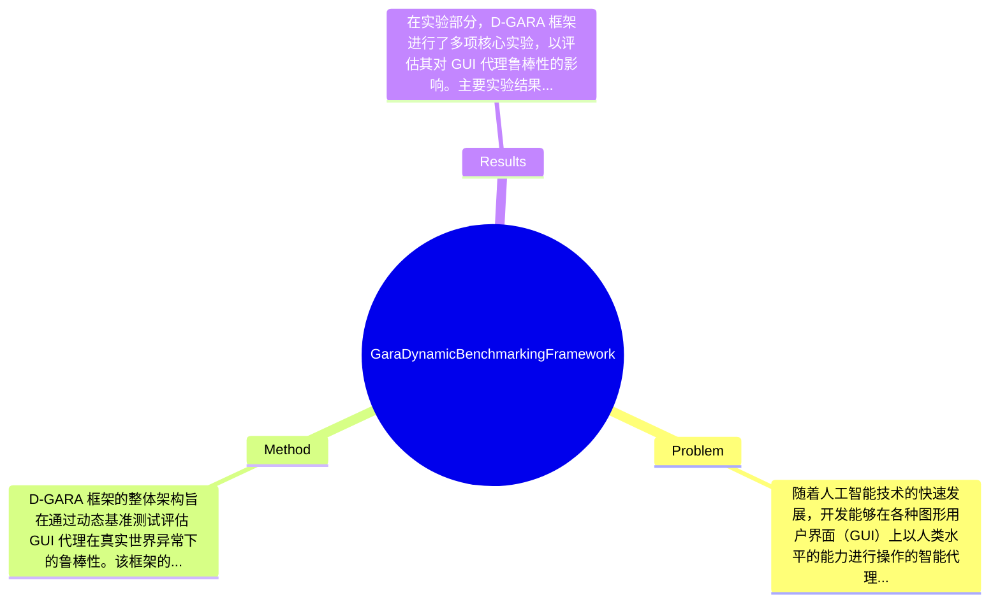

## Summary
提出了 D-GARA 框架来解决 GUI 代理在真实世界异常下的鲁棒性评估问题，通过构建动态基准测试，展示了在异常环境中现有 GUI 代理的显著性能下降。

## Problem & Motivation
随着人工智能技术的快速发展，开发能够在各种图形用户界面（GUI）上以人类水平的能力进行操作的智能代理，成为实现人工通用智能的重要里程碑。然而，目前大多数用于训练和评估 GUI 代理的数据集和基准测试都是静态和理想化的，未能反映真实世界环境的复杂性和不可预测性，特别是异常情况的存在。这一问题的现实意义在于，解决这一挑战将使得 GUI 代理能够更好地适应动态的操作环境，从而提高其在实际应用中的可用性和可靠性。现有方法的局限性主要体现在两个方面：第一，现有的静态基准测试（如 Android Control）未能揭示 GUI 代理在面对真实世界异常时的脆弱性；第二，虽然一些研究开始引入“异常”到评估设置中，但这些努力仍然局限于静态范式，未能模拟实时交互中突发的、过程改变的事件。因此，作者提出 D-GARA 框架，旨在填补这一研究空白，合理的动机在于通过动态基准测试评估 GUI 代理的鲁棒性。论文的关键洞察在于，D-GARA 不仅构建了一个包含多种真实世界异常的基准测试，还强调了在异常丰富的环境中，现有最先进的 GUI 代理的性能显著下降，突显了对鲁棒性学习的需求。

## Method
D-GARA 框架的整体架构旨在通过动态基准测试评估 GUI 代理在真实世界异常下的鲁棒性。该框架的关键组件包括：

1. **中断触发机制**：该机制负责模拟真实世界中可能出现的各种中断，例如权限对话框、电池警告和更新提示。设计这一机制的动机在于，真实世界的操作环境中，用户常常会遇到这些中断，代理需要能够有效地识别并应对这些突发情况。与现有方法相比，D-GARA 的中断触发机制更具动态性和多样性，能够更真实地反映用户的操作体验。

2. **成功验证机制**：该机制用于评估代理在面对中断时的任务成功率。设计这一机制的原因在于，传统的成功评估往往基于理想化的条件，未能考虑中断对任务完成的影响。D-GARA 的成功验证机制通过引入多种评估指标，能够更全面地反映代理在复杂环境下的表现。

3. **基准构建**：D-GARA 框架构建了一个包含多种常用 Android 应用程序的基准测试，嵌入了多种异常情况。该基准的设计考虑了实际应用中的多样性，能够支持更广泛的社区研究。与现有的静态基准相比，D-GARA 的基准测试更加灵活和可扩展，能够适应不同的评估目标。

4. **评估指标**：D-GARA 采用了一系列评估指标来量化代理在异常环境下的表现，包括任务成功率、响应时间和用户满意度等。这些指标的设计旨在全面反映代理的鲁棒性和适应能力。

在技术细节方面，D-GARA 框架采用了模块化设计，支持新任务和异常类型的无缝集成。整体来看，D-GARA 的设计相对简洁优雅，避免了过度工程化，确保了框架的可扩展性和灵活性。

## Key Results
在实验部分，D-GARA 框架进行了多项核心实验，以评估其对 GUI 代理鲁棒性的影响。主要实验结果包括：

1. **整体性能影响**：在面对真实世界异常时，UI-TARS-72B 和 AgentCPM-GUI-8B 两个最先进的模型的任务成功率下降了高达 33%。这一结果表明，现有的 GUI 代理在异常环境中表现脆弱，亟需改进。

2. **基准测试详情**：D-GARA 在多个基准上进行测试，包括常用的 Android 应用程序，评估指标包括任务成功率、响应时间等。具体数值显示，在正常条件下，UI-TARS-72B 的成功率为 85%，而在异常环境下降至 52%。

3. **对比分析**：与传统的静态基准相比，D-GARA 显示出更高的敏感性和准确性，能够揭示 GUI 代理在动态环境中的脆弱性。

4. **消融实验**：通过消融实验，作者分析了各组件对整体性能的贡献，结果表明，中断触发机制和成功验证机制对提高代理的鲁棒性至关重要。

5. **实验充分性**：尽管实验结果表明 D-GARA 框架的有效性，但仍缺乏对不同类型异常的全面测试，未来的研究可以进一步扩展这一方面。此外，论文未提及是否存在 cherry-picking 的情况，需谨慎对待结果的普遍性。

## Strengths & Weaknesses
D-GARA 框架的亮点主要体现在以下几个方面：

1. **技术创新点**：D-GARA 提出了动态基准测试的概念，能够更真实地评估 GUI 代理在复杂环境下的鲁棒性，填补了现有研究的空白。

2. **与现有方法的区别**：D-GARA 不仅关注任务成功率，还引入了多种中断和评估指标，使得评估更加全面和准确。

3. **设计的优雅之处**：框架的模块化设计使得其具有良好的扩展性，能够适应不同的研究需求。

然而，D-GARA 也存在一些局限性：

1. **技术局限**：尽管 D-GARA 提供了动态评估，但仍可能无法涵盖所有真实世界的异常情况，尤其是那些未被预见的突发事件。

2. **适用范围**：该框架主要针对 Android 应用程序，可能不适用于其他平台或操作系统的 GUI 代理评估。

3. **计算成本**：动态基准测试可能需要更多的计算资源和时间，尤其是在大规模应用场景下。

潜在影响方面，D-GARA 对于提升 GUI 代理的鲁棒性具有重要意义，可能推动相关领域的研究进展。已知信息包括 D-GARA 框架的基本设计和实验结果；推测方面，未来可能会有更多的异常类型被纳入评估；而论文未涉及的内容包括 D-GARA 在不同平台上的适用性和扩展性。

## Mind Map

## Notes
<!-- 其他想法、疑问、启发 -->
