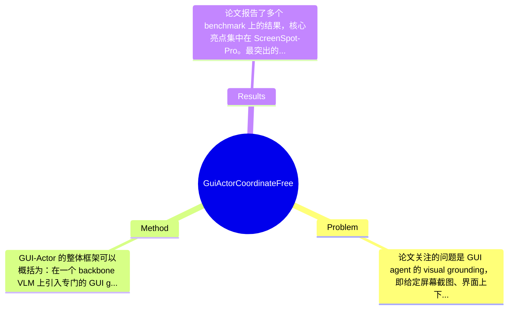

## Summary
这篇论文研究 VLM-powered GUI agent 中的 visual grounding 问题，针对传统“文本生成坐标”范式存在的空间语义对齐弱、监督歧义大和 patch/coordinate 粒度失配等缺陷，提出了 coordinate-free 的 GUI-Actor。其核心是用一个专门的 <ACTOR> token 配合 attention-based action head 在视觉 patch 上直接预测可交互区域，并结合 grounding verifier 选择最终动作区域。在多个 GUI grounding benchmark 上，GUI-Actor-7B 达到 40.7（Qwen2-VL）和 44.6（Qwen2.5-VL）的 ScreenSpot-Pro 成绩，超过 UI-TARS-72B 的 38.1，且参数量和训练数据需求更低。

## Problem & Motivation
论文关注的问题是 GUI agent 的 visual grounding，即给定屏幕截图、界面上下文以及自然语言指令后，模型需要准确定位应该点击、输入或操作的界面区域。这属于 multimodal agent、GUI automation 和 vision-language grounding 的交叉问题，也是让通用 VLM 真正具备可执行 GUI 操作能力的关键环节。若 grounding 做不好，即便高层规划正确，agent 也会因为点错按钮、选错输入框而任务失败，因此它是 GUI agent 从“会看会说”走向“会操作”的核心瓶颈。

这一问题有很强的现实意义。桌面自动化、移动端操作助手、Web navigation、企业流程自动执行、无障碍交互等场景，都需要将自然语言意图稳定映射到界面元素上。尤其在跨平台、多分辨率、动态布局和复杂视觉噪声下，grounding 的鲁棒性直接决定系统是否可部署。

论文批评了现有主流方法将 grounding 视为文本式坐标生成的问题。第一，这类方法让模型以 language generation 的方式输出 x-y 坐标，训练目标和视觉定位目标并不完全一致，导致 spatial-semantic alignment 不够强。第二，许多 GUI 元素并不存在唯一正确点，例如点击一个按钮的多个位置都可生效，但单点监督会把这些合理变化错误地当作负样本。第三，Vision Transformer 提取的是 patch-level 特征，而监督却是 dense coordinate，二者粒度不匹配，容易造成学习信号扭曲。

基于这些不足，作者提出新方法的动机是合理且明确的：与其逼模型“说出坐标”，不如让模型直接“看向区域”，把 grounding 建模为对视觉 patch 的 attention 对齐，再从候选区域中选择最可信者。论文的关键洞察在于，GUI grounding 本质更接近 region selection 而非 language decoding；只要显式建模视觉区域对齐，并允许 multi-region prediction，就能更自然地适配 GUI 中模糊、冗余且多分辨率的交互目标。

## Method
GUI-Actor 的整体框架可以概括为：在一个 backbone VLM 上引入专门的 GUI grounding 机制，不再要求模型直接生成屏幕坐标，而是通过一个额外的 <ACTOR> token 与视觉 patch token 建立 attention，对可能的动作区域进行打分与提议；随后再利用 grounding verifier 对候选区域进行重排序或筛选，最终输出更可靠的 action region 供执行模块使用。整个方法强调 coordinate-free、patch-aligned 和 multi-region-aware，目标是让 grounding 过程与 VLM 的视觉表示结构保持一致。

1. <ACTOR> Token 作为 contextual anchor
- 该组件的作用是为“动作定位”引入一个专门的语义查询位点。与让语言 token 或生成头隐式承担定位职责不同，<ACTOR> token 被设计为一个显式、可学习的 grounding anchor，用来汇聚来自指令和视觉上下文的动作相关信息。
- 这样设计的动机在于，GUI grounding 需要一个稳定的查询表示，既要编码文本意图，也要聚焦视觉区域。如果直接复用普通输出 token，定位信号可能被语言建模目标稀释。
- 与现有坐标生成方法相比，这种做法把“要操作哪里”从文本序列生成问题改成了 query-to-region 对齐问题，更接近 detection / grounding 直觉。

2. Attention-Based Action Head
- 这是论文的核心组件。它利用 <ACTOR> token 对所有视觉 patch token 计算 attention，得到一个动作相关的空间分布，从而定位一个或多个可执行区域。
- 设计动机是消除 coordinate regression/generation 与 patch feature 之间的表示错位。因为视觉主干天然输出 patch token，所以直接在 patch 层面做对齐比回归连续坐标更自然。
- 与现有方法的区别在于，它不是生成一个离散文本坐标串，而是输出 patch-level relevance map，可在一次 forward pass 中产生 multi-region prediction。这对 GUI 中“整个按钮都能点”“多个位置同样合理”的情况尤其友好。
- 从简洁性看，这个 action head 是在 backbone VLM 外接的专用模块，属于较克制的增量设计，而不是完全重写 VLM 架构。

3. Spatial-Aware Multi-Patch Supervision
- 该组件用于训练阶段监督 action head，不再以单点坐标作为唯一目标，而是将目标元素映射到多个相关 patch 上进行监督。
- 设计动机很直接：GUI 元素通常占据一片区域，单点标注会带来监督歧义；多 patch 监督更符合实际交互容忍度，也更匹配 ViT 的 patch 粒度。
- 与传统 point supervision 相比，它允许模型学习区域级而非点级的可交互性，降低了因 annotation 偏差、缩放变化或界面布局差异造成的惩罚。
- 这也是论文实现 OOD resolution/layout generalization 的关键原因之一，因为 patch 区域监督天然比绝对坐标更少依赖固定分辨率。

4. Grounding Verifier
- verifier 的作用是在 action head 给出多个候选区域后，评估哪些候选最 plausible，并选择最终执行目标。
- 设计动机来自 GUI grounding 的 inherent ambiguity：仅靠一个 attention map 往往会出现多个高响应区域，例如重复图标、相似按钮、同名菜单项。作者因此增加一个后验判别模块来做 candidate selection。
- 与只输出 top-1 坐标的基线不同，verifier 允许“先广泛提议，再精细筛选”，把 recall 与 precision 分开处理。摘要还指出，加入 verifier 后，即便冻结 backbone、只训练约 100M 参数的新 action head，也能取得接近 SOTA 的效果，说明 verifier 对提升 sample efficiency 很关键。

5. Training / Inference 策略
- 论文强调可以在两种模式下使用：一种是完整 fine-tuning；另一种是冻结 VLM backbone，仅训练新增 grounding 模块。后者尤其重要，因为它意味着可以在不破坏 backbone 一般能力的前提下，低成本注入 GUI grounding 能力。
- inference 时，多区域预测无需额外 inference cost，这是一个很有价值的设计点，说明作者不是通过多次裁剪、多轮搜索来换准确率，而是在单次前向里完成候选生成。

总体评价上，这个方法相对简洁优雅：它抓住了 GUI grounding 的核心错配——patch 表示 vs coordinate 输出——并用一个专门 token、一个 attention head、一个 verifier 加以修正。它不是纯工程堆料，而是有比较清晰的建模重构。不过其效果在多大程度上依赖特定 backbone、训练数据分布和 verifier 构造细节，仍需进一步检验。

## Key Results
论文报告了多个 benchmark 上的结果，核心亮点集中在 ScreenSpot-Pro。最突出的数字是：GUI-Actor-7B 以 Qwen2-VL 为 backbone 时达到 40.7，以 Qwen2.5-VL 为 backbone 时达到 44.6，均超过 UI-TARS-72B 的 38.1。这个对比很有说服力，因为作者强调 GUI-Actor 使用更少参数和更少训练数据，却在更难的 benchmark 上取得更高分数，说明其建模方式比“大模型直接生成坐标”更有效。

从 benchmark 角度看，论文明确提到在 multiple GUI action grounding benchmarks 上取得 SOTA，并强调对 unseen screen resolutions 和 layouts 的 out-of-distribution generalization 更强。这意味着作者不仅在常规测试集上比较，还考察了分辨率和布局变化下的稳健性。不过在给定材料中，除 ScreenSpot-Pro 外，其余 benchmark 名称、评价指标和具体数值没有完整展开，因此这些地方只能标注为“论文节选未提及具体数字”。

实验还覆盖了 sample efficiency。摘要指出，结合 grounding verifier 后，仅 fine-tuning 新增 action head（7B 模型约 100M 参数）并冻结 backbone VLM，就足以达到与先前 SOTA 可比的性能。这一结果非常关键，因为它说明性能提升不只是来自更大规模全参数微调，而是来自更贴合 GUI grounding 的结构设计。对实际部署而言，这意味着更低训练成本、更少灾难性遗忘风险。

论文还做了 ablation study，并专门提到 Multi-Region Prediction Without Extra Inference Cost、Boosting Performance via Grounding Verifier、Improved Sample Efficiency 等模块级验证。虽然节选中没有列出每个消融项的精确数值，但从实验章节结构来看，作者至少验证了 <ACTOR> token、action head、多 patch supervision 和 verifier 的贡献。

批判性地看，实验总体是有说服力的，但仍不算完全充分。首先，若要证明 coordinate-free 优于 coordinate generation，最好看到更系统的同 backbone、同数据、同训练预算的严格对照。其次，论文虽然强调 OOD generalization，但若缺少更细粒度 failure case 分类，就难判断在重复元素、极小控件、遮挡、滚动页面等场景下是否稳定。最后，目前展示中最醒目的数字集中在 ScreenSpot-Pro，存在一定“主打最佳 benchmark”展示倾向；是否 cherry-picking，需结合全文完整附录中的全表格判断。

## Strengths & Weaknesses
这篇论文的最大亮点之一，是它对问题建模的重新定义很到位。已知：作者明确指出 GUI grounding 不应被简单视作文本坐标生成，而应看作视觉区域对齐；对应地，GUI-Actor 用 <ACTOR> token 加 attention-based action head 直接在 patch 上做 grounding。这个转化不是小修小补，而是把监督目标、视觉表示和推理形式重新对齐，因此有较强的方法论价值。

第二个亮点是 multi-region prediction 与 grounding verifier 的组合。已知：模型能在单次 forward pass 中提出一个或多个 action region，再由 verifier 进行筛选。这样的设计同时兼顾 recall 和 precision，尤其适合 GUI 中存在多个合理点击点、或视觉上相似元素较多的情况。推测：这也能减少训练标注噪声带来的不稳定，因为模型不必被迫压缩到唯一点预测。

第三个亮点是良好的 sample efficiency 和可插拔性。已知：只训练约 100M 的 action head、冻结 backbone，也能达到可比 SOTA 的性能。这表明 GUI-Actor 更像是给通用 VLM 添加 grounding capability 的模块化方案，而非必须大规模破坏性微调。对工业部署，这一点价值很高。

局限性方面，第一，方法仍然依赖 patch-level 表示。已知：它解决了坐标与 patch 的粒度错配，但并没有真正达到 pixel-level 精度。推测：对于非常小、极窄或密集排列的 GUI 元素，patch attention 仍可能不够精确，尤其是在高分辨率、微小 icon 或文本输入光标定位任务中。

第二，verifier 虽然提升效果，但也意味着系统从“单头预测”变成“候选生成+筛选”的两阶段逻辑。已知：论文强调其有效，但对 verifier 的误判模式、额外延迟、跨域稳定性在给定材料中没有充分展开。我们不知道 verifier 是否会在分布外界面、长尾应用或复杂层级菜单中引入新的偏差。

第三，适用边界仍需谨慎。推测：该方法更适合 point/click-like grounding，对 drag-and-drop、多步复合操作、文本编辑区域内精细 selection、动态弹窗交互等复杂 action schema，单一 action region 预测可能不够。论文是否系统覆盖这些动作类型，给定材料中不知道。

潜在影响上，这项工作对 GUI agent、computer use agent 和桌面自动化都有明显推动作用。它提出了一种比坐标生成更自然的 grounding interface，也可能启发 web agent、robotics visual grounding 甚至 embodied action selection 的类似设计。

已知：论文在 ScreenSpot-Pro 上以 40.7/44.6 超过 UI-TARS-72B 的 38.1，并展示更好的 OOD generalization 与 sample efficiency。推测：其优势部分来自 Qwen2.5-VL backbone 本身的增强能力，而不完全是 action head 的独立贡献。不知道：完整训练数据规模细节、各 benchmark 全部数值、不同失败类型的统计、真实在线系统中的时延与资源开销上限，给定材料均未完全提供。

## Mind Map

## Notes
<!-- 其他想法、疑问、启发 -->
