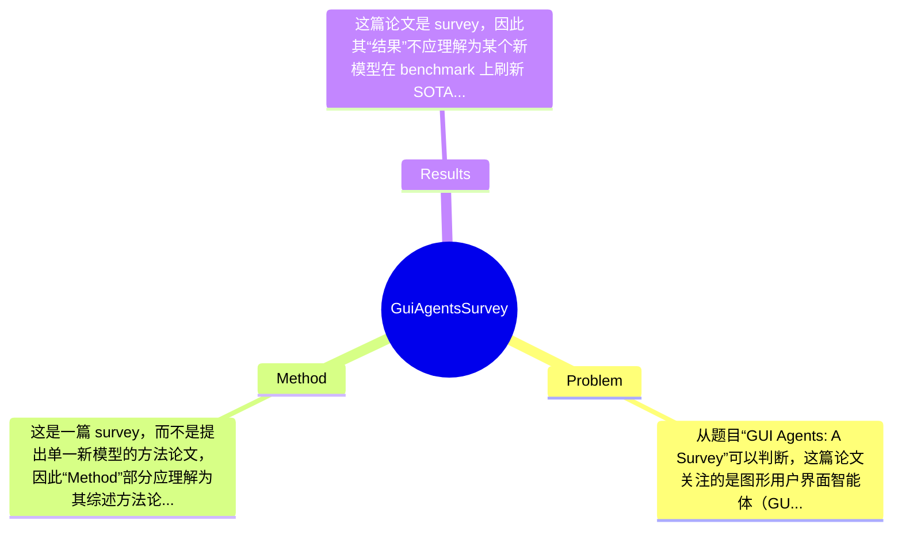

## Summary
这篇论文是一篇关于 GUI Agents 的综述论文，旨在系统梳理基于图形用户界面执行感知、理解、规划与操作的智能体研究方向，归纳其任务设定、方法范式、数据资源、评测基准与开放挑战。由于当前仅知论文标题、作者、年份与 venue，且未获得 abstract 或全文，因此无法确认其具体综述框架、分类方法或定量统计结论；可以确定的是，它试图为 GUI agent 这一快速发展的研究领域提供结构化总结与研究路线图。

## Problem & Motivation
从题目“GUI Agents: A Survey”可以判断，这篇论文关注的是图形用户界面智能体（GUI agents）这一研究方向的系统综述。GUI agent 的核心问题，是让智能体能够像人类一样理解屏幕上的视觉元素、解析界面结构、结合自然语言指令进行推理，并最终在桌面、网页或移动端应用中执行点击、输入、滚动、导航等操作。这一问题处于 multimodal AI、agent、HCI、computer vision 与 NLP 的交叉地带，重要性很高，因为它直接关系到“让模型真正使用软件”的能力，而不仅仅是文本层面的问答或代码生成。现实应用价值非常明确，例如办公自动化、网页信息采集、数字助理、无障碍交互测试、软件 RPA 升级以及复杂工作流自动执行等，尤其当大模型从‘会说’走向‘会做’时，GUI 成为与真实数字世界交互的关键接口。

现有方法的局限，通常可以从三个层面理解。第一，纯文本 agent 往往依赖 API 或结构化环境，难以处理真实 GUI 中高度非结构化、动态变化且视觉依赖强的操作场景。第二，传统基于规则或模板的 RPA 系统泛化能力差，遇到界面布局变化、语言变化或任务迁移时容易失效。第三，单纯的 vision-language 模型虽然能看懂界面截图的一部分语义，但未必具备长程规划、动作 grounding 与闭环执行能力。基于这些背景，综述论文的动机通常是：该领域发展迅速，但研究碎片化，任务定义、评测协议、数据集和方法类别尚未统一，研究者需要一份系统性地图来理解现状、识别空白并指导后续工作。这个动机是合理的，尤其在 GUI agents 近两年受 foundation model 推动快速扩张的背景下更为迫切。该论文可能的关键洞察在于，不仅罗列已有工作，还尝试从感知、推理、决策、执行与评测闭环的角度重新组织该领域；但由于论文未提供摘要或全文，这一点目前只能做有限推断，不能当作已证实事实。

## Method
这是一篇 survey，而不是提出单一新模型的方法论文，因此“Method”部分应理解为其综述方法论、组织框架和分析维度，而非具体训练一个 GUI agent 的算法。基于题目可以合理推断，论文的整体架构大概率是：先定义 GUI agents 的研究范围，再按任务形式、输入模态、模型架构、交互环境、数据集与 benchmark、评测指标和开放问题进行系统分类，最终总结未来方向。由于没有 abstract 或全文，以下分析严格区分“可能的综述组织方式”和“论文明确提出的内容”；后者目前无法确认。

1. 整体架构
这类 survey 通常会先回答三个基本问题：什么是 GUI agent、它和传统 agent/RPA/VLM-based agent 有何区别、当前研究面临哪些核心瓶颈。随后会建立一个统一分析框架，把 GUI agent 拆解为 perception、grounding、planning、action execution、memory/feedback 等环节，再将已有文献映射到这些模块上。这样的组织方式有一个明显优点：它不是简单按时间线罗列工作，而是把领域中的方法学共性抽象出来，帮助读者理解方法之间真正的结构差异。如果该论文采取这种路线，那么其价值会高于“文献堆砌式综述”。但是否真的如此，论文未提及。

2. 关键组件
- 研究对象与任务分类
  作用：界定 survey 的边界，避免把网页问答、RPA、tool use、mobile UI understanding 等松散问题混在一起。对于 GUI agents，任务可能包括单步元素定位、多步任务执行、自然语言驱动的软件操作、网页导航、移动端交互、跨应用工作流等。设计动机是让后续比较建立在统一任务定义之上。与一些早期综述不同，好的 GUI survey 往往不只按应用平台分类，而会兼顾任务复杂度和交互闭环。

- 方法范式归纳
  作用：总结现有 GUI agent 方法到底依赖什么信息、如何做决策。常见维度可能包括 screenshot-based 方法、DOM/accessibility-tree-based 方法、vision-language-action unified 模型、planner-executor 架构、closed-loop interactive agent、以及借助 external tools 或 memory 的方法。这样设计的动机，是解释为什么有些方法在静态理解任务上强、但在真实交互任务上弱。与只按 backbone 分类的综述相比，这种范式归纳更能揭示 failure mode。论文是否采用这些维度，未可知，但这是该主题下较合理的分析方式。

- 数据集与 benchmark 梳理
  作用：统一讨论训练数据来源、任务标注形式和评测协议。GUI agents 的评测高度依赖环境：网页、桌面、手机、虚拟机、模拟器、在线网站等都可能产生截然不同的结果。设计动机在于指出“方法效果”与“测试环境”强绑定，避免跨 benchmark 的数字被误读。若论文做得好，它应当不仅列出数据集名称，还应区分 offline grounding、trajectory imitation、interactive success rate 等不同评测层次。

- 挑战与开放问题分析
  作用：这是 survey 最有价值的部分之一。GUI agents 的关键挑战通常包括界面动态变化、长程任务分解、错误恢复、视觉噪声、跨平台泛化、隐私安全与真实部署稳定性。设计动机是把看似分散的失败案例提炼成共性瓶颈，从而为未来研究提供路线图。与普通 related work 式总结不同，真正好的 survey 会明确指出哪些瓶颈是“感知问题”、哪些是“决策问题”、哪些是“系统问题”。

3. 技术细节
由于这不是一篇单模型论文，技术细节更可能体现为文献筛选标准、分类 taxonomy、对比维度和评测整理方式，而不是 loss function、网络结构或训练策略。理想情况下，作者应说明纳入文献的时间范围、检索来源、分类准则、是否覆盖 web/desktop/mobile 三类 GUI、是否比较开源与闭源系统，以及是否讨论 LLM/VLM 在 GUI 环境中的 grounding 机制。但这些信息目前全部“论文未提及”。

4. 设计选择与简洁性评价
从题目看，论文的关键设计选择在于是否建立了一个足够清晰且不互相重叠的 taxonomy。综述最怕的问题是分类过多、边界模糊，导致读者看完只得到一堆名词而没有认知压缩。如果作者能围绕“观察—理解—规划—执行—反馈”建立主线，那会是相对简洁优雅的组织；如果只是按平台、模型、任务、数据集多重交叉罗列，则可能显得过度工程化。遗憾的是，在没有摘要和全文的情况下，我们无法判断该 survey 是否真正达到了“结构化整合”的目标，因此这里只能给出基于该研究主题的框架性分析，而不能宣称是对论文方法细节的准确复述。

## Key Results
这篇论文是 survey，因此其“结果”不应理解为某个新模型在 benchmark 上刷新 SOTA，而更可能体现为：系统整理了多少篇文献、提出了何种 taxonomy、比较了哪些 benchmark、总结出哪些趋势与研究空白。然而当前最大的问题是，用户已明确标注“未获取全文，仅基于 abstract 分析”，但同时又给出“无内容可用，请提供全文或摘要”，这意味着连 abstract 也未提供。因此，任何关于 benchmark 名称、实验数字、对比提升百分比、消融实验结果的具体陈述，都无法从现有信息中获得，若强行填写将构成捏造。

已知信息只有：论文标题为“GUI Agents: A Survey”，发表于 Findings of ACL 2025。因此可以合理判断，这篇论文大概率包含对 GUI agent 相关 benchmark 的综述，例如网页导航、移动端 UI 操作、桌面软件自动化、GUI grounding 或 instruction-following 等任务上的数据与评测设置比较；但论文究竟列举了哪些 benchmark、是否有表格汇总、是否报告文献数量统计、是否对不同方法在 success rate、step accuracy、grounding accuracy、task completion rate 等指标上进行横向整理，均为论文未提及。

如果从 survey 论文的一般写法推测，其核心“结果”可能包括三类：第一，对现有研究进行系统分类并指出主流技术路线；第二，总结 benchmark 和数据集的覆盖范围及缺口；第三，归纳开放挑战与未来方向。这类结果的价值在于认知组织，而不是数值突破。但是否存在定量 meta-analysis，例如统计不同范式在特定 benchmark 上的平均表现，或者总结近年性能提升趋势，目前完全不知道。

从批判性角度看，当前信息不足也意味着我们无法判断实验是否充分、是否存在 cherry-picking。一个好的 survey 应该覆盖正反两类结果，不能只展示近期大模型方法的成功案例，而忽略其高成本、低稳定性与评测不可重复性；同时也应避免仅按“是否用了 LLM”这种表层标准进行比较。遗憾的是，在缺少摘要和全文时，这些都无法验证。因此，本部分唯一严谨的结论是：具体 benchmark、指标、数值、对比结果、消融实验——论文未提及，无法分析。

## Strengths & Weaknesses
从题目和发表 venue 来看，这篇论文的潜在亮点首先在于选题重要。GUI agents 是连接 foundation models 与真实数字操作环境的关键方向，近两年研究增长快但分散，做一篇系统 survey 本身就具有社区价值。第二，如果作者成功把 GUI agent 问题拆解为 perception、grounding、planning、action、feedback 等模块，并将网页、移动端、桌面端工作统一在同一框架下，那么这会比简单的文献罗列更有分析深度。第三，若论文进一步讨论 benchmark 偏差、评测不可比、真实部署鲁棒性不足等问题，它就不仅是知识汇总，也能起到规范研究问题定义的作用。这些是“可能的亮点”，但需要强调：由于没有摘要与全文，这些不是已证实事实。

局限性同样明显，而且其中最大的局限不是论文本身，而是当前可用信息极度不足。第一，技术内容无法核实：我们不知道作者是否真的提出清晰 taxonomy，也不知道是否覆盖了 GUI agents 与 adjacent areas（如 web agents、mobile agents、RPA、computer-use agents）之间的边界。第二，结果无法评估：没有 benchmark、没有数字、没有统计范围，就无法判断综述是否全面，也无法判断是否存在 cherry-picking。第三，适用范围不明：题目写 GUI agents，但 GUI 是仅指图形界面交互，还是包含 accessibility tree、DOM、OCR、multimodal planning 的更广义软件操作生态，当前完全不清楚。

潜在影响方面，如果该 survey 做得扎实，它可能成为该方向的新入门文献与研究地图，帮助研究者快速理解任务设定、常见数据集、评测坑点和未解决问题，对学术研究和工业系统设计都有帮助。尤其在 computer-use agents 成为热点后，这类综述有望为后续 benchmark 设计与模型评估提供术语和框架。

严格区分信息状态：已知——这是一篇 ACL Findings 2025 的 GUI agents 综述论文。推测——它可能系统总结 GUI agent 的任务、方法、数据集、benchmark 与挑战，并提出分类框架。不知道——其具体结构、是否有新 taxonomy、覆盖多少文献、是否含 quantitative comparison、是否讨论失败案例与安全问题、是否偏重 web/mobile/desktop 中某一子方向。这些关键问题都必须等待摘要或全文才能做出可靠分析。

## Mind Map

## Notes
<!-- 其他想法、疑问、启发 -->
