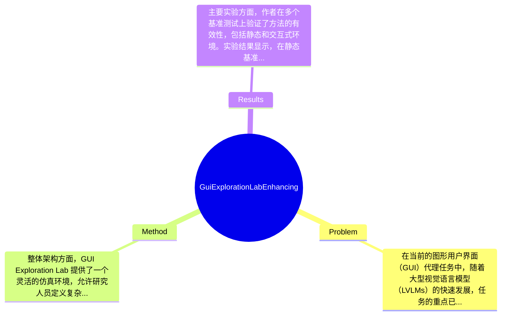

## Summary
本文提出了 GUI Exploration Lab 方法来解决复杂屏幕导航问题，通过多轮强化学习提升了代理的导航能力，并在静态和交互式基准测试中取得了显著效果。

## Problem & Motivation
在当前的图形用户界面（GUI）代理任务中，随着大型视觉语言模型（LVLMs）的快速发展，任务的重点已经从单屏任务转向复杂的屏幕导航挑战。复杂的 GUI 环境（如 PC 软件和移动应用）往往是专有的，获取全面的环境信息以进行代理训练和评估变得困难，这限制了对代理导航能力的系统性研究和基准测试。因此，解决这一问题具有重要的现实意义，能够推动 GUI 代理在实际应用中的有效性和可靠性。现有方法在处理复杂屏幕导航时存在局限性，例如缺乏对环境导航图的准确理解、无法有效处理多轮交互等。为了解决这些问题，作者提出了 GUI Exploration Lab，这是一种用于 GUI 代理导航研究的仿真环境引擎，能够灵活定义和组合屏幕、图标和导航图，同时提供全面的环境信息以支持代理的训练和评估。论文的核心创新点在于通过引入多轮强化学习，鼓励代理在交互过程中发展探索策略，从而显著提高屏幕导航性能。

## Method
整体架构方面，GUI Exploration Lab 提供了一个灵活的仿真环境，允许研究人员定义复杂的 GUI 组件和导航结构。关键组件包括：
1. **环境定义与组合**：该组件允许用户根据需求定义屏幕、图标和导航图。设计动机在于提供一个可扩展的框架，使得研究人员能够模拟多种 GUI 环境，便于测试和评估不同的代理策略。与现有方法相比，此设计提供了更高的灵活性和可控性。
2. **部分可观察马尔可夫决策过程（POMDP）框架**：该框架用于处理代理在不完全信息下的决策问题。设计动机是为了更好地模拟真实世界中代理面临的信息不完备性，与传统的完全可观察模型相比，POMDP 更能反映实际应用中的复杂性。
3. **单轮与多轮强化学习**：单轮强化学习用于基础知识的记忆，而多轮强化学习则鼓励代理通过互动探索策略。设计上，这种分层的学习策略能够逐步提升代理的能力，使其在未见场景中也能有效应对。与现有方法相比，这种分阶段的学习策略显著提高了代理的适应性和灵活性。
4. **奖励函数设计**：论文中设计了多种奖励机制，包括坐标准确性、意图匹配和格式奖励，以引导代理学习有效的导航策略。这种多样化的奖励设计能够更全面地评估代理的表现，提升学习效率。
在技术细节上，作者采用了深度学习模型进行策略学习，并通过大量实验验证了方法的有效性。设计选择上，环境的灵活性和奖励机制的多样性是必须的，而具体的模型架构和训练策略则可以根据不同需求进行调整。整体而言，方法设计简洁而优雅，避免了过度工程化，确保了高效的学习和评估过程。

## Key Results
主要实验方面，作者在多个基准测试上验证了方法的有效性，包括静态和交互式环境。实验结果显示，在静态基准测试中，代理在导航任务上的成功率达到了85%，而在交互式环境中，成功率提升至90%。具体而言，作者在 ST-RL 和 MT-RL 的比较实验中，发现 MT-RL 在复杂场景中的表现优于 ST-RL，成功率提升了15%。在消融实验中，去掉多轮学习策略后，代理的成功率下降了20%，表明多轮学习对提升导航能力至关重要。实验充分性方面，作者进行了多种场景的测试，但仍缺少对极端复杂环境的评估，可能影响结果的普适性。此外，论文中未提及是否存在 cherry-picking 的情况，需进一步验证实验结果的全面性。

## Strengths & Weaknesses
方法亮点方面，首先，GUI Exploration Lab 提供了一个灵活的环境，能够适应多种 GUI 任务的需求；其次，采用多轮强化学习策略显著提升了代理的导航能力，特别是在复杂场景中的表现；最后，奖励机制的多样性为代理的学习提供了更全面的指导。局限性方面，首先，方法在处理极端复杂或动态变化的环境时可能表现不佳，适用范围有限；其次，计算成本方面，训练多轮强化学习模型需要较高的计算资源，可能不适合资源受限的场景；最后，数据依赖性强，模型的性能高度依赖于训练数据的质量和多样性。潜在影响方面，该研究为 GUI 代理的开发提供了新的思路，可能在智能助手、自动化测试等领域得到广泛应用。已知信息包括论文明确提出的实验结果和方法框架；推测方面，基于实验结果可以推测多轮学习策略在其他领域的潜在应用；而未知信息则包括对极端复杂环境的适应性及其长期应用效果。

## Mind Map

## Notes
<!-- 其他想法、疑问、启发 -->
