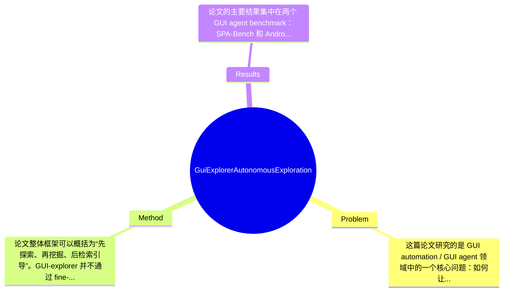

## Summary
该论文针对 GUI agent 在动态应用环境中普遍存在的 UI 元素误解和知识过时问题，提出了一个 training-free 的 GUI-explorer，通过自主探索生成 function-aware trajectory，并从交互状态转移中无监督挖掘 transition-aware knowledge 来辅助决策；在 SPA-Bench 和 AndroidWorld 上分别取得 53.7% 和 47.4% 的任务成功率，显著优于已有 SOTA 方法，且无需为新 app 做参数更新。

## Problem & Motivation
这篇论文研究的是 GUI automation / GUI agent 领域中的一个核心问题：如何让基于 LLM/MLLM 的智能体在真实、动态、异构的图形界面环境中稳定完成任务。问题本质上不是单纯“看懂屏幕”，而是要把视觉理解、控件语义判断、操作后果预测以及跨页面状态迁移推理结合起来。该问题非常重要，因为移动端和桌面端大量实际工作都发生在 GUI 上，包括搜索、购物、办公、社交、设备设置、内容创作等；若 agent 能可靠理解并操作 GUI，将直接推动个人助理、自动测试、RPA、无障碍交互等场景落地。论文指出现有方法至少有几类具体不足：第一，通用 MLLM 往往会误判具有 app-specific 设计风格的图标或控件语义，例如音乐识别按钮可能被识别成无关图标，这导致 action grounding 出错；第二，很多知识增强方法依赖人工整理 app 文档、示例轨迹或微调参数，但 app 版本更新快、功能迭代频繁，导致知识很快过时，维护成本高；第三，现有 agent 多关注单步感知或短程规划，却缺乏对“当前页面执行某操作后通常会跳到什么状态、触发什么功能”的 transition-level knowledge 建模，因此在动态 GUI 中容易盲试、重复操作或走入错误分支。基于这些局限，作者提出新方法的动机是合理的：希望在不做额外训练、不依赖人工标注知识的前提下，自动探索 app 功能空间，并从探索轨迹中提炼可复用的操作逻辑。论文的关键洞察是，GUI agent 所缺的并不只是静态控件描述，而是“屏幕-操作-结果”之间的状态转移知识；只要能系统地探索功能入口，并把交互三元组中的转移规律结构化出来，就能为后续任务推理提供比纯感知更稳定的决策支撑。

## Method
论文整体框架可以概括为“先探索、再挖掘、后检索引导”。GUI-explorer 并不通过 fine-tuning 把 app 知识写入模型参数，而是先在目标 app 内自主探索，生成覆盖较广的 function-aware trajectories；随后基于这些轨迹中的结构化交互三元组（observation, action, outcome）无监督抽取 transition-aware knowledge；最后在执行真实任务时，根据当前任务与页面状态动态排序相关知识，并生成 operational guidance 来辅助 GUI agent 做下一步决策。整体上这是一个 training-free、知识外置、以状态转移为中心的框架。

1. Autonomous Exploration of Function-aware Trajectory
该组件的作用是尽可能覆盖 app 的主要功能入口，而不是像随机探索那样只收集碎片化轨迹。作者设计了 Function-aware Task Goal Generator，利用 screenshot 与 activity hierarchy 等 GUI 结构信息，自动构造探索目标，使 agent 有目的地访问不同功能模块。这样设计的动机很明确：若探索目标不具备“功能感知”，得到的数据会高度偏向首页或浅层页面，难以支撑后续知识挖掘。与已有依赖人工设计任务列表或随机 walk 的方法相比，这里强调由模型自动生成 exploration goals，从而减少人工参与并提升覆盖率。论文从附录标题看还引入了 exploration anchors，用于识别可作为功能入口的关键 UI 线索，这说明其探索不是盲目点击，而是围绕功能节点展开。

2. Unsupervised Mining of Transition-aware Knowledge
这是论文最核心的技术贡献。该模块从探索得到的轨迹中抽取 structured interaction triples，即给定某个 observation，执行某个 action，得到某种 outcome，然后分析其状态转移模式，形成可复用的知识。它的作用不是简单记录“某按钮是什么”，而是总结“在什么页面特征下，执行什么操作，通常导致什么结果”，因此是 transition-aware 的。设计动机在于 GUI 任务的难点往往来自动态变化：同一图标在不同页面上下文中意义不同，而操作价值最终要由后续状态决定。与现有静态 UI caption、OCR-based grounding 或人工规则库不同，该方法强调从真实交互后果中无监督归纳 screen-operation logic，因此更加贴近决策需求。摘要中明确说明该过程无需 human involvement，这是其工程价值所在。

3. Dynamic Guidance for GUI Agent
有了知识库之后，论文并不是把所有知识一股脑塞进 prompt，而是加入 Dynamic Guidance，包括 Knowledge Ranking Formulation 和 Operational Guidance Generation。前者负责根据当前任务目标、当前屏幕和候选知识之间的相关性做排序，后者把高相关知识转化为可执行的推理提示。这样设计的原因是 GUI 知识天然稀疏且场景相关，如果召回过多低质量知识，LLM 容易被噪声误导。与简单 retrieval-augmented prompting 相比，这里更强调“动态排序 + 行动指导”的链路，说明作者意识到知识质量与上下文适配比知识数量更重要。附录中还专门有“Comparison with Alternative Ranking Methods”，表明 ranker 是被单独分析过的关键模块，但具体排序公式细节在当前给定文本中论文未提及。

4. Benchmark and Reasoning Setting
论文还提出了 GUI-Knowledge Reasoning Benchmark（GUI-KRB），包含 prior knowledge task 和 dynamic comprehension task，用于评估知识是否真的改善 GUI reasoning，而不仅仅提高 end-to-end success rate。这个设计有助于把“感知错误”和“知识缺失错误”区分开来，是方法论上的补充。

从技术风格看，该方法相对简洁：没有引入额外训练，没有复杂参数优化，核心是探索、知识抽取、排序检索三步闭环，思路上是优雅的。但如果落到实际系统，依赖多阶段 prompting、结构化解析、轨迹管理和知识索引，也带有一定系统工程色彩；是否过度工程化取决于其模块间耦合度，当前信息看属于“合理工程化”，不是纯粹堆模块。

## Key Results
论文的主要结果集中在两个 GUI agent benchmark：SPA-Bench 和 AndroidWorld。根据摘要，GUI-explorer 在 SPA-Bench 上达到 53.7% task success rate，在 AndroidWorld 上达到 47.4% success rate，并被作者表述为“significant improvements over SOTA agents”。这说明方法不仅在相对受控的数据集上有效，也在更接近真实 Android 交互环境的 benchmark 上保持了提升。需要指出的是，当前用户提供的文本没有给出所有 baseline 的具体数值，因此无法精确计算相对提升百分比；按要求应明确标注：baseline 的详细成功率、绝对提升值、相对提升比例，论文片段未完整提供。

从 benchmark 设置来看，论文在 5.1 节中明确使用了 SPA-Bench 与 AndroidWorld，指标至少包含 task success rate；此外，4.1 Tasks and Metrics 与 GUI-KRB 的设计表明作者还评估了知识推理能力，但当前摘要和截取内容没有给出 GUI-KRB 上的具体数值，因此无法复述该 benchmark 的定量结果，只能确认其被作为专门评测集提出。论文还包括 5.3 Analysis and Discussion、附录 E Error Analysis、F Comparison with Alternative Ranking Methods、G Generalization and Robustness Analysis，说明作者确实做了超出主表结果的进一步分析，例如感知错误、推理错误、缺失知识错误，以及对不完整 metadata 的鲁棒性和向 web 环境的泛化。不过这些实验的具体数字在当前材料中未提及。

若从批判角度看，实验设计有两个优点。第一，同时在两个主流 GUI benchmark 上报告结果，避免只在单一环境中证明有效。第二，作者不仅看 end-to-end success，还单独构造知识推理 benchmark，这有助于验证“知识模块本身是否有效”。但实验也存在信息缺口：当前可见内容没有完整列出 baseline 名称与分数，没有消融实验具体数字，例如去掉 autonomous exploration、去掉 knowledge ranker、去掉 transition-aware extractor 各会下降多少，这使我们难以严格判断每个组件的独立贡献。此外，虽然论文声称显著优于 SOTA，但是否存在 cherry-picking 目前无法完全排除，因为我们没有看到失败任务分布、不同 app 类型上的方差、以及长尾应用上的细粒度结果。总体上，主结果是有吸引力的，但若要充分信服，还需要完整实验表和消融数据支撑。

## Strengths & Weaknesses
这篇论文的亮点比较明确。第一，技术创新点在于把 GUI knowledge 从静态控件描述提升到 transition-aware knowledge，即围绕 observation-action-outcome 的状态转移逻辑建模。这比仅做 UI caption、元素 grounding 或简单 memory 更贴近真实 GUI 决策过程，是与现有工作的重要区别。第二，方法是 training-free 的，不需要针对新 app 做参数更新，这在 app 频繁迭代的现实环境中很有价值；相比 fine-tuning 路线，它把知识维护问题转化为“再探索 + 再抽取”，工程上更灵活。第三，作者不仅提出方法，还构建了 GUI-KRB 来测试知识推理，这说明论文不满足于 end-to-end 指标，而试图分析能力来源，这是较为严谨的研究设计。

局限性也很明显。第一，方法高度依赖探索质量：如果 autonomous exploration 没有覆盖关键功能路径，后续 knowledge mining 就会产生系统性盲区，因此该方法对“可探索性”和“初始功能入口识别”较敏感。第二，transition-aware knowledge 本质上是经验归纳，面对强条件分支、个性化推荐页面、登录态差异、地区/版本差异时，知识可能失效甚至误导；这类动态性是否能通过 ranker 充分化解，论文片段中没有证据。第三，虽然不需要训练，但并不意味着低成本。前期自主探索、轨迹存储、知识抽取、在线排序都需要额外时间和 token/推理预算，尤其在大型 app 或多 app 场景下，冷启动成本可能不低。第四，方法适用范围可能偏向具有较清晰页面跳转逻辑的任务；对于 heavily animated、canvas-based、游戏化界面或依赖复杂手势的 GUI，结构化 observation-action-outcome 三元组是否足够，值得怀疑。

潜在影响方面，这项工作对 GUI agent、RPA 和移动端自动化测试都可能有启发：它提示研究者不要只增强视觉识别，而应显式建模界面操作的转移知识。已知：论文明确提出自主探索、无监督知识抽取、动态知识排序，并报告在 SPA-Bench 53.7%、AndroidWorld 47.4% 的结果。推测：其 ranking 模块和 exploration anchors 可能对性能贡献较大，且对新 app 冷启动效率可能优于重新 fine-tune。未知：完整消融数值、不同 app 类型上的表现波动、探索阶段的真实时间成本、以及在真实商用闭源 app 大规模部署时的稳定性，当前提供文本均未说明。因此我认为它是“有参考价值”的工作，但是否达到里程碑水平，还取决于完整实验细节和后续复现验证。

## Mind Map

## Notes
<!-- 其他想法、疑问、启发 -->
