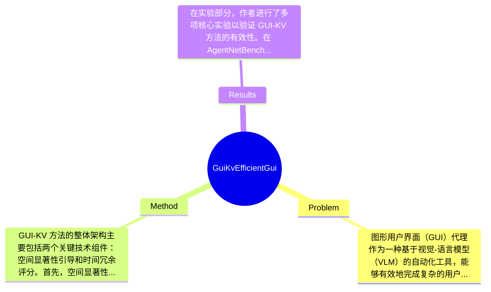

## Summary
提出了 GUI-KV 方法来解决 GUI 代理在处理高分辨率截图时的效率问题，通过引入空间和时间冗余评分技术，在 AgentNetBench 基准上实现了 38.9% 的解码 FLOPs 降低和 4.1% 的步骤准确率提升。

## Problem & Motivation
图形用户界面（GUI）代理作为一种基于视觉-语言模型（VLM）的自动化工具，能够有效地完成复杂的用户任务。然而，随着任务复杂度的增加，处理长序列高分辨率截图的计算需求也随之上升，导致推理过程变得缓慢且资源消耗巨大。现有的解决方案，如合并输入视觉标记或在高层次上修剪视觉表示，往往需要重新训练模型，这在实际应用中并不理想。另一方面，关键-值（KV）缓存技术虽然可以在一定程度上缓解这一问题，但在图像密集的上下文中，存储完整的缓存会消耗大量内存，甚至可能导致内存溢出。因此，现有的缓存压缩方法未能有效考虑 GUI 特有的空间和时间冗余，导致其在 GUI 代理任务中的有效性受到限制。基于此，作者提出了 GUI-KV 方法，旨在通过分析 GUI 代理工作负载中的注意力模式，发现与自然图像不同，GUI 的注意力稀疏性在所有变换层中均表现出均匀的高水平。这一发现促使作者提出了一种简单的均匀预算分配策略，实验证明其在性能上优于更复杂的层变化方案。核心创新点在于结合了空间显著性引导和时间冗余评分两种新技术，以实现高效的 KV 缓存压缩。

## Method
GUI-KV 方法的整体架构主要包括两个关键技术组件：空间显著性引导和时间冗余评分。首先，空间显著性引导的作用是通过增强注意力分数，保留语义上重要的视觉标记。具体来说，作者利用隐藏状态的 L2 范数来评估每个视觉标记的重要性，从而在注意力机制中给予更高的权重。这种设计的动机在于，GUI 中存在大量的空间冗余，许多区域在多个时间步中保持不变，因此需要优先保留那些对任务执行至关重要的视觉信息。与现有方法相比，GUI-KV 通过引入空间显著性引导，能够更好地捕捉到这些重要特征，从而提升推理效率。其次，时间冗余评分的设计则是通过将之前帧的键投影到当前帧的键子空间中，以优先修剪冗余的历史信息。这一设计旨在减少不必要的计算负担，特别是在处理长时间序列时。技术细节方面，GUI-KV 采用了一种无须重新训练的插拔式缓存压缩方法，这使得其在实际应用中具有较高的灵活性和适应性。设计选择上，空间显著性引导和时间冗余评分的结合是必须的，因为它们共同作用于提高缓存的有效性和推理的准确性。整体来看，GUI-KV 方法在设计上较为简洁优雅，避免了过度工程化的问题，能够有效地应对 GUI 代理任务中的计算挑战。

## Key Results
在实验部分，作者进行了多项核心实验以验证 GUI-KV 方法的有效性。在 AgentNetBench 基准上，GUI-KV 在 5 个截图的设置下，成功将解码 FLOPs 降低了 38.9%，同时步骤准确率提升了 4.1%。此外，作者还进行了与现有 KV 压缩基线的对比分析，结果显示 GUI-KV 在接近完整缓存准确率的情况下，显著降低了计算资源的消耗。消融实验进一步验证了各组件的贡献，表明空间显著性引导和时间冗余评分在提升性能方面起到了关键作用。总体来看，实验设计较为充分，涵盖了准确性评估和效率分析，但仍缺乏对不同任务复杂度下的表现分析，可能影响结果的普适性。此外，论文未提及是否存在 cherry-picking 的现象，需谨慎对待实验结果的解读。

## Strengths & Weaknesses
方法的亮点主要体现在以下几个方面：首先，GUI-KV 提出了针对 GUI 特有的空间和时间冗余的缓存压缩方法，具有较强的创新性；其次，方法的设计简洁且无需重新训练，提升了实际应用的灵活性；最后，实验结果显示出显著的性能提升，验证了方法的有效性。然而，局限性也不可忽视：一方面，方法在特定的 GUI 任务上表现良好，但在其他类型的视觉任务中可能不适用；另一方面，计算成本方面，尽管降低了 FLOPs，但仍需大量 GPU 内存，可能对资源有限的用户造成困扰；最后，数据依赖性较强，方法的有效性可能受到训练数据质量和多样性的影响。潜在影响方面，GUI-KV 方法为 GUI 代理的高效推理提供了新的思路，可能推动相关领域的进一步研究和应用。已知的信息包括论文中明确提到的实验结果和方法设计，推测方面可以认为该方法在其他视觉任务中也有潜在应用，但尚未得到验证；而关于方法在更广泛应用场景下的表现，论文未涉及，仍需进一步探索。

## Mind Map

## Notes
<!-- 其他想法、疑问、启发 -->
