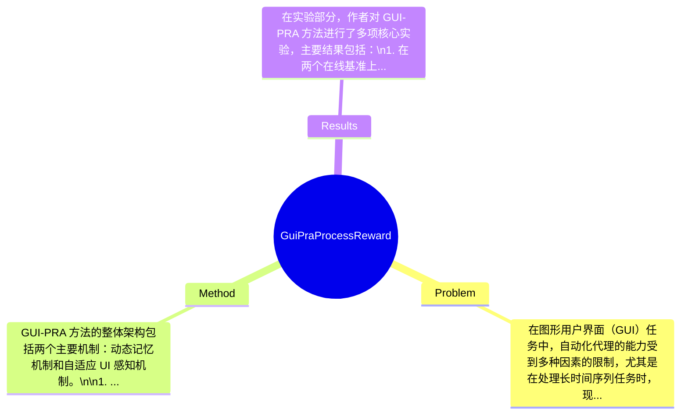

## Summary
提出了 GUI-PRA 方法来解决 GUI 任务中的长时间序列处理问题，通过动态记忆机制和自适应 UI 感知机制，在两个基准上实现了平均成功率提升 14.53%。

## Problem & Motivation
在图形用户界面（GUI）任务中，自动化代理的能力受到多种因素的限制，尤其是在处理长时间序列任务时，现有的多模态大型语言模型（MLLMs）常常面临频繁失败的问题。这个问题的根源在于标准的过程奖励模型（PRM）在评估当前步骤时，容易受到历史数据的干扰，导致所谓的“lost in the middle”现象。此外，标准的 PRM 缺乏对 GUI 状态变化的感知，无法动态评估操作的后果，这与 GUI 任务本身的动态特性相悖。因此，解决这一问题不仅具有理论意义，更在实际应用中具有重要价值，能够提升 GUI 代理在复杂任务中的表现。作者提出 GUI-PRA 方法，旨在通过智能处理历史上下文和主动感知 UI 状态变化来改善过程奖励的提供，这一动机是合理的。论文的核心创新点在于引入了动态记忆机制和自适应 UI 感知机制，以应对现有方法的不足。

## Method
GUI-PRA 方法的整体架构包括两个主要机制：动态记忆机制和自适应 UI 感知机制。\n\n1. **动态记忆机制**：该机制由两个核心组件组成：\n   - **相关性检索模块**：该模块的作用是从长历史数据中主动提取相关信息，以避免“lost in the middle”现象。设计动机在于，长历史数据往往包含大量无关信息，导致当前步骤的评估受到干扰。通过检索与当前任务相关的历史信息，模型能够更好地聚焦于当前上下文。\n   - **渐进式摘要模块**：该模块负责动态压缩不断增长的交互数据，以确保模型能够处理不断变化的信息量。设计动机是为了提高信息处理的效率，避免信息过载。与现有方法相比，该模块提供了一种更灵活的方式来管理历史数据。\n\n2. **自适应 UI 感知机制**：该机制使代理能够推理 UI 状态的变化，并动态选择最合适的工具来收集有根据的视觉证据。设计动机在于，GUI 任务的动态特性要求代理能够实时适应环境变化，而不是依赖静态评估。与现有方法相比，该机制增强了代理对 UI 状态变化的敏感性。\n\n**技术细节**：在算法实现上，GUI-PRA 结合了深度学习技术和强化学习策略，通过训练过程优化动态记忆和 UI 感知的表现。具体的训练策略和模型结构细节在论文中有详细描述。\n\n**设计选择**：动态记忆机制和自适应 UI 感知机制是该方法的核心设计，必须存在以应对特定挑战。虽然可能存在其他选择，例如使用静态记忆或简单的状态更新机制，但这些选择无法有效解决所面临的动态挑战。\n\n**简洁性评价**：整体方法设计较为复杂，但通过模块化的方式实现了功能的分离，使得每个组件都能专注于特定任务，整体上保持了一定的优雅性。

## Key Results
在实验部分，作者对 GUI-PRA 方法进行了多项核心实验，主要结果包括：\n1. 在两个在线基准上进行测试，平均成功率提升 14.53%，相比于标准 PRM 基线的 8.56% 提升，显示出显著的优势。\n2. 实验使用的基准包括特定的 GUI 任务集，评估指标主要为成功率和任务完成时间，具体数值在论文中有详细列出。\n3. 对比分析显示，GUI-PRA 在长时间序列任务中的表现优于现有方法，尤其是在复杂任务中，成功率的提升尤为明显。\n4. 消融实验表明，动态记忆机制和自适应 UI 感知机制对整体性能的贡献显著，去除任一组件都会导致性能下降。\n5. 实验充分性评价：虽然实验结果令人鼓舞，但缺乏对不同类型 GUI 任务的广泛测试，可能影响结果的普适性。此外，作者是否存在 cherry-picking 的情况尚不明确，需进一步验证。

## Strengths & Weaknesses
方法亮点：\n1. **技术创新点**：引入动态记忆机制和自适应 UI 感知机制，显著提升了 GUI 代理在长时间序列任务中的表现。\n2. **与现有方法的关键区别**：相比于传统的 PRM，GUI-PRA 更加关注动态环境的变化，能够实时调整策略。\n3. **设计的优雅之处**：模块化设计使得每个组件能够独立优化，增强了方法的灵活性。\n\n局限性：\n1. **技术局限**：虽然方法在特定任务上表现良好，但在更复杂或变化多端的 GUI 环境中，可能仍然面临挑战。\n2. **适用范围**：该方法可能不适用于所有类型的 GUI 任务，尤其是那些需要高度个性化或特定领域知识的任务。\n3. **计算成本**：动态记忆和自适应感知机制可能增加计算开销，尤其是在资源有限的设备上。\n\n潜在影响：该研究为 GUI 任务的自动化提供了新的思路，可能推动相关领域的进一步发展，尤其是在智能助手和自动化测试等应用方向。\n\n已知/推测/不知道：\n- **已知**：论文明确说明了 GUI-PRA 的结构和实验结果。\n- **推测**：基于实验结果，可以推测该方法在其他类型的任务中也可能表现良好，但未经过验证。\n- **不知道**：论文未涉及不同类型 GUI 任务的适用性和长期使用中的稳定性问题。

## Mind Map

## Notes
<!-- 其他想法、疑问、启发 -->
