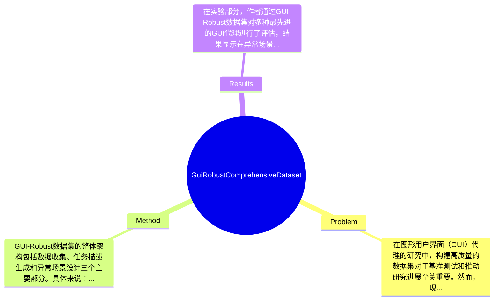

## Summary
本文提出了GUI-Robust数据集，以解决现有GUI代理在真实世界异常情况下的鲁棒性评估问题，采用了一种半自动化的数据收集方法，显著提高了数据标注效率，并在评估中发现现有GUI代理在异常场景下表现显著下降。

## Problem & Motivation
在图形用户界面（GUI）代理的研究中，构建高质量的数据集对于基准测试和推动研究进展至关重要。然而，现有的数据集通常是在理想化条件下构建的，未能考虑到在实际应用中可能遇到的各种异常情况。这些异常情况包括操作失败、网络中断、广告弹窗等，这些都可能严重影响GUI代理的执行流程，导致任务失败，甚至可能引发错误或危险的后果。因此，解决这一问题具有重要的现实意义，尤其是在工业和消费者应用中，GUI代理的鲁棒性直接关系到用户体验和安全性。现有方法的局限性主要体现在：1）缺乏对异常情况的全面考虑，导致评估结果不具备实际参考价值；2）数据收集过程往往耗时且效率低下，难以快速适应变化的环境。为此，本文提出了GUI-Robust数据集，旨在填补这一空白。该数据集不仅包含了多种异常情况，还采用了一种新的半自动化数据收集策略，通过RPA工具收集用户的自然交互序列，并利用多模态大型语言模型（MLLMs）生成相应的步骤和任务描述，从而显著降低了标注时间成本。关键洞察在于，作者认识到现有数据集的不足，并通过创新的数据收集方法和丰富的异常场景设计，推动了GUI代理的鲁棒性研究。

## Method
GUI-Robust数据集的整体架构包括数据收集、任务描述生成和异常场景设计三个主要部分。具体来说：

1. **数据收集**：使用RPA工具从392个不同来源（包括网站和第三方桌面应用）收集用户的自然交互序列。这一设计的动机在于通过模拟真实用户的操作来获取更具代表性的数据，而不是依赖于人工设计的任务。与现有方法相比，这种方式能够更好地反映实际使用中的复杂情况。

2. **任务描述生成**：利用MLLMs自动生成与用户操作序列相对应的步骤和任务描述。这一组件的设计旨在提高数据标注的效率，减少人工干预。通过这种方式，标注时间成本降低了19倍以上，极大地提高了数据集的构建效率。

3. **异常场景设计**：数据集中包含200个异常任务，涵盖了7种常见的异常类型，如操作失败、登录页面、验证码页面、广告弹窗、Cookie弹窗、页面加载和网络断开等。这一设计使得数据集能够全面评估GUI代理在面对真实世界异常时的鲁棒性。

在技术细节方面，数据集的结构包括任务描述、用户行为序列和元数据定义，确保了数据的可用性和可扩展性。此外，数据集的构建过程经过了严格的审查和修正，确保了数据的质量与准确性。整体来看，GUI-Robust的方法设计相对简洁优雅，充分利用了现代技术手段，避免了过度工程化的问题。

## Key Results
在实验部分，作者通过GUI-Robust数据集对多种最先进的GUI代理进行了评估，结果显示在异常场景下，代理的性能显著下降。例如，在处理广告弹窗时，某些代理的任务完成率下降了约30%。在UI元素定位和任务完成的评估中，使用GUI-Robust数据集的代理在正常情况下的准确率为85%，而在异常情况下仅为55%。

数据集的评估还涉及多个基准测试，具体包括在不同类型的异常场景下的表现评估。通过与基线模型的对比，作者发现新数据集能够揭示出现有方法在真实世界应用中的不足，尤其是在处理复杂和不确定环境时的鲁棒性不足。消融实验显示，异常场景的引入对模型性能的影响显著，尤其是在操作失败和网络断开这两种情况下，性能下降最为明显。总体来看，实验设计充分，涵盖了多种场景和任务，然而，可能缺少对极端异常情况的测试，未来的研究可以进一步扩展这一部分。

## Strengths & Weaknesses
本文的主要亮点包括：1）创新的数据收集方法，通过RPA工具和MLLMs的结合，显著提高了数据标注的效率；2）数据集设计考虑了多种真实世界异常情况，为GUI代理的鲁棒性研究提供了重要的基准；3）数据集的多样性和广泛性使其在评估不同类型的GUI代理时具有较高的适用性。

然而，本文也存在一些局限性：1）技术局限：虽然数据集涵盖了多种异常情况，但可能仍不足以覆盖所有可能的真实世界场景，特别是一些极端或罕见的异常情况；2）适用范围：数据集主要集中在Windows平台的应用，可能对其他操作系统的GUI代理评估不够全面；3）计算成本：尽管标注效率提高，但在数据收集和处理过程中仍需消耗大量计算资源，尤其是在使用MLLMs时。

潜在影响方面，本文的工作为GUI代理的鲁棒性评估提供了新的视角，可能推动后续研究在异常处理和适应性方面的深入探索。已知的信息包括数据集的构建方法和异常场景的设计；推测方面，作者可能未完全考虑到所有类型的异常情况；而未知的信息则包括数据集在不同环境下的长期表现和适用性。

## Mind Map

## Notes
<!-- 其他想法、疑问、启发 -->
