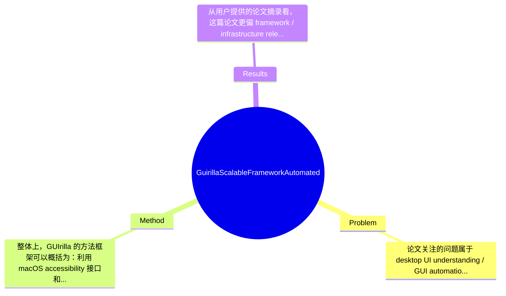

## Summary
这篇论文针对 macOS 桌面 GUI 数据稀缺、真实交互轨迹难以规模化采集的问题，提出了一个基于 accessibility API 的自动化桌面 UI 探索框架 GUIrilla，并用层次化的 MacApp Tree 表示应用状态与动作转移。其主要贡献不在于提出新的 GUI agent，而在于构建可扩展的数据采集基础设施、开放源码库与结构化表示，以支持后续 foundation model、GUI agent、检索与测试任务。

## Problem & Motivation
论文关注的问题属于 desktop UI understanding / GUI automation / human-computer interaction 交叉领域，核心是如何在桌面环境中大规模、自动化、可复用地采集真实 GUI 状态与交互轨迹数据。这个问题之所以重要，是因为当前大量 VLM、LLM-based agent、GUI grounding 和 desktop automation 系统的性能上限，往往受限于训练数据的覆盖度、真实性和结构化程度。相比移动端，桌面端尤其是 macOS 的 GUI 更复杂：存在多窗口重叠、弹窗、菜单栏、系统组件、不同坐标系和多样 toolkit，导致“看见界面”与“正确操作界面”之间的鸿沟更大。现实上，这类数据对自动化测试、辅助功能、数字员工、软件分析、界面检索和 agent training 都有直接价值。

现有方法存在几类具体不足。第一，很多数据集依赖人工演示或人工标注任务轨迹，虽然质量较高，但采集成本高，难以覆盖长尾应用和大量 UI state，扩展性很差。第二，现有 benchmark 往往只采单窗口静态截图，忽略真实桌面环境中的 overlapping windows、modal dialogs、background apps 和系统 widgets，因此数据的生态有效性有限。第三，自动化采集高度依赖平台特定工程设计，尤其 macOS 缺乏 Android 那样成熟的虚拟化和可控环境，导致该平台在现有公开资源中严重缺失。论文给出的动机是合理的：如果没有一个可扩展、平台适配、结构化的数据采集框架，那么下游模型再强也会受制于数据瓶颈。本文的关键洞察是，不应把重点放在“立刻做一个 autonomous agent”，而应先构建一套稳定的 accessibility-driven crawling framework，并把应用探索过程组织成可复用的层次化 MacApp Tree，从而为后续训练、评测、检索和测试提供基础设施。

## Method
整体上，GUIrilla 的方法框架可以概括为：利用 macOS accessibility 接口和自动化交互能力，对桌面应用进行系统性探索；在每个可达 UI state 上同步保存 screenshot、完整 accessibility tree、交互动作及状态转移关系；最终将整个探索过程组织成层次化的 MacApp Tree。它不是一个基于目标规划的 autonomous agent，而更像是一个 platform-specific crawler + structured recorder，其核心目标是“尽可能稳定地收集真实而可分析的桌面 GUI 数据”。

1. accessibility-driven exploration 组件
该组件的作用是以 accessibility metadata 作为主要观测信号，对 macOS 应用当前 UI 结构进行解析，并决定哪些元素可交互、哪些状态值得扩展。这样设计的动机很明确：纯视觉截图虽然能反映表观，但很难稳定恢复语义结构、控件类型、层级关系和可操作性；而 accessibility tree 天然提供节点属性、角色、层次和可访问标签，更适合做结构化采集。与很多仅基于 screenshot 的 GUI 数据方案相比，这种设计能显著提高状态表示的可解释性和后处理价值。不过它也隐含依赖：若应用 accessibility 支持差，则采集质量会下降。

2. MacApp Tree 层次表示
这是论文最核心的结构性贡献。每个节点表示一个 UI state，节点内包含完整 accessibility tree 和对应 screenshot；边表示由 crawler 执行的某个用户动作导致的状态转移。设计动机在于，桌面应用不是孤立页面集合，而是交互式状态空间，因此必须显式记录状态间转换关系，才能支持 trajectory modeling、检索、测试覆盖分析和未来 agent training。与传统静态 UI dataset 的区别在于，MacApp Tree 保留了“结构 + 视觉 + 动作 + 转移”四元关系，更接近可执行环境的图结构表示。这种表示也比简单线性 trajectory 更通用，因为它允许一个状态有多个后继分支。

3. scalable crawling framework
GUIrilla 强调 scalable，但这里的“可扩展”主要体现在工程流程和数据组织上，而不是论文中展示了某种新搜索算法。其作用是批量运行应用探索流程，自动收集大量状态和交互痕迹。设计上显然考虑了 macOS 平台特有约束，例如权限系统、事件模型、桌面窗口管理和缺乏 robust virtualization 等问题。与现有依赖人工任务脚本的方法不同，GUIrilla 试图将采集过程标准化、可复现、可开源复用。论文摘要显示其还额外发布了 macapptree 开源库，这说明作者把“可复现的采集基础设施”视为一等公民，而不是一次性实验代码。

4. realistic desktop context 建模
论文特别批评 single-window snapshot 数据，因此 GUIrilla 的采集目标并非仅记录某个前台窗口，而是尽量保留真实桌面使用场景中的窗口重叠、弹窗、系统组件和背景应用影响。该组件的作用是提高 ecological validity，即让数据更像真实用户环境。设计动机是，下游 agent 若只在干净单窗口上训练，落地到真实桌面时极易失败。与先前 desktop benchmark 相比，这一立场更偏“环境真实性优先”，虽然代价是数据更脏、更难标准化。

5. open-source reproducibility 支撑
作者同时发布 framework implementation 和 macapptree library，作用是让其他研究者能在相同抽象下复现 accessibility-driven collection。其设计价值在于降低平台专有工程门槛，扩大 macOS GUI 数据生态。与闭源工业系统不同，这一选择有助于社区积累共享工具链。

技术细节方面，已知信息主要集中在：系统以 accessibility states 和 user actions 组织树结构；节点保存 screenshot + accessibility tree；边表示 crawler action。至于具体动作集合、状态去重算法、搜索策略（DFS/BFS/heuristic）、终止条件、异常恢复机制、训练策略等，论文摘录中未提及，因此不能臆造。就设计选择而言，accessibility-based state parsing 和 graph/tree-based state organization 看起来是必要设计；而具体探索策略、状态压缩方式、动作优先级、去重判据理论上都可以有其他选择。整体评价上，这个方法从研究贡献看较为简洁务实，没有明显堆叠复杂模型，更像高质量系统工程；优点是问题抓得准，缺点是算法创新性可能弱于 model-centric 论文。

## Key Results
从用户提供的论文摘录看，这篇论文更偏 framework / infrastructure release，而不是传统以 SOTA 指标为中心的模型论文，因此可报告的“具体数字结果”非常有限。摘要和引言中明确给出的数字主要是背景统计，而非 GUIrilla 本身的 benchmark 成绩。例如，作者指出在 OS-Atlas 中 macOS 界面仅占全部样本的 0.06%，而在自动采集 desktop UIs overall 中约占 2.45%，这用来支撑“macOS 严重欠代表”的问题设定。除此之外，当前摘录没有提供 GUIrilla 实际爬取了多少应用、多少 UI states、多少 transitions、覆盖了多少类别，也没有给出与 baseline crawler 的定量比较。

已知的核心“结果”更多体现在产出物而非性能数值：第一，作者发布了 GUIrilla 这一面向 macOS 的 scalable automated desktop UI exploration framework；第二，发布了 MacApp Trees 作为可复用的结构化表示；第三，发布了 macapptree 开源库和完整实现以支持 reproducible collection。这些都是明确贡献，但不是 benchmark score。论文摘录中还通过 Figure 1 展示了从 Session application 解析出的层次树结构，说明系统至少能把应用探索过程表示为节点-边层次图，其中节点含 accessibility tree 和 screenshot，边对应 crawler actions。

从批判性角度看，实验充分性目前明显不足，至少在给定文本中没有看到以下关键验证：1）与人工采集或已有 crawler 相比，状态覆盖率是否更高；2）在真实应用集合上，采集稳定性、失败率、重复状态比例如何；3）下游任务如 retrieval、GUI grounding、agent pretraining 是否因 MacApp Tree 数据获益；4）面对动态界面、非标准控件、权限弹窗时的鲁棒性如何。如果正式论文完整版本中也缺乏这些量化实验，那么其说服力会偏向“工具发布”而非“经验证的通用研究结论”。是否存在 cherry-picking 目前无法确认；但只展示结构图和动机统计、而缺少系统性 quantitative evaluation，本身就意味着读者需要谨慎看待其“scalable”与“realistic”的实际程度。简言之：背景数字明确，系统产出明确，但关键 benchmark 和消融数字在当前材料中属于论文未提及。

## Strengths & Weaknesses
这篇工作的主要亮点有三点。第一，它把研究焦点从“再做一个 GUI agent”转向“补齐桌面 GUI 数据基础设施”，这个切入点很有现实价值。当前很多 desktop agent 论文受限于数据稀缺却把问题归因于模型能力，GUIrilla 则抓住了更底层的瓶颈。第二，MacApp Tree 这一表示较有启发性：它不是只存截图，也不是只存线性操作序列，而是把 screenshot、accessibility tree、action 和 state transition 统一起来，适合后续做 retrieval、testing 和 trajectory learning。第三，专门面向 macOS 这一欠覆盖平台，且开源实现与库，对社区贡献实际且稀缺。

局限性同样明显。第一，技术上它更像数据采集系统而非算法论文，核心创新集中在工程整合和表示设计，若缺少充分量化实验，就难判断其相对现有工具链的优势究竟有多大。第二，该方法高度依赖 accessibility API 的完整性和一致性；对于自绘控件、游戏界面、权限受限窗口或 accessibility 支持差的应用，采集效果可能显著下降。第三，桌面环境真实但也更脏，窗口遮挡、系统弹窗、异步更新会导致状态空间爆炸和重复数据问题；如果没有强去重和探索策略，所谓 scalable 可能很快遇到成本瓶颈。计算成本、并发部署方式、失败恢复和长期运行稳定性，在当前摘录中也没有被量化说明。

潜在影响方面，这项工作对 desktop autonomy、GUI foundation models、自动化测试和 accessibility research 都有潜在价值。若社区真的基于其开源框架积累大规模 macOS 数据，那么它可能成为后续 agent 训练集和 benchmark 的基础层。

严格区分三类信息：已知——论文明确提出 GUIrilla 是 automated exploration framework，不是 autonomous agent；其目标平台是 macOS；输出包含 MacApp Trees；发布了 macapptree 库与实现。推测——MacApp Tree 未来可能适合作为 agent pretraining、state abstraction、UI retrieval 的中间表示；框架若扩展到其他 OS 需要大量平台适配工作。不知道——具体采集规模、覆盖应用数、失败率、去重策略、动作搜索算法、资源消耗、与 baseline 的定量对比、以及下游模型收益，在当前材料中均未提及。综合来看，这是一篇有参考价值的系统型论文，但暂未显示为里程碑级结果。

## Mind Map

## Notes
<!-- 其他想法、疑问、启发 -->
