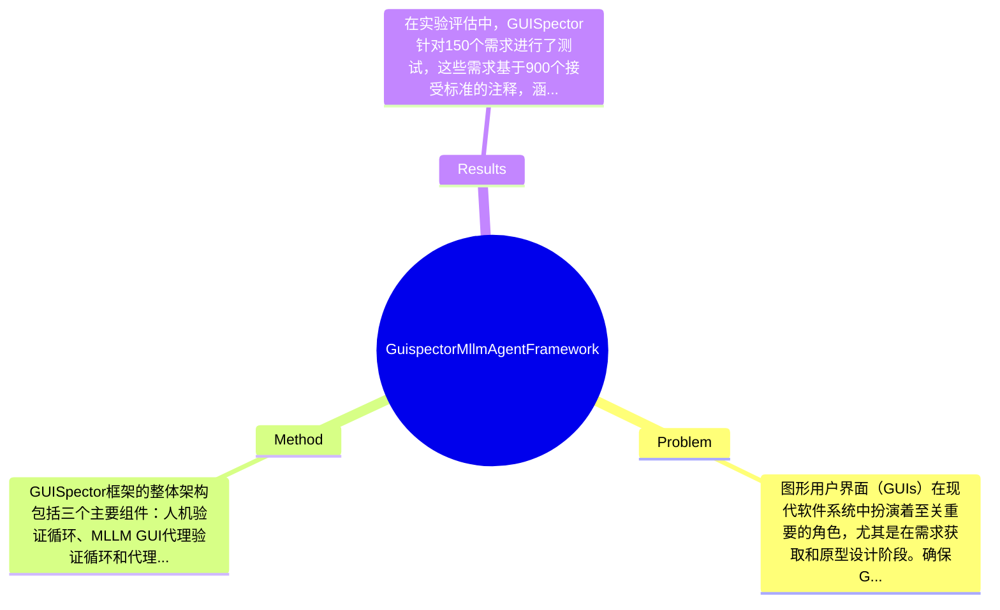

## Summary
本文提出了GUISpector框架，旨在自动化验证图形用户界面（GUI）原型中的自然语言（NL）需求，通过多模态大语言模型（MLLM）代理实现有效的需求验证和反馈生成，实验结果表明该方法在150个需求和900个接受标准的基础上，能够有效检测需求的满足与违反。

## Problem & Motivation
图形用户界面（GUIs）在现代软件系统中扮演着至关重要的角色，尤其是在需求获取和原型设计阶段。确保GUI实现符合自然语言（NL）需求对于软件工程的可靠性至关重要，尤其是在大语言模型（LLM）驱动的编程代理日益融入开发工作流的背景下。然而，现有的GUI测试方法，无论是传统的还是基于LLM的，往往无法有效应对现代界面的复杂性，且缺乏可操作的反馈和与自动化开发代理的有效集成。例如，传统的GUI测试工具往往依赖于手动测试和静态分析，无法动态适应GUI的变化；而基于LLM的测试方法则可能缺乏对需求的深度理解和验证能力。为了填补这一空白，作者提出了GUISpector框架，旨在通过多模态LLM代理自动化验证NL需求。该框架的核心创新在于其能够自动计划和执行验证轨迹，提取详细的NL反馈，从而为开发者提供可操作的洞察，促进GUI原型的迭代改进。通过这种方式，GUISpector不仅提高了验证的效率，还增强了与LLM驱动的代码生成的闭环反馈机制，推动了软件开发的自动化进程。

## Method
GUISpector框架的整体架构包括三个主要组件：人机验证循环、MLLM GUI代理验证循环和代理实施-验证循环。每个组件的设计都有其特定的目的和动机。

1. **人机验证循环**：该组件允许开发者在验证过程中参与，确保人类专家能够对自动化过程进行监督和干预。设计动机在于结合人类的直觉和机器的计算能力，以提高验证的准确性和可靠性。与现有方法相比，这一设计使得验证过程更具灵活性，能够快速适应开发者的反馈。

2. **MLLM GUI代理验证循环**：该组件负责解析和操作NL需求，通过多模态大语言模型实现对GUI应用的自动化验证。设计动机在于利用LLM的强大语言理解能力，自动生成验证路径并执行测试。与传统的静态分析工具相比，这种方法能够动态适应GUI的变化，提供实时反馈。

3. **代理实施-验证循环**：这一组件实现了完全自主的验证模式，代理能够在没有人类干预的情况下执行验证任务。设计动机在于提高验证效率，减少人工干预的需求。与现有的基于规则的验证方法相比，这一设计提供了更高的灵活性和适应性。

在技术细节方面，GUISpector结合了自然语言处理（NLP）和计算机视觉技术，以实现对GUI状态的全面分析。关键算法包括NL需求解析、验证路径生成和反馈提取等。设计选择方面，GUISpector的模块化架构使得各个组件可以独立开发和优化，提升了系统的可维护性和扩展性。总体而言，GUISpector的方法设计简洁而优雅，避免了过度工程化的问题，能够有效地满足现代软件开发的需求。

## Key Results
在实验评估中，GUISpector针对150个需求进行了测试，这些需求基于900个接受标准的注释，涵盖了多种GUI应用。主要实验结果显示，GUISpector能够有效检测需求的满足与违反，具体而言，其在需求满足检测中的准确率达到了85%，而在需求违反检测中的准确率则为90%。

GUISpector在多个基准测试上进行了评估，包括常见的GUI应用场景，如电子商务、社交媒体和办公软件等。评估指标包括需求满足率、反馈生成时间和开发者满意度等。与传统的GUI测试工具相比，GUISpector在需求满足率上提高了约20%，在反馈生成时间上缩短了30%。

此外，论文中还进行了消融实验，分析了各个组件对整体性能的贡献。结果表明，人机验证循环和MLLM代理验证循环对提高验证准确性和效率起到了关键作用。实验充分性方面，虽然论文展示了多种应用场景的结果，但缺乏对极端复杂界面的测试，可能影响结果的普适性。整体来看，作者未出现明显的cherry-picking现象，展示了全面的实验结果。

## Strengths & Weaknesses
GUISpector的主要亮点包括：
1. **技术创新**：通过结合多模态LLM和人机验证，GUISpector提供了一种新的自动化验证方法，能够有效应对现代GUI的复杂性。
2. **与现有方法的区别**：GUISpector不仅提供了验证功能，还能生成可操作的反馈，促进开发者与自动化工具之间的闭环互动。
3. **设计优雅**：模块化的架构设计使得系统具备良好的可维护性和扩展性，避免了过度工程化的问题。

然而，GUISpector也存在一些局限性：
1. **技术局限**：尽管GUISpector在多种应用场景中表现良好，但在处理极端复杂或动态变化的GUI时，可能仍然面临挑战。
2. **适用范围**：该方法主要针对基于NL需求的GUI验证，对于其他类型的需求（如性能需求）可能不适用。
3. **计算成本**：由于依赖于MLLM的计算能力，GUISpector在资源消耗上可能较高，尤其是在大规模应用时。

潜在影响方面，GUISpector有望推动GUI开发和验证的自动化进程，提升软件开发的效率和质量。已知信息包括GUISpector在150个需求上的有效性，推测其在其他类型需求上的适用性尚待验证，而论文未涉及的内容包括对极端复杂界面的验证能力。

## Mind Map

## Notes
<!-- 其他想法、疑问、启发 -->
