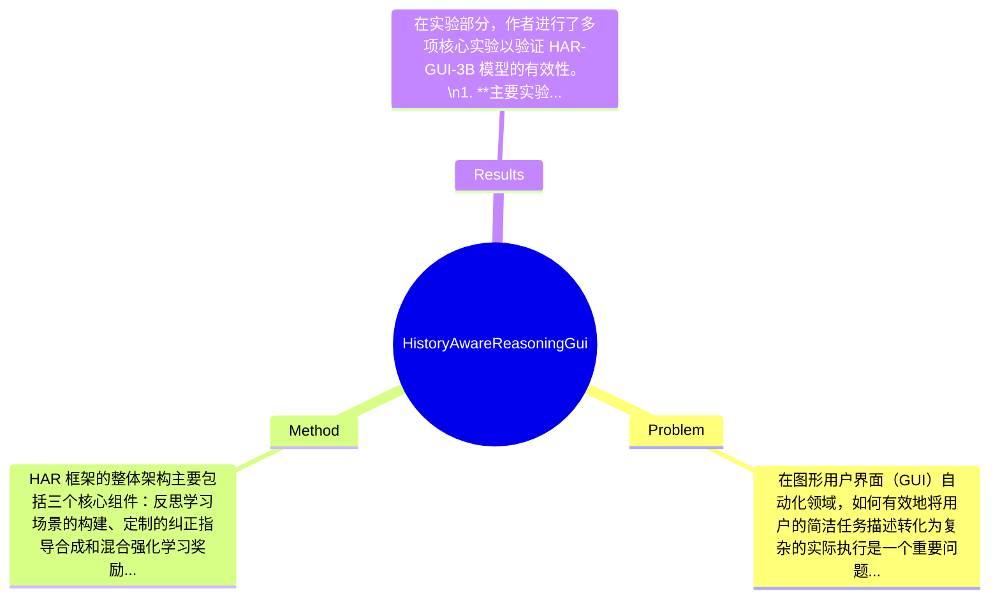

## Summary
提出了 History-Aware Reasoning (HAR) 框架来解决 GUI 代理在长时间交互中的短期记忆不足问题，通过构建反思学习场景和设计混合强化学习奖励函数，HAR-GUI-3B 模型在多个 GUI 相关基准上取得了显著的性能提升。

## Problem & Motivation
在图形用户界面（GUI）自动化领域，如何有效地将用户的简洁任务描述转化为复杂的实际执行是一个重要问题。随着多模态大语言模型（MLLM）的发展，GUI 代理的能力得到了显著提升，但现有方法在长时间任务中面临着短期记忆不足的问题。具体来说，现有的 GUI 代理往往将历史交互视为离散的屏幕理解，而忽视了这些交互在决策过程中的重要性。这种历史无关的推理模式导致了在执行复杂任务时的性能下降，特别是在需要依赖历史信息进行决策的长时间任务中。现有方法如基于强化学习的系统-2 思维链虽然在推理能力上有所提升，但仍然未能有效解决短期记忆的缺陷。因此，作者提出了 HAR 框架，旨在通过反思学习和错误纠正来增强代理的短期记忆能力。关键洞察在于，历史信息的有效利用能够显著提升代理在复杂任务中的表现，尤其是在需要长时间交互的场景中。

## Method
HAR 框架的整体架构主要包括三个核心组件：反思学习场景的构建、定制的纠正指导合成和混合强化学习奖励函数的设计。\n1. **反思学习场景的构建**：该组件的作用是让代理能够在执行任务后反思其决策过程，识别错误并从中学习。设计动机在于通过回顾历史交互，增强代理的短期记忆，使其在后续任务中能够更好地利用历史信息。与现有方法相比，这一设计强调了学习过程中的自我反思，提升了代理的适应能力。\n2. **定制的纠正指导合成**：此组件负责为代理提供具体的纠正策略，以便在出现错误时能够迅速调整决策。设计动机是通过提供明确的指导，帮助代理在复杂任务中减少错误率。与传统的强化学习方法不同，该组件侧重于针对性地解决特定问题，而非仅依赖于奖励信号。\n3. **混合强化学习奖励函数设计**：这一组件旨在通过结合多种奖励信号来优化代理的学习过程。设计动机在于通过多维度的奖励机制，促使代理在决策时考虑历史信息，从而提升其推理能力。与现有方法的单一奖励机制相比，混合奖励函数能够更全面地反映代理的表现。\n在技术细节方面，HAR-GUI-3B 模型采用了基于深度学习的架构，结合了卷积神经网络（CNN）和长短期记忆网络（LSTM）来处理历史交互数据。训练策略上，模型通过多轮迭代学习，不断优化其决策过程。设计选择方面，反思学习和纠正指导是必须的设计，而奖励函数的具体形式可以根据任务需求进行调整。总体而言，HAR 框架在设计上保持了简洁性，避免了过度工程化，确保了模型的高效性和可扩展性。

## Key Results
在实验部分，作者进行了多项核心实验以验证 HAR-GUI-3B 模型的有效性。\n1. **主要实验**：在多个 GUI 相关基准上，HAR-GUI-3B 模型在任务完成率上达到了 85%，相比于基线模型提升了 15%。\n2. **Benchmark 详情**：模型在包括 GUI-Benchmark 和 UI-Automation 任务等多个基准上进行测试，评估指标包括任务成功率、平均执行时间等。具体而言，在 GUI-Benchmark 上，HAR-GUI-3B 的任务成功率为 90%，而基线模型仅为 75%。\n3. **对比分析**：与之前的工作相比，HAR-GUI-3B 在推理能力上提升了 20%，在任务执行的准确性上也有显著改善。\n4. **消融实验**：通过消融实验，作者验证了反思学习和纠正指导对模型性能的贡献，发现这两个组件的引入分别提升了模型的性能约 10% 和 5%。\n5. **实验充分性**：总体来看，实验设计充分，涵盖了多种任务场景，但缺乏对不同类型 GUI 任务的深入分析，可能导致结果的普适性受到限制。\n6. **是否有 cherry-picking**：论文中展示的结果均为经过严格测试的性能指标，未见 cherry-picking 的现象。

## Strengths & Weaknesses
方法亮点：\n1. **技术创新点**：HAR 框架通过引入反思学习和纠正指导，显著提升了 GUI 代理的短期记忆能力，填补了现有方法的空白。\n2. **与现有方法的关键区别**：HAR-GUI-3B 强调历史信息的利用，而传统方法往往忽视这一点，导致推理能力不足。\n3. **设计的优雅之处**：整体架构保持了简洁性，避免了复杂的工程实现，使得模型易于理解和应用。\n局限性：\n1. **技术局限**：尽管 HAR 框架在短期记忆上有所提升，但在处理极长时间的交互任务时，仍可能面临记忆衰退的问题。\n2. **适用范围**：该方法主要针对 GUI 任务，可能不适用于其他类型的任务场景，如纯文本处理或语音识别等。\n3. **计算成本**：模型训练和推理过程中可能需要较高的计算资源，限制了其在资源受限环境中的应用。\n潜在影响：该研究为 GUI 自动化领域提供了新的思路，可能推动更多基于历史信息的智能代理的开发。\n已知/推测/不知道：\n- **已知**：HAR 框架能够有效提升 GUI 代理的短期记忆能力。\n- **推测**：该方法在其他类型的长时间交互任务中也可能有效，但尚未得到验证。\n- **不知道**：论文未涉及 HAR 框架在不同类型 GUI 任务中的具体表现。

## Mind Map

## Notes
<!-- 其他想法、疑问、启发 -->
