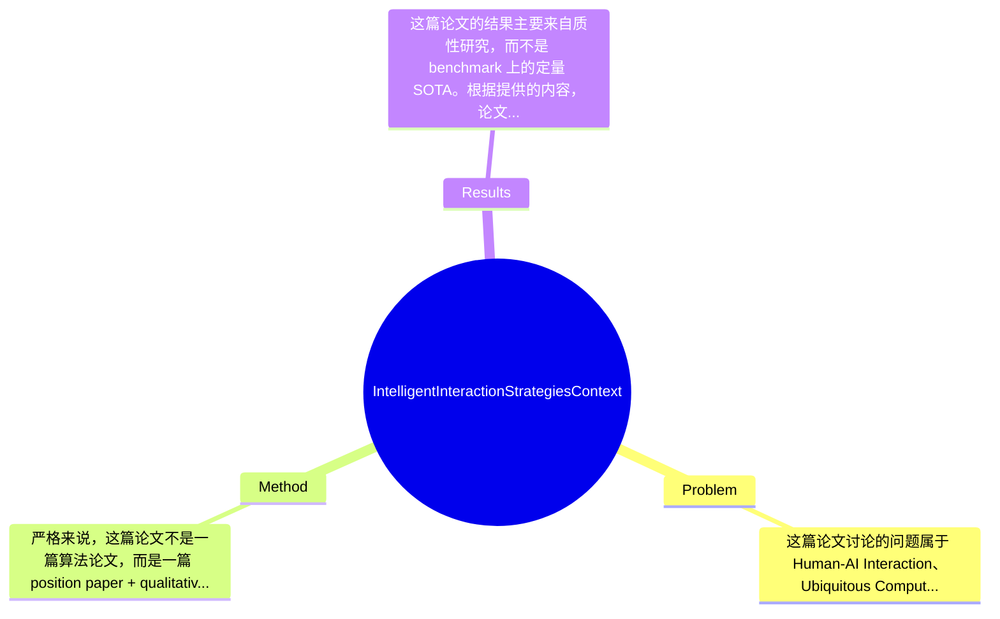

## Summary
该论文关注如何让 LLM 从被动问答工具转变为具备 context-aware 能力的认知增强系统，旨在解决人在复杂多模态环境中信息过载、知识组织困难与决策支持不足的问题；方法上并未提出可复现的算法模型，而是通过 exhibition 场景下的 think-aloud study 提炼出一套 context-aware cognitive augmentation 的设计框架；其主要贡献不是 benchmark 上的性能突破，而是总结出实时情境感知、个性化推理支持与 socially adaptive interaction 的设计原则，为后续系统研究提供方向。

## Problem & Motivation
这篇论文讨论的问题属于 Human-AI Interaction、Ubiquitous Computing 与 LLM-based cognitive augmentation 的交叉领域，核心是：人在真实世界的信息密集场景中，感知到的信息远超可被有效处理、组织和调用的认知容量，因此需要 AI 不只是“回答问题”，而是能根据环境、任务阶段和用户状态主动提供认知支持。这个问题重要，因为很多现实任务——如参观展览、现场学习、会议协作、知识调研、复杂决策——都不是在安静、单轮、纯文本环境中完成的，而是在持续变化的物理和社会情境中展开。若 AI 只能等待用户明确提出完整问题，就无法真正缓解认知负担。论文的现实意义在于，它试图把 LLM 从 desktop chatbot 推向嵌入式、情境化、陪伴式认知助手，为教育、博物馆导览、专业培训、知识工作与辅助决策等场景提供设计启发。现有方法的局限主要有三点：第一，许多 LLM 系统是 reactive 的，只在用户发问后响应，无法在用户尚未意识到信息缺口时主动干预；第二，现有 AI 助手大多基于文本上下文，缺乏对空间位置、社交情境、多模态输入和任务阶段的建模，因此常给出“语义相关但场景不合适”的帮助；第三，认知增强研究常强调记忆外包或信息检索，却较少关注信息从感知、筛选、组织到事后回顾的完整链条。作者提出新框架的动机总体合理：如果认知瓶颈是真实存在的，那么有效辅助必须是 context-aware、阶段自适应且 socially appropriate 的。论文的关键洞察是，认知支持不是单一功能，而应覆盖实时信息理解与事后知识整理两个阶段，并以环境与用户状态变化为触发条件动态切换支持策略。

## Method
严格来说，这篇论文不是一篇算法论文，而是一篇 position paper + qualitative study。其“方法”核心不是训练一个新模型，而是通过 think-aloud study 观察用户在 exhibition 场景中的真实信息处理行为，再将发现抽象为 context-aware cognitive augmentation 的系统框架。整体框架可以概括为：以真实情境中的用户认知活动为中心，结合多模态环境线索、用户信息需求和交互偏好，设计一种能够在实时体验阶段提供轻量、及时、适度干预，并在体验结束后支持知识整理、检索和反思的 LLM-empowered augmentation system。

关键组件可分为以下几部分：

1. 情境感知层（context sensing and interpretation）
   该组件的作用是捕捉用户所在环境及交互状态，例如空间位置、正在接触的展品/信息对象、周围社交环境以及可能的注意力变化。设计动机在于，认知支持是否有效，高度依赖“何时出现、针对什么出现、以什么强度出现”。与传统 chatbot 仅依赖对话历史不同，这里强调 multi-modal context 与 situated interaction。论文未给出具体传感器实现、context fusion 算法或模型结构，因此这一层更多是概念性设计，而非工程细节。

2. 用户认知需求识别（information need and cognitive state inference）
   该组件试图识别用户当前处于信息采集、比较、联想、总结还是决策阶段，以及其面临的是信息过载、记忆衰减还是结构化困难。设计理由是，用户需要的帮助并非总是“更多信息”，有时是摘要、关联、提醒、追问或组织工具。与现有 LLM 助手“统一回答模式”不同，论文强调 support type 需要随任务阶段变化。值得注意的是，论文更多基于 think-aloud study 中观察到的行为模式提出这一点，并未展示可操作化的 cognitive state classifier，因此仍停留在设计原则层。

3. 实时认知支持策略（real-time cognitive support）
   这是论文最核心的交互设想之一。作者认为在现场体验过程中，AI 应提供低打扰、上下文相关的支持，例如帮助提取关键信息、建立展品间联系、解释陌生概念、提醒先前见过的相关内容等。这样设计的原因是，用户在移动和感知驱动场景中没有足够带宽进行复杂显式输入。与现有系统相比，它的差异在于强调 proactive assistance，而非等待用户提出完整查询。论文没有给出提示策略、交互节奏控制算法或触发阈值，这使得“何时主动、何时沉默”成为一个未解决但关键的问题。

4. 事后知识组织与回顾（post-experience knowledge organization）
   论文提出认知增强不能只做现场辅助，还应在体验结束后帮助用户将碎片化感知转化为可检索、可复用的知识结构。该组件可能包括自动摘要、主题聚类、时间线整理、概念图谱构建与后续问答支持。设计动机很清晰：人类在现场获取的是离散片段，真正的学习和决策 often happen after the experience。与单轮问答式 AI 不同，这一部分强调 longitudinal memory support。遗憾的是，论文未说明使用何种记忆表示、知识库结构或 retrieval 机制。

5. 社会适应性交互（socially adaptive interaction）
   论文特别指出，在真实空间中，AI 交互受到社会规范约束，例如不便大声提问、不希望频繁打断同伴交流、在公共空间对设备使用有顾虑。该组件的作用是让 AI 根据社交语境调整交互方式，如选择合适的 modality、时机和粒度。其设计相比传统 HCI 研究更贴近真实使用情境，也是本文相对有价值的观察之一。

技术细节方面，论文几乎没有提供可复现的模型结构、训练数据、loss function、evaluation protocol 或系统实现参数，因此它不是技术实现导向的工作。设计选择中，“情境感知 + 阶段化支持 + 社会适应”看起来是作者认为必须的三根支柱；至于采用何种 sensing 技术、是否需要用户建模、用 rule-based 还是 agent-based orchestration，则都可能有其他方案。就简洁性而言，这一框架在概念上是清楚的，但由于缺少系统化实现，容易给人一种高层设计合理、落地路径模糊的感觉；因此它更像研究议程（research agenda），而非成熟方法。

## Key Results
这篇论文的结果主要来自质性研究，而不是 benchmark 上的定量 SOTA。根据提供的内容，论文在 exhibition setting 中开展了 think-aloud study，并围绕三个方面报告 preliminary findings：一是参与者的信息处理策略（Participants’ Information Processing Strategies），二是 context-aware AI interaction 面临的环境与社会约束（Environmental and Social Constraints），三是参与者对 adaptive AI support 的期待（Participants’ Expectations for Adaptive AI Support）。这些发现支撑了作者提出的 context-aware cognitive augmentation 框架。

但需要明确指出，论文未提及具体 benchmark 名称、测试集、样本量统计结果、定量指标，也没有 accuracy、F1、BLEU、user satisfaction score、task completion time reduction 等具体数字。因此从严格的机器学习论文标准看，这部分证据强度有限。它不是通过标准化 benchmark 证明“方法优于 baseline”，而是通过观察研究说明“现有交互范式无法满足真实场景中的认知支持需求”。

若从 HCI 研究角度评价，核心“实验”可以理解为：第一，观察用户在展览中如何处理多模态信息；第二，分析现场环境和社交因素如何限制 AI 介入；第三，归纳用户希望 AI 在何时以何种方式提供支持。这些结果的价值在于生成设计启示，而非验证某个算法模块的增益。论文也未见消融实验，因为本身没有实现型系统；同样没有 baseline 对比，因为没有部署一个 context-aware AI prototype 与现有 chatbot 正面对照。

实验充分性方面，我认为证据明显不足。缺少的信息包括：参与者人数、人口统计分布、编码方法、inter-rater reliability、是否达到理论饱和、具体任务设计、观察记录如何归纳为设计原则等。也缺少对其他场景的验证，例如会议、课堂、工业巡检等。是否存在 cherry-picking 目前无法确认，因为论文只给出了概括性 findings，未见完整原始材料和反例展示；但由于只呈现支持作者主张的主题，读者应保持谨慎。

## Strengths & Weaknesses
这篇论文的亮点首先在于问题意识准确。它并没有把 LLM 当作万能问答引擎，而是抓住了“真实认知支持发生在动态情境中”这一关键事实，把研究焦点从 response quality 转向 context fit、timing 和 social appropriateness，这是对当前大量静态 benchmark 驱动研究的有益纠偏。第二个亮点是提出了从实时辅助到事后知识组织的连续式认知增强视角，而不是把 AI 支持局限为单轮检索或摘要；这一点对于教育、导览和知识工作都有启发。第三个亮点是强调社会情境约束，说明 AI 介入不仅是技术问题，也是 interaction design 问题。

局限性也很明显。第一，技术层面几乎没有可执行实现，缺乏模型、系统原型、算法流程和工程验证，因此贡献更多是概念框架而非方法突破。第二，适用范围目前主要来自 exhibition 场景，能否推广到高风险决策、专业协作或长期知识工作尚不清楚；展览场景的信息密度、节奏和目标与其他任务差异很大。第三，计算与数据依赖被严重低估：若要实现论文设想，系统需要持续采集位置、视觉、语音、交互历史甚至用户行为线索，这会带来隐私、传感器可靠性、context inference 错误和部署成本问题，但论文未深入讨论。第四，主动式 AI 存在 failure case：误判用户意图、过度打断、在社交场合给出不合时宜提示，反而可能增加 cognitive load。

潜在影响方面，这项工作对 Human-AI Interaction 与 context-aware LLM system 设计有参考价值，尤其适合作为后续原型系统、Wizard-of-Oz study 和 longitudinal deployment 的起点。

已知：论文明确进行了 think-aloud study，并提出 context-aware cognitive augmentation 框架，强调 real-time support、post-experience organization 与 socially adaptive interactions。推测：作者未来可能希望将该框架实现为 wearable 或 mobile-based multimodal assistant，并结合 LLM memory、retrieval 和 context sensing。未知：具体参与者规模、编码流程、系统实现、定量效果、隐私保护机制、跨场景泛化能力，论文均未充分说明。

## Mind Map

## Notes
<!-- 其他想法、疑问、启发 -->
