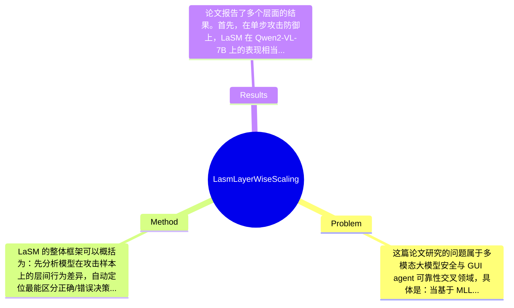

## Summary
论文聚焦 GUI agents 在 pop-up 环境注入攻击下易被恶意视觉元素劫持注意力的问题，提出无需 retraining 的 LaSM（Layer-wise Scaling Mechanism），通过自动定位关键层并对 attention 与 MLP 进行选择性层级缩放来恢复任务相关区域的 saliency。实验显示，LaSM 在 Qwen2-VL-7B 上将 overlay injection 下平均 defense success rate 提升到 74.8%、inductive injection 下提升到 61.1%，与 CoT alerts 结合可达 99.3%，在 LLaVA-v1.6-Vicuna-13B 上甚至达到 100.0%，同时对正常能力影响很小。

## Problem & Motivation
这篇论文研究的问题属于多模态大模型安全与 GUI agent 可靠性交叉领域，具体是：当基于 MLLM 的图形界面智能体在真实屏幕环境中执行点击、输入、导航等操作时，攻击者可以插入 pop-up、overlay 或语义诱导型弹窗，使模型把注意力错误转移到恶意区域，从而做出偏离用户意图的动作。这个问题非常重要，因为 GUI agent 不只是做问答，而是直接作用在设备界面上，一旦被劫持，后果可能是误点广告、泄露隐私、授权恶意操作，甚至完成错误交易。现实意义很强：未来桌面自动化、手机助理、网页操作 agent 都可能面对开放环境，而开放环境里的弹窗恰恰最容易被操控。

现有方法有几个具体不足。第一类是 retraining-based defense，例如 reinforcement fine-tuning 或 preference optimization，虽然可能提升鲁棒性，但需要构建大量带攻击的数据并重新训练，部署成本高，对已有闭源/大模型系统不友好。第二类是 prompt-level alerts，如在输入中加入安全提醒或 CoT reasoning，希望模型“谨慎处理”弹窗，但这类方法对 inductive pop-up 尤其脆弱：如果恶意弹窗文本本身与任务目标高度相关，模型仍会被表面语义牵引。第三，更深层的问题是现有方法大多把模型当 black box，只调输入或再训练，却没有解释 vulnerability 的内部机制，因此泛化边界不清楚。

论文动机是：如果脆弱性核心在于 attention/saliency 在某些层发生系统性偏移，那么或许不需要重新训练，只需在关键层上做结构化干预，就能把模型拉回到正确关注区域。这个动机是合理的，因为 GUI 决策高度依赖视觉 grounding，而 layer-wise 表征在多模态模型中本就承担从局部视觉到高层语义聚合的不同角色。论文的关键洞察是发现“正确输出与错误输出之间存在 layer-wise attention divergence pattern”，尤其是中层语义层更具判别性；据此提出在局部关键层同时放大 attention 和 MLP，而不是全局统一缩放，从而以较低代价修复注意力错位。

## Method
LaSM 的整体框架可以概括为：先分析模型在攻击样本上的层间行为差异，自动定位最能区分正确/错误决策的关键层区间；随后在推理时仅对这些层的 attention 和 MLP 模块施加适度缩放，使模型对任务相关区域的 saliency 回升，同时尽量不扰动其他层的正常语义整合过程。它是 post-training、plug-and-play 的防御机制，不要求额外训练，也不依赖特定 backbone。

关键组件可分为以下几部分：

1. 关键层定位（progressive range-narrowing search）
   这一模块的作用是自动找出“该干预哪些层”。作者不是对所有 Transformer block 一视同仁，而是通过渐进式缩小搜索范围，寻找最具判别力的层段。设计动机在于：不同深度承担的功能不同，低层偏视觉局部模式，中层偏跨模态语义绑定，高层偏任务聚合与最终决策；若盲目全层放大，可能把噪声也一起增强。与现有黑盒 defense 不同，LaSM 明确把层深作为干预维度，属于一种白盒/灰盒式结构利用。

2. Layer-wise attention scaling
   该组件直接对关键层中的 attention 模块输出进行缩放，目标是增强模型对真正任务相关 token/区域的关注，使被 pop-up 劫持的注意力重新回流到主任务区域。设计理由是攻击本质上先表现为 saliency 偏移，因此 attention 是首要干预点。与 prompt defense 相比，这种做法不依赖语言提醒模型“自己小心”，而是直接修改内部计算路径。论文还指出高层 attention 过度放大会伤害高层语义聚合，因此缩放是 selective 而非 uniform 的。

3. Layer-wise MLP scaling
   仅调 attention 不够，因此作者进一步对同一关键层的 MLP 激活也进行联合缩放。其作用是强化这些层中已经被修正后的语义表征，使 attention 回正后的信息能在前馈网络中被充分保留和放大。设计动机很关键：Transformer block 中 attention 负责信息路由，MLP 负责特征变换与记忆更新；只调一路，另一路可能仍把错误偏置继续传播。与很多只看 attention map 的分析工作不同，LaSM 明确把 MLP 也纳入安全干预对象。

4. 联合缩放策略（joint scaling）
   论文的重要发现是 attention-only 或 MLP-only 都不足，甚至会降低 robustness；必须联合缩放两者，效果才稳定。这说明攻击不是单一模块失灵，而是 block 内部的路由与表征共同偏移。技术上可以理解为在关键层内对两个子模块使用统一或协调的系数 α，文中给出较优范围接近 α≈1.1。这个系数很小，说明作者并不是暴力重写模型行为，而是进行轻量 nudging。

5. 训练无关的推理时部署
   LaSM 最大特点之一是无需 additional training。实现上，它更像 inference-time intervention：加载已有 GUI agent/MLLM，在前向传播的指定层插入缩放操作即可。这样设计的价值在于低部署成本、可快速嫁接到现有系统。与 retraining-based robustification 相比，它对数据和算力要求显著更低，也更适合闭源模型的有限修改场景——当然前提是能访问足够细的层级接口。

技术细节上，从论文摘录可知作者主要基于 attention divergence 分析来驱动层选择，并通过 sensitivity study 发现模型特定的窄系数区间最优，尤其是中层 semantic layers 更“安全关键”。设计上，关键且必要的部分包括：只干预局部层、attention+MLP 联合、适度而非大幅缩放。可能存在其他选择，例如使用 gating、residual reweighting、head-wise scaling、token-level masking，甚至借助 external detector 先定位 pop-up 区域；但作者选择的是最简单可插拔的 layer-wise scalar 方案。

从简洁性看，这个方法总体是相对优雅的：没有引入新模型、没有 adversarial retraining、没有复杂外部模块，核心就是“找对层，再轻微放大”。不过它也带有一定经验性调参色彩，尤其层范围搜索和 α 选择可能需要模型特定适配，因此虽不算过度工程化，但也还没有达到完全 parameter-free 的程度。

## Key Results
论文报告了多个层面的结果。首先，在单步攻击防御上，LaSM 在 Qwen2-VL-7B 上的表现相当突出：在 overlay injection 场景下，平均 defense success rate 提升到 74.8%；在更难的 inductive injection 场景下达到 61.1%。进一步地，当 LaSM 与 CoT alerts 组合时，防御成功率达到 99.3%，说明它与 prompt-level defense 具有互补性，而不是简单替代关系。更强的是，在 LLaVA-v1.6-Vicuna-13B 上，论文声称 LaSM alone reaches 100.0% across all settings，表明该机制在另一 backbone 上也可能非常有效。

其次，在多步 GUI 控制任务中，作者测试了 AndroidControl episodes。这里使用的核心指标是 TSR（通常可理解为 task success rate）。论文给出的数字是：LaSM 将 TSR 从 18.75% 提升到 30.36%。考虑到多步任务中单步错误会累积放大，这个提升说明防御不是只在 isolated example 上有效，而对长程交互也有实用价值。同时作者强调 action type 和 grounding accuracy 只有 negligible changes，说明正常行为模式没有被明显破坏。

消融实验方面，论文给出几个关键结论：第一，中层 semantic layers 最值得放大，而最高层放大会损害高层语义聚合；第二，attention 与 MLP 必须 joint scaling，单独缩放任一组件都会降低 robustness；第三，缩放系数存在较窄的模型特定最优区间，接近 α≈1.1。虽然摘录中没有给出完整消融表格数字，但这些结论支持了其 architectural rationale。

实验充分性上，优点是覆盖了不同攻击类型（overlay、inductive）、不同 backbone（Qwen2-VL-7B、LLaVA-v1.6-Vicuna-13B）和多步任务（AndroidControl）。不足是：论文摘录未展示更广泛 benchmark 名称、样本规模、方差或置信区间；也未看到对更多 GUI agent framework、更多 closed-source VLM、不同分辨率/弹窗大小的系统测试。是否存在 cherry-picking 不能下定论：已知作者展示了 benign performance 保持与多模型结果，这是正面信号；但由于全文细节未完整给出，目前无法确认是否也系统报告了失败案例和极端攻击条件。

## Strengths & Weaknesses
这篇论文的亮点首先在于，它没有停留在“多加安全提示”或“重新训一遍”这两个常见套路，而是把 GUI agent 的 vulnerability 归因到内部的 attention misalignment，并进一步细化为 layer-wise divergence pattern。这种从机制分析到防御设计的链条比较完整。第二，LaSM 的工程形式很有吸引力：training-free、plug-and-play、backbone-agnostic，实际部署门槛远低于 adversarial fine-tuning。第三，它不是只改 attention，而是提出 attention+MLP 的联合干预，这个点体现出对 Transformer block 内部功能分工的理解，也被消融结论支持。

但局限也很明确。第一，方法依赖可访问模型中间层并能插入缩放，因此对真正封闭 API 式 MLLM 未必适用；所谓 backbone-agnostic 更准确地说是“对开放权重 Transformer-like backbone 相对通用”。第二，缩放系数和关键层范围似乎具有 model-specific 特性，论文虽有自动搜索，但这意味着迁移到新模型时仍需额外校准，不能保证零成本泛化。第三，LaSM 的防御对象主要是 pop-up/overlay 类视觉注入，对其他更隐蔽的攻击如 instruction injection、OCR-level adversarial text、跨步策略诱导，效果论文摘录中未证明。第四，从机制上说，它是在“把注意力拉回来”，如果恶意 pop-up 本身与任务区域高度重叠、或者攻击利用真实可交互控件伪装而非单纯显著性干扰，LaSM 的收益可能受限，这是合理推测。

潜在影响方面，这项工作对 GUI agent 安全研究有两层贡献：一是提示研究者不要只做输入端防御，而要重视中间层表征纠偏；二是为 post-hoc alignment/robustness 提供了低成本范式，未来可拓展到 VLM、web agent、embodied agent 的其他环境注入问题。

严格区分信息来源：已知——论文明确声称在 Qwen2-VL-7B、LLaVA-v1.6-Vicuna-13B、AndroidControl 上取得显著提升，且 joint scaling 优于单独缩放。推测——LaSM 可能对其它基于 Transformer 的 GUI agent 有一定迁移性，也可能对某些视觉诱导攻击有效，但需重新调参。 不知道——完整 benchmark 列表、样本数量、统计显著性、推理延迟开销、对闭源模型适用性、以及在更复杂真实世界攻击中的 failure cases，摘录中均未充分说明。

## Mind Map

## Notes
<!-- 其他想法、疑问、启发 -->
