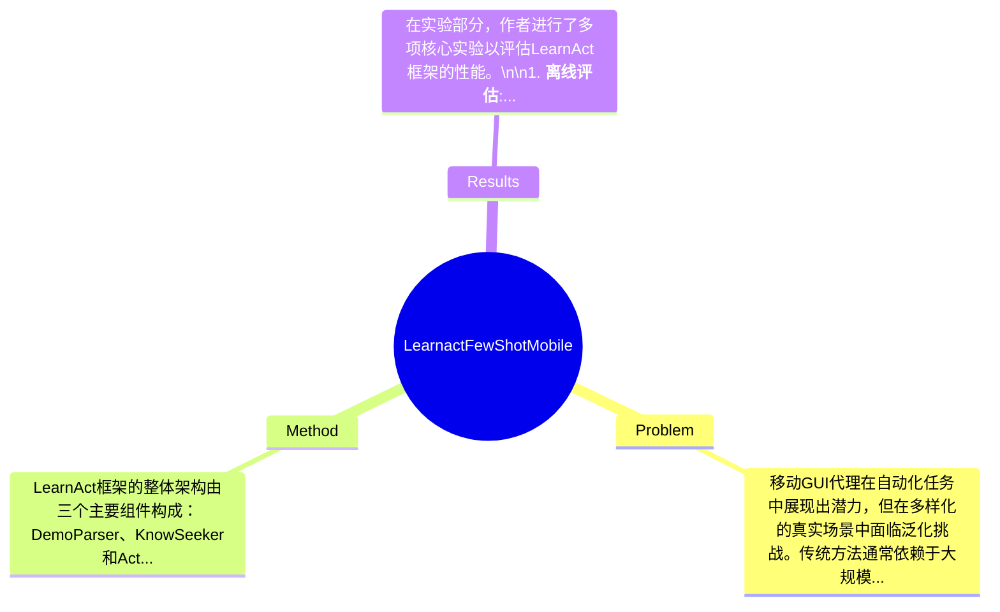

## Summary
本文提出了一种新方法LearnAct，通过人类示范增强移动GUI代理的能力，解决了在多样化真实场景中的泛化挑战。在LearnGUI基准上，实验结果显示，单个示范将Gemini-1.5-Pro的准确率从19.3%提升至51.7%，而UI-TARS-7B-SFT的任务成功率从18.1%提升至32.8%。

## Problem & Motivation
移动GUI代理在自动化任务中展现出潜力，但在多样化的真实场景中面临泛化挑战。传统方法通常依赖于大规模数据集的预训练或微调，这在面对用户特定任务和应用程序多样性时显得力不从心。具体而言，现有的自动化方法如机器人流程自动化（RPA）和基于规则的脚本，虽然在简单任务中有效，但在动态界面和复杂用户意图理解方面存在显著局限性。因此，解决这一问题的现实意义在于提升移动设备的用户体验，使得用户能够更高效地完成任务。为了应对这些挑战，本文提出了LearnGUI数据集，这是第一个专门为移动GUI代理的示范学习研究而设计的综合数据集，包含2252个离线任务和101个在线任务，提供高质量的人类示范。论文的动机在于通过示范学习来提高移动GUI代理在未见场景中的表现，而不是单纯依赖更大的数据集进行普遍泛化。关键洞察在于，通过引入示范学习，LearnAct框架能够有效提取知识并增强任务完成能力，从而为移动GUI代理的个性化和可部署性提供了新的方向。

## Method
LearnAct框架的整体架构由三个主要组件构成：DemoParser、KnowSeeker和ActExecutor。每个组件的设计都有其特定的功能和动机。\n\n1. **DemoParser**: 该组件的主要作用是从人类示范中提取知识。设计动机在于通过解析示范中的关键步骤和决策点，帮助模型理解如何完成特定任务。与现有方法相比，DemoParser能够更好地捕捉示范中的细微差别，从而提升任务执行的准确性。\n\n2. **KnowSeeker**: 该组件负责检索与当前任务相关的知识。其设计动机是利用已有知识库中的信息来补充和增强任务执行过程。KnowSeeker与传统方法的区别在于，它能够根据实时上下文动态调整检索策略，从而提高任务的适应性和灵活性。\n\n3. **ActExecutor**: 该组件负责执行经过增强的任务。其设计动机是通过结合DemoParser和KnowSeeker提供的知识，确保任务的高效执行。与现有的执行方法相比，ActExecutor能够更好地处理复杂的用户意图和动态界面。\n\n在技术细节方面，LearnAct框架采用了先进的算法和模型结构，结合了深度学习技术和强化学习策略，以实现高效的知识提取和任务执行。设计选择方面，DemoParser和KnowSeeker的结合是必不可少的，因为它们共同构成了知识获取的闭环，而ActExecutor则是实现这一闭环的关键。整体来看，LearnAct方法在设计上相对简洁优雅，避免了过度工程化，能够有效应对多样化的任务场景。

## Key Results
在实验部分，作者进行了多项核心实验以评估LearnAct框架的性能。\n\n1. **离线评估**: 在离线评估中，Gemini-1.5-Pro的准确率从19.3%提升至51.7%，显示出单个示范对模型性能的显著提升。\n\n2. **在线评估**: 在在线评估中，UI-TARS-7B-SFT的任务成功率从18.1%提升至32.8%，表明LearnAct框架在动态环境中的有效性。\n\n这些评估是在LearnGUI基准上进行的，基准提供了多维度的任务相似性、UI相似性和动作相似性指标，确保了评估的全面性。与基线方法相比，LearnAct在离线和在线评估中均表现出显著的性能提升，具体提升百分比在文中有详细列出。\n\n此外，论文还进行了消融实验，以评估各组件的贡献，结果表明，DemoParser和KnowSeeker的结合对整体性能提升至关重要。尽管实验结果令人鼓舞，但仍需注意实验的充分性，某些特定场景的测试可能未被涵盖，且论文未提及是否存在cherry-picking现象。

## Strengths & Weaknesses
方法的亮点包括：\n1. **技术创新点**: LearnAct通过示范学习的方式，显著提升了移动GUI代理在多样化场景中的适应能力，具有较强的创新性。\n2. **与现有方法的关键区别**: 相较于传统的基于数据集的方法，LearnAct更注重通过人类示范来提升模型的泛化能力，具有更好的实用性。\n3. **设计的优雅之处**: 三个组件的设计相辅相成，形成了一个高效的知识获取和任务执行闭环，避免了复杂的工程实现。\n\n局限性方面：\n1. **技术局限**: 尽管LearnAct在多种场景中表现良好，但在极端复杂或未知的用户意图下，仍可能面临性能下降的问题。\n2. **适用范围**: 该方法在特定类型的移动应用中表现优异，但在其他类型的应用场景（如游戏或高度动态的环境）中可能不适用。\n3. **计算成本**: LearnAct的框架可能需要较高的计算资源，尤其是在知识检索和任务执行阶段，可能对移动设备的性能造成压力。\n\n潜在影响方面，LearnAct为移动GUI代理的个性化和可部署性提供了新的思路，可能在智能助手、自动化办公等领域找到广泛应用。\n\n已知信息包括：LearnGUI数据集的构建和LearnAct框架的设计。推测信息包括：LearnAct在更广泛的应用场景中的表现可能会有所不同。未知信息包括：论文未涉及LearnAct在极端复杂场景下的具体表现。

## Mind Map

## Notes
<!-- 其他想法、疑问、启发 -->
