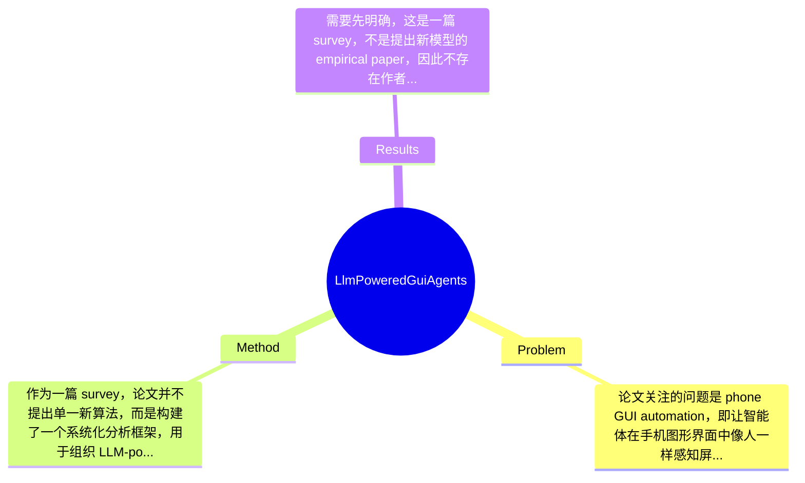

## Summary
这篇论文系统综述了 LLM-powered phone GUI agents 这一新兴方向，试图回答“如何用 LLM/VLM 将自然语言用户意图映射为手机界面上的感知、规划与执行动作”这一问题；方法上，作者提出了一个覆盖 agent framework、建模范式、训练策略、数据集与 benchmark 的结构化 taxonomy，并梳理了 prompt engineering、supervised fine-tuning、reinforcement learning 等路线；作为 survey，其主要贡献不是刷新某个 benchmark 数字，而是总结了领域进展、识别关键瓶颈，并提出未来研究议程。

## Problem & Motivation
论文关注的问题是 phone GUI automation，即让智能体在手机图形界面中像人一样感知屏幕、理解用户指令并执行点击、滑动、输入等操作。这一问题属于 mobile agent、GUI grounding、multimodal reasoning 与 embodied AI 的交叉领域。它的重要性很高，因为手机是现实世界最常用的计算平台之一，大量真实任务——如订票、点餐、表单填写、设置调整、跨 App 工作流执行——都依赖 GUI 交互。如果系统能直接操作现有 App，而不需要开发专门 API，就具备很强的通用自动化价值。现实层面，它可用于个人助理、无障碍辅助、自动测试、企业流程自动化以及端侧智能助手。论文指出，传统脚本式自动化的主要问题至少有三类：第一，泛化性差，界面布局、语言、分辨率或版本一变化，脚本就失效；第二，维护成本高，需要人工录制、更新 selector 或规则，难以扩展到开放世界任务；第三，意图理解弱，只能执行预定义流程，无法真正理解“帮我把这张图发给妈妈”这类高层目标。作者提出新综述的动机是：LLM 与 VLM 的出现，使系统能够通过自然语言理解、视觉-文本 grounding、长程规划与决策来缓解上述瓶颈，但该方向论文快速增长、范式分散、评测标准不统一，研究者缺少统一地图。这个动机总体合理，而且是 survey 的典型价值所在。其关键洞察在于：phone GUI agent 不是单纯的 NLP 或 CV 问题，而是一个从用户意图到 GUI action sequence 的闭环系统，因此必须联合讨论 agent architecture、prompt/training 范式、数据、评测和部署约束，而不能只看单个模型模块。

## Method
作为一篇 survey，论文并不提出单一新算法，而是构建了一个系统化分析框架，用于组织 LLM-powered phone GUI agents 的设计空间。整体上，作者将该领域拆解为“agent framework—modeling approach—training strategy—dataset/benchmark—open challenge”五层结构：先从系统级 agent 形态出发，再讨论底层模型如何表示 GUI 与语言、如何训练、用什么数据评测，最后回到真实部署中的效率、安全与个性化问题。这种写法的优点是适合初学者建立全景认知，也便于研究者定位具体创新点。

1. Agent framework taxonomy：论文首先按智能体组织方式划分为 single-agent、multi-agent、plan-then-act 等框架。single-agent 把感知、理解、决策、执行集中到一个模型或一个主控流程中，优点是实现简单、时延较低，但容易在长任务中累积错误。multi-agent 则把任务拆给 planner、perceiver、executor、critic 等角色，设计动机是通过模块分工缓解单模型上下文拥塞并提升可解释性；与传统脚本系统不同，这里各模块之间依靠自然语言或结构化消息交互。plan-then-act 强调先生成高层计划，再逐步执行 GUI action，适用于长程任务和多步依赖场景，其区别于直接 reactive policy 的地方在于显式中间计划可以提高稳定性，但也可能引入规划误差传播。

2. Modeling approaches：作者将方法分为 prompt engineering 与 training-based 两大路线。prompt engineering 主要依赖强大的 foundation model，通过设计系统提示词、action schema、screen description format、few-shot exemplars 来诱导模型完成 grounding 和 action prediction。其好处是开发快、数据需求低，尤其适合快速验证新 agent pipeline；但局限是输出不稳定、对提示词敏感、可复现性较弱。training-based 则通过 supervised fine-tuning、instruction tuning 或专门的 GUI-grounded pretraining 学习从屏幕状态到动作序列的映射。与纯 prompt 方法相比，这条路线通常更稳定，也更适合固定任务域，但标注成本和训练成本更高。

3. Perception and grounding pipeline：虽然提取文本中未完整展开每个实现细节，但从摘要可知论文强调 multimodal perception。也就是说，phone GUI agent 通常需要联合利用 screenshot、OCR text、view hierarchy、icon/image region、历史动作与用户指令。该组件的作用是把像素级界面转化为模型可推理的结构化表示。设计动机是手机 GUI 并不总能仅靠文字理解：图标、位置关系、弹窗遮挡、滚动状态都很关键。与早期仅基于 DOM/view tree 或模板匹配的方法不同，LLM/VLM 路线更强调视觉语义与自然语言对齐，从而提高开放环境适应性。

4. Training strategies：论文特别点出 supervised fine-tuning 与 reinforcement learning。SFT 的核心作用是把人类演示或高质量轨迹蒸馏到模型中，学习“给定指令与当前界面，下一步应该做什么”。RL 的作用则是在长期任务中优化成功率、减少无效操作，并桥接 sparse reward 与真实交互闭环。设计动机在于：GUI 自动化本质上是 sequential decision-making，仅靠静态 imitation 容易在分布外状态崩溃。与传统 RPA 规则库不同，RL 允许 agent 从试错中优化策略，但其挑战在于 reward 设计、训练环境构建和安全探索。

5. Datasets and benchmarks layer：作者将数据与评测纳入 taxonomy，而不是视作附属内容，这一点很重要。原因是该领域最大的瓶颈之一正是缺乏统一、充分、多样的数据覆盖；不同论文使用不同任务集、不同 Android 环境、不同成功率定义，导致横向比较困难。把 benchmark 纳入方法框架，体现出作者认为“评测协议本身就是研究对象”。

从设计选择看，这篇 survey 的框架总体简洁而不失完整，重点抓得比较准：agent 架构、建模方式、训练策略、数据评测、部署挑战几乎覆盖了该方向的主要变量。它不算过度工程化，但也存在 survey 常见问题：分类较为宏观，边界有时会重叠，例如某些系统同时属于 multi-agent、plan-then-act 与 training-based；此外，不同论文的真实差异可能被 taxonomy 抽象掉。总体而言，这一综述框架是清晰且有实用价值的。

## Key Results
需要先明确，这是一篇 survey，不是提出新模型的 empirical paper，因此不存在作者自己在某个 benchmark 上“达到 SOTA xx%”的核心实验结果。用户提供的摘录中也没有列出具体 benchmark 名称、指标表格、数值对比或消融实验数据，因此任何精确数字都无法从当前材料可靠恢复，必须标注为“论文未提及”。从摘要和结论可确认的结果主要是结构性结论，而非单点实验结论：第一，作者系统梳理了 LLM-powered phone GUI agents 的研究谱系，覆盖 single-agent、multi-agent、plan-then-act 等框架；第二，总结了 prompt engineering 与 training-based 两类主流建模路线，以及 supervised fine-tuning、reinforcement learning 等训练策略；第三，归纳了该方向面临的关键挑战，包括 dataset diversity、on-device deployment efficiency、user-centric adaptation、security/privacy 等。

如果从“survey 的结果”角度理解，其最核心产出是一个组织框架和研究地图，而不是某一实验胜负。论文声称介绍并评估了最新 datasets 与 benchmarks，但在当前提供文本中，具体 benchmark 详情、测试任务数、成功率、平均步数、错误率、跨 App 泛化指标等数值均未提及。也看不到作者是否对不同论文使用统一标准做了再比较，因此无法判断是否存在严格意义上的 apples-to-apples 对比。消融实验方面，作为综述通常也不会有传统意义的模型组件消融；如果论文内部有对 taxonomy 维度的案例分析，当前摘录同样未提供。批判性地看，这类 survey 常见问题是：会大量引用已有工作进展，但若缺少统一表格、统一定义或 meta-analysis，就容易变成“论文列表式综述”。从目前材料看，作者至少意识到了 benchmark 不统一这一问题，但是否真正提供了足够细的 quantitative synthesis，论文摘录无法证明。关于 cherry-picking，也无法直接下结论；已知的是作者讨论了 open challenges，说明并非只强调乐观结果，但是否系统呈现负面结果、failure cases 和鲁棒性退化曲线，论文摘录未提及。

## Strengths & Weaknesses
这篇论文的第一大亮点是选题及时且具有聚合价值。LLM-powered phone GUI agents 是 2024-2025 年快速升温的交叉方向，论文数量增长快、术语混乱、系统形态分散，这种时候一篇结构清晰的 survey 能显著降低入门门槛。第二个亮点是 taxonomy 设计比较合理：作者不是只从模型角度分类，而是同时覆盖 agent framework、建模范式、训练策略、数据与 benchmark、以及部署与安全问题，这比单纯“按论文时间线排列”更有分析力。第三个亮点是作者没有把问题过度理想化，而是明确指出 dataset diversity、端侧效率、用户适配与 security/privacy，这说明其视角不止停留在 demo-level agent，而是关注真实落地。

局限性也比较明显。第一，作为 survey，它的价值高度依赖覆盖范围与比较深度；从给定摘录看，作者提出“definitive reference”这一表述略显激进，因为该领域变化极快，且 arXiv survey 的稳定性与系统性往往不如顶会 tutorial 或长期维护的 living review。第二，taxonomy 虽然清楚，但可能过于宏观，无法充分揭示一些关键技术分歧，例如 GUI grounding 到底更依赖 screenshot 还是 accessibility tree、action space 如何设计、closed-loop error recovery 如何实现等。第三，论文强调 LLM 的赋能作用，但潜在地存在技术乐观倾向：并非所有 phone automation 问题都适合用大模型解决，许多高频、强约束、低延迟任务也许仍然更适合 rule-based 或 hybrid pipeline；这一边界若讨论不足，会让读者误以为 LLM 是通用答案。

潜在影响方面，这篇论文对研究社区的主要贡献是建立共同语言和问题拆解框架；对工业界的意义则在于帮助团队识别“从 demo 到产品”中真正困难的部分，比如安全、隐私、端侧算力和个性化。

已知：论文明确综述了 LLM phone GUI agents 的演进、taxonomy、训练策略、数据 benchmark 和未来挑战。推测：论文很可能整理了代表性工作表格并比较不同系统设计，但当前摘录未展示。 不知道：具体 benchmark 数字、是否提供统一 quantitative comparison、是否系统分析 failure cases、是否包含严格纳排标准与文献检索协议，这些在当前材料中都无法确认。

## Mind Map

## Notes
<!-- 其他想法、疑问、启发 -->
