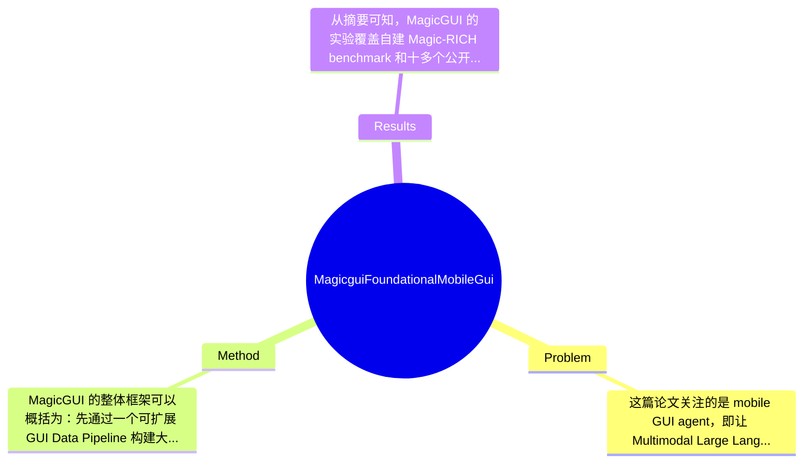

## Summary
MagicGUI 针对移动端 GUI agent 在 perception、grounding 和 long-horizon reasoning 上的瓶颈，提出了一个以大规模 GUI 数据管线、统一 action space、planning-oriented reasoning 和两阶段训练（7.8M continue pre-training + reinforcement fine-tuning）为核心的端到端 foundational mobile GUI agent；论文声称其在自建 Magic-RICH benchmark 以及十多个公开 benchmark 上取得了优于已有方法的结果，并表现出较好的泛化与部署潜力。

## Problem & Motivation
这篇论文关注的是 mobile GUI agent，即让 Multimodal Large Language Model/MLLM 直接理解手机屏幕、定位 UI 元素、分解用户指令并执行点击、输入、滑动等操作的问题。该问题属于 multimodal agent、GUI automation 与 embodied digital interaction 的交叉领域。它的重要性很高，因为相比纯文本任务，真实移动端环境存在界面风格差异大、元素密集、状态变化快、任务链条长等特点，模型不仅要“看懂”屏幕，还要“知道下一步做什么”，并且需要把抽象意图映射成精确空间动作。现实中，这类能力可用于智能助手、无障碍辅助、自动化测试、企业流程自动执行以及端侧个人生产力工具。

现有方法主要有两类局限。第一类是 pipeline-based GUI system，依赖 OCR、DOM/XML、专门 grounding 模块、外部规划器和 memory 模块拼装，优点是可控，但系统高度脆弱：任一子模块出错都会级联失败，而且对环境假设较强，跨 App、跨风格、跨语言时可扩展性差。第二类是 end-to-end GUI agent，虽然更统一，但经常受限于训练数据规模不足、标注噪声大以及 GUI 场景覆盖有限，导致 perception 和 grounding 不稳定，尤其在小目标、密集控件、复杂页面迁移时容易失效。此外，很多工作在 reasoning 上更像“直接预测一步动作”，缺少对复杂任务显式分解与中间计划表达。

因此，作者提出 MagicGUI 的动机是合理的：如果要做“foundation-level”移动 GUI agent，就必须同时解决数据规模与质量、感知对齐、动作表达以及强化学习优化四个层面的问题。论文的关键洞察在于，不把 GUI agent 仅视为 instruction-following，而是视为一个需要大规模 GUI-centric multimodal data、细粒度 spatial grounding、统一动作建模和 planning-aware optimization 协同支持的系统问题。这个视角是有说服力的，也比单纯堆模型参数更符合 GUI 场景的实际需求。

## Method
MagicGUI 的整体框架可以概括为：先通过一个可扩展 GUI Data Pipeline 构建大规模、多来源、高覆盖的 GUI-centric multimodal dataset；再围绕 perception、grounding、action modeling 与 planning reasoning 设计统一训练任务；随后采用两阶段训练，先进行 7.8M 样本的 continue pre-training 强化基础 GUI 理解能力，再通过带有 spatially enhanced composite reward 的 reinforcement fine-tuning 优化决策执行，最终得到一个可直接在移动 GUI 环境中感知、推理和操作的端到端 agent。整体上，它试图同时解决“看不清、指不准、想不明白、做不稳定”四类问题。

1. GUI Data Pipeline 与大规模数据构建
- 该组件的作用是为模型提供足够丰富的 GUI 感知与交互监督。作者强调数据来自 open-source repositories、automated crawling 和 targeted manual annotation，多源融合以覆盖更多 App 类型、页面风格和任务分布。
- 这样设计的动机很明确：GUI agent 的上限高度依赖数据分布，而现有公开数据集往往规模有限、语言单一或标签噪声较高，难以支撑 foundation model 级别泛化。
- 与现有方法相比，MagicGUI 不只收集 trajectory，还强调 unified annotation framework，同时覆盖 perception 和 interaction 任务，这意味着模型不仅学“下一步动作”，也学“界面理解、元素指代与 grounding”。这一点更接近通用 GUI 基座模型思路。

2. Enhanced perception and grounding
- 该组件的核心作用是提升模型对屏幕内容、元素位置、文本与视觉区域之间关系的细粒度理解，使其能完成 UI element referencing、grounding 和 screen comprehension。
- 设计动机来自 GUI 场景的特殊性：元素往往很小、布局密集、文本短且语义依赖上下文，仅靠一般 VLM 的粗粒度图文对齐并不够。
- 与已有通用 VLM 相比，MagicGUI 更强调 fine-grained multimodal alignment，说明作者把 GUI grounding 视为第一类能力，而非普通 caption/QA 的附属能力。不过从给定摘要看，具体采用了何种位置编码、区域表示或坐标离散化策略，论文摘录中未提及，因此只能确认目标而无法完整复现细节。

3. Unified action space
- 该组件负责把 agent 输出统一到一个覆盖基础 UI 操作与复杂 interactive intents 的动作体系中。基础操作应包括 click/tap、type、swipe 等；复杂 intent 则可能将多步人机交互抽象为更高层动作，但具体定义论文摘录未完全展开。
- 设计动机是减少不同 benchmark、不同系统接口之间动作表示不一致的问题，让同一模型能在多种 GUI agent 任务上共享表示。
- 相比许多工作只做 point-and-click 或 tokenized action prediction，统一 action space 的优点是更利于跨任务迁移，也更适合做 reinforcement fine-tuning，因为 reward 可以直接作用于统一接口。

4. Planning-oriented reasoning mechanism
- 该组件的作用是让模型在复杂用户指令下先形成 sequential actions 的分解，并显式给出 intermediate meta-plan reasoning。也就是说，模型不只是“看到当前屏幕然后做一步”，而是尝试建立任务层面的计划结构。
- 设计动机在于移动端任务普遍是 long-horizon 的，例如登录、检索、筛选、填写、跳转、确认等链式操作，如果没有显式 plan，模型容易在中间界面偏航。
- 与只做单步 imitation 的方法不同，MagicGUI 将 reasoning 纳入训练目标，这种设计更接近近期 agent 领域对“plan-then-act”范式的追求。但也要看到，显式 meta-plan 可能增加推理长度与错误传播风险，论文是否比较了有无显式 planning 的 latency 与稳定性，摘录中未提及。

5. Two-stage training: continue pre-training + reinforcement fine-tuning
- 第一阶段是基于 7.8M 样本的 continue pre-training，重点学习 GUI domain knowledge、screen understanding、grounding 与 action-language alignment。第二阶段是 reinforcement fine-tuning，用 spatially enhanced composite reward 和 dual filtering strategy 进一步提升策略质量。
- 这种设计的动机很合理：GUI agent 需要先有“静态理解”能力，再通过交互式优化获得“动态决策”能力；单靠 supervised learning 往往会受 teacher forcing 影响，执行时误差累积明显。
- 强化学习部分是论文较值得关注的地方。所谓 spatially enhanced composite reward，按字面理解应当同时考虑任务完成度与空间动作准确性，例如点击位置与目标区域重合程度，但具体 reward 分解、权重、训练算法（PPO、GRPO 或其他）在摘录中未说明。dual filtering strategy 说明作者也意识到 RL 数据质量和 reward hacking 问题，尝试在样本层面做双重筛选，这比直接用所有 rollout 更务实。

总体评价上，这个方法框架是相对完整而系统化的，不是单一 trick，而是“数据—表示—动作—规划—训练”全链路设计。优点是覆盖了 GUI agent 的关键短板；缺点是工程成分较重，很多提升可能来自大规模数据和系统调参协同，而不一定完全归因于某个明确、简洁的核心算法创新。从研究风格看，它更像一篇 foundation system paper，而不是一个极简、理论性很强的方法论文。

## Key Results
从摘要可知，MagicGUI 的实验覆盖自建 Magic-RICH benchmark 和十多个公开 benchmark，并声称在 GUI perception 与 agent tasks 上都取得 superior performance，同时展示了较强 generalization 和真实部署潜力。但需要非常明确指出：由于用户提供的正文摘录中没有完整实验表格，绝大多数 benchmark 名称、评价指标和具体数值在当前材料中“论文摘录未给出”，因此不能捏造具体数字。

已知的核心实验结论主要有三点。第一，作者在 proprietary Magic-RICH benchmark 上报告了 competitive / superior performance，说明他们不仅在公开数据上调参，而是尝试构建更接近真实移动场景的评测集。第二，公开 benchmark 数量超过十个，覆盖 GUI perception 与 agent tasks 两大类，这意味着评测范围不是单一任务，而是同时衡量 screen understanding、element grounding、instruction following 与 environment interaction。第三，两阶段训练被认为对性能有关键帮助，其中 continue pre-training 建立基础 GUI 能力，reinforcement fine-tuning 则进一步提升执行鲁棒性与泛化。

不过，从批判性角度看，实验部分当前可见信息存在明显不足。benchmark 的具体名称、指标定义（如 success rate、step accuracy、grounding accuracy、IoU、F1 等）、对比 baseline 列表、绝对数值、相对提升百分比、统计显著性都未在摘录中出现，因此无法严格评估“superior”究竟有多大幅度，也无法判断提升是全面存在还是集中在少数任务。消融实验方面，摘要暗示六大组件都重要，但没有给出各组件单独贡献，例如是否数据规模才是真正主因、planning reasoning 是否在长任务中才有效、RL 是否只在交互 benchmark 上提升明显等，这些都属于论文需要补充的关键信息。

是否存在 cherry-picking？仅根据现有摘录无法定论。积极的一面是作者同时强调 public benchmarks 和自建 benchmark，不像只挑一个数据集展示；但风险在于自建 Magic-RICH 若缺少公开构建细节与对外可复验性，容易让结果解释空间过大。总体而言，实验叙事很强，但在当前可见材料中，定量证据不够充分，这是阅读原文时最需要重点核查的部分。

## Strengths & Weaknesses
这篇论文的主要亮点有三点。第一，系统视角完整。它没有把 GUI agent 简化为单纯的 action prediction，而是同时处理数据构建、perception、grounding、action space、planning 与 RL 优化，这种端到端 yet full-stack 的设计很贴近真实移动端自动化需求。第二，数据与训练范式的结合比较有价值。7.8M continue pre-training 加上 reinforcement fine-tuning，说明作者意识到 GUI agent 不可能只靠少量 expert trajectories 学好，必须先学通用 GUI 表征，再用交互反馈校正策略。第三，统一 action space 与 planning-oriented reasoning 的结合具有潜在通用性，这种设计如果实现得好，确实比面向单 benchmark 的专门 agent 更可能迁移到真实 App。

但局限性也很明显。其一，技术贡献的“可归因性”偏弱。当前看起来很多性能提升可能来自更大数据、更强训练和更多工程整合，而非某个特别清晰的新算法；如果没有强消融，很难判断到底是哪部分最关键。其二，适用范围可能受移动端环境假设限制。论文标题强调 mobile GUI，能否无缝迁移到 tablet、desktop、web GUI 或混合工具调用场景，论文摘录未证明。其三，计算与数据成本很高。构建 largest and most diverse dataset、进行 7.8M continue pre-training、再做 RL fine-tuning，本身就是高资源门槛方案，对普通研究者复现并不友好。其四，RL 在 GUI 场景容易出现 reward mismatch 和探索不稳定，作者虽提出 composite reward 与 dual filtering，但其鲁棒性边界仍需要更多 evidence。

潜在影响方面，这项工作对 GUI agent 领域的贡献在于推动“foundation mobile GUI agent”这一方向从 demo 型系统走向规模化训练范式，可能影响智能手机助手、自动化测试、数字无障碍和端侧 agent 产品化。

严格区分信息来源：已知：论文明确提出六个核心组件、7.8M continue pre-training、reinforcement fine-tuning、Magic-RICH benchmark、十多个公开 benchmark。推测：其性能提升很大程度依赖数据规模与系统工程协同；planning 对长程任务更有效；统一 action space 有助于跨 benchmark 迁移。不知道：具体 backbone 模型规模、各 benchmark 精确数字、RL 算法实现细节、训练成本、失败案例分布、对不同语言/设备分辨率的敏感性，这些在给定摘录中均未提及。

综合评分我给 3 分：有参考价值。它显然是 GUI agent 方向的重要系统论文，尤其在数据与训练范式上值得关注；但由于目前公开信息里很多关键定量与方法细节仍不足，是否达到“必读”或“里程碑”级别，还需要看完整实验和社区复现情况。

## Mind Map

## Notes
<!-- 其他想法、疑问、启发 -->
