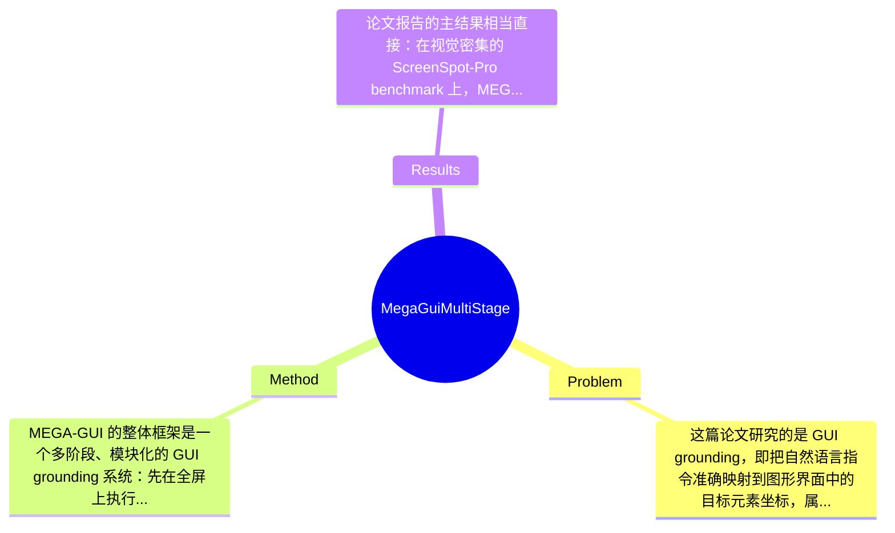

## Summary
MEGA-GUI 旨在解决 GUI grounding 中“自然语言指令到屏幕坐标”映射在复杂界面下不准的问题，提出了一个将粗粒度 ROI 搜索与细粒度元素定位解耦的多阶段 modular framework，并结合 bidirectional ROI zoom、context-aware rewrite agent 与 specialized grounding agents。论文的核心结论是：不同 VLM 在不同视觉尺度上具有互补能力，因此通过多阶段协作优于单体 one-shot 方法；其在 ScreenSpot-Pro 上达到 73.18% accuracy，在 OSWorld-G 上达到 68.63%，显著超过既有结果。

## Problem & Motivation
这篇论文研究的是 GUI grounding，即把自然语言指令准确映射到图形界面中的目标元素坐标，属于 multimodal agent、GUI automation 与 human-computer interaction 交叉领域的核心基础问题。它之所以重要，是因为无论是 autonomous computer-use agent、企业流程自动化、RPA 升级版，还是面向视障用户的 accessibility technology，都依赖模型先“看懂屏幕并点对位置”；如果 grounding 不可靠，上层规划、工具调用、工作流执行都会连锁失败。现实中 GUI grounding 难点非常集中：一方面现代 UI 元素密集、尺度差异大、文本与图标混合，造成视觉 clutter；另一方面用户指令常含模糊语义、隐式指代和上下文依赖，导致语义 ambiguity。

现有方法的局限，论文点得比较明确。第一，monolithic model 往往试图一次性从整屏完成理解与定位，但在高分辨率、密集布局场景里会出现 spatial dilution，即目标在全屏视角下被稀释，模型注意力难以稳定落在小元素上。第二，one-shot、单向 pipeline 缺少 error recovery 能力，一旦早期判断错过关键区域，后续没有机制回退或重新搜索。第三，许多方法没有显式处理 instruction ambiguity，直接把原始文本送入 grounding 模型，容易在语义上被误导，尤其是在 OSWorld-G 这类语义复杂 benchmark 上更明显。

因此作者提出新方法的动机是合理的：既然不同 VLM 在不同视觉尺度、不同子任务上有互补优势，就不应指望一个模型一步到位，而应采用多阶段、模块化、带纠错能力的 agent orchestration。论文的关键洞察有两个：其一，GUI grounding 可自然分解为“先找 ROI，再做精定位”；其二，视觉尺度与语义明确性是性能瓶颈，因此通过 bidirectional zoom 缓解尺度问题、通过 context-aware rewriting 缓解指令模糊性，能够系统性提高整体成功率。这一动机不仅合理，而且比单纯堆更强 backbone 更贴近问题结构。

## Method
MEGA-GUI 的整体框架是一个多阶段、模块化的 GUI grounding 系统：先在全屏上执行 coarse ROI deduction，确定可能包含目标元素的区域；随后对 ROI 进行缩放与裁剪，在局部视图中执行 fine-grained grounding；若搜索失败或上下文不足，则通过双向缩放和语义重写机制进行补救。其核心不是训练一个新的 end-to-end 大模型，而是编排多个具有不同专长的 VLM agent，在不同阶段处理不同类型的不确定性，从而把“搜索问题”和“定位问题”解耦。

关键组件可以概括为以下几部分：

1. Bidirectional ROI Zoom
   - 作用：这是论文最核心的搜索机制，用于在全屏与局部视图之间动态切换，缓解小目标在整屏中的可见性不足问题。
   - 设计动机：传统单向 zoom-in 虽然能放大小目标，但一旦初始 ROI 错误或过窄，模型会陷入局部视野，丢失 surrounding context。作者因此提出 bidirectional 机制，不仅允许逐步 zoom-in，还允许在必要时 zoom-out 或重新调整 ROI，形成某种搜索-校正闭环。
   - 与现有方法区别：区别不只是“裁图再识别”，而是把缩放方向本身当作策略变量处理，强调 error recovery；这比 one-shot crop 或固定金字塔更灵活。论文还专门分析了 asymmetric zoom-in heuristic，说明缩放并非简单对称操作，而是结合 UI 布局特征做启发式设计。

2. Stage 1 ROI Deduction
   - 作用：在 coarse 层面推断目标大致所在区域，缩小后续搜索空间。
   - 设计动机：直接在全屏上做坐标回归会受到视觉噪声和元素密度干扰，而先判断“目标可能在哪一块”更符合人类搜索界面的方式。
   - 与现有方法区别：很多 prior work 直接做 element matching 或 point prediction；MEGA-GUI 先做 containment-oriented deduction，即优先保证 ROI 包含目标，再在后续阶段追求精度。这是一种把 recall 优先于 localization precision 的阶段化设计。

3. Specialized Agents for Precision Grounding
   - 作用：针对不同子任务调用不同 VLM agent，而不是由单一模型统一处理搜索、理解和点击。
   - 设计动机：论文的核心经验发现是 VLM 的能力随视觉尺度变化而显著不同，有的模型更擅长全局语义判断，有的更擅长局部精定位，因此分工优于平均化使用。
   - 与现有方法区别：区别在于 agent specialization 和 orchestration，而不是仅比较 backbone。论文标题里的 Multi-stage Enhanced Grounding Agents 就体现了这种系统层创新。

4. Context-Aware Rewrite Agent
   - 作用：对原始 instruction 做语义改写，减少歧义、补充上下文线索，为后续 grounding 提供更可执行的描述。
   - 设计动机：很多 GUI 指令具有指代、省略、任务语境依赖，例如“打开那个设置项”“点右边那个按钮”，如果不做 semantic refinement，视觉 grounding 模型容易匹配错误对象。
   - 与现有方法区别：许多工作默认文本输入是确定的，而该文显式把“指令重写”变成系统组件，并在附录中做了 prompt engineering ablation，说明这不是装饰性模块，而是可测量贡献项。

5. Conservative Scale Agent
   - 作用：从名字和结构看，它负责在缩放过程中避免过激裁剪，保持足够上下文，降低因放大过度导致的误判。
   - 设计动机：GUI 元素的身份经常依赖邻近标签、分组关系和页面结构；过度局部化会让模型只看到按钮形状却看不到其语义环境。
   - 与现有方法区别：它体现的是一种保守搜索策略，优先避免因过窄视野带来的灾难性错误，而不是一味追求最大放大倍数。

技术细节上，论文给出了 Bidirectional ROI Zoom Algorithm 的 overview、full pseudocode、helper functions，并在实验里拆分了 feasibility check、ROI deduction、fine-grained grounding 等环节，说明系统是按可分析、可替换的模块构建的。训练策略方面，从当前摘录看更偏 prompt-based orchestration 与 inference-time pipeline，而不是大规模额外训练；若有专门微调细节，当前提供内容未提及。设计选择上，“先 containment 再 precision”与“rewrite + zoom + specialized agents”的组合是该方法不可或缺的主线；而具体采用哪些 VLM、缩放步长、裁剪比例、pruning 策略则可能存在替代空间。整体而言，这个方法在思想上相对简洁：本质是把问题拆开并利用模型互补性；但在工程实现上包含多 agent、重写、缩放、pruning 等多个环节，也带有明显系统工程色彩，不算极致优雅，但比无原则堆模块更有结构性。

## Key Results
论文报告的主结果相当直接：在视觉密集的 ScreenSpot-Pro benchmark 上，MEGA-GUI 达到 73.18% accuracy；在语义更复杂的 OSWorld-G benchmark 上达到 68.63%。这两个结果构成论文最重要的性能证据，也支撑其“modular multi-stage framework 优于 monolithic approach”的核心主张。摘要中明确称其 significantly surpassing prior results，但在当前提供文本里，具体 baseline 名称、各自数值以及提升百分点未完整展开，因此严格来说只能确认“超过已有最好结果”，无法在这里精确列出每个对比方法的具体差距，相关细节应在正文 4.2 与附录 D.1 中。

从 benchmark 特性看，ScreenSpot-Pro 偏重 visually dense UIs，考验模型在高分辨率、元素拥挤界面中的细粒度定位能力；OSWorld-G 更偏 semantic UIs，强调语言理解、语义歧义消解和跨元素关系判断。论文同时在这两个维度取胜，说明方法并非只在视觉放大上奏效，而是兼顾了语义重写与局部 grounding。指标方面，当前明确可确认的是 accuracy；是否还报告了 containment rate、composite score 或其他细分指标，摘要未完全展示，但附录目录显示作者还分析了 containment 与 accuracy 的平衡。

消融实验是这篇论文较有价值的部分。作者单独分析了 bidirectional zoom 的影响、asymmetric zoom-in heuristic 的有效性、prompt engineering 对 semantic refinement 的作用、image scaling 的影响，以及 pruning 对搜索效率的贡献。这说明论文并非只给最终分数，而是试图证明各组件都“有用”。不过当前摘录未给出具体 ablation 数字，因此无法精确量化每个模块带来的 absolute gain，只能确认论文做了较系统的组件验证。

实验充分性总体上是中上水平：有主 benchmark、组件消融、失败案例分析和 reproducibility appendix，还公开代码与 GBT 工具包。但批判性地看，仍有两点不足。第一，当前信息不足以判断是否覆盖更多真实交互式、多步任务环境，还是主要停留在单步 grounding。第二，虽然论文讨论 failure cases，但尚不能确认是否进行了跨分辨率、跨平台、跨主题风格之外的更强 domain shift 测试。至于 cherry-picking，从结构上看作者既报告成功结果也列出失败模式，主观上不像只展示好例子，但是否存在 benchmark-specific tuning，论文摘录无法完全排除。

## Strengths & Weaknesses
这篇论文的亮点首先在于问题拆解正确。已知事实是，作者没有把 GUI grounding 当作单一步骤坐标回归，而是拆成 ROI 搜索与精定位两个阶段，并引入 specialized agents；这比单体模型硬做 one-shot prediction 更贴合 GUI 任务结构。第二个亮点是 bidirectional zoom 的设计，它不是简单放大图像，而是显式处理“放大带来清晰度、但也会损失上下文”的矛盾，因此具备一定 error recovery 能力。第三个亮点是 context-aware rewrite agent，把 instruction ambiguity 作为一等公民处理，这一点对 OSWorld-G 这类语义复杂场景尤其合理，也体现出论文不只关注视觉侧。

但局限性同样明显。第一，技术上这是一个较复杂的多模块系统，虽然 modularity 带来性能提升，但也增加了 orchestration 成本、调参复杂度与潜在延迟；对于实时 computer-use agent，推测 inference latency 可能高于单模型方案，但论文摘录未给出严格时延数据。第二，方法对 VLM 互补性的依赖很强，这意味着整体性能可能受具体模型组合、prompt 设计和 API 行为漂移影响，迁移到其他模型栈时未必稳定复现。第三，适用范围上，它主要优化的是单步 GUI grounding；对于动态页面、滚动后元素出现、交互改变界面状态、长程任务依赖等场景，当前证据仍不足。论文确实在 failure analysis 中提到 attentional fixation、deterministic bias、instructional over-correction，这说明系统仍会在搜索策略僵化、定位偏置和语义修正过头时出错。

潜在影响方面，这项工作对 GUI agent 领域的贡献不一定是提出全新 backbone，而是提供了一种更可信的系统设计范式：承认 VLM 的局限，用多阶段、可分析、可诊断的 pipeline 替代黑盒 monolithic predictor。它对 enterprise automation、assistive technology、screen understanding toolkit 都有现实意义，尤其是开源代码和 Grounding Benchmark Toolkit 可能促进后续评测标准化。

严格区分信息来源：已知——方法包含 bidirectional ROI zoom、rewrite agent、specialized agents，并在 ScreenSpot-Pro/OSWorld-G 上分别达到 73.18%/68.63%。推测——系统可能在推理成本、API 依赖和工程维护上较重，且更适合高价值场景而非低延迟场景。不知道——具体使用了哪些底层 VLM 组合、每步延迟和成本是多少、在真实在线交互任务中的端到端成功率提升有多大，当前摘录没有完整说明。

## Mind Map

## Notes
<!-- 其他想法、疑问、启发 -->
