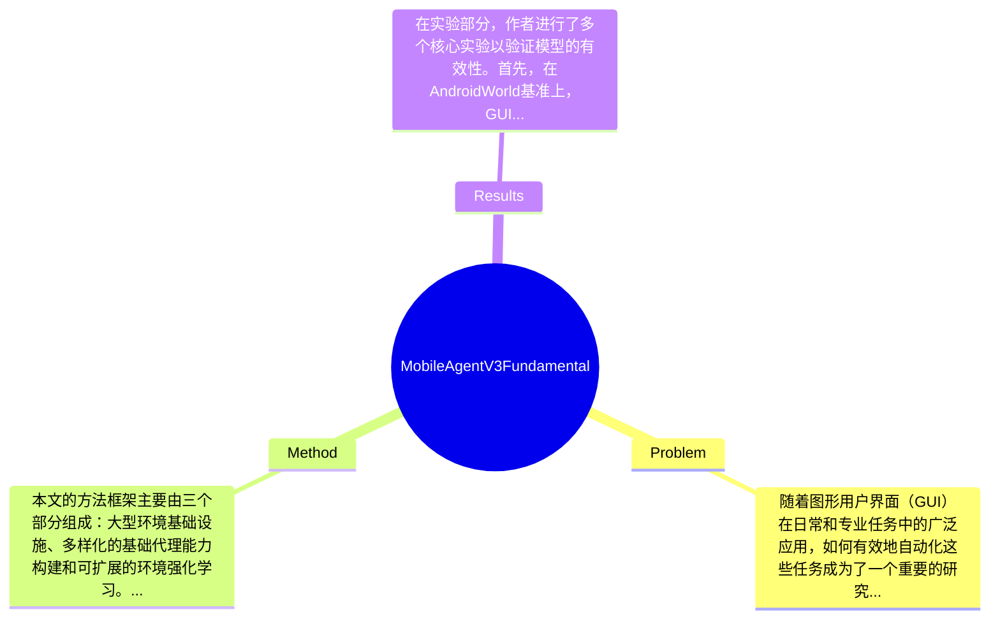

## Summary
本文提出了GUI-Owl，一个基础的GUI代理模型，通过在十个GUI基准测试中实现了新的最先进性能，随后基于此提出了Mobile-Agent-v3框架，进一步提升了性能，在AndroidWorld和OSWorld-Verified基准上分别达到了73.3和37.7的分数。

## Problem & Motivation
随着图形用户界面（GUI）在日常和专业任务中的广泛应用，如何有效地自动化这些任务成为了一个重要的研究领域。GUI代理的目标是根据人类指令在不同设备环境中执行任务，从而提高生产效率。然而，现有的GUI自动化方法在处理复杂的多模态交互时存在局限性。例如，许多现有方法缺乏灵活性，无法适应不同的操作系统和应用场景，导致在实际应用中效果不佳。此外，现有的模型往往依赖于大量的手动标注数据，增加了开发和维护的成本。因此，提出一种能够在多种环境中自我演化并减少人工干预的GUI代理模型显得尤为重要。本文的动机在于通过构建一个大型的环境基础设施和自我演化的轨迹生成框架，来提升GUI代理的能力。关键洞察在于，作者通过整合多种基础能力（如UI数据的基础知识、规划和动作语义识别）以及引入可扩展的强化学习框架，来实现对复杂任务的自动化处理。这样的创新不仅提高了模型的性能，还为未来的多代理系统提供了模块化的解决方案。

## Method
本文的方法框架主要由三个部分组成：大型环境基础设施、多样化的基础代理能力构建和可扩展的环境强化学习。以下是关键组件的详细描述：

1. **大型环境基础设施**：该组件通过云基础设施支持跨多个操作系统（如Android、Ubuntu、macOS和Windows）的虚拟环境。设计动机在于创建一个统一的平台，以便于生成高质量的交互数据。与现有方法相比，这种基础设施能够支持更广泛的应用场景，并减少手动标注的需求。

2. **多样化的基础代理能力构建**：这一部分集成了UI数据的基础知识、规划和动作语义识别等能力。设计的目的是使代理不仅能够进行端到端的决策，还能作为多代理框架中的模块化组件。与传统方法相比，这种设计提供了更高的灵活性和适应性。

3. **可扩展的环境强化学习**：作者开发了一种可完全异步训练的强化学习框架，以更好地与现实世界的使用情况对齐。引入的轨迹感知相对策略优化（TRPO）方法，能够在在线环境中进行有效的学习，显著提升了模型的性能。

在技术细节方面，本文详细描述了代理的架构，包括外部知识检索、动态任务规划和协调、基础动作执行、自我反思和持久上下文记忆等模块。这些设计选择是必要的，因为它们共同构成了一个高效的工作流，能够处理复杂的GUI自动化任务。整体而言，该方法在设计上既简洁又高效，避免了过度工程化的问题。

## Key Results
在实验部分，作者进行了多个核心实验以验证模型的有效性。首先，在AndroidWorld基准上，GUI-Owl-7B的得分为66.4，而Mobile-Agent-v3进一步提升至73.3，显示出显著的性能提升。其次，在OSWorld-Verified基准上，GUI-Owl的得分为29.4，Mobile-Agent-v3则提升至37.7，进一步验证了其在复杂任务中的优势。此外，作者还进行了消融实验，评估各个组件对整体性能的贡献，结果表明，轨迹生成和自我反思模块对模型性能的提升起到了关键作用。实验充分性方面，虽然作者展示了多个基准的结果，但缺少对不同场景下模型表现的深入分析，可能影响对模型适用性的全面理解。此外，作者的结果是否存在选择性展示（cherry-picking）的问题，值得进一步探讨。

## Strengths & Weaknesses
该论文的亮点包括：1) 技术创新点，提出了自我演化的轨迹生成框架，显著提升了GUI代理的性能；2) 与现有方法的关键区别在于其模块化设计，使得模型能够适应多种应用场景；3) 设计的优雅之处在于通过云基础设施支持多操作系统的交互，减少了人工干预。

然而，局限性也不可忽视：1) 技术局限，尽管模型在多个基准上表现出色，但在特定复杂场景下的表现仍需验证；2) 适用范围，模型可能在资源受限的环境中表现不佳；3) 计算成本，云基础设施的使用可能导致较高的计算资源消耗。

潜在影响方面，该研究为GUI自动化领域提供了新的思路，尤其是在多代理系统的应用方向上具有重要的参考价值。已知信息包括模型在多个基准上的具体得分，推测信息包括模型在未测试场景下的表现，未知信息则是关于模型在实际应用中的长期表现和稳定性。

## Mind Map

## Notes
<!-- 其他想法、疑问、启发 -->
