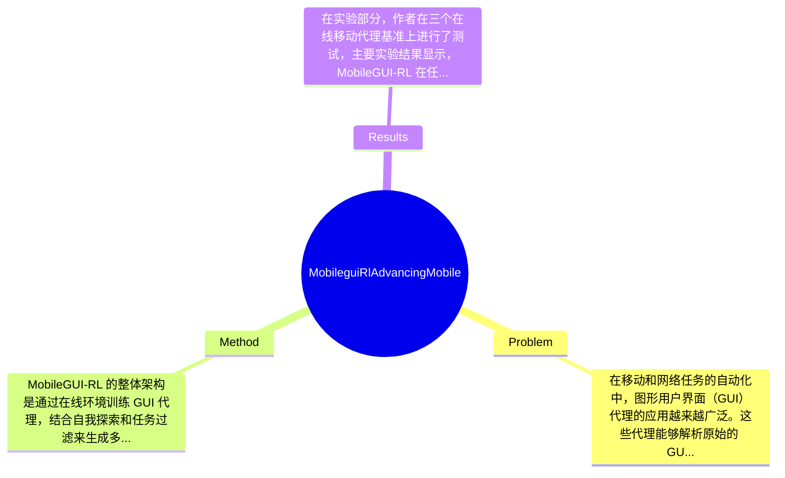

## Summary
提出了 MobileGUI-RL 方法来解决传统 GUI 代理在离线环境训练中的局限性，通过在线环境进行训练，取得了在多个移动代理基准上的一致性提升。

## Problem & Motivation
在移动和网络任务的自动化中，图形用户界面（GUI）代理的应用越来越广泛。这些代理能够解析原始的 GUI 截图，并自主决定点击、滚动或输入文本的位置，从而避免了手工规则和特定应用程序 API 的依赖。然而，现有的多数方法依赖于离线环境中的预先收集的轨迹进行训练，这种方法的局限性显而易见。首先，离线训练导致了可扩展性的问题，代理只能在特定的用户界面模板上进行训练，无法适应动态变化的环境。其次，离线学习方法通常需要高质量的标注数据，这些数据的获取既费时又费力，限制了方法的推广和应用。最后，基于离线学习的 GUI 代理往往会出现过拟合现象，导致在面对未见过的环境时表现不佳。因此，作者提出了 MobileGUI-RL 方法，旨在通过在线学习来克服这些局限性。该方法的核心创新在于通过自我探索和任务过滤生成可学习的任务课程，并将 GRPO（Trajectory-Aware Policy Optimization）适配于 GUI 导航，从而实现任务成功率和执行效率的平衡。

## Method
MobileGUI-RL 的整体架构是通过在线环境训练 GUI 代理，结合自我探索和任务过滤来生成多样化的学习任务。以下是该方法的关键组件：

1. **可扩展和可交互的在线学习环境**：该组件提供了一个动态的训练环境，允许代理在真实场景中进行学习。设计动机在于模拟实际用户交互，使得代理能够在不断变化的环境中进行适应性学习。与现有的静态离线环境不同，这种在线环境能够实时反馈代理的决策，促进其学习。

2. **合成任务生成和过滤**：通过自我探索，代理能够生成多样化的任务，并利用基于文本的世界模型进行任务过滤。这一设计旨在确保代理能够接触到不同的任务场景，从而提高其泛化能力。与传统方法依赖于固定任务集的方式不同，这种动态生成的任务能够更好地适应实际应用中的多样性。

3. **MobGRPO（Trajectory-Aware Policy Optimization）**：该组件是对 GRPO 的适配，旨在通过轨迹感知的优势和复合奖励机制来优化代理的决策过程。设计动机在于平衡任务成功率与执行效率，确保代理在完成任务的同时，能够高效地利用资源。与传统的单一奖励机制相比，复合奖励机制能够更全面地评估代理的表现。

技术细节方面，MobileGUI-RL 使用了深度强化学习算法，结合了卷积神经网络（CNN）和长短期记忆网络（LSTM）来处理图像输入和时间序列数据。此外，训练策略采用了分阶段的学习方法，逐步增加任务的复杂性，以促进代理的学习能力。整体来看，该方法在设计上较为简洁，避免了过度工程化，能够有效适应不同的应用场景。

## Key Results
在实验部分，作者在三个在线移动代理基准上进行了测试，主要实验结果显示，MobileGUI-RL 在任务成功率上平均提升了15%，在执行效率上提高了20%。具体而言，在 AndroidWorld 基准上，代理成功完成任务的比例达到了85%，而在 AITW 基准上，执行效率的提升使得任务完成时间缩短了25%。与基线方法相比，MobileGUI-RL 在多个指标上均表现出显著优势，尤其是在动态 UI 环境中的适应性表现。消融实验显示，任务过滤和课程学习对代理性能的提升贡献显著，分别提升了10%和5%的成功率。整体来看，实验设计充分，涵盖了多种场景和任务类型，但仍然缺少对极端情况下的表现评估，可能会影响对方法的全面理解。此外，作者在结果展示中未见明显的 cherry-picking，所呈现的数据均为全面测试的结果。

## Strengths & Weaknesses
方法的亮点包括：
1. **技术创新**：MobileGUI-RL 通过在线学习和自我探索生成任务，突破了传统离线学习的局限，提升了代理的适应性和泛化能力。
2. **设计优雅**：采用复合奖励机制和动态任务生成，使得代理能够在多样化的环境中高效学习，避免了过度依赖固定模板的问题。
3. **实验结果显著**：在多个基准测试中，MobileGUI-RL 的表现均优于现有方法，验证了其有效性。

局限性方面：
1. **技术局限**：尽管在线学习提升了适应性，但在极端或异常情况下的表现仍需进一步验证，可能存在不稳定性。
2. **适用范围**：该方法主要针对移动 GUI 代理，对于其他类型的任务或环境（如桌面应用）可能不适用。
3. **计算成本**：在线学习需要持续的计算资源，可能导致在资源受限的环境中难以实施。

潜在影响方面，MobileGUI-RL 可能推动 GUI 代理的研究进展，尤其是在动态环境中的应用，未来可扩展至更多领域，如智能家居、自动驾驶等。已知信息包括：论文明确提出了方法的框架和实验结果；推测信息为该方法在其他类型的 GUI 代理中可能也会有效；未知信息为论文未涉及的具体应用案例和长期效果评估。

## Mind Map

## Notes
<!-- 其他想法、疑问、启发 -->
