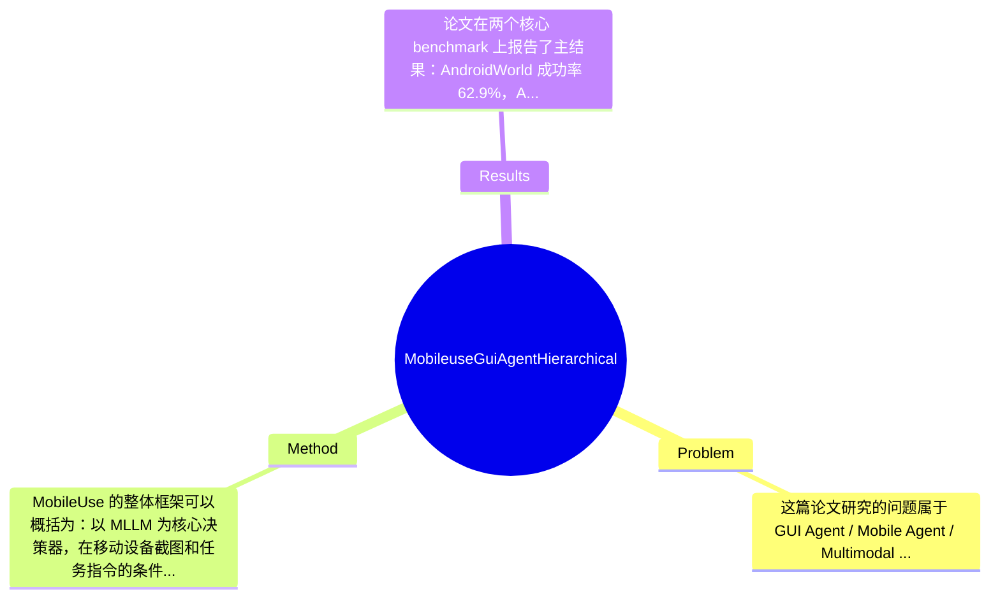

## Summary
论文提出了面向移动端 GUI 自动操作的代理系统 MobileUse，重点解决长程任务中的错误恢复、动态环境适应和陌生环境 cold-start 问题，核心方法是 hierarchical reflection（动作级、轨迹级、全局级）结合 proactive exploration。该方法在 AndroidWorld 和 AndroidLab 上分别取得 62.9% 与 44.2% 的成功率，达到论文声称的 state-of-the-art 水平，并同时提供可部署到真实手机的工具链。

## Problem & Motivation
这篇论文研究的问题属于 GUI Agent / Mobile Agent / Multimodal Agent 方向，具体是让一个基于 Multimodal Large Language Model 的智能体在手机界面上自主完成用户指令，例如打开 app、跨页面导航、填写表单、修改设置等。这个问题的重要性在于，移动设备是现实世界中最广泛的计算平台之一，且其交互形式天然统一为 click、swipe、type 等有限动作，因此非常适合作为通用数字代理落地的核心场景。若该问题被有效解决，能够直接服务于效率提升、辅助无障碍交互、复杂设置自动化、个人助理等真实需求，应用价值非常明确。现有方法虽然已经能在 benchmark 上做出一定进展，但通常存在几个具体短板：第一，长程任务容易累积误差，一旦中间一步点错，后续计划会全部建立在错误状态上，而许多方法缺乏系统化的 error recovery 机制；第二，很多 agent 依赖固定流程分解或单步决策，对动态 UI、弹窗、权限请求、页面跳转等非预期变化鲁棒性不足；第三，在陌生 app 或从未见过的界面里，agent 常常陷入 cold-start，即不知道关键页面结构、入口位置和功能布局，导致探索成本极高。基于这些局限，作者提出新方法的动机是合理的：不仅要让 agent 会“做决策”，更要让它能“发现错误、回退修正、积累环境知识”。论文的关键洞察在于，把反思机制分成多个时间尺度：局部动作是否合理、短期轨迹是否偏离目标、全局任务是否卡住或失败；同时用按需触发 reflection-on-demand 控制额外开销，再通过 proactive exploration 在正式执行前主动建立环境先验，从而提升陌生环境中的起步能力。这一思路相较于只做 planner 或只做 action grounding 的方法，更贴近真实移动操作中的长期闭环控制问题。

## Method
MobileUse 的整体框架可以概括为：以 MLLM 为核心决策器，在移动设备截图和任务指令的条件下生成操作动作，同时配套一个 hierarchical reflection 机制持续监控执行是否偏航，并在必要时进行恢复；此外，在环境陌生时先进行 proactive exploration，主动探索 app 或系统页面，沉淀结构化知识，帮助后续任务执行更稳健。论文的重点并不只是“再加一个反思模块”，而是把反思拆成不同层级，并与执行流程深度耦合。

1. Action Reflector：这是最细粒度的反思单元，负责判断单步动作是否合理、是否真的产生了预期效果。它的作用是避免低级操作错误持续传播，比如点错控件、输入位置错误、滑动方向不对、页面没有变化却误以为成功进入下一步。这样设计的动机是，许多 mobile agent 的失败并不是因为高层规划完全错误，而是某一步 grounding 或状态理解出错，若不立刻纠正，后续所有推理都建立在错误 UI 状态上。与只在任务失败后做整体复盘的方法不同，Action Reflector 更像在线局部校验器。论文摘要未给出完整算法细节，但从框架描述看，它应基于前后截图、当前动作、预期目标与实际状态变化进行一致性判断，并在发现异常时触发重试、替代动作或回退。

2. Trajectory Reflector：这是中等时间尺度的反思模块，负责评估最近一段操作序列是否朝任务目标推进。它的核心作用是识别“局部动作看起来都合理，但整体路径已经偏了”的情形，例如连续进入无关页面、重复在几个界面之间循环、遗漏某个必要子步骤。设计动机在于，单步正确不等于任务层面正确，长程 GUI 任务往往需要跨多个页面完成子目标，如果没有轨迹级监督，agent 很容易陷入局部最优。与传统 chain-of-thought 式静态规划相比，这种 trajectory-level reflection 更强调执行后验证，而不是只在动作前做推理。论文强调 reflection-on-demand，说明该模块不是每一步都重跑，而是在检测到卡顿、重复、进度异常时再介入，以降低额外成本。

3. Global Reflector：这是最粗粒度的任务级反思器，负责从全局判断任务是否已完成、是否进入死局、是否需要重大策略调整。其作用包括识别任务终止条件、发现长期停滞、以及当局部修补无法解决问题时触发更高层重规划。这样的设计是合理的，因为 GUI 环境中存在大量“假成功”或“假进展”现象，比如进入了看似相关页面但核心目标并未达成。与只看最后 success/failure 的评测式机制不同，Global Reflector 是执行中的战略监控器。它与前两个模块形成层级关系：动作级处理即时错误，轨迹级处理短程偏航，全局级处理任务整体失败模式。

4. Proactive Exploration：这是论文另一个关键组件，主要解决 cold-start。它的作用是在正式接到任务前或面对陌生环境时，agent 主动探索 app/系统页面，发现菜单层级、关键入口、常见功能位置，并将这些信息整理为可复用知识。设计动机很直接：很多失败并非推理能力不足，而是缺乏环境先验，导致每次都从零开始盲搜。与依赖人工构建 app-specific workflow 或外部文档的方法相比，proactive exploration 更自动化，也更符合开放世界设置。论文提到 collected knowledge，但摘要未展开知识表示形式；合理推测可能包括页面描述、可点击元素语义、导航路径或操作经验缓存，但具体格式论文摘录中未提及。

5. Reflection-on-Demand 策略：这是一项工程上很关键的设计选择。因为多层反思如果每步全开，会显著增加 MLLM 调用次数和延迟，尤其在真实手机上会影响可用性。作者因此不是持续性地执行全部反思，而是按需触发。这个设计较为务实：它承认反思有效，但也承认其昂贵。必要性在于平衡鲁棒性与效率；可替代选择则包括固定周期触发、基于 uncertainty 的触发、或训练轻量级 verifier 先做预筛，但论文摘录未说明其触发判据是否为规则、模型打分还是混合方案。

从方法整体看，MobileUse 的优点是架构逻辑清晰：执行、监控、纠错、探索四部分各司其职，且问题对齐真实失败模式，因此比单一 planner 更完整。它不算特别“极简”，因为引入了多级 reflector 和探索模块，系统复杂度明显高于纯单代理决策器；但这种复杂度大体是为了解决真实 mobile operation 中的核心难点，属于有针对性的系统增强，而不是无意义堆模块。若批判性评价，其创新更偏系统框架与 agent control，而非底层模型结构突破。

## Key Results
论文在两个核心 benchmark 上报告了主结果：AndroidWorld 成功率 62.9%，AndroidLab 成功率 44.2%。从摘要表述看，这两个数字构成论文最重要的实证证据，并被作者用来支持其“establishes new state-of-the-art performance”的结论。AndroidWorld 和 AndroidLab 都是面向 Android 设备 GUI 操作的 benchmark，但摘录内容未给出更细的任务数、任务类型分布、是否包含 unseen apps、以及 success 的严格判定标准，因此这些 benchmark 详情只能部分确认：已知指标是 success rate，已知结果是 62.9% 和 44.2%，更多统计信息论文摘录未提及。

从对比分析角度，作者明确声称超过现有方法，但当前提供的全文片段没有列出具体 baseline 名称、各 baseline 的数字、以及绝对提升或相对提升百分比，因此无法严谨给出“相比某方法提升 X%”的完整比较，只能说论文主张其在两个 benchmark 上均达到 SOTA。结合 introduction 中提到的 AppAgent-v2、MobileAgent-v2、Agent-S2 等相关框架，可以合理推测这些可能是对比对象之一，但具体是否进入主表、采用何种 backbone、公平性如何，摘录未提及，因此不应捏造。

论文还包含 Ablation Study 与 Further Analysis，说明作者至少意识到需要拆解 hierarchical reflection 和 proactive exploration 的贡献。根据方法设计，最关键的消融应当包括：去掉 Action/Trajectory/Global Reflector 的影响、关闭 proactive exploration 的表现变化、以及 reflection-on-demand 对效率与成功率的平衡。不过当前提供内容没有任何具体 ablation 数字，因此只能确认“论文有做消融”，无法复述每个模块提升了多少。实验充分性方面，优点是至少覆盖了两个 benchmark，并兼顾真实设备工具链，说明作者不仅在单一测试集上优化；不足在于从摘录看不到更细粒度分析，例如不同任务长度、不同 app 熟悉度、不同错误类型上的 success/failure breakdown，也看不到成本指标如平均步数、token 开销、反思触发频率。是否存在 cherry-picking，目前没有明显证据表明作者只展示有利结果，但由于缺少完整表格与失败案例统计，仍需谨慎看待其 SOTA 结论的稳健性。

## Strengths & Weaknesses
这篇论文最明显的亮点有三点。第一，方法真正针对 mobile GUI agent 的核心痛点，而不是泛泛再包一层 planner。长程任务失败、错误恢复困难、陌生环境 cold-start，这三类问题都非常现实，hierarchical reflection + proactive exploration 的设计和问题本身高度对齐。第二，分层反思的时间尺度设计较自然：动作级、轨迹级、全局级分别对应即时失误、阶段偏航、整体失败，这比单一 self-reflection 更有结构，也更容易解释失败来自哪里。第三，作者强调 reflection-on-demand 和真实手机 toolkit，说明其目标不只是 benchmark 分数，也关心真实部署中的效率与可用性，这一点对 agent 系统工作很重要。

局限性同样明显。第一，技术上它更像一个复杂控制框架，而不是从根本上提升感知或 grounding 精度；如果底层 MLLM 对 UI 元素识别、文字理解或空间定位本身不稳定，多层反思可能只能补救一部分问题，无法根治。第二，系统复杂度较高，多个 reflector 加上 exploration 可能带来较大的推理开销、较长延迟和更多 API 调用成本；摘要虽提到 efficiency，但没有给出具体成本数字，因此其实际部署代价仍需核实。第三，proactive exploration 的收益可能依赖环境相对稳定；若 app 界面频繁更新、强个性化推荐导致页面布局变化大，预探索知识可能迅速过时。适用范围上，它显然适合可视化、步骤明确的移动操作任务，但在需要复杂外部推理、账号隐私验证、验证码、人机校验等场景中可能仍然受限。

潜在影响方面，这项工作对 GUI Agent 领域的贡献主要在于推动“可恢复、可自监控”的 mobile agent 设计范式，而不仅是提高单步 action prediction。它可能启发后续工作把 agent 从一次性规划器发展为持续闭环控制器，并进一步用于 accessibility assistant、企业流程自动化、端侧智能助手等方向。

已知：论文提出 MobileUse、包含 hierarchical reflection 与 proactive exploration，在 AndroidWorld/AndroidLab 上达到 62.9%/44.2%，并发布 toolkit。推测：其主要贡献更偏系统工程与 agent control policy，且可能依赖强大的闭源或高性能 MLLM backbone。论文未提及：完整 baseline 数字、计算成本对比、反思触发规则细节、知识库具体表示形式、不同 app 类型上的泛化边界。因此在阅读原文前，不应过度解读其提升来源。

## Mind Map

## Notes
<!-- 其他想法、疑问、启发 -->
