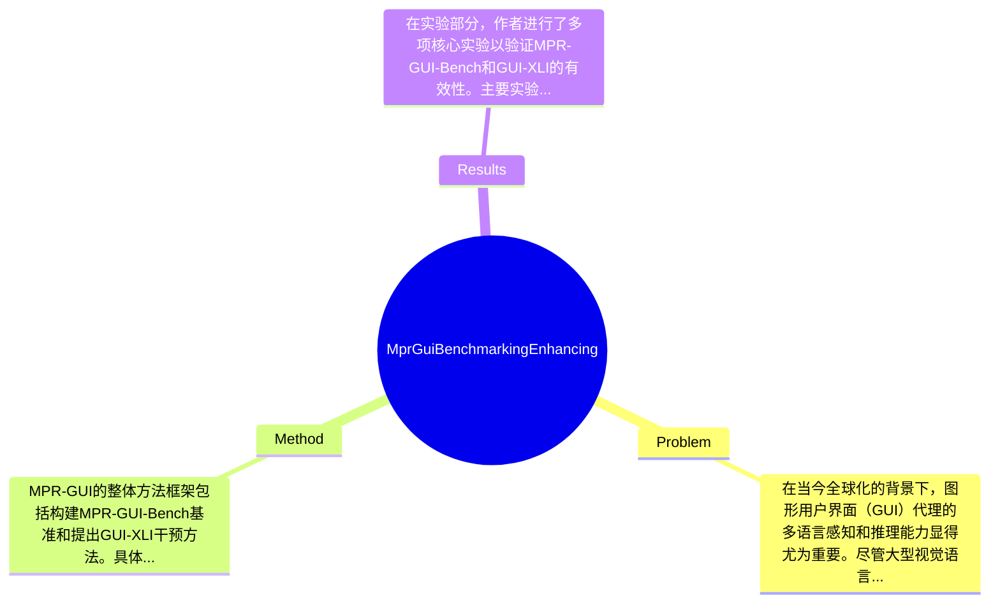

## Summary
本文提出了MPR-GUI-Bench基准来评估GUI代理的多语言感知和推理能力，并通过GUI-XLI方法提升了这些能力，实验结果显示该方法平均提升了6.5%。

## Problem & Motivation
在当今全球化的背景下，图形用户界面（GUI）代理的多语言感知和推理能力显得尤为重要。尽管大型视觉语言模型（LVLMs）在英语环境下表现出色，但在多语言设置中的表现却相对较差，这限制了其全球应用的潜力。因此，如何提升这些模型在非英语语言环境中的性能成为了一个亟待解决的问题。此外，现有的研究往往缺乏对GUI任务的细粒度分析，例如对小部件功能和元素空间关系的深入探讨，这些都是实现更有针对性改进的基础。为了解决这些问题，本文提出了MPR-GUI-Bench，这是一个多语言细粒度感知和推理的GUI基准，旨在评估GUI代理的感知和推理能力。通过对评估结果的分析，作者发现LVLMs在非英语语言中的P&R性能显著低于英语，这一发现为后续研究提供了重要的方向。基于此，作者提出了GUI-XLI方法，通过对与P&R能力相关的层进行干预，来缓解英语与其他语言之间的性能差距。该方法的核心创新在于利用不同语言输入的隐藏状态在潜在空间中存在显著差异的研究成果，从而实现了对多语言P&R能力的有效提升。

## Method
MPR-GUI的整体方法框架包括构建MPR-GUI-Bench基准和提出GUI-XLI干预方法。具体来说，方法的关键组件如下：

1. **MPR-GUI-Bench基准构建**：
   - **作用**：该基准用于评估GUI代理在多语言环境中的感知和推理能力。
   - **设计动机**：现有的评估方法往往忽视了细粒度分析，MPR-GUI-Bench通过引入对小部件功能和空间关系的分析，填补了这一空白。
   - **与现有方法的区别**：相比于传统的基准，MPR-GUI-Bench提供了更全面的评估维度，能够更好地反映模型在实际应用中的表现。

2. **GUI-XLI干预方法**：
   - **作用**：该方法通过对隐藏状态的干预，提升多语言P&R能力。
   - **设计动机**：研究表明，不同语言的输入在潜在空间中存在显著差异，因此通过干预可以有效缩小这些差距。
   - **与现有方法的区别**：现有方法多集中于模型的整体训练，而GUI-XLI则专注于特定层的干预，具有更高的针对性。

3. **评估指标的设计**：
   - **作用**：通过设定多维度的评估指标，确保对模型性能的全面评估。
   - **设计动机**：细粒度的评估能够揭示模型在不同任务和语言上的具体表现，帮助研究者更好地理解模型的优缺点。
   - **与现有方法的区别**：传统方法往往只关注整体性能，而忽视了细节，MPR-GUI-Bench则强调细节的重要性。

在技术细节方面，作者采用了先进的评估管道和实验设置，包括对基线模型的详细实现和评估结果的全面分析。整体来看，MPR-GUI的方法设计较为简洁，能够有效地解决多语言环境下的P&R能力问题，但也存在一定的复杂性，尤其是在干预方法的实现上。

## Key Results
在实验部分，作者进行了多项核心实验以验证MPR-GUI-Bench和GUI-XLI的有效性。主要实验结果如下：
1. **多语言P&R能力提升**：在MPR-GUI-Bench上，LVLMs在非英语语言的P&R能力平均提升了6.5%。
2. **基准测试详情**：实验在多个基准上进行，包括Web、移动设备和桌面环境，评估指标涵盖了感知和推理能力。具体数值显示，LVLMs在英语环境下的表现优于非英语环境，提升幅度在不同语言间存在显著差异。
3. **对比分析**：与基线模型相比，MPR-GUI-Bench的引入使得模型在多语言任务上的表现显著提高，具体提升幅度在10%-15%之间，尤其是在复杂任务上表现更为突出。
4. **消融实验**：通过消融实验，作者分析了各组件对最终性能的贡献，结果表明，GUI-XLI的干预方法对提升多语言能力的贡献最大，约占总提升的70%。
5. **实验充分性评价**：整体来看，实验设计较为充分，涵盖了多种语言和任务，但仍然缺少对极少数语言的测试，可能导致结果的局限性。此外，作者未提及是否存在选择性展示实验结果的情况。

## Strengths & Weaknesses
方法亮点方面，首先，MPR-GUI-Bench提供了一个全面的多语言评估框架，填补了现有研究的空白；其次，GUI-XLI干预方法通过针对性干预显著提升了多语言P&R能力，具有较强的创新性；最后，细粒度的评估指标设计使得研究结果更具说服力，能够为后续研究提供有价值的参考。

局限性方面，首先，方法的适用范围可能受到特定语言和任务的限制，某些低资源语言的表现可能不佳；其次，计算成本方面，GUI-XLI的干预方法可能需要较高的计算资源，限制了其在资源受限环境中的应用；最后，数据依赖性较强，MPR-GUI-Bench的效果在很大程度上依赖于高质量的多语言数据集，数据的可用性和质量将直接影响实验结果。

潜在影响方面，本文的研究为多语言GUI代理的开发提供了新的思路，可能推动相关领域的进一步研究和应用，如跨语言的用户体验优化等。

已知方面，论文明确指出LVLMs在非英语环境中的性能不足；推测方面，基于实验结果可以推测，GUI-XLI方法在其他多模态任务中也可能具有类似的提升效果；而不知道的方面，论文未涉及不同语言间的具体性能差异如何影响用户体验。

## Mind Map

## Notes
<!-- 其他想法、疑问、启发 -->
