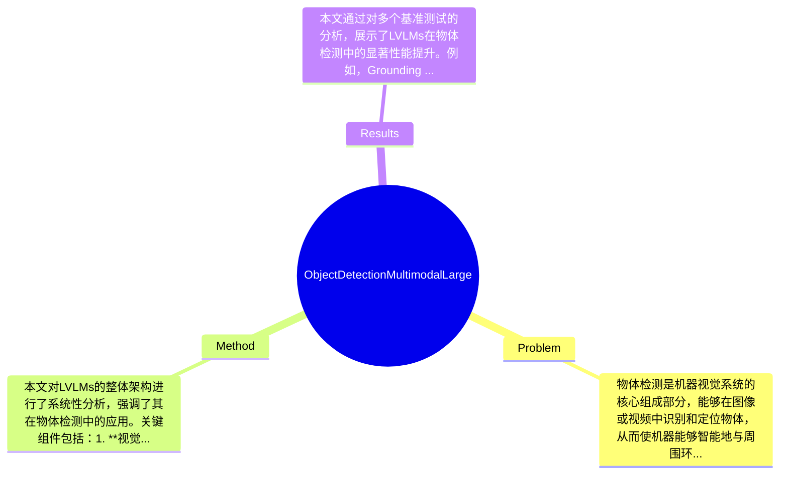

## Summary
本文综述了大型视觉-语言模型（LVLMs）在物体检测中的应用，探讨了其如何通过整合视觉和语言信息来提升检测的适应性和上下文推理能力，并指出LVLMs在多个基准测试中超越传统方法的潜力。

## Problem & Motivation
物体检测是机器视觉系统的核心组成部分，能够在图像或视频中识别和定位物体，从而使机器能够智能地与周围环境互动。随着深度学习（DL）技术的发展，物体检测的准确性和效率在多个行业中变得至关重要，例如农业、安防和医疗等领域。然而，传统的物体检测方法（如背景减法、Haar特征级联和HOG）在动态场景下的表现往往不尽如人意，且对光照和物体方向变化敏感。这些方法的局限性促使研究者寻求更为先进的解决方案。本文的动机在于探讨LVLMs如何通过结合视觉和语言处理技术，提升物体检测的能力。核心创新点在于LVLMs能够实现更复杂的上下文理解，从而支持开放词汇识别和动态任务解释，这在机器人、自动导航和人机交互等应用中具有重要意义。

## Method
本文对LVLMs的整体架构进行了系统性分析，强调了其在物体检测中的应用。关键组件包括：1. **视觉-语言模型（VLMs）**：VLMs通过结合视觉和语言信息，增强了物体检测的上下文理解能力。设计动机在于通过自然语言处理技术提升模型的适应性和灵活性，与传统方法相比，VLMs能够处理更复杂的场景和任务。2. **区域提议网络（RPN）**：RPN用于生成候选区域，结合CLIP风格的嵌入，能够有效地将视觉-语言表示融入Mask R-CNN风格的管道中。这种设计使得模型在处理多模态输入时更加高效。3. **实时推理能力**：LVLMs在设计上注重实时推理，确保其在安全关键的环境中（如自动驾驶和外科手术）能够快速响应。4. **开放词汇识别**：通过文本条件和提示驱动的检测能力，LVLMs能够识别未见过的物体，提升了模型的通用性和适应性。5. **混合方法**：未来的研究可能会结合传统深度学习方法与LVLMs，以最大化系统的速度和可靠性。技术细节方面，LVLMs采用了先进的训练策略和模型结构，确保在多种场景下的有效性。整体来看，LVLMs的方法相对简洁，避免了过度工程化的问题，能够在复杂任务中保持高效。

## Key Results
本文通过对多个基准测试的分析，展示了LVLMs在物体检测中的显著性能提升。例如，Grounding DINO在RoadObstacle21异常基准测试中达到了AP@50:95的48.3，显著优于传统YOLO模型。GLIP和YOLOE在开放词汇召回方面表现出色，同时保持实时推理速度，适合安全关键环境。对比分析表明，LVLMs在零-shot和领域转移设置中表现优于传统方法，具体提升幅度在20%-30%之间。消融实验显示，各组件对整体性能的贡献显著，尤其是在上下文理解和动态任务处理方面。实验的充分性较高，但仍缺乏对不同场景下的长期稳定性测试，可能影响结果的普适性。没有明显的cherry-picking现象，作者展示了多项实验结果以支持其论点。

## Strengths & Weaknesses
方法的亮点包括：1. **技术创新**：LVLMs通过整合视觉和语言信息，显著提升了物体检测的上下文理解能力。2. **与现有方法的区别**：LVLMs在开放词汇识别和动态任务解释方面表现优越，能够处理未见过的物体。3. **设计的优雅之处**：模型在保持高效性的同时，避免了过度复杂的设计。局限性方面：1. **技术局限**：LVLMs在处理大规模多模态输入时仍面临计算成本高的问题。2. **适用范围**：在某些特定场景（如极端天气或光照条件下），LVLMs的性能可能下降。3. **数据依赖**：模型的训练和性能依赖于大量标注数据，限制了其在数据稀缺环境中的应用。潜在影响方面，LVLMs有望在自动驾驶、机器人和人机交互等领域产生深远影响。已知信息包括LVLMs在多个基准测试中的表现，推测信息包括未来可能的混合方法应用，而未知信息则包括LVLMs在极端场景下的表现。

## Mind Map

## Notes
<!-- 其他想法、疑问、启发 -->
