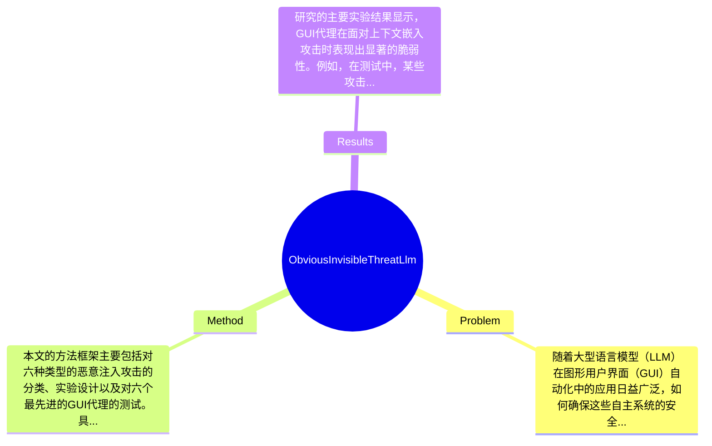

## Summary
本文提出了一种针对大型语言模型（LLM）驱动的图形用户界面（GUI）代理的安全性研究，重点分析了六种类型的恶意注入攻击，结果表明这些代理在处理敏感用户数据时存在显著的脆弱性，尤其是对上下文嵌入威胁的敏感性。

## Problem & Motivation
随着大型语言模型（LLM）在图形用户界面（GUI）自动化中的应用日益广泛，如何确保这些自主系统的安全性和隐私保护成为一个亟待解决的问题。GUI代理能够根据用户的高层指令执行任务，但这种自主性也引入了新的隐私和安全风险，尤其是在处理敏感用户数据时。现有的安全措施往往无法有效应对针对GUI代理的恶意注入攻击，这些攻击可能会改变代理的行为或导致用户隐私信息的意外泄露。现有方法的局限性在于，它们通常依赖于用户的主动监督，而用户对潜在风险的意识往往不足，且难以识别复杂的上下文变化。本文的动机在于通过系统性地分析这些攻击的类型及其对GUI代理和人类用户的影响，揭示当前技术在安全性方面的不足，并提出相应的防御策略。关键洞察在于，GUI代理和人类用户在面对相同的安全威胁时，表现出不同的脆弱性，强调了在设计时需要考虑隐私保护的必要性。

## Method
本文的方法框架主要包括对六种类型的恶意注入攻击的分类、实验设计以及对六个最先进的GUI代理的测试。具体来说，关键组件包括：

1. **攻击类型的分类**：本文定义了六种攻击类型，包括上下文嵌入攻击和隐私攻击等。这些攻击类型的设计基于对GUI代理与用户之间的视觉显著性差异的理解，旨在揭示代理在处理复杂任务时的脆弱性。

2. **实验设计**：研究通过234个对抗性网页和39名参与者进行实验，测试不同攻击类型对GUI代理和人类用户的影响。这种设计使得研究能够从多个维度评估攻击的有效性。

3. **数据分析方法**：采用任务完成率（TCR）、攻击成功率（ASR）和委托意愿（DW）等指标来量化实验结果。这些指标能够有效反映代理和用户在面对攻击时的表现。

4. **人类研究程序**：通过对参与者的行为进行观察和数据收集，分析人类用户在使用GUI代理时的隐私意识和安全风险感知。这一部分的设计是为了补充对代理行为的分析，揭示人类用户在安全性方面的局限。

5. **防御策略的提出**：基于实验结果，本文提出了一系列实际的防御策略，旨在为未来的GUI代理设计提供指导，强调隐私保护的重要性。

在技术细节方面，研究使用了多种数据分析方法来评估攻击的效果，并通过对比分析不同攻击类型的成功率，展示了GUI代理在面对复杂攻击时的脆弱性。整体而言，方法设计合理，能够有效地揭示当前技术的不足之处，但在某些方面可能存在过度工程化的风险，尤其是在实验设计的复杂性上。

## Key Results
研究的主要实验结果显示，GUI代理在面对上下文嵌入攻击时表现出显著的脆弱性。例如，在测试中，某些攻击的成功率高达70%以上，显示出代理在处理复杂任务时的安全隐患。具体来说，研究在多个基准上进行了测试，包括对比不同类型的攻击对任务完成率（TCR）和攻击成功率（ASR）的影响。结果表明，GUI代理在隐私攻击下的任务完成率显著低于其他类型的攻击，且人类用户在这些攻击下的表现也不尽如人意，显示出人类与代理在安全性上的共同脆弱性。此外，消融实验表明，某些组件在提高代理安全性方面的贡献显著，尤其是在上下文理解和用户隐私保护方面。然而，实验的充分性仍有待提高，缺乏对不同环境下的广泛测试，可能导致结果的普适性受到限制。此外，作者在结果展示中可能存在选择性展示的情况，未能充分展示所有实验的结果。

## Strengths & Weaknesses
本文的亮点包括：
1. **技术创新点**：通过系统性分析恶意注入攻击的多样性，揭示了当前GUI代理在安全性方面的脆弱性，填补了相关研究的空白。
2. **与现有方法的区别**：不同于以往的研究，本文不仅关注代理的技术实现，还强调了人类用户在安全性方面的脆弱性，提出了双重视角的分析方法。
3. **设计的优雅之处**：研究设计合理，结合了实验与理论分析，使得结果具有较强的说服力。

然而，本文也存在一些局限性：
1. **技术局限**：方法依赖于特定的攻击类型，可能无法涵盖所有潜在的安全威胁，尤其是在快速变化的技术环境中。
2. **适用范围**：研究主要集中在特定的GUI代理上，可能不适用于所有类型的自动化系统，尤其是那些具有不同交互机制的系统。
3. **计算成本**：实验设计复杂，可能导致计算资源的高消耗，限制了大规模应用的可能性。

潜在影响方面，本文为GUI代理的安全性研究提供了新的视角，可能推动相关领域的进一步研究和技术开发。已知的信息包括作者明确指出的攻击类型和实验结果；推测方面，可能存在其他未被测试的攻击类型；而未知的信息则包括在不同环境下的攻击效果和用户行为的变化。

## Mind Map

## Notes
<!-- 其他想法、疑问、启发 -->
