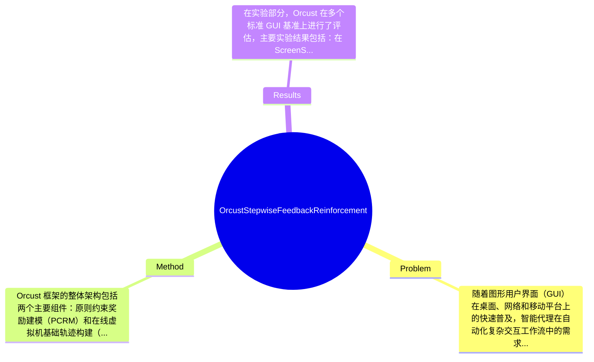

## Summary
提出了 Orcust 框架来解决 GUI 代理在奖励信号不可靠和在线轨迹生成有限的问题，通过整合原则约束奖励建模（PCRM）和在线虚拟机基础轨迹构建（OVTC）方法，在标准 GUI 基准上取得了显著提升，分别提高了 22.2% 和 23.9%。

## Problem & Motivation
随着图形用户界面（GUI）在桌面、网络和移动平台上的快速普及，智能代理在自动化复杂交互工作流中的需求日益增加。尽管近期在视觉语言建模方面取得了显著进展，使得代理能够感知界面元素和执行基本操作，但在将感知与稳健的长期决策相结合方面仍然面临挑战。现有的 GUI 代理模型通常依赖于静态、手动标注的数据集，缺乏深度规划能力，且在面对动态布局时表现不佳。现有的强化学习（RL）方法如基于规则的 R1 奖励塑造（RFT）虽然提升了决策能力，但仍存在几个关键局限：首先，奖励信号往往是粗粒度的，成功/失败信号通常在最终结果才显现，这使得在长链思考中难以进行有效的信用分配；其次，现有的轨迹生成方法是静态的，无法随着界面的更新而演变，也无法捕捉到新出现的失败模式，导致需要耗费大量时间进行回忆和重建。因此，作者提出 Orcust 框架，旨在通过引入环境可验证的原则和逐步可验证的奖励信号来增强推理的可靠性和数据效率。关键的创新点在于通过原则约束奖励建模（PCRM）和在线虚拟机基础轨迹构建（OVTC）来实现这一目标。

## Method
Orcust 框架的整体架构包括两个主要组件：原则约束奖励建模（PCRM）和在线虚拟机基础轨迹构建（OVTC）。

1. **原则约束奖励建模（PCRM）**：该组件的作用是通过引入环境可验证的原则和基于大语言模型（LLM）生成的奖励信号来约束代理的决策过程。设计动机在于提升奖励信号的可解释性，确保代理在执行任务时遵循特定的原则和规则。与现有方法相比，PCRM 提供了更细粒度的奖励反馈，使得代理能够在长链思考中进行有效的信用分配。

2. **在线虚拟机基础轨迹构建（OVTC）**：该组件通过启动仪器化的虚拟机，自动收集结构化的 GUI 交互轨迹。设计动机是为了实现动态的、可演化的轨迹生成，能够捕捉到实时的界面变化和交互模式。OVTC 允许代理在执行任务时实时更新其轨迹，提升了数据的效率和可靠性。

3. **自标记子目标**：该组件通过定义明确的子目标来引导代理的学习过程。设计动机在于将复杂任务拆分为更易管理的部分，使得代理能够逐步实现目标。与传统的全局目标相比，自标记子目标能够更好地适应动态变化的环境。

在技术细节方面，Orcust 使用了强化学习算法，结合了深度学习模型来训练奖励函数，并通过消融实验验证了各个组件的贡献。设计选择上，PCRM 和 OVTC 的结合是 Orcust 的核心，而自标记子目标则为代理提供了灵活性。整体来看，Orcust 的设计较为简洁，避免了过度工程化，聚焦于提升奖励信号的可靠性和轨迹生成的动态性。

## Key Results
在实验部分，Orcust 在多个标准 GUI 基准上进行了评估，主要实验结果包括：在 ScreenSpot 基准上，Orcust 相较于基线模型（Qwen2.5-VL-7B）提高了 22.2%，而在 ScreenSpot-Pro 基准上则提高了 23.9%。这些结果表明 Orcust 在感知基础、基础操作和端到端任务执行等方面的能力显著增强。

具体的 benchmark 包括 ScreenSpot 和 ScreenSpot-Pro，评估指标主要集中在感知能力、操作能力和任务执行能力等方面。实验结果显示 Orcust 在这些指标上均优于现有的最先进方法，体现了其在复杂环境和任务复杂性上的适应性和可扩展性。

此外，论文中还进行了消融实验，分析了不同奖励函数类型、奖励深度、轨迹多样性和数据质量等因素对性能的影响。实验表明，逐步奖励深度和高质量的轨迹数据对模型性能提升具有显著贡献。总体来看，实验设计充分，结果展示了 Orcust 的有效性，但论文未提及是否存在 cherry-picking 的情况。

## Strengths & Weaknesses
Orcust 的方法亮点主要体现在以下几个方面：
1. **技术创新**：通过引入原则约束奖励建模（PCRM），Orcust 提供了更为细致和可解释的奖励信号，提升了代理的决策能力。
2. **动态轨迹生成**：在线虚拟机基础轨迹构建（OVTC）使得代理能够实时适应界面变化，增强了数据的有效性和可靠性。
3. **灵活的目标设定**：自标记子目标的引入使得复杂任务的学习过程更加高效，代理能够逐步实现目标。

然而，Orcust 也存在一些局限性：
1. **技术局限**：尽管 Orcust 在多个基准上表现优异，但其在极端动态环境下的表现尚未得到充分验证。
2. **适用范围**：该方法可能不适用于所有类型的 GUI 任务，尤其是那些具有高度不确定性和复杂性的场景。
3. **计算成本**：在线虚拟机的使用可能导致较高的计算资源消耗，限制了其在资源受限环境中的应用。

潜在影响方面，Orcust 对于 GUI 代理的研究具有重要贡献，可能推动智能代理在更复杂的交互任务中的应用。已知的信息包括 Orcust 在标准基准上的性能提升，推测 Orcust 在实际应用中可能面临的挑战，而论文未涉及的方面包括 Orcust 在不同类型 GUI 任务中的适用性和长期稳定性。

## Mind Map

## Notes
<!-- 其他想法、疑问、启发 -->
