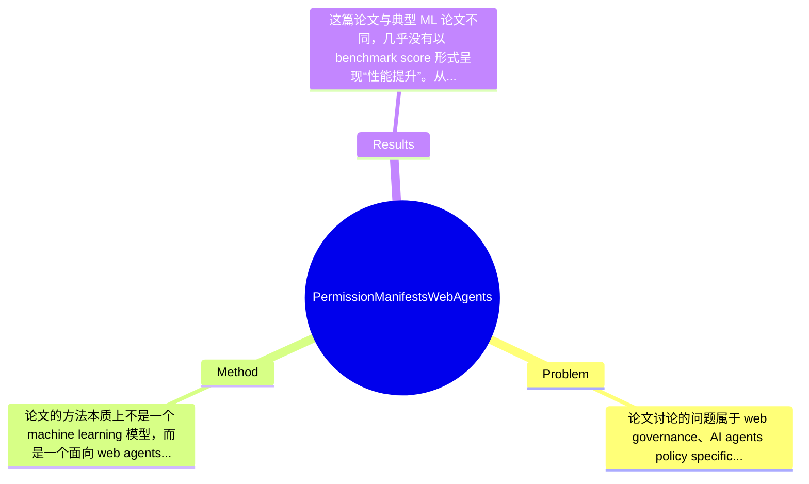

## Summary
这篇论文针对 LLM-based web agents 缺乏细粒度网站交互治理机制的问题，提出了一个类似 robots.txt 的轻量级标准 agent-permissions.json，用于声明资源访问、动作权限与 API 优先路径。其核心效果不是通过模型性能 benchmark 证明“更强”，而是提供一种低摩擦、可机器解析的合规协调框架，试图在网站全面封禁与完全放任之间建立中间层治理机制。

## Problem & Motivation
论文讨论的问题属于 web governance、AI agents policy specification 与 human-computer/web interaction 的交叉领域。具体来说，传统 robots.txt 主要面向 crawler/indexer 这类“读取型”自动化程序，而新一代 LLM web agents 已经能够执行搜索、导航、表单填写、事务提交乃至端到端任务完成，这使“是否允许访问页面”不再足够，网站真正需要表达的是“允许读什么、做到哪一步、在什么条件下可做”。这个问题重要，因为一旦缺乏标准化权限表达，网站只能采取 403、CAPTCHA、激进 rate limiting 等粗暴防御策略，结果是恶意流量和有益 agent 一并被拦截，损害自动化客服、电商辅助、无障碍工具、研究助手等应用的可行性。

现有方法的局限，论文点出了几类：第一，robots.txt 只能粗粒度地控制抓取路径，无法描述 submit、purchase、login、checkout 等动作级约束，更无法表达“允许查询但不允许确认支付”这类条件式权限。第二，AIPref、TDMRep、ai.txt、llms.txt 等更偏向数据使用、训练偏好或内容声明，主要回答“数据能否被抓/用于训练”，并不覆盖 agent interaction policy。第三，重量级替代方案如私有 API、合同接入、按次付费 crawl、MCP/A2A 等，虽然可控性更强，但接入成本高、部署复杂、难以成为开放 Web 的通用底层协调机制。

作者提出新方法的动机总体合理：如果没有一个足够轻量、低部署成本、可自动解析的标准，网站不太可能广泛采用，agent 框架也难形成统一合规行为。论文的关键洞察是：web agents 的治理不一定一开始就依赖强认证、强执行、强监管体系，先提供一个像 robots.txt 一样简单的 manifest，可以把“网站的偏好”结构化表达出来；即使 enforcement 不完美，它仍可作为合规 agent、反滥用系统和未来更强协议的基础协调层。

## Method
论文的方法本质上不是一个 machine learning 模型，而是一个面向 web agents 的权限声明协议。整体框架是：网站在固定可发现位置发布 agent-permissions.json，文件中以结构化 JSON 的形式声明资源级权限、动作级指南以及 API references；agent 在访问站点前读取并解析该 manifest，据此决定允许哪些页面读取、哪些 DOM/资源可提取、哪些动作可执行、哪些步骤需要 human approval，以及是否优先转向官方 API 而非直接操作前端界面。它试图把“网站政策”从非结构化 ToS/CAPTCHA/封禁策略，转成机器可执行的规范层。

1. 结构与可发现性（Structure and Discoverability）
- 作用：定义 manifest 的文件形态与部署位置，使 agent 能像查找 robots.txt 那样发现权限规则。
- 设计动机：如果发现机制不统一，agent 就需要为每个站点定制逻辑，标准失去意义；固定 discoverability 是低摩擦采用的前提。
- 与现有方法区别：不同于散落在 HTML、隐私政策或 API docs 中的非结构化说明，该设计强调一个统一 JSON 入口，便于 parser、browser automation framework 与 agent runtime 直接消费。

2. 资源与动作权限（Resource and Action Permissions）
- 作用：区分“读什么”和“做什么”两类权限。资源权限面向页面、端点、内容块；动作权限面向 click、form fill、submit、purchase 等行为。
- 设计动机：传统治理往往把访问看成单一事件，但对 web agents 来说，读取库存信息和下单支付的风险完全不同，必须分层表达。
- 区别：相较 robots.txt 只控制 crawl path，这里显式引入 action semantics，使 policy 可以覆盖 transaction-risk boundary。论文强调这正是 LLM agents 时代的新需求。

3. 资源规则：selectors、verbs、modifiers
- 作用：这是 manifest 的核心语法。selectors 用于匹配页面、URL、DOM 区域或资源对象；verbs 表示允许或禁止的操作类型；modifiers 进一步加上条件，如速率、身份、审批要求、用途限制等。
- 设计动机：网站往往不是想对整个站点一刀切，而是想表达细粒度政策，例如“允许读取商品详情页，但禁止抓取用户评论区中的某些字段”或“允许搜索，不允许提交订单”。只有 selector + verb + modifier 的组合，才能表达这类 nuanced policy。
- 与现有方法区别：比 robots.txt 更细，比纯 API allowlist 更开放。它保留了文本规则的轻量性，但增加了动作语义与条件控制。
- 技术细节：从目录标题看，selectors、verbs、modifiers 是独立定义的子模块，说明作者有意把语法设计成可扩展体系，而不是一次性硬编码少量命令。具体字段定义在给定摘录中未完整展示，故更细 JSON schema 论文节选未提及。

4. 动作指南（Action Guidelines）
- 作用：除了硬性 allow/deny 规则，论文还引入指南层，用来表达 softer constraints，例如某些高风险操作需 human approval、需用户在环、或需额外确认。
- 设计动机：真实网站 policy 不总是二元的。很多操作并非绝对禁止，而是希望 agent 在特定安全边界内执行，因此 guideline 比硬规则更贴近实际业务。
- 区别：现有 web policy 多是 legal prose，难被 agent 执行；这里尝试把 operational expectation 结构化。

5. API 作为首选路径（APIs as the Preferred Path）
- 作用：若站点已有正式 API，manifest 可以提供 API references，引导 agent 优先走稳定、可控、可审计的程序接口，而不是脆弱地操作 UI。
- 设计动机：前端自动化成本高、易破坏、也更可能触发安全风险。API-first 能减少页面抓取与界面操控带来的负担。
- 与现有方法区别：论文不是简单为 UI automation 开绿灯，而是把 manifest 作为“从开放网页过渡到正式接口”的协调器。

从设计选择上看，manifest 的“轻量 JSON + 可发现位置 + 规则化语法”是必须的，否则无法低成本部署；而 selectors 的粒度、modifiers 的丰富程度、是否需要身份认证字段，则明显有多种备选实现。简洁性方面，这个方案整体是比较克制和优雅的：它没有直接构造庞大的认证/结算/法律执行系统，而是先定义最小公共语言。但也因此带有明显的协议主义假设——默认 agent 愿意读取并遵守 manifest；对恶意或竞争性 agent，规范本身并不提供强 enforcement，只能成为后续封禁与审计的依据。

## Key Results
这篇论文与典型 ML 论文不同，几乎没有以 benchmark score 形式呈现“性能提升”。从提供的摘要和章节结构看，论文的“结果”主要是规范设计、分析与实现建议，而非在某个公开数据集上报告准确率、success rate 或 pass@k。因此严格来说，Benchmark 名称、评价指标、核心数字、提升百分比等信息，在当前给定文本中均为“论文未提及”。如果按用户要求强行列数字，会构成捏造，这里必须明确指出。

论文可识别的结果主要包括三类。第一，规范产出：作者给出了一个名为 agent-permissions.json 的 manifest 设计，包含 Structure and Discoverability、Resource and Action Permissions、Selectors/Verbs/Modifiers、Action Guidelines、API Specifications 等组成部分，并讨论了在 agent frameworks 与 website owners 侧的实现方式。第二，分析性结果：第 4 节专门讨论 Enforcement、Incentives、Strengths and Limitations，说明作者并未把该方案包装成“天然可执行”的完美标准，而是承认其效果依赖激励相容和合规生态。第三，实现性结果：第 5 节提到 Reference Library、Resource Rules、Action Guidelines、API Specifications 的实现，表明作者至少考虑了工程落地路径，但具体支持了哪些框架、代码仓库地址、覆盖哪些站点，当前节选未提及。

从批判性角度看，论文实验充分性明显不足，至少在给定内容中没有看到以下关键验证：1）真实网站部署试点，证明网站管理员能低成本编写并维护 manifest；2）真实 agent compliance study，验证不同 agent framework 是否能一致解析并遵守规则；3）安全红队测试，评估规则歧义、绕过空间与误执行风险；4）生态收益评估，如是否减少 CAPTCHA、403、误封率，或提升 accessibility/e-commerce automation 的完成率。是否存在 cherry-picking？由于论文几乎未展示定量实验，所以谈不上典型意义上的 cherry-picking；但也正因为缺少负面案例与部署数据，作者对实际采用难度的乐观程度仍需谨慎看待。

## Strengths & Weaknesses
这篇论文的最大亮点之一，是把问题定义得非常准确：它没有把 web agents 简化成“更聪明的 crawler”，而是指出其本质是可执行动作的自动化主体，因此治理对象必须从 URL 抓取扩展到 action permission。第二个亮点是设计上的克制与兼容性。agent-permissions.json 延续 robots.txt 的精神，用极低部署成本争取现实采用可能性，同时又通过 selectors、verbs、modifiers 提供比 robots.txt 更细粒度的表达能力。第三个亮点是 API-first 思路，避免把 UI automation 当成默认最优路径，这一点在工程和治理上都相对成熟。

局限性也很明显。第一，技术局限在于 enforcement 弱。manifest 本质是声明式规范，不是安全机制；恶意 agent 可以完全无视它，真正受约束的主要是本就愿意合规的参与者。第二，适用范围有限。对于高风险站点，如金融、医疗、政务、需要强身份验证和责任追踪的平台，仅靠公开 JSON manifest 很难满足审计、授权和合规要求。第三，规则表达可能存在语义歧义。不同 agent framework 对 selector 匹配、action mapping、human approval 的理解可能不一致，导致“同一 manifest，不同执行”，尤其在复杂动态页面上更明显。第四，数据与运维依赖不小。虽然写一个 JSON 看似简单，但真正维护与网站功能同步的权限规范、避免过期或错误配置，并不一定比维护 robots.txt 轻松多少。

潜在影响方面，这项工作更像是一个标准提案而非算法突破。若被采纳，它可能成为 web agent 合规交互的基础层，进一步连接 API economy、agent identity、payment、审计和政策执行机制。

已知：论文明确提出 agent-permissions.json，强调资源权限、动作权限、action guidelines 与 API references，并讨论 enforcement 与 incentives。推测：作者希望它成为类似 robots.txt 的行业协调标准，并可能配合 agent frameworks 自动执行。论文未证实这一标准的广泛部署效果。 不知道：真实采用网站数量、跨框架兼容性、用户研究结果、对反滥用系统的实际改善幅度、以及长期治理效果，当前文本均未涉及。

## Mind Map

## Notes
<!-- 其他想法、疑问、启发 -->
