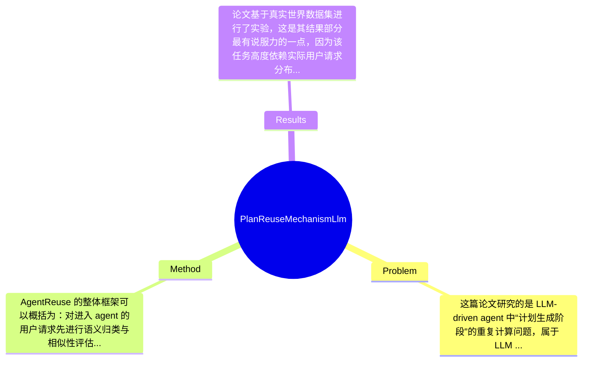

## Summary
论文针对 LLM-driven agent 在生成任务计划时延迟高、且大量请求具有重复/相似性的实际问题，提出了一个基于 intent classification 与 structured plan reuse 的计划复用机制 AgentReuse；该方法不直接在原始自然语言请求上做粗糙匹配，而是通过语义相似性评估与结构化计划表示来实现可复用计划检索与执行；在真实数据集上，作者报告其有效计划复用率达到 93%，请求相似性评估的 F1 为 0.9718、Accuracy 为 0.9459，并相对不使用复用机制的 baseline 将延迟降低了 93.12%。

## Problem & Motivation
这篇论文研究的是 LLM-driven agent 中“计划生成阶段”的重复计算问题，属于 LLM agent systems、AIoT personal assistant 与 semantic cache / reuse optimization 的交叉领域。具体而言，当用户向智能助手提交任务时，系统通常需要调用 LLM 将复杂请求分解为可执行 plan，再借助 API、搜索、设备控制等工具完成执行。问题在于，plan generation 往往是整条链路中最慢的一步，摘要中提到其延迟可达数十秒，这对语音助手、手机助手、智能家居控制等强交互场景尤其致命，因为这些场景对实时性要求远高于普通聊天系统。现实意义非常明确：如果能在不显著损害正确性的前提下复用历史计划，就能减少 LLM 调用成本、缩短用户等待时间、提升设备端交互体验，并可能降低云端推理压力。

现有方法的局限主要有三点。第一，若直接对原始 request text 做字符串级或表层语义匹配，很难处理自然语言中的多样表达，例如同一意图会有不同措辞、不同槽位组织方式，这会导致相似请求识别不稳定。第二，传统 semantic cache 往往更适用于问答响应复用，而不是 agent planning，因为 agent 的输出不是单一答案，而是包含子任务、参数依赖与工具调用顺序的 plan，复用条件更苛刻。第三，plan 本身如果是非结构化文本，就算检索到“相似”计划，也很难安全地参数替换并重新执行，容易出现步骤错配或工具调用错误。

论文的动机是合理的：作者观察到真实世界数据中约 30% 请求是相同或相似的，这说明复用空间是真实存在的，而不是人为构造出来的研究假设。其关键洞察在于，不应直接在原始请求文本层面做复用，而应先通过 intent classification 将请求映射到更稳定的语义/任务类型空间，再配合结构化 plan 表达来判断哪些部分可以复用、哪些参数需要更新。这个思路本质上是把“模糊自然语言匹配”转化为“半结构化任务匹配”，是该工作的核心创新来源。

## Method
AgentReuse 的整体框架可以概括为：对进入 agent 的用户请求先进行语义归类与相似性评估，判断它是否与历史请求属于可复用的同类任务；若满足条件，则从缓存中取出对应的历史 plan，并通过结构化表示进行参数适配后直接执行；若不满足，则回退到常规 LLM plan generation 流程，并将新生成的 plan 以可复用形式存入系统中。它本质上是插在“用户请求 -> LLM planning -> tool execution”链路前端的一层 reuse middleware。

1. 意图分类与请求相似性评估
该组件的作用是解决“什么请求算相似”这一根本问题。作者没有停留在原始文本 embedding 相似度上，而是强调利用 requests semantics 以及 intent classification 来评估相似性。这种设计动机很清楚：在 agent 任务中，决定 plan 能否复用的往往不是词面相似，而是任务骨架是否一致，例如“帮我订后天去北京的票”和“预订明天去上海的高铁”在词面差异较大，但意图框架接近。与现有直接文本匹配或一般 semantic cache 的区别在于，这里相似性判定是为“计划可复用性”服务，而非为“答案语义接近”服务，因此更偏任务级别的等价判断。论文给出的 F1=0.9718、Accuracy=0.9459 说明这一判定器是系统成立的关键支撑。

2. 历史计划缓存与复用触发机制
该组件负责维护可复用 plan 的存储、检索与命中逻辑。其作用不是简单 memoization，而是面向 agent workflow 的 plan repository。设计动机来自作者对真实数据的统计：约 30% 请求存在相同或相似模式，因此建立历史计划库具有显著价值。与传统 cache 最大区别在于，缓存对象不是最终 response，而是中间 planning artifact；这意味着即使外部环境变化，系统仍有机会通过重执行 plan 来获得最新结果，而不是返回过期答案。这一点比直接缓存完整响应更适合订票、查天气、控制 IoT 等动态任务场景。

3. Structured Plan Reuse
这是方法最值得关注的部分。作者明确提出“structured plan reuse”，其目标是克服 plan text 非结构化导致的复用困难。结构化表示的作用，一是把 plan 从自由文本转换为更清晰的步骤/槽位/工具调用形式，二是允许系统对变量部分进行替换，例如时间、地点、设备名等。设计动机是：若 plan 仍是自然语言段落，那么相似请求下复用历史 plan 仍需大量 LLM 理解，收益会被抵消。与现有方法的区别在于，这里不仅缓存了“做什么”，还尽量显式化了“按什么顺序做、哪些参数可变”。论文节选未给出完整 schema，因此其具体字段设计论文未提及，但从命名看，作者显然希望将可复用的计划模板化。

4. 回退与在线更新机制
一个实际可用的 reuse system 必须支持 miss 和失败恢复。虽然节选中没有给出完整算法伪代码，但从系统逻辑推断，AgentReuse 在未命中、低置信度或无法安全适配时，应回退到原始 LLM 生成流程，并把新 plan 纳入缓存。这种设计是必须的，否则系统覆盖面会过窄。相比完全依赖缓存的方案，这种 fallback 机制更稳健，也使复用机制可以渐进式积累历史知识。

5. 成本控制设计
论文专门设置了“Storage Extra Cost Analysis”和“Latency Extra Cost Analysis”，说明作者意识到复用系统本身也有代价。增加一个分类器、检索层和缓存存储，并不是零成本；因此方法的合理性不仅取决于命中率，还取决于额外开销能否远小于节省的 planning 成本。从摘要看，由于最终 latency 降低 93.12%，说明在作者实验环境下这层额外机制是值得的。

从设计选择上看，intent classification 和 structured representation 基本属于该方法成立的必要条件；而具体采用何种分类模型、相似度阈值设定、缓存组织方式，理论上都可以有其他实现。整体而言，这个方法概念上比较简洁：抓住高延迟 planning 阶段做中间结果复用，不算过度工程化。但如果落地到开放域 agent，结构化 plan schema、参数抽取、失效管理会迅速复杂化，因此其“优雅”更多体现在问题切入点，而不是已经完全解决所有工程难题。

## Key Results
论文基于真实世界数据集进行了实验，这是其结果部分最有说服力的一点，因为该任务高度依赖实际用户请求分布。摘要中给出的三组核心数字分别对应三类指标：第一，请求相似性评估方面，AgentReuse 达到 F1 score 0.9718、Accuracy 0.9459，说明其 intent-based similarity evaluation 在判定“是否可复用”时具有较高精度；第二，计划复用效果方面，有效 plan reuse rate 达到 93%，意味着被系统判定并执行复用的样本中，大多数能够成功复用历史 plan；第三，端到端效率方面，相比不使用复用机制的 baseline，latency 降低了 93.12%，这是论文最强的 headline result。

从 benchmark 角度看，文中明确说明实验基于 real-world dataset，但节选内容没有提供数据集名称、规模、类别分布、训练/测试划分方式，因此这些 benchmark 详情论文节选未提及。评价指标至少包括 F1、Accuracy、effective reuse rate 和 latency reduction；此外根据章节标题，作者还评估了 storage extra cost 与 latency extra cost，但具体数值在给定材料中未出现，只能标注为论文节选未提及。

对比分析方面，目前可明确比较的是“使用 AgentReuse”与“不使用 reuse mechanism”的 baseline：前者将时延压低 93.12%，这是数量级上的提升，而非边际改进。若按绝对比例理解，意味着 planning 成本被大幅摊薄。另一方面，F1 0.9718 与 Accuracy 0.9459 也说明系统不是靠激进复用换速度，而是在相似性判断上保持了较好可靠性。不过，论文节选没有给出与其他 semantic cache、embedding retrieval 或直接文本匹配方法的逐项对比数字，因此无法判断它相对更强 baseline 的优势是否同样显著。

消融实验方面，从章节结构推测，文中可能分析了结构化计划复用、存储开销、额外延迟等模块影响，但当前提供文本中没有明确的 component ablation 表格和数字，因此不能捏造。实验充分性上，这篇论文已经覆盖了准确性、复用率、端到端时延、额外成本几个关键维度，方向是对的；但仍缺少至少三类重要验证：一是跨 domain 或开放域泛化实验，二是错误复用带来的任务失败案例分析，三是随着环境变化导致历史 plan 失效时的鲁棒性测试。是否存在 cherry-picking 目前无法下结论；已知结果都偏正面，而对失败案例与误判代价披露不足，这是需要警惕的。

## Strengths & Weaknesses
这篇论文的亮点首先在于它抓住了 LLM-driven agent 中一个非常实际但常被忽略的瓶颈：不是所有优化都该放在 model 上，planning reuse 这种系统层优化在真实产品中可能更有性价比。第二个亮点是它没有简单套用 response cache 思路，而是针对 agent 的特殊性提出 plan reuse，且进一步意识到“自然语言 plan 不利于复用”，因此引入 structured plan reuse，这一点比纯粹 embedding retrieval 更贴近工程现实。第三个亮点是使用真实世界请求分布作为动机和实验基础，30% 相似请求这一观察让方案具有明确落地价值。

局限性也很明显。第一，方法高度依赖意图分类质量与任务分布稳定性；如果面对 multi-intent、组合任务、长尾新任务，历史计划很可能无法覆盖，甚至错误命中。作者在 discussion 中专门提到 Multi-Intent Classification，恰恰说明当前方案在复杂意图上仍有短板。第二，计划复用适用于“任务骨架稳定、参数变化有限”的场景，但对于开放式推理、强上下文依赖、工具调用路径受实时环境强烈影响的任务，复用价值会显著下降。第三，结构化 plan 的构建、缓存维护、版本管理、过期策略都可能带来额外工程成本；虽然论文分析了 storage 和 latency extra cost，但从节选看尚未充分讨论长期运行下缓存膨胀、工具 API 变化、外部环境漂移等问题。

潜在影响方面，这项工作对 personal assistant、AIoT agent、serverless agent runtime 都有参考意义。它提示研究者：agent 优化不仅是更强的 LLM，也可以是更聪明的中间状态复用。若与 workflow memory、tool execution trace、parameterized templates 结合，未来可能形成更系统的 agent compilation / caching 框架。

严格区分信息来源：已知——论文提出 AgentReuse，采用 intent classification 与 structured plan reuse，在真实数据上达到 F1 0.9718、Accuracy 0.9459、有效复用率 93%、时延下降 93.12%。推测——其结构化 plan 可能包含任务步骤、工具调用和参数槽位，且系统应包含 fallback 和增量缓存机制，但节选未展示完整算法。未知——数据集规模、具体模型架构、阈值设置、误复用失败率、跨领域泛化能力、与强 baseline 的精确对比数字，论文节选均未提及。综合来看，这是一篇有参考价值的系统优化论文，但尚未达到领域里程碑级别。

## Mind Map

## Notes
<!-- 其他想法、疑问、启发 -->
