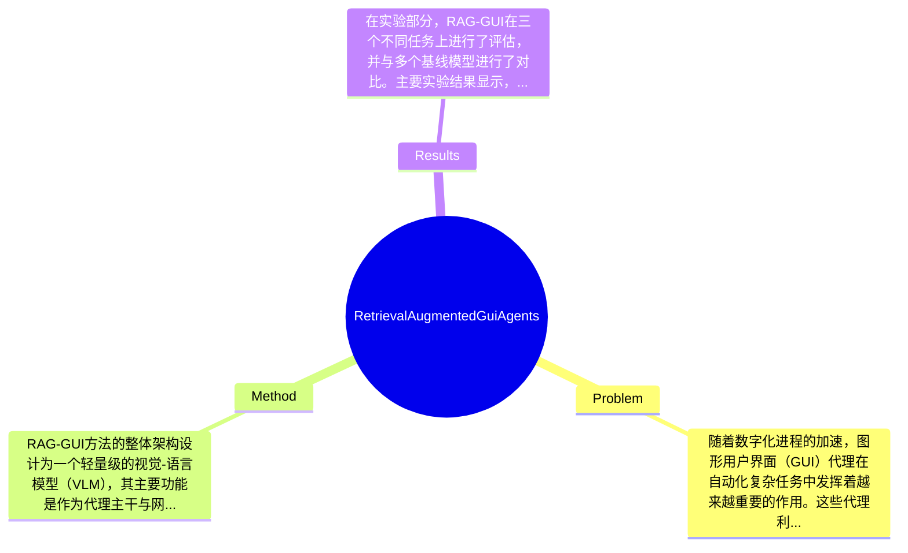

## Summary
提出了RAG-GUI方法来解决GUI代理在复杂数字任务中的适应性问题，通过利用网络教程在推理时增强模型能力，在多个任务上实现了2.6%到13.3%的性能提升。

## Problem & Motivation
随着数字化进程的加速，图形用户界面（GUI）代理在自动化复杂任务中发挥着越来越重要的作用。这些代理利用视觉-语言模型（VLMs）提升了对环境的理解和交互能力，但在实际应用中仍面临显著挑战。首先，复杂的多步骤任务需要丰富的知识背景，而现有的训练数据往往稀缺，导致模型在处理长尾知识和未见场景时表现不佳。其次，虽然一些研究尝试通过网络教程来生成合成数据以增强模型的训练，但这些合成数据的质量不一，限制了模型的灵活性和泛化能力。因此，如何有效利用网络教程来提升GUI代理的适应性成为了一个亟待解决的问题。本文提出的RAG-GUI方法旨在通过在推理时利用网络教程作为非参数知识库，来增强代理在多样化任务中的适应能力。该方法的核心创新在于将网络教程与任务相关性评估结合，生成针对性的指导，从而提升代理的任务完成能力。通过这种方式，RAG-GUI不仅解决了现有方法在处理复杂任务时的局限性，还为GUI代理提供了一种通用的增强模块，具有广泛的应用潜力。

## Method
RAG-GUI方法的整体架构设计为一个轻量级的视觉-语言模型（VLM），其主要功能是作为代理主干与网络教程之间的适配器，以增强代理在推理时的能力。该方法的关键组件包括：

1. **监督微调（SFT）**：RAG-GUI首先通过监督微调进行预热，利用教师VLM生成的合成相关性标签来启动学习过程。这一设计的动机在于，通过初步的监督学习，模型能够快速适应任务需求，并在此基础上进行进一步的优化。

2. **自指导拒绝采样微调（RSF）**：在初步微调后，RAG-GUI采用自指导拒绝采样的方法进行进一步的优化。该方法允许模型在生成指导时根据任务的相关性进行自我评估，从而提高生成指导的质量。这一设计与现有方法的区别在于，它不仅依赖于固定的训练数据，而是通过动态的反馈机制来提升模型性能。

3. **相关性评估模块**：该模块负责评估当前任务（包括查询和先前的操作）与给定教程之间的相关性。通过这种方式，RAG-GUI能够选择最适合当前任务的教程，从而生成更有针对性的指导。

4. **指导生成模块**：在确定相关教程后，该模块负责从中提取和生成有用的指导信息，帮助代理完成任务。这一设计确保了生成的指导信息不仅准确且具有实用性。

在技术细节方面，RAG-GUI采用了模型无关的设计，能够作为任何基于VLM的代理的插件，极大地提升了其适用性和灵活性。此外，RAG-GUI在设计上追求简洁性，避免了过度工程化，使得模型在实际应用中能够快速部署和使用。

## Key Results
在实验部分，RAG-GUI在三个不同任务上进行了评估，并与多个基线模型进行了对比。主要实验结果显示，RAG-GUI在两个模型规模上相较于基线模型的性能提升在2.6%到13.3%之间，具体数值取决于任务的复杂性和模型的初始状态。实验使用的基准包括标准的任务评估指标，如准确率和任务完成率，确保了结果的可靠性。此外，消融实验表明，SFT和RSF两个组件对模型性能的提升起到了显著作用，尤其是在处理复杂任务时，相关性评估模块的引入显著提高了生成指导的有效性。尽管实验结果令人鼓舞，但仍需注意的是，论文未提及是否存在选择性报告（cherry-picking）的问题，未来的研究应考虑更全面的实验设计以验证模型的普适性。

## Strengths & Weaknesses
RAG-GUI方法的亮点主要体现在以下几个方面：
1. **技术创新**：通过将网络教程作为非参数知识库，RAG-GUI有效地解决了传统VLM在处理复杂任务时的知识稀缺问题，提升了模型的适应性。
2. **设计优雅**：RAG-GUI的模型无关设计使其能够作为插件广泛应用于不同的VLM代理，增强了其灵活性和可扩展性。
3. **自指导机制**：通过自指导拒绝采样，模型能够动态调整生成的指导信息，提高了任务完成的成功率。

然而，该方法也存在一些局限性：
1. **技术局限**：RAG-GUI依赖于网络教程的质量和相关性，若教程信息不准确或不相关，可能会导致生成的指导信息失效。
2. **适用范围**：该方法在处理特定类型的任务时表现优异，但在某些高度专业化或极端复杂的任务中，可能仍需额外的领域知识支持。
3. **计算成本**：尽管RAG-GUI设计为轻量级，但在实际应用中，相关性评估和指导生成的计算开销可能会影响实时性能。

潜在影响方面，RAG-GUI为GUI代理的研究提供了新的思路，尤其是在如何利用外部知识库来增强模型能力方面。未来的应用方向可能包括更广泛的数字任务自动化和人机交互优化。

已知信息包括RAG-GUI的设计理念和实验结果；推测信息包括其在特定任务中的表现可能会受到教程质量的影响；未知信息则是关于该方法在更广泛场景下的适用性和长期效果，论文未对此进行深入探讨。

## Mind Map

## Notes
<!-- 其他想法、疑问、启发 -->
