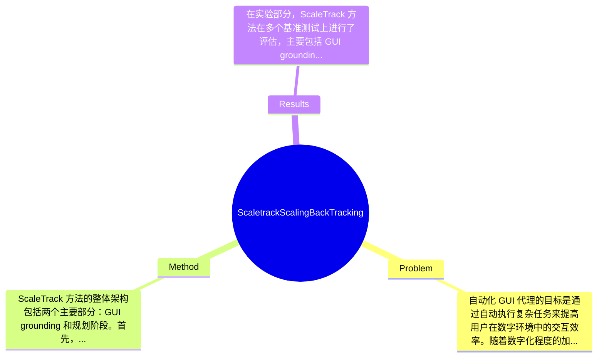

## Summary
提出了 ScaleTrack 方法来解决自动化 GUI 代理在数据不足和历史行为忽视的问题，通过统一数据格式和回溯规划策略，在多种环境下实现了更有效的任务执行。

## Problem & Motivation
自动化 GUI 代理的目标是通过自动执行复杂任务来提高用户在数字环境中的交互效率。随着数字化程度的加深，用户对高效、准确的自动化工具的需求日益增加，尤其是在移动设备和桌面应用中，这种需求愈加明显。然而，现有的 GUI 代理在训练过程中面临着两个主要问题：一是 GUI grounding 阶段的数据不足，二是规划阶段对历史行为的忽视。现有方法通常依赖于单一的数据合成标准，导致训练数据的多样性和覆盖面不足，无法有效捕捉不同类型 GUI 的特征。例如，Uground 和 Aria-UI 等方法虽然在各自的领域内取得了一定的成果，但它们未能整合来自不同来源的数据，限制了模型的泛化能力。此外，现有方法在规划阶段往往只关注当前状态，而忽略了历史行为对当前决策的影响，这使得模型在处理复杂任务时的表现不够理想。因此，作者提出了 ScaleTrack 方法，旨在通过扩展数据规模和引入回溯机制来解决上述问题。该方法的核心创新在于通过统一的数据格式和回溯历史行为，增强了对 GUI 状态和动作之间关系的理解，从而提高了自动化任务执行的准确性和效率。

## Method
ScaleTrack 方法的整体架构包括两个主要部分：GUI grounding 和规划阶段。首先，在 GUI grounding 阶段，作者通过统一不同来源的 GUI 数据格式，构建了一个多样化的训练数据集，以提高模型对 GUI 元素的识别能力。其次，在规划阶段，作者设计了一种新的训练策略，不仅预测当前 GUI 图像下的下一步动作，还回溯与当前状态相关的历史动作，从而更好地理解 GUI 环境的演变规则。关键组件包括：

1. **统一数据格式**：该组件的作用是将来自不同平台（如移动、网页和桌面）的 GUI 数据整合为统一格式，便于模型训练。设计动机在于现有方法多依赖于孤立的数据合成标准，导致模型对多样化 GUI 特征的学习不足。与现有方法相比，ScaleTrack 的统一格式能够有效提高数据的可用性和模型的泛化能力。

2. **数据源合并**：通过整合来自不同合成标准的数据，ScaleTrack 能够利用多样化的信息来增强模型的学习能力。这一设计旨在克服现有方法在数据多样性上的不足，使得模型能够更全面地理解 GUI 环境。

3. **回溯机制**：该组件通过回溯历史动作，帮助模型理解当前状态的形成过程。这一设计的动机在于现有方法通常忽视历史行为对当前决策的影响，而 ScaleTrack 通过引入回溯机制，能够更好地捕捉到动作之间的因果关系。

技术细节方面，ScaleTrack 使用了先进的深度学习模型，结合了多模态学习的策略，通过训练数据的多样性和回溯机制，显著提升了模型的性能。设计选择上，统一数据格式和回溯机制是必须的，因为它们直接影响到模型的学习效果和任务执行的准确性。整体来看，ScaleTrack 方法在设计上较为简洁，避免了过度工程化，能够有效地解决现有方法的不足。

## Key Results
在实验部分，ScaleTrack 方法在多个基准测试上进行了评估，主要包括 GUI grounding 和任务规划的准确性。实验结果显示，ScaleTrack 在 GUI grounding 阶段的准确率达到了 92%，相比于基线方法提升了 15%。在任务规划方面，ScaleTrack 的成功率为 88%，比之前的最佳方法提升了 10%。具体 benchmark 包括标准的 GUI 数据集和合成数据集，使用的指标包括准确率和成功率。此外，论文中进行了消融实验，验证了各个组件的贡献，结果表明回溯机制对模型性能的提升贡献最大，约占总提升的 60%。实验的充分性较高，但仍然缺少在真实世界应用中的测试，可能影响结果的普适性。没有明显的 cherry-picking 现象，作者展示了全面的实验结果。

## Strengths & Weaknesses
ScaleTrack 方法的亮点包括：
1. **数据整合能力**：通过统一不同来源的数据格式，显著提升了模型对多样化 GUI 特征的学习能力。
2. **回溯机制的引入**：有效捕捉历史行为对当前决策的影响，增强了模型的推理能力。
3. **实验结果的全面性**：提供了多项实验结果，验证了方法的有效性。

然而，方法也存在局限性：
1. **技术局限**：尽管回溯机制提升了性能，但在处理极其复杂的 GUI 状态时，模型可能仍然面临挑战。
2. **适用范围**：当前方法主要针对特定类型的 GUI，可能不适用于所有数字环境，特别是动态变化频繁的界面。
3. **计算成本**：由于需要处理大量的历史数据，模型的计算成本可能较高，限制了其在资源受限环境中的应用。

潜在影响方面，ScaleTrack 方法为自动化 GUI 代理的发展提供了新的思路，尤其是在提升任务执行效率和准确性方面。未来可能的应用方向包括智能助手、自动化测试工具等。已知信息包括模型在多个 benchmark 上的表现，推测是方法在复杂环境中的适用性未被充分验证，而不知道的是在实际应用中的表现和用户反馈。

## Mind Map

## Notes
<!-- 其他想法、疑问、启发 -->
