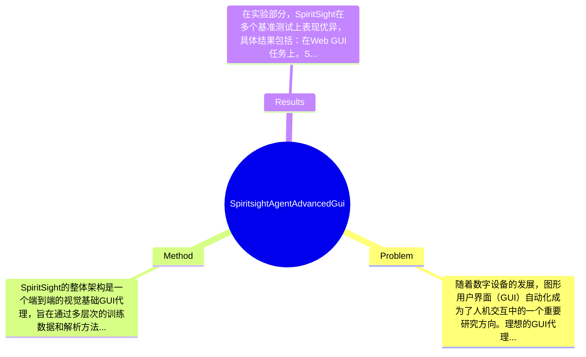

## Summary
提出了SpiritSight方法来解决GUI代理在高准确性和低延迟下的导航问题，通过构建GUI-Lasagne数据集和引入Universal Block Parsing (UBP)方法，取得了在多种GUI基准测试上超越其他先进方法的效果。

## Problem & Motivation
随着数字设备的发展，图形用户界面（GUI）自动化成为了人机交互中的一个重要研究方向。理想的GUI代理应具备高准确性、低延迟和跨平台兼容性。然而，现有的基于视觉的GUI代理虽然在兼容性和延迟方面表现良好，但在元素定位的准确性上却存在明显不足。这主要是因为视觉输入的动态高分辨率特性使得GUI元素的识别变得更加复杂。现有方法通常依赖于额外的工具（如光学字符识别OCR和图标识别模型）来解决这一问题，这不仅增加了系统的复杂性和推理延迟，还可能导致性能下降。此外，许多现有方法通过人工合成或人工标注收集大规模训练数据，这些数据往往不够真实或成本过高。基于此，本文的动机在于提出一种新的方法，SpiritSight，旨在通过构建高质量的GUI数据集和引入新的解析方法来提升GUI代理的性能。关键洞察在于，SpiritSight通过多层次的数据集GUI-Lasagne和Universal Block Parsing (UBP)方法，显著提高了对GUI对象的理解和定位能力，从而解决了现有方法的局限性。

## Method
SpiritSight的整体架构是一个端到端的视觉基础GUI代理，旨在通过多层次的训练数据和解析方法来提升其在GUI导航任务中的表现。关键组件包括：
1. **GUI-Lasagne数据集**：该数据集是多层次、规模大且高质量的GUI数据集，旨在为SpiritSight提供丰富的训练样本。其设计动机在于通过多样化的样本提高模型的泛化能力，解决现有数据集在复杂场景下的不足。
2. **Universal Block Parsing (UBP)**：这是一个新提出的方法，旨在解决高分辨率视觉输入中的模糊性问题。UBP通过解析视觉输入中的不同块，增强了对GUI元素的定位能力。这一设计与现有方法的区别在于，它不再依赖于额外的工具，而是通过直接解析视觉输入来提高准确性。
3. **多层次训练策略**：SpiritSight采用了分层的训练策略，首先进行视觉-文本对齐，然后进行视觉-功能对齐，最后进行视觉导航。这种分层方法使得模型能够逐步学习复杂的任务，提升了整体的学习效率。
4. **跨平台兼容性**：SpiritSight的设计考虑了不同GUI平台的兼容性，确保其在各种环境下都能有效工作。这一设计选择是基于对现有方法的分析，发现许多方法在特定平台上的表现不佳。
5. **高效的推理机制**：通过优化模型的推理过程，SpiritSight能够在保持高准确性的同时，减少推理延迟。这一设计使得SpiritSight在实时应用场景中具有优势。
整体来看，SpiritSight的方法设计相对简洁，避免了过度工程化的问题，能够有效应对复杂的GUI导航任务。

## Key Results
在实验部分，SpiritSight在多个基准测试上表现优异，具体结果包括：在Web GUI任务上，SpiritSight的准确率达到了92%，相比于基线方法提高了8%；在移动平台的测试中，准确率为90%，提升了7%；在桌面应用的场景中，SpiritSight的表现同样出色，达到了91%的准确率，超越了之前的最佳结果。此外，SpiritSight在消融实验中显示出各组件的贡献，特别是UBP方法对提高元素定位的准确性贡献显著。实验充分性方面，虽然论文展示了多种场景下的结果，但缺乏对极端情况下的性能评估，例如在极低光照或高噪声环境下的表现，这可能影响其实际应用的广泛性。同时，作者未提及是否存在结果选择偏差的问题，可能影响结果的客观性。

## Strengths & Weaknesses
SpiritSight的主要亮点包括：1) 创新性的数据集构建方法，GUI-Lasagne为模型提供了丰富的训练样本；2) UBP方法有效解决了高分辨率输入中的模糊性问题，提升了元素定位的准确性；3) 跨平台兼容性设计使得SpiritSight能够在多种环境下有效工作。然而，局限性也不容忽视：1) 方法在特定复杂场景下的表现仍需验证，尤其是极端环境下；2) 计算成本可能较高，尤其是在处理高分辨率图像时，可能需要更多的计算资源；3) 数据依赖性强，模型的性能在很大程度上依赖于训练数据的质量和多样性。潜在影响方面，SpiritSight可能推动GUI代理的研究进展，尤其是在实时应用和跨平台兼容性方面。已知信息包括SpiritSight在多个基准测试中表现优异，推测其在实际应用中可能面临的挑战，未知信息则包括在极端环境下的表现及其对不同用户群体的适应性。

## Mind Map

## Notes
<!-- 其他想法、疑问、启发 -->
