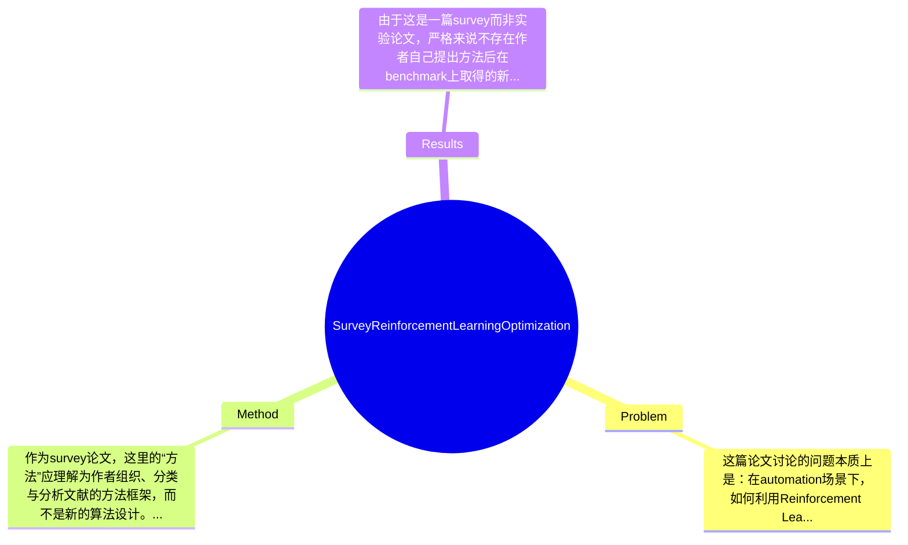

## Summary
该论文是一篇面向automation领域的综述，聚焦Reinforcement Learning（RL）如何用于manufacturing、energy systems与robotics中的优化问题，系统梳理了代表性应用、常见算法类型与关键挑战。其方法不是提出新模型，而是通过领域划分与问题导向的文献组织方式，总结RL在自动化优化中的能力边界、优势与失败风险。论文的主要贡献在于提供了一份跨领域的结构化综述框架，并明确提出sample efficiency、safety、interpretability、transfer与real-world deployment等未来研究主线。

## Problem & Motivation
这篇论文讨论的问题本质上是：在automation场景下，如何利用Reinforcement Learning解决复杂优化问题。该问题横跨控制、运筹优化、工业工程与智能系统等多个领域，典型任务包括production scheduling、process control、inventory management、energy dispatch以及robotic decision-making。之所以重要，是因为自动化系统中的优化往往具有动态性、不确定性、时序耦合和高维决策空间等特征，传统静态优化或基于精确模型的方法在真实工业环境中经常难以保持性能。现实意义非常直接：如果RL能稳定落地，就可能提升生产效率、降低能源消耗、改善机器人自主性，并增强系统对扰动和环境变化的自适应能力。

论文对现有方法的局限概括得比较到位。第一，传统数学规划与启发式/metaheuristics通常依赖较强的问题建模假设，在大规模、非平稳、实时决策场景下容易出现scalability不足的问题。第二，很多自动化任务难以获得精确环境模型，而经典控制或优化方法往往需要明确模型、约束或人工设计规则，迁移到新场景时需要大量专家介入。第三，单一任务导向的方法常常针对某一子问题有效，但缺乏跨domain的统一视角，导致研究碎片化，不利于总结通用瓶颈，例如安全性、样本效率和可解释性。

论文的动机是合理的：RL在多个自动化子领域已有大量工作，但缺少专门围绕“optimization in automation”这一交叉主题的系统综述。作者试图把manufacturing、energy systems和robotics放在同一框架下比较，进而提炼共同挑战。其关键洞察并不在于提出新的技术机制，而在于指出：RL在自动化中真正的核心难点并非单纯提升平均回报，而是如何在有限数据、高安全要求、强工程约束下实现可部署、可信赖、可迁移的优化能力。这一点抓住了学术论文与工业落地之间的真实鸿沟。

## Method
作为survey论文，这里的“方法”应理解为作者组织、分类与分析文献的方法框架，而不是新的算法设计。整体上，论文采用“应用域 + 共性挑战”的双层结构：先按manufacturing、energy systems、robotics三个自动化核心领域梳理RL优化应用，再在第三部分抽象出跨领域共性问题，如sample efficiency and scalability、safety and robustness、interpretability and trustworthiness、transfer learning and meta-learning，以及real-world deployment and integration。这种结构的优点是既保留行业场景差异，又能提炼RL在automation中的普遍规律。

1. 应用域划分框架
   该组件的作用是建立survey主线，将分散文献纳入三个高价值场景：制造、能源、机器人。这样设计的动机在于，这三类场景分别代表离散生产优化、连续资源调度与物理交互决策，是自动化中最典型且最具挑战性的RL落地方向。与很多仅按算法类别分类的综述不同，该文优先按应用域展开，更利于工程读者理解“问题—约束—方法”的对应关系。不过这种设计也有代价：跨领域共享的算法细节可能被弱化，算法层面的统一比较不够细。

2. 状态空间中的“优化任务”视角
   论文不是把RL当作通用智能工具泛泛而谈，而是明确强调其在optimization中的角色，例如scheduling、control、dispatch、resource allocation等。该组件的作用是把RL与automation传统问题连接起来，避免停留在算法成功案例的罗列。设计动机很清楚：工业界更关心RL是否能替代或增强既有优化器，而不是单纯是否在仿真中学到策略。与一些以benchmark score为中心的综述相比，这种问题导向的组织更贴近真实应用，但论文未提取统一的问题形式化模板，例如MDP定义、约束类型、奖励设计范式，导致不同文献间的可比性仍有限。

3. 共性挑战抽象模块
   第三部分是论文最核心的分析组件。作者将挑战总结为五类：sample efficiency and scalability，safety and robustness，interpretability and trustworthiness，transfer learning and meta-learning，real-world deployment and integration。其作用是把“RL为什么难以在自动化中大规模落地”明确化。这样设计的理由非常充分，因为这些问题在制造、能源和机器人中都反复出现。与很多只做文献列表式总结的survey不同，这一模块体现出更强的问题意识。尤其是将safety、trustworthiness和deployment单列，说明作者并未把automation当作纯学术仿真问题，而是放在实际系统约束中讨论。

4. 未来方向与解决策略归纳
   论文进一步讨论潜在解决路径，如提高样本效率、增强安全机制、利用transfer learning与meta-learning促进跨任务泛化等。该组件的作用是从“现状描述”走向“研究议程设定”。其设计动机是使survey不仅回顾过去，还能为后续研究提供路线图。与现有survey相比，这部分更具指导性，但从提供的文本看，具体技术路线仍偏概括，例如是否强调model-based RL、offline RL、safe RL、constrained RL、digital twin等并未充分展开，深度上可能不如专题性survey。

5. 综合 bibliography 资源整理
   作者强调提供comprehensive bibliography，这对survey类论文很重要。其价值在于帮助研究者快速建立文献地图，尤其适合入门和跨学科读者。与方法论文不同，这一设计更多体现资料整合能力。缺点是，如果缺少明确纳入/排除标准、检索范围和分类准则，就可能影响综述的系统性与可复现性；从给出的内容看，论文未明确说明是否遵循systematic review protocol。

从技术细节角度看，这篇论文更多是概念与文献层面的梳理，而非算法推导型综述。其框架总体简洁、清晰，不算过度工程化；但也因为追求广覆盖，导致算法比较维度、任务设定统一性与定量meta-analysis较弱。换言之，它是一篇“结构清楚的 broad survey”，而不是“技术深挖型 survey”。

## Key Results
由于这是一篇survey而非实验论文，严格来说不存在作者自己提出方法后在benchmark上取得的新SOTA结果。根据提供内容，论文的“结果”主要体现在文献综述范围、问题分类和挑战归纳，而不是具体数值性能。因此，若按标准研究论文的Results框架评价，其可量化实验结果基本为“论文未提及”。摘要与引言明确说明其覆盖的benchmark/应用面包括manufacturing、energy systems和robotics，但没有给出统一实验平台、统一指标，亦未提供诸如平均reward、success rate、energy saving percentage、makespan reduction等汇总数字。

从“主要实验”角度看，论文并未报告新的实验；它更多引用代表性工作来说明RL在不同自动化场景中的有效性。遗憾的是，在当前提供的文本片段中，没有看到具体被综述论文的名称、benchmark名称、评价指标和数值对比，因此无法准确列出“2-3个核心实验及其结果（具体数字）”。按用户要求，不能捏造信息，因此这里必须明确标注：具体benchmark详情、指标、数值、提升百分比，论文片段中均未提及。

若批判性评价实验充分性，这篇文章作为survey的不足在于：第一，似乎没有采用systematic review常见的定量统计方式，例如按年份、任务类别、算法类别、指标类别做分布分析；第二，没有看到统一表格比较不同RL方法在automation任务中的效果、数据需求、训练成本和安全约束；第三，没有meta-analysis式的结论来支持“哪些方法在什么条件下更优”。这意味着读者能获得宏观认知，但很难直接据此做方法选型。

关于是否存在cherry-picking，当前文本无法直接证明作者只展示了成功案例，因为survey通常会引用代表性工作；不过从摘要与引言措辞看，作者同时强调了constraints与challenges，而非只宣称RL成功，因此主观上并不像明显的宣传式综述。真正的问题不是cherry-picking，而是“负结果/失败案例呈现不足”：如果没有系统纳入RL在工业部署中的失败经验、训练不稳定案例或安全事故风险，那么对读者而言仍会形成偏乐观印象。这一点是该survey在结果层面最需要补足的。

## Strengths & Weaknesses
这篇论文的亮点首先在于选题定位准确。它不是泛泛而谈RL综述，而是把焦点放在“optimization in automation”，使manufacturing、energy systems和robotics这三类原本分散的研究在同一工业语境下被重新组织起来。这种 framing 很有价值，因为自动化领域最关心的不是算法是否新颖，而是是否能解决带约束、带不确定性、带实时性的优化问题。第二个亮点是挑战归纳较有现实感。sample efficiency、safety、interpretability、transfer、deployment 这些问题都是RL工业落地的关键障碍，作者没有沉迷于仿真性能，而是强调可信与可部署性，这一点优于很多偏学术demo导向的综述。第三，作为入门资料，它的结构清晰、覆盖面广，适合研究者快速建立领域地图。

局限性也很明显。第一，技术深度有限。当前文本显示论文更多是 broad survey，而不是针对safe RL、offline RL、model-based RL、hierarchical RL等路线进行细粒度拆解，因此对已经熟悉该方向的研究者来说，增量可能不算大。第二，缺少定量比较与系统综述规范。论文未提及文献检索策略、纳入排除标准、统计方法，也缺乏统一benchmark与指标汇总，这会削弱其结论的客观性和可复查性。第三，适用范围上，它虽然覆盖三大领域，但对其他automation重要方向如process industries、logistics、supply chain cyber-physical systems等是否纳入，论文片段中看不出来，可能存在覆盖边界。第四，若面向工业实践者，计算成本、数据需求、仿真到现实的集成成本如果没有专门展开，则实操指导价值会受限。

潜在影响方面，这篇论文更像一篇“路线图型”综述：它能帮助学界统一问题意识，也能提醒工程界关注RL落地中的系统性风险。对于初入该交叉领域的研究者，它有较强参考价值；对资深研究者，则更多提供结构化整理，而非新的理论突破。

已知：论文明确覆盖manufacturing、energy systems、robotics三大应用域，并总结五类共性挑战。推测：作者希望把RL从算法研究推进到可部署的automation optimization框架，但这一目标更多体现在叙事层面。 不知道：论文是否包含严格的文献筛选流程、具体表格统计、代表性论文定量汇总、以及对失败案例的系统分析，当前提供内容未说明。

## Mind Map

## Notes
<!-- 其他想法、疑问、启发 -->
