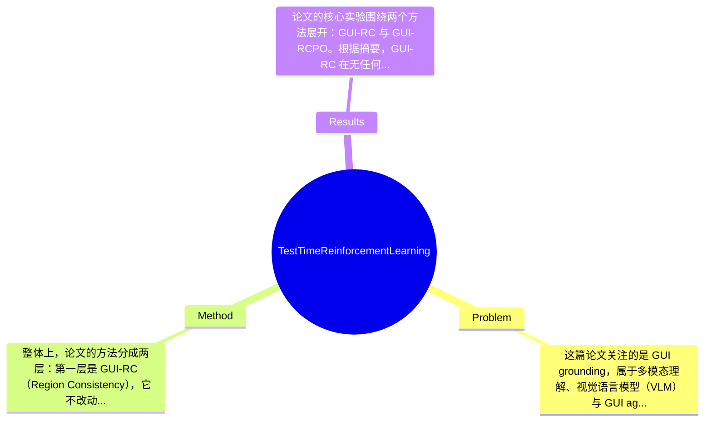

## Summary
该论文研究 GUI grounding，即将自然语言指令定位到屏幕精确坐标的问题，提出了基于多次采样空间一致性的 test-time scaling 方法 GUI-RC，以及进一步将一致性转化为无标注 test-time reinforcement learning 奖励的 GUI-RCPO；在无需额外像素级标注的条件下，GUI-RC 在 ScreenSpot 上带来约 2-3% 提升，GUI-RCPO 仅用 1,272 条无标注数据即可取得约 3-6% 提升，并表现出一定 OOD 泛化能力。

## Problem & Motivation
这篇论文关注的是 GUI grounding，属于多模态理解、视觉语言模型（VLM）与 GUI agent 交叉领域中的基础问题：给定一张界面截图和一条自然语言指令，模型需要输出对应 GUI 元素的精确位置，通常是 point 或 bbox。这个问题之所以重要，是因为它直接决定了 GUI agent 能否正确点击、输入或操控界面，是自动化执行的前提能力。如果 grounding 错了，后续规划、执行、工具调用再强都没有意义。现实中，它可用于手机/电脑自动化、无障碍交互、软件测试、企业流程自动执行等场景，因此既有研究价值也有落地价值。

现有方法主要依赖两类路线：一类是 supervised fine-tuning，在大量带 pixel-level annotation 的数据上训练；另一类是 reinforcement learning，但往往仍需人工设计或标注 reward。这些方法有几个具体不足。第一，像素级标注成本高，尤其 GUI 元素密集、层级复杂时，标注和迁移到新 app/domain 的代价很大。第二，主流工作几乎把优化都放在 train time，推理时通常只做一次或少量采样，没有利用 test-time computation 去挖掘模型自身的不确定性与隐式置信度。第三，GUI grounding 常出现 hallucination 或偏置预测，单次输出难以判断是否可靠，而现有方法缺少一种无需标注即可在测试时自校正的机制。

论文动机是合理的：如果同一个模型对同一目标进行多次采样，这些预测之间的空间重合模式本身就包含“共识”信息。作者的关键洞察在于，不必依赖外部真值标签，也可以利用多次预测的一致性来估计哪个区域更可信；进一步，这种一致性不仅可用于推理时投票，还可以反过来作为 reward，在无标注数据上进行 test-time reinforcement learning。这个思路的创新点不在于发明全新的 grounding backbone，而在于把“区域一致性”提升为一种可计算、可优化、可泛化的 inference-time 信号。

## Method
整体上，论文的方法分成两层：第一层是 GUI-RC（Region Consistency），它不改动原模型参数，而是对同一输入进行多次采样，收集多个 point/bbox 预测，并通过空间 voting grid 统计这些预测在图像平面上的重叠程度，从而找到模型最一致的候选区域；第二层是 GUI-RCPO（Region Consistency Policy Optimization），它将这种区域一致性进一步定义为 reward，对模型在测试阶段利用无标注数据进行 reinforcement learning，使模型逐步偏向输出与集体共识更一致的预测。

关键组件可分为以下几部分：

1. 多次采样预测机制。
其作用是为单个指令-截图对生成一组候选定位结果，而不是依赖一次 greedy decoding。设计动机很直接：如果模型本身具备一定 grounding 能力，那么不同采样结果虽然会有噪声，但正确区域附近通常会形成更高密度的空间聚集。与传统单次解码不同，这里把采样视为一种 test-time scaling 资源，用额外计算换更稳健的定位。论文还分析了 decoding strategy、temperature、sampling number，说明该方法对采样分布有一定依赖。

2. 空间一致性投票网格（spatial voting grids）。
这是 GUI-RC 的核心。其作用是把多个预测映射到统一的二维空间上，并统计每个区域被多少候选覆盖或支持。若是 bbox-style 预测，区域重叠可以较自然地转化为 voting heat；若是 point-style，信息则更稀疏，因此提升有限。设计动机在于把“候选之间是否相似”转化为“空间上哪些区域被反复指向”，从而避免直接依赖模型输出的文本置信度。与现有方法相比，这不是学习一个额外 reranker，也不是靠外部 verifier，而是纯粹基于预测几何关系做无训练聚合。

3. 共识区域选择与最终 grounding 输出。
在 GUI-RC 中，模型最终输出不是简单多数投票某个离散答案，而是从 voting grid 中寻找一致性最高的区域，再转成最终 point 或 bbox。这个设计特别适合 GUI grounding，因为目标本来就在二维空间中，局部共识比 token-level 一致性更自然。必要设计在于必须有一种从多个候选中提取“空间中心”的机制；但具体形式未必唯一，也可以想象用 kernel density estimation、mean-shift clustering、Gaussian heatmap aggregation 等替代。论文主张其方法简洁，可直接叠加在不同架构上。

4. Region Consistency Reward。
GUI-RCPO 的关键是把“单个预测与集体共识对齐得多好”定义成 reward。根据摘要和附录标题，这一 reward 函数有伪代码，核心思想是：若某次采样结果落在高共识区域内，则得到更高奖励；偏离集体一致性的结果奖励更低。其作用是为无标签测试样本提供自监督式优化信号。设计动机是避免使用人工标注 reward，同时利用模型自身生成的结构化不确定性。与标准 RLHF 或需要环境交互成功信号的 GUI RL 不同，这里 reward 完全来自 prediction set 内部。

5. Test-time reinforcement learning 优化。
GUI-RCPO 在推理时用少量无标注数据做 policy optimization，论文称仅用 1,272 条数据即可有效提升。其本质是 test-time training / test-time RL：边推理边适配当前分布。论文强调 GUI-RCPO 由 GUI-RC 监督，但性能又超过 GUI-RC，说明 reward 不只是静态 reranking，而是在参数层面改善了模型的后续输出分布。进一步地，论文还发现 GUI-RCPO 后再应用 GUI-RC 还能继续提升，表明二者一个偏参数适配，一个偏输出聚合，具有互补性。

从方法风格看，这项工作总体较简洁，不属于重工程堆叠。最优雅之处在于把“多次采样的一致性”同时用于 inference aggregation 和 policy reward，形成统一视角。不过它的有效性显然建立在一个前提上：模型的多次采样必须在正确区域附近存在可利用的聚集，否则一致性可能只会放大错误共识。这也是该方法最关键的适用边界。

## Key Results
论文的核心实验围绕两个方法展开：GUI-RC 与 GUI-RCPO。根据摘要，GUI-RC 在无任何额外训练的情况下，在 ScreenSpot benchmarks 上对多种架构带来约 2-3% 的准确率提升；GUI-RCPO 在仅使用 1,272 条无标注数据进行 test-time reinforcement learning 后，带来约 3-6% 的提升。这说明作者不仅验证了 inference-time aggregation 有效，也验证了 consistency reward 可转化为参数更新收益。

benchmark 方面，文中明确提到主要在 ScreenSpot benchmarks 上评估，但从给定材料中无法恢复更细的子 benchmark 名称、完整指标定义和逐模型绝对数值，因此这部分只能谨慎描述：指标应为 grounding accuracy 或 end-to-end grounding performance，论文强调了 GUI-RC “consistently improves the end-to-end grounding performance”。若需精确表格数字，当前材料不足，论文未在提取文本中完整给出。

对比分析上，作者指出 GUI-RC 对 bbox-style prediction models 的提升更明显，这与方法机制高度一致，因为 bbox 重叠更容易形成稳定的一致性区域；相反，论文在 limitations 中承认 point-style grounding 的增益有限。对于 GUI-RCPO，作者称其“supervised by GUI-RC yet outperforms it”，说明将一致性信号做成 RL reward 比单纯 test-time voting 更强；此外还声称其在 out-of-distribution 场景下泛化良好，这一点如果实验成立，说明它不只是对测试集分布做了局部过拟合。

消融方面，文中明确列出了针对 GUI-RC 的 decoding strategy、temperature、sampling number、超参数 α 的分析，也有 GUI-RCPO 在 test-time training 中持续改进、以及 GUI-RCPO 后叠加 GUI-RC 进一步提升的实验。这些消融是有价值的，因为它们直接检验了方法依赖哪些条件。批判性来看，实验仍有两个不足：第一，当前摘要未显示计算开销与准确率的 trade-off，例如采样次数增加多少才值得；第二，OOD 评测虽被提及，但缺少更细分的 failure case 展示。就目前信息看，作者没有明显 cherry-picking，因为同时报告了 point-style 增益有限和依赖模型固有能力等限制，但完整论文表格仍需核验是否所有模型/数据集都同样稳定收益。

## Strengths & Weaknesses
这篇论文的亮点首先在于视角新：它没有继续沿着“更多标注、更多训练”路线走，而是把 GUI grounding 中被忽视的 test-time computation 利用起来，用 region consistency 作为无标注信号。这一点与现有大量依赖 pixel-level annotation 的方法形成明确区分。第二个亮点是统一性强：同一个核心信号既能做 GUI-RC 的推理期 spatial voting，又能做 GUI-RCPO 的 RL reward，方法论连贯，不是彼此割裂的模块拼接。第三个亮点是实用性不错：无需改 backbone、可用于多架构、且仅用 1,272 条无标注数据就能取得 3-6% 提升，这对真实场景中的低标注适配很有吸引力。

局限性也很明确。第一，技术上它依赖“正确答案附近会形成预测共识”这一假设；如果模型本身存在系统性偏差，多次采样可能只是重复同一种 hallucination，一致性反而会强化错误。论文附录提到它能缓解部分 hallucination，但并不能保证对所有错误模式都有效。第二，适用范围上，方法对 bbox-style 更友好，而 point-style grounding 提升有限，这是论文已明确承认的限制，说明其几何归纳偏置并非普适。第三，计算成本不可忽视：GUI-RC 需要多次采样，GUI-RCPO 还涉及 test-time RL 更新，推理延迟、显存与部署复杂度都会上升；当前提取内容未给出系统级成本评估。第四，它依赖模型“固有能力”，如果底座模型初始 grounding 很弱，consistency 可能没有足够信息量，test-time 优化空间也有限。

潜在影响方面，这项工作对 GUI agent 领域的贡献在于提出了一条与 train-time scaling 并行的路线：用 test-time scaling/test-time training 提升 grounding，而不是一味增加标注和预训练数据。它也可能启发更广泛的 VLM 定位任务，如 referring expression grounding、文档元素定位、多步 UI 操作中的 self-refinement。

严格区分信息来源：已知——GUI-RC 无训练提升约 2-3%，GUI-RCPO 用 1,272 条无标注数据提升约 3-6%，对 bbox-style 更有效，point-style 增益有限，且依赖模型 inherent capabilities。推测——该方法在界面布局相对规则、候选元素密集但语义聚焦的场景会更有效；在高度歧义或视觉相似元素极多时，可能出现错误共识。 不知道——完整 reward 数学定义、各模型逐项绝对结果、训练开销曲线、与更强 verifier/reranker baseline 的全面比较，当前材料均未完整提供。

## Mind Map

## Notes
<!-- 其他想法、疑问、启发 -->
