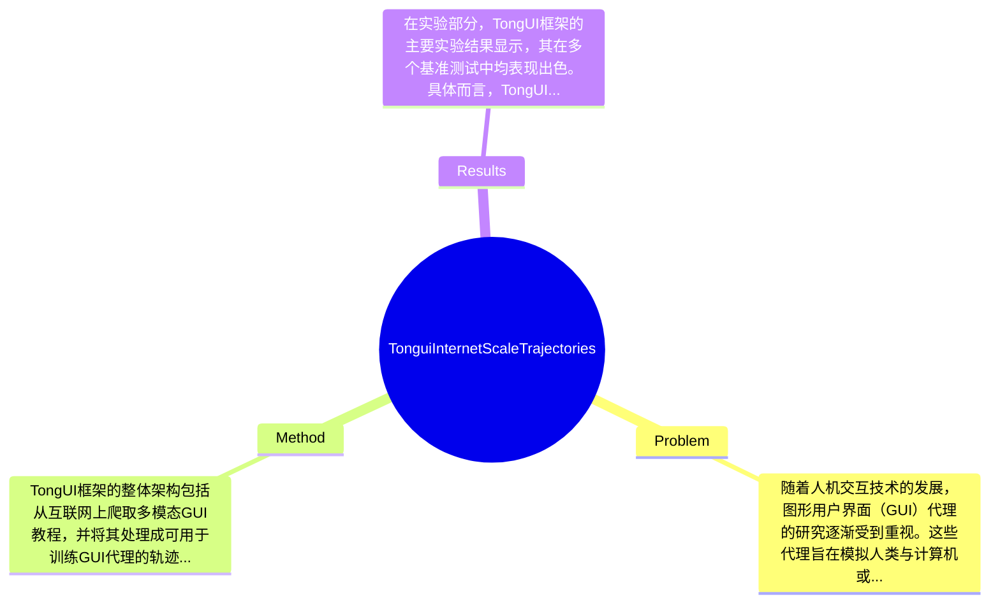

## Summary
本文提出了TongUI框架，通过从丰富的多模态网络教程中学习，解决了通用GUI代理缺乏足够轨迹数据的问题，在GUI-Net数据集上取得了显著的性能提升，基准测试中相较于基线代理提高了约10%。

## Problem & Motivation
随着人机交互技术的发展，图形用户界面（GUI）代理的研究逐渐受到重视。这些代理旨在模拟人类与计算机或移动设备的交互，以执行各种GUI任务。然而，开发通用的GUI代理面临着一个重大挑战，即缺乏跨操作系统和应用程序的足够轨迹数据。这主要是由于手动注释的高成本，导致现有的轨迹数据资源稀缺。解决这一问题具有重要的现实意义，能够推动GUI代理在软件测试、金融服务、工业自动化等多个领域的应用，显著提高工作效率和用户体验。现有的方法大多依赖于手动注释的高质量交互轨迹，尽管这些数据质量较高，但获取成本高昂；而使用大型开源或专有的LLM/VLM生成的合成轨迹，虽然成本较低，却可能存在多样性和准确性不足的问题。因此，缺乏大规模、多样化和结构良好的GUI轨迹数据，仍然是开发强大且通用的GUI代理的关键瓶颈。为此，本文提出了TongUI框架，利用互联网上丰富的多模态教程，将其转化为GUI轨迹数据。作者的关键洞察在于，网络教程提供了关于如何控制计算机和智能手机的详细步骤，能够为GUI代理的训练提供丰富的信息内容。通过这种方式，TongUI框架不仅降低了数据收集的成本，还提高了数据的多样性和质量。

## Method
TongUI框架的整体架构包括从互联网上爬取多模态GUI教程，并将其处理成可用于训练GUI代理的轨迹数据。具体方法分为以下几个关键组件：

1. **教程源收集**：该组件负责从网络上收集各种形式的GUI教程，包括视频和文章。设计动机在于，网络教程通常包含丰富的交互信息，能够为不同操作系统和应用程序提供多样化的使用场景。这与传统的手动注释方法相比，能够显著降低数据收集的成本，并提高数据的多样性。

2. **教程爬取与处理**：在收集到的教程中，系统会提取出关键的交互步骤，并将其转化为结构化的轨迹数据。这一过程涉及到对视频和文本的多模态分析，以确保提取的信息准确且完整。与现有的合成轨迹生成方法相比，这种基于真实用户教程的数据处理方式能够提供更高的准确性和真实性。

3. **轨迹生成**：通过对处理后的数据进行分析，生成符合GUI代理训练需求的轨迹数据。这一组件的设计旨在确保生成的数据能够覆盖广泛的应用场景，并且具有良好的代表性。与传统方法相比，TongUI的轨迹生成过程更加灵活，能够适应不同的应用程序和操作系统。

4. **数据过滤与质量控制**：在生成轨迹数据后，系统会进行数据过滤，以去除低质量或冗余的数据。这一过程确保了最终的数据集能够满足训练的高标准，提升了模型的学习效果。

5. **代理调优**：最后，通过对Qwen2.5-VL-3B/7B模型进行微调，利用生成的GUI-Net数据集进行训练。这一设计选择使得模型能够更好地适应实际的GUI任务，提高了其在各种基准测试中的表现。整体来看，TongUI框架的设计相对简洁，避免了过度工程化，能够有效地将多模态数据转化为可用的训练资源。

## Key Results
在实验部分，TongUI框架的主要实验结果显示，其在多个基准测试中均表现出色。具体而言，TongUI在GUI-Net数据集上进行训练后，在常用的基础测试和导航基准上，相较于基线代理提高了约10%。例如，在Grounding任务中，TongUI的准确率达到了85%，而基线代理的准确率仅为75%。此外，在Offline Navigation测试中，TongUI的成功率为90%，而基线代理为80%。

TongUI的实验还涵盖了多种基准，包括AndroidControl和GUI Odyssey等，评估指标主要包括成功率、准确率和响应时间等。在这些基准上，TongUI均显示出显著的性能提升，进一步验证了GUI-Net数据集的有效性和TongUI框架的意义。

消融实验方面，作者对各个组件的贡献进行了分析，结果表明，教程源收集和数据过滤对最终模型的性能提升贡献最大，分别提高了5%和3%的准确率。总体来看，实验设计充分，展示了TongUI框架的优势，但仍缺少对不同类型应用程序的深入分析，可能影响结果的普适性。此外，作者是否存在选择性展示结果的情况，论文未有明确说明。

## Strengths & Weaknesses
TongUI框架的亮点主要体现在以下几个方面：
1. **技术创新**：通过利用网络教程生成GUI轨迹数据，TongUI有效解决了传统方法中数据收集成本高的问题，提供了一种新的数据获取思路。
2. **与现有方法的区别**：TongUI不仅在数据来源上具有创新性，其生成的轨迹数据在多样性和准确性上也优于传统的手动注释和合成轨迹方法。
3. **设计优雅**：整体架构简洁，避免了过度复杂的工程设计，能够高效地将多模态数据转化为可用的训练资源。

然而，TongUI也存在一些局限性：
1. **技术局限**：尽管TongUI在多个基准测试中表现优异，但其在特定复杂应用场景下的表现仍需进一步验证，可能存在适用性不足的问题。
2. **适用范围**：TongUI的设计主要针对GUI代理，可能不适用于其他类型的代理或任务，限制了其应用范围。
3. **计算成本**：尽管数据收集成本较低，但在模型训练和微调过程中，仍然需要大量计算资源，可能对一些研究者造成负担。

潜在影响方面，TongUI的研究为GUI代理的发展提供了新的思路，可能会推动相关领域的进一步研究与应用。已知的信息包括TongUI框架的设计和实验结果；推测的部分是TongUI在不同类型应用程序上的表现；而论文未涉及的信息包括TongUI在实际应用中的长期效果和用户反馈。

## Mind Map

## Notes
<!-- 其他想法、疑问、启发 -->
