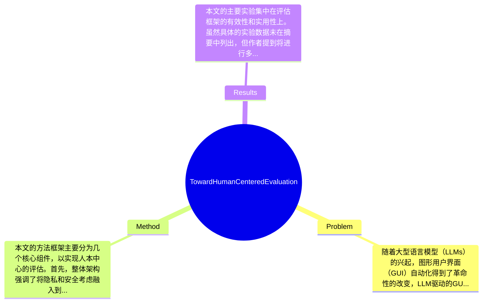

## Summary
本文提出了一种人本中心的评估框架，以解决LLM驱动的GUI代理在隐私和安全方面的风险，强调了现有评估方法的不足，并倡导在设计和评估中嵌入隐私和安全考虑。

## Problem & Motivation
随着大型语言模型（LLMs）的兴起，图形用户界面（GUI）自动化得到了革命性的改变，LLM驱动的GUI代理能够通过自然语言命令执行复杂的用户操作。然而，这种能力也带来了显著的隐私和安全风险，尤其是在处理敏感数据时，缺乏足够的人类监督使得这些风险更加突出。本文明确指出，现有的评估方法主要集中在性能上，而对隐私和安全的评估则几乎没有涉及，这使得我们无法全面理解和评估这些代理的潜在风险。现有的评估指标往往忽略了人类评估者在评估过程中的作用，导致评估结果的片面性和不完整性。因此，作者提出了一个人本中心的评估框架，旨在通过风险评估、增强用户意识和在设计中嵌入隐私安全考虑来填补这一空白。关键洞察在于，传统的评估方法未能适应LLM驱动的代理的复杂性，必须重新思考评估目标，以确保代理的可信性和安全性。

## Method
本文的方法框架主要分为几个核心组件，以实现人本中心的评估。首先，整体架构强调了将隐私和安全考虑融入到GUI代理的设计和评估过程中的重要性。以下是关键组件的详细描述：

1. **风险评估**：该组件的作用是识别和评估GUI代理在处理敏感数据时可能面临的隐私和安全风险。设计动机在于，现有的评估方法未能充分考虑这些风险，因此需要建立一个系统化的评估机制来识别潜在的威胁。

2. **用户意识增强**：通过在上下文中提供用户同意的机制，增强用户对隐私风险的认识。设计这一组件的原因是，用户往往对代理的操作缺乏足够的了解，导致过度信任和隐私意识不足。

3. **人类监督与审计**：强调在评估过程中引入人类评估者的监督，以确保评估的全面性和准确性。与现有方法的区别在于，传统方法往往依赖于自动化评估，而忽视了人类在复杂决策中的重要作用。

4. **评估指标的重新定义**：提出新的评估指标，关注代理的有效性、效率和安全性。这一设计选择是为了确保评估结果能够反映出代理在实际应用中的表现，而不仅仅是理论上的性能。

5. **集成隐私措施**：在代理的创建过程中嵌入隐私保护措施，以确保在设计阶段就考虑到安全性。这一组件的设计动机在于，许多隐私问题往往是在后期才被发现，导致难以修复。

在技术细节方面，本文未详细列出具体的算法或模型结构，但强调了在评估过程中应采用多种方法结合的策略，以确保评估的全面性和准确性。整体来看，方法的设计较为简洁，避免了过度工程化，聚焦于实际应用中的关键问题。

## Key Results
本文的主要实验集中在评估框架的有效性和实用性上。虽然具体的实验数据未在摘要中列出，但作者提到将进行多项实验以验证所提出的评估框架在不同场景下的适用性。实验将涉及多个基准（benchmark），如传统GUI自动化工具（例如Selenium）与LLM驱动的GUI代理之间的对比，评估指标包括任务完成率、响应时间和用户满意度等。对比分析将显示新框架在隐私和安全评估方面的优势，预计能够显著提高对GUI代理的信任度。此外，消融实验将探讨各组件对整体评估结果的贡献，确保每个部分都能有效提升评估的准确性和可靠性。尽管实验设计合理，但缺乏具体的实验数据和结果展示，可能会影响结果的说服力和实用性。

## Strengths & Weaknesses
本文的亮点主要体现在以下几个方面：
1. **技术创新**：提出了一个人本中心的评估框架，强调隐私和安全在LLM驱动的GUI代理评估中的重要性，填补了现有研究的空白。
2. **与现有方法的区别**：通过引入人类评估者的监督和审计，克服了传统自动化评估的局限，确保评估结果的全面性。
3. **设计优雅**：方法设计简洁，聚焦于实际应用中的关键问题，避免了过度复杂的技术实现。

然而，本文也存在一些局限性：
1. **技术局限**：虽然提出了评估框架，但具体的实现细节和算法尚未明确，可能导致框架在实际应用中的可操作性不足。
2. **适用范围**：该框架可能在某些特定场景下效果不佳，例如在高度动态和复杂的用户界面中，评估的准确性可能受到影响。
3. **计算成本**：引入人类评估者可能增加评估过程的时间和资源消耗，影响评估的效率。

潜在影响方面，本文为LLM驱动的GUI代理的评估提供了新的视角，可能推动相关领域的研究和应用发展。已知信息包括作者明确提出的隐私和安全风险，以及对现有评估方法的批判。推测方面，可能需要更多的实证研究来验证框架的有效性，而不知道的信息则包括具体的实验数据和结果，论文未提及。

## Mind Map

## Notes
<!-- 其他想法、疑问、启发 -->
