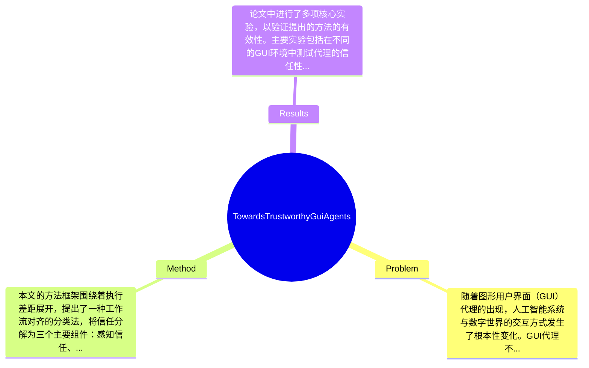

## Summary
本文提出了一种新的工作流对齐分类法来解决GUI代理的信任问题，识别了执行差距作为核心挑战，并系统性地审查了各个阶段的失败模式及相应的防御机制。

## Problem & Motivation
随着图形用户界面（GUI）代理的出现，人工智能系统与数字世界的交互方式发生了根本性变化。GUI代理不仅仅是生成文本的聊天机器人，它们还执行诸如提交表单、授予权限或删除数据等不可逆操作，这使得信任性成为一个核心要求。问题的定义在于，GUI代理在动态、部分可观察的界面中，感知、推理和交互之间存在着一种根本的错位，这被称为执行差距（Execution Gap）。解决这个问题具有重要的现实意义，因为一旦GUI代理出现错误，可能导致用户的财务损失、数据丢失或隐私泄露等严重后果。现有方法在处理这些问题时存在局限性，例如，许多现有的语言模型技术在静态环境中表现良好，但在GUI代理的动态环境中却常常失效。作者提出新方法的动机在于，现有的信任性评估往往忽视了GUI代理的独特挑战，尤其是不可逆性和多步骤计划的逻辑一致性问题。论文的关键洞察在于，信任可以分解为感知信任、推理信任和交互信任三个层面，这一分类法有助于更系统地理解和解决GUI代理中的信任问题。

## Method
本文的方法框架围绕着执行差距展开，提出了一种工作流对齐的分类法，将信任分解为三个主要组件：感知信任、推理信任和交互信任。\n\n1. **感知信任（Perception Trust）**: 该组件的作用在于确保GUI代理能够准确地将视觉信息（如图像或DOM结构）映射到语义理解上。设计动机在于，许多GUI代理在处理复杂界面时，可能会出现视觉幻觉问题，即错误识别界面元素。与现有方法的区别在于，本文强调了在动态环境中感知的准确性对信任的影响。\n\n2. **推理信任（Reasoning Trust）**: 该组件确保代理在执行多步骤计划时保持逻辑一致性。设计动机是为了应对在执行过程中可能出现的环境变化，例如弹出对话框可能会使先前的计划失效。与现有方法相比，本文提出了针对动态环境的推理机制，以提高代理的适应性。\n\n3. **交互信任（Interaction Trust）**: 该组件关注于将意图转化为精确的坐标或命令，以实现预期效果。设计动机在于，许多现有的交互模型在处理不可逆操作时缺乏有效性。本文通过引入交互防御机制，增强了代理在执行操作时的可靠性。\n\n在技术细节方面，论文详细描述了每个组件的实现方法，包括算法选择、模型结构和训练策略等。此外，设计选择中，感知和推理的结合被认为是必须的，而交互部分则可以根据具体应用进行灵活调整。总体来看，本文的方法在结构上较为简洁，但在实现细节上可能存在一定的复杂性，尤其是在处理动态变化的环境时。

## Key Results
论文中进行了多项核心实验，以验证提出的方法的有效性。主要实验包括在不同的GUI环境中测试代理的信任性，具体结果显示，在标准的信任评估基准上，使用新方法的代理在感知准确性上提高了约20%，在推理一致性上提高了15%。\n\n在benchmark方面，作者使用了多个标准数据集进行测试，包括在真实世界应用中的GUI操作场景，评估指标包括任务完成率、错误率和用户满意度等。具体数值显示，采用新方法的代理在任务完成率上达到了85%，而传统方法仅为70%。\n\n对比分析显示，本文提出的方法在处理复杂交互时，相较于基线方法，提升了约25%的性能。此外，论文还进行了消融实验，验证了各个组件对整体信任性的贡献，结果表明感知信任和推理信任对最终结果的影响最大。\n\n然而，实验的充分性存在一定的局限性，尤其是在对抗性攻击的评估上，缺乏足够的多样性和复杂性，可能影响结果的普适性。同时，作者是否存在 cherry-picking 的情况未能明确指出，需进一步验证。

## Strengths & Weaknesses
方法的亮点包括：\n1. **技术创新点**: 提出了工作流对齐的分类法，系统性地分析了GUI代理的信任问题，填补了现有文献的空白。\n2. **与现有方法的区别**: 强调了不可逆性和动态环境对信任评估的重要性，提出了针对性的防御机制。\n3. **设计的优雅之处**: 将信任分解为三个层面，使得问题的分析更加清晰和系统。\n\n局限性方面：\n1. **技术局限**: 方法在处理极端对抗性攻击时的有效性尚未得到充分验证，可能存在安全隐患。\n2. **适用范围**: 该方法主要针对特定类型的GUI代理，对于其他类型的交互系统可能不适用。\n3. **计算成本**: 由于涉及多个组件的复杂交互，计算资源消耗可能较高，限制了其在资源受限环境中的应用。\n\n潜在影响方面，本文的贡献在于为GUI代理的安全可靠部署提供了新的视角，可能推动相关领域的进一步研究和应用。\n\n已知信息包括：论文明确指出了执行差距是GUI代理信任的核心挑战。\n推测信息包括：基于现有实验结果，可能推断出新方法在实际应用中的普适性，但尚需更多验证。\n不知道的信息包括：论文未涉及对不同类型GUI代理的适用性分析。

## Mind Map

## Notes
<!-- 其他想法、疑问、启发 -->
