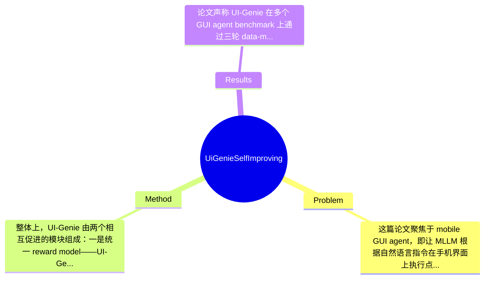

## Summary
UI-Genie 试图解决移动端 GUI agent 中“轨迹结果难验证”和“高质量训练数据难规模化”两个核心问题，方法上提出统一的 reward model（UI-Genie-RM）与 agent/reward model 联合迭代自增强框架，并通过规则验证、轨迹扰动和 hard negative mining 构建奖励数据。论文声称基于三轮 self-improvement 在多个 GUI benchmark 上达到 state-of-the-art，同时构建了 UI-Genie-RM-517k 和 UI-Genie-Agent-16k 两个数据集，但当前给出的摘录未包含完整实验数字，部分结果只能据论文描述概括，具体数值需标注为论文未提及。

## Problem & Motivation
这篇论文聚焦于 mobile GUI agent，即让 MLLM 根据自然语言指令在手机界面上执行点击、输入、滑动等操作，完成真实应用中的多步任务。这属于 multimodal agent 与 embodied decision making 的交叉问题，核心难点不是单步感知，而是在动态界面中结合历史上下文进行长期决策，并判断一条轨迹是否真正完成任务。这个问题重要，是因为手机 GUI 是数字世界里最普遍的人机交互入口，若 agent 能稳定操作 app，就可以支撑自动化测试、个人助理、无障碍交互、企业流程自动执行等大量场景。现有方法的局限主要有三类：第一，结果验证薄弱。很多工作只看最终页面、关键词匹配，或依赖闭源 judge model，但 GUI 任务往往要求依赖历史步骤和状态转移，单看终态很容易误判。第二，训练数据昂贵。高质量 GUI 轨迹通常依赖人工标注或演示，覆盖 app、页面和任务组合的成本极高，导致模型泛化能力受限。第三，已有 synthetic data 方案缺少可靠过滤机制，模型自己生成的数据容易积累错误，形成 self-training 中常见的 confirmation bias。论文的动机因此是合理的：如果能先构建一个更可靠的 reward model 去判断动作和任务结果，再用它指导 agent 探索和筛选轨迹，就有机会建立一个闭环式自增强系统。论文的关键洞察在于，把 GUI agent 的学习瓶颈从“直接收集更多人工轨迹”转为“先解决可验证性”，即先训练一个统一的、能处理历史图文上下文的 reward model，再让 reward 作为合成数据和迭代训练的基础设施。这一思路比单纯扩大 agent 模型更务实，也更符合 GUI 场景对过程监督的需求。

## Method
整体上，UI-Genie 由两个相互促进的模块组成：一是统一 reward model——UI-Genie-RM，用于对 GUI 轨迹进行动作级和任务级评估；二是 iterative self-improvement pipeline，用 reward-guided exploration 在动态环境中生成和筛选更高质量轨迹，再反过来提升 agent 与 reward model。本质上它不是单一模型创新，而是“奖励建模 + 数据生成 + 自训练闭环”的系统化方案。

1. UI-Genie-RM：统一奖励建模组件
该组件的作用是同时判断单步 action 是否合理、整条 trajectory 是否完成任务，从而为训练数据过滤、test-time reranking 以及后续自增强提供信号。论文强调其采用 image-text interleaved architecture，说明它不是只读当前 screenshot 或只读文本动作，而是把历史 screenshot、instruction、action context 交织编码，以捕获 GUI 任务强依赖历史状态的特点。设计动机很明确：GUI 成败往往不由某一步局部决定，而由之前是否进入正确页面、是否输入了正确内容共同决定。与已有只做 end-state verification 或只做 action scoring 的方法相比，它试图把 action-level reward 与 task-level reward 统一到一个模型里，减少训练目标割裂的问题。

2. Reward 数据构建：规则验证 + 可控破坏 + hard negative
为了训练 RM，作者构建了 UI-Genie-RM-517k。其核心不只是收集正例，而是系统地产生“难负例”。规则验证用于自动判定一部分轨迹是否成功，解决没有人工标签时的初始监督来源问题；controlled trajectory corruption 则通过有控制地篡改单步或多步动作，制造接近正确但实际错误的轨迹，逼迫 RM 学会细粒度区分；hard negative mining 进一步从模型容易混淆的样本中挑困难案例，提升 reward 判别边界。这个设计与一般简单正负采样不同，更接近 reward modeling 中“构造高信息量对比样本”的思路。其优点是可扩展、无需大量人工；潜在问题是规则验证覆盖面是否足够、合成负例是否贴近真实 agent failure，论文摘要未完全展开。

3. 自增强闭环：联合提升 agent 和 RM
UI-Genie 的核心卖点是 iterative self-improvement。agent 在环境中探索生成轨迹，RM 对轨迹进行过程打分与结果验证，高质量轨迹被纳入新的训练集，进而训练更强的 agent；同时更强的 agent 又能产生更复杂、更接近真实成功案例的数据，继续反哺 RM。这是一个典型 co-evolution 结构。其设计动机在于：单独提升 agent 会受限于数据质量，单独提升 RM 又受限于样本分布，二者交替更新可以逐步拓展可解任务空间。与普通 self-training 不同，这里 reward model 不是被动打分器，而是数据质量守门员和 test-time scaling 工具。

4. Agent 训练数据生成
论文提到构建了 UI-Genie-Agent-16k，并强调无需人工标注即可获得高质量 synthetic trajectory。这意味着作者不是直接蒸馏现有演示，而是依赖环境交互和 RM 验证来获得训练 supervision。技术上，agent 训练很可能采用标准的 supervised fine-tuning 于轨迹序列，动作空间定义见附录 A.1，但摘录未给出更细的 loss、backbone 和 decoding 细节，因此这些具体实现属于论文未提及。

5. 设计选择与简洁性评价
必须的设计有两个：一是显式 reward model，因为没有可靠 verifier 就无法进行可信自增强；二是历史图文交错建模，因为 GUI 任务天然依赖长上下文。可替代的设计包括：reward 可做成 pairwise preference model、value model 或 process reward model；负例构造也可来自真实失败回放而非人工 corruption。整体看，这个方法在理念上相当清晰，属于“先解决 verification，再放大 data”的优雅路线；但工程上模块较多，包括规则系统、奖励模型、探索策略、迭代训练，实际实现并不轻量，带有明显系统工程色彩，而非极简单模型创新。

## Key Results
论文声称 UI-Genie 在多个 GUI agent benchmark 上通过三轮 data-model self-improvement 达到 state-of-the-art，并专门从 agent model evaluation 与 reward model evaluation 两方面进行了测试，还包含针对 test-time scaling、RM 架构有效性以及 self-improvement 有效性的消融。然而，用户提供的全文摘录与摘要没有保留具体表格和数字，因此凡是精确性能值、相对提升幅度、benchmark 上的成功率，都只能标注为“论文未提及”。

从结构上看，主要实验至少包括三类。第一，agent 评测：论文明确提到 benchmark 包含 AndroidLab 与 Android Arena (A3) 的在线案例示例，说明评测既有离线也可能有在线环境。典型指标大概率是 task success rate、step accuracy 或 trajectory completion rate，但具体指标定义和数值，论文摘录未提及。第二，reward model 评测：作者强调 UI-Genie-RM 是首个面向 GUI agent 的 reward-specific dataset 训练出来的统一 verifier，因此实验应比较 action-level 与 task-level 判断能力，可能涉及 accuracy、F1、AUC 或 ranking metric，但具体数字论文未提及。第三，消融实验：4.3 节说明作者测试了 UI-Genie-RM 对 test-time scaling 的帮助、reward model 架构是否优于替代设计，以及 self-improvement pipeline 是否确实带来持续收益。从论文叙事来看，三轮迭代后性能逐步提升，这支持其闭环有效性，但提升幅度无法从当前材料中恢复。

批判性看，实验设计方向是对的：既测最终 agent，也测 verifier，还测闭环中各模块贡献，算是比较完整。但仍有几个不足。其一，若没有跨 app、跨分布、跨设备版本的泛化实验，仅在固定 benchmark 上 SOTA 不能证明真实鲁棒性。其二，若 RM 训练数据与 agent 测试环境高度同分布，可能高估 verifier 的泛化能力。其三，论文是否展示失败案例比例、长任务退化、探索成本等，摘录中未体现，因此存在一定 cherry-picking 风险；不过是否真的只展示好结果，当前信息不足，不能下确定结论。

## Strengths & Weaknesses
这篇论文的最大亮点有三点。第一，它抓住了 GUI agent 里最被低估但最关键的问题：verification。很多工作把重点放在更强的 backbone 或更复杂 prompting，但如果无法可靠判断轨迹是否正确，就无法做高质量数据扩张。UI-Genie 先做 reward infrastructure，这个切入点是对的。第二，UI-Genie-RM 统一 action-level 与 task-level reward，这比只看单步或只看终局更贴合 GUI 任务的层级结构，理论上也更适合做 reranking、trajectory filtering 和过程监督。第三，自增强思路具有现实吸引力：利用 reward-guided exploration 迭代提升数据和模型，若验证器足够可靠，就能减少对人工演示的依赖，对大规模 GUI agent 训练是有价值的。

局限性也很明显。第一，技术上它高度依赖 reward model 的正确性；一旦 RM 有系统性偏差，self-improvement 可能不断放大错误分布，这是所有 bootstrapping 方法的共同风险。论文虽然用 hard negative 和规则验证缓解，但不能从根本上消除。第二，适用范围可能受限于规则可验证任务。若任务成功标准高度语义化、需要外部世界状态、或涉及登录/支付/验证码等受限页面，规则验证和自动合成会明显变难。第三，系统成本不低。需要环境交互、轨迹探索、奖励训练、agent 再训练，多轮迭代意味着较高算力与工程维护成本；对于学术小团队，复现门槛可能高于看上去的“无人工标注”。

潜在影响方面，它可能推动 GUI agent 从“监督模仿”走向“可验证自提升”，尤其适合需要不断适应新 app 和新任务的场景，也可能启发网页代理、桌面代理、RPA 等相邻领域采用类似的 verifier-first 路线。

已知：论文提出 UI-Genie-RM、UI-Genie-RM-517k、UI-Genie-Agent-16k，并通过三轮 self-improvement 达到多 benchmark 的 SOTA，且开源框架与数据。推测：其 reward model 很可能还能用于 inference-time reranking 与 beam/test-time scaling，提升复杂任务成功率。不知道：具体 backbone 规模、训练成本、每轮迭代收益曲线、跨设备泛化、真实失败模式分布，这些在当前摘录中都未充分给出。因此我会把这篇论文评为 3 分：有参考价值，尤其在 reward modeling 和 data engine 设计上值得借鉴，但是否达到领域必读，取决于完整实验数字与后续社区复现结果。

## Mind Map

## Notes
<!-- 其他想法、疑问、启发 -->
