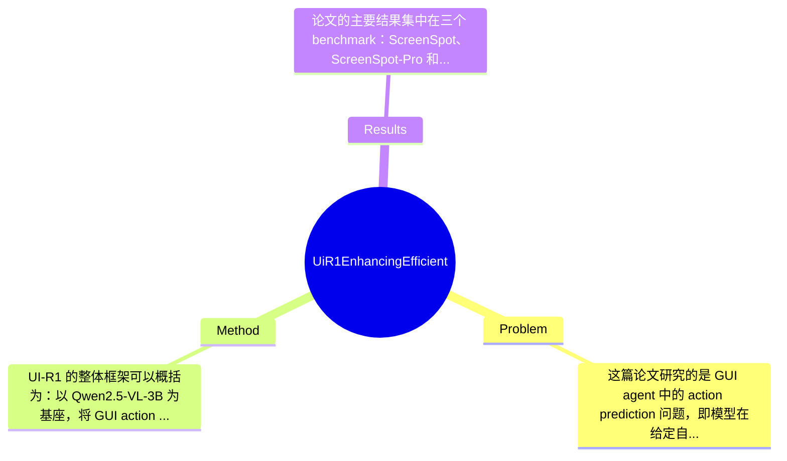

## Summary
UI-R1 针对 GUI agent 的 action prediction 数据昂贵、OOD 泛化差和推理冗长的问题，提出基于 rule-based reward 的 reinforcement learning 框架，在 Qwen2.5-VL-3B 上用仅 136 条高质量任务进行 GRPO 式强化微调。结果显示，其在 ScreenSpot、ScreenSpot-Pro 和 AndroidControl 上相对基座模型分别取得 22.1%、6.0% 和 12.7% 的平均准确率提升，并达到接近更大规模 SFT 模型的性能。

## Problem & Motivation
这篇论文研究的是 GUI agent 中的 action prediction 问题，即模型在给定自然语言指令和当前屏幕截图时，预测应执行的具体动作，例如 click、input、swipe 以及对应坐标或参数。这属于 multimodal agent / GUI understanding / visual grounding 的交叉领域，核心挑战在于：模型不仅要“看懂”界面元素，还要把语言意图映射为可执行操作。这个问题非常重要，因为移动端自动化、无障碍交互、智能助手、RPA、测试自动化和 device control 都依赖高可靠的 GUI 行为预测。现实中，用户任务通常跨 app、跨布局、跨主题，要求模型具备强泛化能力，而不仅是在训练分布内“背答案”。

现有方法主要依赖 supervised fine-tuning。第一，SFT 严重依赖大规模高质量标注数据，而 GUI 动作数据的标注成本很高，因为不仅要给出动作类型，还要精确标注坐标、输入内容和格式。第二，许多开源 GUI agent 在 in-domain 上还可以，但在 ScreenSpot 这类 OOD benchmark 上性能显著下降，说明它们更多是在拟合训练平台分布，而非学到稳健的界面推理能力。第三，已有 rule-based RL 在 multimodal 领域多聚焦 detection 或 grounding，奖励函数通常依赖 IoU 等通用视觉指标，不适合 GUI action prediction 这种“动作类型+参数格式+坐标准确性”联合决定对错的任务。

论文的动机因此较为合理：如果能设计针对 GUI 动作预测的 rule-based reward，就可能在少量高质量样本上，通过 RL 直接优化可执行行为，而不再完全依赖海量 SFT 数据。作者的关键洞察是，GUI 任务天然具有结构化、可程序判定的输出空间，因此可以把动作类型、坐标精度和输出格式拆成明确奖励信号，再结合高质量、困难且多样的小规模训练集，诱导 MLLM 学会更有效的 action reasoning，而不是仅做表面模仿。

## Method
UI-R1 的整体框架可以概括为：以 Qwen2.5-VL-3B 为基座，将 GUI action prediction 建模为可由规则自动评估的序列生成问题；训练时不依赖大规模人工偏好或 dense annotation，而是通过 rule-based action reward 配合 GRPO 进行 reinforcement fine-tuning；同时通过 fast grounding 与数据筛选策略，压缩推理长度并提高训练效率，最终得到 UI-R1-3B 及更高效版本 UI-R1-E-3B。

关键组件可以拆成以下几部分：

1. 规则化动作奖励（Rule-Based Action Rewards）
- 这是整篇论文最核心的设计。作者没有沿用通用视觉任务里的 IoU reward，而是针对 GUI 动作输出定义奖励。根据文中结构，奖励至少包括 action type reward、coordinate accuracy reward、format reward。
- action type reward 的作用是先判断模型有没有选对动作类别，例如 click、swipe、input 等。这样设计的动机在于 GUI 控制中“动作类型错了”通常比“坐标略偏”更致命，因此要把动作语义正确性单独建模。
- coordinate accuracy reward 用于评估点击或操作位置是否接近目标区域，这是 GUI grounding 能力的直接体现。与一般 box-level grounding 不同，这里更强调 point-based action correctness，而非矩形检测质量。
- format reward 约束模型输出为可解析、可执行的结构化动作，避免 RL 训练后出现 reasoning 很长但最终 action 不规范的问题。这个设计很实用，因为 agent 真实部署时最怕“答得像分析，执行不了”。
- 与现有方法相比，这套奖励更贴近下游 execution success，而不是停留在视觉匹配层面。

2. GRPO 驱动的 policy optimization
- 论文明确提到采用 policy-based algorithm，如 Group Relative Policy Optimization。其作用是让模型在同一任务上比较多条采样轨迹的相对优劣，用规则奖励直接推动策略更新。
- 这种设计动机来自 DeepSeek-R1 路线：对于可验证任务，RL 比 SFT 更可能激发“做对题”的策略，而不是模仿标注文本表面形式。
- 对 GUI 场景而言，GRPO 的价值在于输出空间较离散、reward 可程序化，因此即便只有 136 条训练任务，也可能反复采样得到足够学习信号。
- 论文未在给定材料中展开完整损失公式，因此具体 KL 约束、采样组大小、advantage 计算细节属于“论文未完整提及于摘录”。

3. Fast Grounding 与 DAST / NOTHINK
- 文中 3.3 标题显示作者还设计了 Fast Grounding，以及 DAST、NOTHINK 相关机制。结合摘要中“UI-R1-E-3B 显著提升 grounding efficiency and accuracy”可推断，该部分目标是减少冗长 reasoning，提高坐标定位效率。
- 设计动机很明确：GUI action prediction 不是开放式问答，过长 chain-of-thought 会拉高延迟和 token 成本，也可能引入无关推理噪声。特别在移动端 agent 中，响应速度本身就是核心指标。
- 与很多“让模型多想一会儿”的 RL 工作不同，这里强调 efficient reasoning，说明作者并不把更长推理视为必然更优，而是在“足够推理”和“快速执行”之间寻找平衡。
- 但 DAST、NOTHINK 的具体结构、prompt 机制或训练接口，在当前提供文本中没有完整公式与实现细节，因此只能确认其为效率优化模块，无法进一步精确还原。

4. 小而精的数据选择策略
- 作者没有追求大规模数据，而是构建了 136 条高质量、困难、具有多样性的 mobile tasks，覆盖五类常见动作。
- 文中明确从 Quality、Difficulty、Diversity 三个维度筛选训练数据，这一点非常关键。RL 在小数据下是否有效，很大程度取决于任务是否“可学、可判、能覆盖关键边界”。
- 这种设计与传统 SFT 的区别在于：不是让模型见到更多样本，而是让它在更有信息量的样本上通过 trial-and-error 优化策略。作者实际上在赌一个命题：高质量困难样本 + rule reward 比海量普通模仿数据更能提升 OOD action prediction。

5. 设计选择与简洁性评价
- 必要设计：规则奖励几乎是不可替代的核心，因为没有它就无法把 GUI action prediction 转化为可验证 RL 任务；数据筛选也相当必要，因为 136 条样本若质量不高，RL 很可能过拟合或学不到泛化能力。
- 可替代设计：policy optimizer 不一定非得是 GRPO，也可能换成 PPO/DPO 类变体；坐标奖励也可能设计成区域命中率、距离衰减函数或 step-wise reward。
- 从方法简洁性上看，UI-R1 整体是相对克制的：核心创新不是叠复杂模块，而是把 GUI 动作任务重新表述为“可规则验证的 RL 问题”。不过如果 Fast Grounding、DAST、NOTHINK 依赖较多额外工程技巧，则 UI-R1-E 可能比主方法更偏工程优化。总体而言，这篇工作更像“任务定义与奖励设计驱动的方法创新”，而不是大规模架构发明。

## Key Results
论文的主要结果集中在三个 benchmark：ScreenSpot、ScreenSpot-Pro 和 AndroidControl，其中前两者更偏 OOD GUI grounding / action understanding，AndroidControl 则可视为更接近 in-domain 的移动端控制测试。摘要中给出的核心数字是，相比基座模型 Qwen2.5-VL-3B，UI-R1-3B 在 ScreenSpot 上平均准确率提升 22.1%，在 ScreenSpot-Pro 上提升 6.0%，在 AndroidControl 上提升 12.7%。这些提升幅度说明，rule-based RL 并非只在训练分布内“修小补丁”，而是在 OOD 场景也带来了较稳定收益，尤其是 ScreenSpot 上 22.1% 的增益相当显著。

另一个重要结果是数据效率对比。论文强调 UI-R1-3B 仅使用 136 条高质量任务进行强化微调，而其性能已可与 OS-Atlas-7B 这类更大模型、且基于约 76K 样本 SFT 训练的方法相竞争。这一结果的意义不只是“省数据”，更是在挑战 GUI agent 领域长期默认的 SFT 扩数据路线。图示信息还强调 UI-R1 在 GPU hours 上也更省，但当前提供文本未给出精确训练时长和算力数值，因此只能定性描述，不能伪造具体数字。

实验部分从目录看还包含 GUI Grounding Capability、Action Prediction Capability、Key Factor Study、Ablation Study。说明作者至少分析了数据规模、reasoning length、Fast Grounding、Reward Function、Data Selection 等因素的影响，这类消融设置方向是合理且必要的。可惜在当前摘录中，消融的具体数值没有完整给出，因此不能精确说明各模块贡献百分比，只能确认论文确实做了相关分析。

从实验充分性看，优点是同时评估了 ID 和 OOD，并把“少数据 RL”与“大数据 SFT”进行了直接比较，论证力度较强。缺点是当前能看到的公开结果主要围绕 accuracy，若缺少 latency、token cost、action success rate 或真实交互多步任务评估，那么“高效”二字仍有部分停留在 grounding 子任务层面。另外，论文强调 UI-R1-E-3B 提升效率与精度，但若没有更系统的 failure case 分析，仍可能存在 cherry-picking 风险；就目前摘录，尚未看到作者只展示最优子集结果的明显证据，但也不能完全排除。

## Strengths & Weaknesses
这篇论文的第一大亮点是问题切入点非常准：它不是泛泛讨论 multimodal RL，而是抓住 GUI agent 中最适合规则验证的一环——action prediction，并据此设计 action type、coordinate、format 三类 reward，把任务从“难监督的生成”变成“可计算优化的执行决策”。第二个亮点是数据效率突出。仅用 136 条高质量任务就取得对基座模型的明显提升，并接近更大规模 SFT 系统，这对 GUI 这种标注昂贵领域非常有吸引力。第三个亮点是它关注 efficient reasoning，而不是一味增加思维链长度，这比很多 RL-for-reasoning 工作更贴近真实 agent 部署需求。

局限性也很明显。首先，技术上该方法高度依赖 reward 可程序化定义，因此更适合低层、结构化、单步或局部可验证的 GUI 动作；一旦进入长程多步任务、模糊指令解释、执行后状态变化建模，简单规则奖励可能就不够。其次，适用范围可能偏向 mobile GUI 和五类常见动作，面对 desktop/web 上更复杂控件、动态布局、滚动列表、弹窗遮挡等情形，奖励函数是否还能稳定对齐真实成功率，论文摘录中没有充分证明。第三，虽然训练数据少，但 RL 通常对采样稳定性、超参数和 rollout 成本敏感；如果要在更大任务空间上扩展，计算优势是否仍成立，还需更多证据。

潜在影响方面，这项工作可能推动 GUI agent 从“模仿学习驱动”转向“可验证策略优化驱动”，并启发更多针对 structured multimodal action 的 RL 研究，例如 web agent、RPA agent、robot UI control。

已知：论文明确提出 UI-R1，是首个将 rule-based RL 系统用于 GUI action prediction 的框架；使用 136 条高质量任务训练；在 ScreenSpot、ScreenSpot-Pro、AndroidControl 上相对基座有 22.1%、6.0%、12.7% 的平均提升。推测：Fast Grounding/NOTHINK 可能通过压缩 reasoning 或约束输出模板来换取更快推理，但当前材料不足以完全确认实现机制。不知道：完整 reward 公式、GRPO 超参数、各消融的精确数值、多步真实交互成功率，以及在更大规模桌面/网页 GUI 环境中的扩展表现。

## Mind Map

## Notes
<!-- 其他想法、疑问、启发 -->
