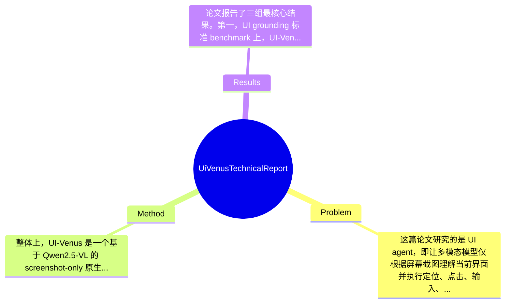

## Summary
论文提出了基于 Qwen2.5-VL 和 reinforcement finetune (RFT) 的原生截图驱动 UI agent——UI-Venus，目标是同时提升 UI grounding 与 UI navigation 的性能，并通过奖励设计、数据清洗以及 Self-Evolving Trajectory History Alignment & Sparse Action Enhancement 改善复杂交互中的规划能力；结果上，UI-Venus-7B/72B 在 ScreenSpot-V2 / Pro 上分别达到 94.1% / 50.8% 和 95.3% / 61.9%，在 AndroidWorld 上达到 49.1% / 65.9%，超过文中所称的现有开源与部分闭源基线。

## Problem & Motivation
这篇论文研究的是 UI agent，即让多模态模型仅根据屏幕截图理解当前界面并执行定位、点击、输入、滚动等交互行为。它处于 multimodal large language model、GUI understanding 与 embodied/interactive agent 的交叉领域。该问题的重要性在于，现实中的大量数字任务都发生在图形界面中，而不是结构化 API 环境中；如果模型能够稳定理解屏幕并做出正确操作，就能直接服务于移动端自动化、数字助理、企业流程执行、无障碍交互、测试自动化等高价值场景。相比网页 DOM 或 accessibility tree 驱动的方法，只看截图的原生 UI agent 更通用，因为它不依赖底层接口，理论上可以迁移到更多封闭系统或真实设备环境。

论文对现有方法的批评比较明确。第一类是 pretraining + supervised fine-tuning (SFT) 路线，如 CogAgent、UI-TARS 一类方法把完整轨迹和动作当作 token 序列做交叉熵学习，但这在 UI grounding 这类判别任务上存在目标错配：只要点击点落在正确 bounding box 内通常就算正确，SFT 却会对除“标注中心点”外的其他正确点一律惩罚。第二类是大规模数据驱动方法，虽然有效，但预训练与清洗成本高、人工投入重，不利于快速迭代。第三类是已有 RFT/GRPO 变体，多数主要集中于 grounding benchmark，对 navigation 的长期规划、历史轨迹一致性和稀有关键动作建模不够充分。

因此，作者的动机是合理的：用更贴合判别式目标的 reinforcement finetune 替代纯 SFT，并在 navigation 中进一步解决“历史推理与当前状态不一致”“关键但低频动作学不会”两个实际痛点。论文的关键洞察有两个：一是 UI grounding 和 navigation 都可以通过精心设计 reward function 来更直接优化最终成功标准；二是 navigation 不只是单步动作预测问题，还涉及历史轨迹质量，因此需要对 trajectory history 进行自演化式对齐，并对 sparse but critical actions 做分布再平衡。

## Method
整体上，UI-Venus 是一个基于 Qwen2.5-VL 的 screenshot-only 原生 UI agent，训练范式以 reinforcement finetune 为主，底层优化使用 GRPO。作者将任务拆成 UI grounding 与 UI navigation 两类，并分别设计奖励函数、数据清洗流程以及面向导航的历史轨迹改进机制。直观理解，它不是简单把 SFT 数据再喂给 VLM，而是围绕“点击是否落在目标区域”“任务是否成功完成”“规划链条是否连贯”这些最终目标来重构训练闭环。

1. 基础学习框架：GRPO 驱动的 RFT
   该组件的作用是替代传统 token-level SFT，使模型直接对 rollout 的相对优劣进行优化。文中给出了标准 GRPO 形式：对于每个问题采样一组输出，按组内 reward 做标准化 advantage，再结合 clipped policy objective 和 KL regularization 更新策略。这样设计的动机是避免单独训练 critic，同时提高训练稳定性，尤其适合多模态生成模型做 policy optimization。与现有 SFT 路线的最大区别在于，它不再把唯一标注答案当作绝对真值，而是允许“多种等价正确动作”通过 reward 得到正反馈，这对 grounding 任务尤其关键。

2. UI grounding 奖励与数据清洗
   该部分的作用是让模型学会从截图中准确定位元素。根据摘要和引言可知，作者非常强调 reward design 与 efficient data cleaning strategy，但完整奖励公式在给定材料中未完全展开。可以确定的是，设计动机是纠正 SFT 对框内非中心点的错误惩罚问题，把评价标准从“是否生成了某个精确 token 序列”改为“是否命中正确 UI 区域”。与已有 GUI-G1、GUI-G2、Phi-Ground、GTA1 等工作相比，论文声称自己的 grounding 训练在高质量样本规模仅数十万时仍能达到 SOTA，说明其清洗策略和奖励定义可能比单纯堆数据更有效。论文未提及具体数据筛选规则、噪声比例和每类 reward 权重，属于关键信息缺失。

3. UI navigation 奖励设计
   该组件负责把多步交互问题转化为可优化的 RL 目标。navigation 不仅需要视觉 grounding，还需要基于任务目标选择点击、输入、返回、滚动等动作序列。作者声称为 navigation 设计了 carefully designed reward functions，但从给定文本可明确知道的只有：其目标是提升 summary 与 planning ability，并在 AndroidWorld 这类在线环境中优化 success rate。设计动机显然是因为单步动作监督不能充分传达长期成功信号，而 RL 更适合处理 delayed reward。与已有 UI-R1、GUI-R1、InfiGUI-R1 等方法相比，这篇论文的增量主要不在于“用了 RL”，而在于后续两个针对导航特有问题的机制。

4. Self-Evolving Trajectory History Alignment
   这是论文最值得关注的导航创新之一。其作用是修正历史 reasoning traces 与真实状态、动作序列之间的错位，避免模型在后续决策中被错误历史误导。作者指出数据中的历史信息存在粒度和质量不一致问题，这会削弱 history 的效用，甚至引发 confusion in decision-making。所谓 self-evolving，可以理解为历史轨迹不是固定监督信号，而是在训练/迭代过程中被重写、筛选或对齐，使模型读到的是更一致、更有助于规划的上下文。与现有只把 past actions / CoT 直接拼接进 prompt 的做法相比，这一设计更关注“历史本身是否可信”。这是很合理的，因为 UI navigation 里一旦早期步骤描述错了，后续规划会层层传递误差。

5. Sparse Action Enhancement
   该组件的目标是平衡稀疏但关键动作的训练分布。很多 UI 任务中，常见动作如 click 占绝大多数，而输入、长按、系统返回、特定滚动方向等动作出现频率低，却可能决定任务是否完成。如果按原始分布训练，模型容易学成“保守点击器”。作者提出的 enhancement 用来提升这类少数关键动作的学习信号，从而增强复杂任务泛化。与常见的均匀采样或简单 loss reweighting 不同，这里更可能是围绕动作类型频次与成功价值做重采样或奖励增强，但具体机制论文摘录未给出。

从设计选择上看，RFT + reward shaping 基本是必须的核心；而历史对齐、自演化更新、稀疏动作增强则是导航性能继续拔高的特化模块。方法整体上不算特别“极简”，因为它包含数据清洗、任务特定奖励、历史处理、动作分布修正等多处工程设计；但这些部件大多直指 UI agent 的真实痛点，不属于无意义堆 trick。若论文完整公开更多公式与实现细节，其方法会更容易被判断为“结构化且可复现”，目前则介于有洞察和偏工程之间。

## Key Results
论文报告了三组最核心结果。第一，UI grounding 标准 benchmark 上，UI-Venus-7B 在 ScreenSpot-V2 / ScreenSpot-Pro 上分别达到 94.1% / 50.8%，72B 版本达到 95.3% / 61.9%。从数字看，72B 相比 7B 在 ScreenSpot-V2 仅提升 1.2 个百分点，但在更难的 ScreenSpot-Pro 上提升 11.1 个百分点，说明更大模型主要提升体现在复杂或更具分布外性质的界面理解上。第二，在在线 UI navigation arena AndroidWorld 上，UI-Venus-7B 与 72B 成功率分别为 49.1% 和 65.9%，72B 相比 7B 提升 16.8 个百分点，这也侧面说明导航比 grounding 更吃模型容量与规划能力。第三，作者宣称其结果超越了先前开源 SOTA GTA1 以及闭源 UI-TARS-1.5，但给定材料中没有列出这些 baseline 的具体数值，因此无法精确计算相对提升百分比，只能确认论文主张其为 SOTA。

Benchmark 方面，grounding 测试主要是 ScreenSpot-V2 与 ScreenSpot-Pro，指标显然是定位正确率或 success/accuracy；navigation 测试是 AndroidWorld，指标是 task success rate。论文摘要还提到其训练仅使用 several hundred thousand high-quality training samples，这一说法若成立，意味着其数据效率相对依赖海量 SFT 数据的方法有明显优势。

不过从批判性角度看，当前公开摘要层面的实验信息仍不够充分。首先，缺少更细的 benchmark breakdown，例如不同 app 类型、不同动作类型、英文/多语言界面、长任务与短任务的分项结果。其次，消融实验在给定材料中未展示，尤其是 Self-Evolving Trajectory History Alignment 和 Sparse Action Enhancement 各自带来多少提升、是否存在相互依赖，论文摘录无法判断。再次，也没有看到训练成本、采样组大小 G、reward 权重、seed 方差、在线评测次数等稳定性信息。因此虽然 headline numbers 很强，但是否存在 cherry-picking 目前不能排除：作者至少展示了三个标准任务上的强结果，但我们不知道是否还测过失败较多的环境或更苛刻设置而未报告。

## Strengths & Weaknesses
这篇论文的亮点首先在于问题抓得准。它没有停留在“把 VLM 用到 UI 上”这一层，而是直接指出 SFT 在 UI grounding 这类判别任务中的目标错配，这是一个非常实质的批评：UI 中很多答案是区域等价而不是 token 唯一。用 RFT/GRPO 处理这类问题，在理论动机上比纯交叉熵更自然。第二个亮点是它不只做 grounding，而是同时覆盖 navigation，并明确处理长期决策中的历史轨迹质量问题。Self-Evolving Trajectory History Alignment 这个思路相对有新意，因为很多工作默认 history 越多越好，却忽略了错误历史会污染后续推理。第三个亮点是结果层面确实强，尤其 72B 在 AndroidWorld 上 65.9% 的 success rate，如果评测设置公平，这说明其方法不仅会点，还具有相当的任务规划能力。

局限性也很明显。第一，方法较重度依赖 reward design 和 data cleaning，这意味着性能可能很大程度上来自任务工程化细节，而不是可普适迁移的统一算法；如果换到桌面软件、网页复杂工作流、游戏界面，现有奖励可能需要重写。第二，72B 模型虽然性能最好，但计算成本、推理延迟和在线交互吞吐大概率较高，真实部署门槛不低；论文摘录没有给出成本-性能权衡。第三，论文强调 screenshot-only 的通用性，但这也意味着模型缺少 accessibility tree、DOM、OCR 结构信号时可能更容易受遮挡、动画、模糊、分辨率变化和小目标元素影响，这种感知脆弱性在复杂真实设备上可能更突出。

潜在影响方面，这项工作对开源 UI agent 社区是有推动作用的：如果代码和训练流程足够完整，研究者可以更系统地验证 RFT 是否会成为 UI agent 的主流训练范式，而不是继续依赖大规模 SFT。应用方向包括移动端自动化助手、企业 RPA、App 测试、无障碍辅助操作与通用数字代理。

严格区分信息来源：已知——论文明确声称基于 Qwen2.5-VL、使用 RFT/GRPO、引入 Self-Evolving Trajectory History Alignment 与 Sparse Action Enhancement，并给出了 ScreenSpot-V2 / Pro 与 AndroidWorld 的具体数值。推测——历史对齐机制很可能涉及轨迹重写、筛选或迭代更新；稀疏动作增强可能采用重采样、reweight 或 reward bonus。不知道——具体奖励函数形式、训练数据组成、清洗规则、消融结果、训练算力、失败案例分布、与 UI-TARS-1.5 / GTA1 的精确差距，论文摘录均未提及。

## Mind Map

## Notes
<!-- 其他想法、疑问、启发 -->
